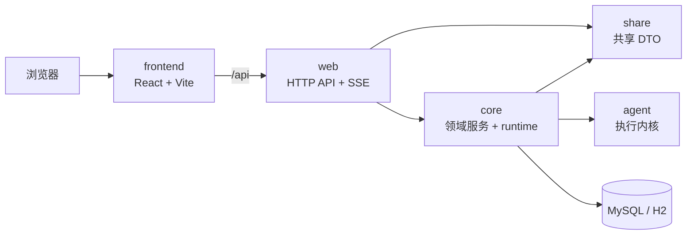

# kk-studio

`kk-studio` 当前是一套前后端分离的云端内嵌 Agent Studio MVP。主链路为 `provider / model / agent / session / event / run`，后端运行时以 `agent` 包数据结构为准组装执行上下文。

## 快速导览

| 主题 | 当前状态 | 入口 |
| --- | --- | --- |
| 产品形态 | 前后端分离控制面 | `frontend/` + `web/` |
| 后端主链路 | provider / model / agent / session / event / run / embedded runtime | `core/` `web/` |
| 前端主链路 | Agent 控制台、Provider/Model/Agent CRUD、Chat 列表与详情 | `frontend/src/features/ai/` |
| 运行时模型 | 服务端单进程 embedded runtime | `docs/technical-solution/cloud-embedded-agent-runtime.md` |
| 技术方案入口 | 当前生效方案文档 | [docs/technical-solution/README.md](docs/technical-solution/README.md) |

## 系统拓扑



## 当前能力

| 领域 | 已落地能力 |
| --- | --- |
| Provider | 创建、编辑、删除、分页查询；运行时映射为 `ProviderInfo` 的 `providerType/baseUrl/apiKey/timeout/streamIdleTimeout` |
| Model | 创建、编辑、删除、分页查询；运行时映射为 `ModelInfo` 和 `Variant` |
| Agent | 创建、编辑、删除、分页查询；运行时映射为 `AgentInfo` |
| Chat | 创建、编辑、删除 session，提交 message，基于 `agent_session_event` 投影聊天消息 |
| 流式事件 | `GET /api/agent/sessions/{sessionId}/events/stream` 以 SSE 推送 `session_event` |
| Runtime | `queued -> running -> succeeded/failed`，事务提交后调度 embedded runtime |
| 存储初始化 | H2 schema/seed、MySQL schema/seed |

## 仓库结构

| 目录 | 角色 |
| --- | --- |
| `agent/` | 执行内核，定义 `AgentInfo`、`ModelInfo`、`Variant`、`ProviderInfo`、session event 与 provider 调用语义 |
| `core/` | 领域服务、仓储、runtime 组装 |
| `web/` | Spring Boot HTTP API 与 SSE 入口 |
| `share/` | 前后端共享 DTO |
| `frontend/` | React + TypeScript + Vite 控制面 |
| `docs/` | 当前技术方案 |

## 本地 MiniMax 开发模式

默认开发入口只保留一个：`scripts/dev.sh`。它默认启动 `minimax-h2`，并把默认资源收敛为：

- provider: `minimax`
- model: `MiniMax-M2.7`
- agent: `default-assistant`

启动前需要提供 `MINIMAX_API_KEY`。脚本会在后端启动后把内存 H2 中的默认 `minimax` provider 同步成当前环境变量里的真实连接信息。

```bash
MINIMAX_API_KEY=xxx scripts/dev.sh start
```

常用命令：

| 目标 | 命令 |
| --- | --- |
| 启动 | `MINIMAX_API_KEY=xxx scripts/dev.sh start` |
| 停止 | `scripts/dev.sh stop` |
| 重启 | `MINIMAX_API_KEY=xxx scripts/dev.sh restart` |
| 查看状态 | `scripts/dev.sh status` |
| 查看日志 | `scripts/dev.sh logs` |
| 持续跟踪日志 | `scripts/dev.sh tail` |

默认地址：

| 服务 | 地址 |
| --- | --- |
| 后端 | `http://127.0.0.1:18080` |
| 前端 | `http://127.0.0.1:5173` |


## MySQL 运行准备

```bash
mysql -h <host> -P <port> -u <user> -p <database> < core/src/main/resources/schema-mysql.sql
mysql -h <host> -P <port> -u <user> -p <database> < core/src/main/resources/data-mysql.sql
```

最小 seed：

| 表 | 默认记录 |
| --- | --- |
| `agent_provider` | `stub` |
| `agent_model` | `stub / acceptance-stub` |
| `agent_definition` | `default-assistant` |

真实模型需要在控制台或 SQL 中创建真实 provider/model/agent。Provider 存储只承载连接配置和展示信息，不承载模型参数；模型参数放在 model variants 中，agent 只绑定默认 provider/model/variant 与 system prompt/tools/subagents/skills。

## 启动前后端

以下方式只适合调试单独进程；不会自动执行 `scripts/dev.sh` 里的 provider 同步步骤。

后端：

```bash
env JAVA_HOME=$JAVA_HOME_17 mvn -pl web -am package -DskipTests
MINIMAX_API_KEY=xxx $JAVA_HOME_17/bin/java -jar web/target/kk-studio-web-1.0.0.jar --spring.profiles.active=minimax-h2 --server.port=18080
```

前端：

```bash
cd frontend
npm install
API_PROXY_TARGET=http://127.0.0.1:18080 npm run dev -- --host 127.0.0.1 --port 5173
```

## 验收命令

| 目标 | 命令 |
| --- | --- |
| 后端完整验证 | `env JAVA_HOME=$JAVA_HOME_17 mvn clean verify` |
| 前端 lint | `cd frontend && npm run lint` |
| 前端覆盖率 | `cd frontend && npm run coverage` |
| 前端构建 | `cd frontend && npm run build` |

## 最小验收流程

| 步骤 | 预期结果 |
| --- | --- |
| 打开 `/agent/providers` | 可看到默认 Provider，并可执行 CRUD |
| 打开 `/agent/models` | 可看到默认 Model，并可执行 CRUD |
| 打开 `/agent/agents` | 可看到默认 Agent，并可执行 CRUD |
| 打开 `/agent/sessions` | 可创建、编辑、删除 Chat |
| 进入 `/agent/sessions/{sessionId}` | 可发送 message |
| 观察聊天详情 | SSE 推送 `assistant_delta`，页面实时追加 assistant 文本 |
