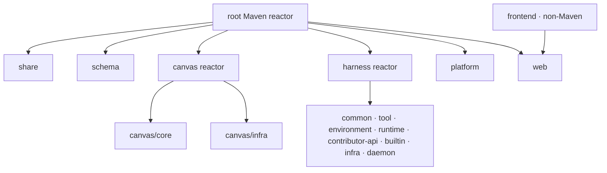

# kk-studio

`kk-studio` 是由一个或多个 Web 应用节点承载的 AI 与 Canvas 工作台。Harness
负责可恢复的 Thread 执行，Canvas 负责图形和 Function 运行，Frontend 提供
浏览器界面。多节点共享 PostgreSQL 与对象存储；App 节点之间无需 IP/DNS
连通，调度、租约、路由和通知都通过 PostgreSQL 收敛。

## 模块边界

根 Maven reactor 直接聚合六个目录；其中 `canvas` 和 `harness` 继续聚合
叶子模块。`frontend` 是独立的 Node/Vite 工程，不是 Maven module。



模块清单：

- `share`、`schema`
- `canvas/core`、`canvas/infra`
- `harness/common`、`harness/tool`、`harness/environment`、`harness/runtime`
- `harness/contributor-api`、`harness/builtin`、`harness/infra`、`harness/daemon`
- `platform`、`web`
- `frontend`

## Quick start

```bash
env JAVA_HOME="$JAVA_HOME_21" mvn -B -ntp validate
docker compose -f deploy/local/compose.yaml up -d --build --wait
```

应用会由 Web Fat JAR 同时提供 UI、API 和 SPA fallback。完整部署入口见
[本地部署说明](deploy/local/README.md) 和
[部署与运行](docs/operations/deployment.md)。

## 质量入口

```bash
env JAVA_HOME="$JAVA_HOME_21" mvn -B -ntp test
npm --prefix frontend run test
npm --prefix frontend run lint
npm --prefix frontend run build
node scripts/docs/check.mjs
python3 scripts/security/check-sensitive-data.py
python3 -m unittest discover -s scripts/e2e/tests -p 'test_*.py'
node scripts/e2e/run-matrix.mjs --docs
```

E2E、覆盖率、可靠性、性能和供应链命令以
[开发与测试](docs/operations/development-and-testing.md) 为准。

## 文档

[文档唯一导航](docs/README.md) 汇总系统设计、18 个逻辑模块和三个运行
operations 文档；建议先读[系统设计](docs/system-design.md)。

在自有主机上安装并常驻 Environment Daemon：
[Environment Daemon 安装与运行](docs/operations/environment-daemon.md)。

## 安全边界

- 真实 Provider credential、MCP bearer token、Daemon registration token 和部署
  密钥只在运行时配置，不进入源码、镜像、seed 或公共 DTO。
- PostgreSQL 保存可恢复的业务事实；对象字节由受控存储服务保存，浏览器只
  获得短期签名 URL。
- Trusted contributor JAR 只从显式部署目录在启动时加载；HTTP 认证、TLS 和 ingress
  策略属于部署边界。

## 协议与安全报告

本项目采用 [Apache License 2.0](LICENSE)。安全漏洞请按
[Security Policy](SECURITY.md) 通过 GitHub 私密渠道报告，不要在公开 Issue
中披露。
