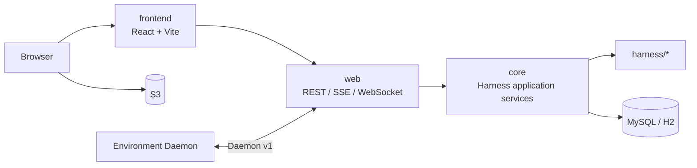

# kk-studio

`kk-studio` 是全局单实例的 Agent Studio。Harness 将 Session、Run、Run Event、Tool Invocation、Task、Control、Usage、Artifact 和 Environment 持久化为唯一可恢复事实；前端通过 REST 和数据库 cursor 驱动的 SSE 重建页面状态。

## 能力摘要

| 领域 | 已落地能力 |
| --- | --- |
| Agent 资源 | Provider、Model、Agent 的全局 CRUD 与运行时配置 |
| Harness Chat | 冻结 Agent Snapshot、完整 Session Entry、可恢复 Run 与 Run Event 流 |
| Tool | 权限、YOLO、Cloud/Environment 执行、artifact 与媒体预览 |
| Subagent | Root Activity、递归 Task Tree、child report、权限 relay 与 Run Control |
| 用量与成本 | Prompt Cache、不可变 Usage Record、价格快照和 Session 聚合 |
| Environment | 全局 Environment Registry、认证后的 Daemon v1 WebSocket gateway |
| ComfyUI | 工作流卡片 CRUD、无状态远端 job、浏览器经 S3 预签名直传输入/输出 |

## 系统拓扑



## 仓库结构

| 目录 | 角色 |
| --- | --- |
| `harness/` | Provider、Tool、Agent Turn、Session/Run runtime 与 Environment daemon |
| `core/` | 持久化、应用服务、worker、Environment gateway、S3 与 ComfyUI 集成 |
| `web/` | Spring Boot REST、SSE 与 WebSocket adapter |
| `share/` | HTTP DTO |
| `frontend/` | React + TypeScript + Vite 控制面 |
| `agent/` | Provider/Model/Agent 管理和嵌入式运行时支持 |
| `docs/technical-solution/` | 当前生效的技术设计 |

## 本地开发

使用 JDK 17：

```bash
env JAVA_HOME=$JAVA_HOME_17 mvn clean verify -Dspotless.check.skip=true
```

前端：

```bash
cd frontend
npm ci
npm test
npm run lint
npm run build
npm run coverage
```

使用 MiniMax 的本地 H2 开发入口：

```bash
MINIMAX_API_KEY=xxx scripts/dev.sh start
```

默认地址：后端 `http://127.0.0.1:18080`，前端 `http://127.0.0.1:5173`。

## 技术方案

从 [技术方案文档地图](docs/technical-solution/README.md) 开始。关键文档：

- [架构总览](docs/technical-solution/architecture.md)
- [Harness 执行运行时](docs/technical-solution/cloud-embedded-agent-runtime.md)
- [后端落地设计](docs/technical-solution/backend-implementation-design.md)
- [前端落地设计](docs/technical-solution/frontend-implementation-design.md)
- [Environment Daemon Gateway](docs/technical-solution/environment-daemon-gateway.md)
