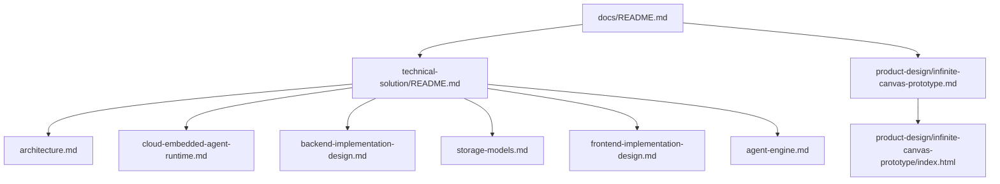

# Docs

仓库文档统一收敛到当前生效的一套说明中维护，不按版本分叉，不按模块散落维护。

## 文档地图

## 入口索引

| 文档 | 角色 | 说明 |
| --- | --- | --- |
| [technical-solution/README.md](technical-solution/README.md) | 技术方案入口 | 汇总当前架构、运行时、前后端实现和存储模型 |
| [product-design/infinite-canvas-prototype.md](product-design/infinite-canvas-prototype.md) | 产品原型 | 定义无限画布的产品定位、页面原型、交互、对象模型和扩展基座；可直接打开 [交互原型](product-design/infinite-canvas-prototype/index.html) |

## 维护规则

| 规则 | 说明 |
| --- | --- |
| 单一事实来源 | 同一主题只维护一份当前有效文档，不维护历史版本分叉 |
| 上下文无关 | 文档应让新接手的 Agent 不依赖会话历史即可理解 |
| 状态边界明确 | 技术方案描述当前实现；产品设计描述当前确定的目标形态和验收边界 |
