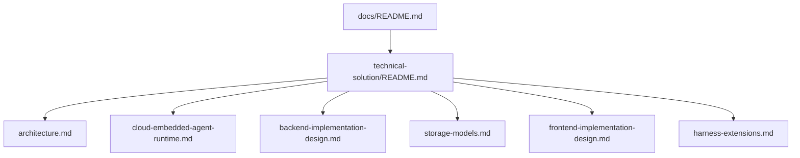

# Docs

仓库文档统一收敛到当前生效的一套说明中维护，不按版本分叉，不按模块散落维护。

## 文档地图

## 入口索引

| 文档 | 角色 | 说明 |
| --- | --- | --- |
| [technical-solution/README.md](technical-solution/README.md) | 技术方案入口 | 汇总当前架构、运行时、前后端实现和存储模型 |

## 维护规则

| 规则 | 说明 |
| --- | --- |
| 单一事实来源 | 技术方案以当前代码为准，不维护历史版本分叉 |
| 上下文无关 | 文档应让新接手的 Agent 直接理解当前实现 |
| 只描述当前有效边界 | 文档内容必须与当前代码和运行链路一致 |
