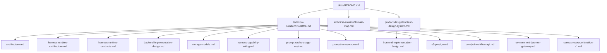

# Docs

仓库文档统一收敛到当前生效的一套说明中维护，不按版本分叉，不按模块散落维护。

## 文档地图

## 入口索引

| 文档 | 角色 | 说明 |
| --- | --- | --- |
| [technical-solution/README.md](technical-solution/README.md) | 技术方案入口 | 汇总已落地架构与实现边界 |
| [technical-solution/domain-map.md](technical-solution/domain-map.md) | 领域词汇 | Harness/Studio 双域词汇与前后端映射 |
| [product-design/frontend-design-system.md](product-design/frontend-design-system.md) | 前端设计规范 | 全局 token、AppShell、组件约定 |
| [technical-solution/harness-runtime-architecture.md](technical-solution/harness-runtime-architecture.md) | Harness 架构事实源 | Entry/Thread/Command/Invocation/Work、Agent Loop 与 processor |
| [technical-solution/harness-runtime-contracts.md](technical-solution/harness-runtime-contracts.md) | Runtime 契约 | JSON/DTO、命令 batch、CAS、replay、snapshot 与 wire 契约 |
| [technical-solution/architecture.md](technical-solution/architecture.md) | 架构总览 | 模块边界、双域不变量与 Studio 当前事实 |
| [technical-solution/storage-models.md](technical-solution/storage-models.md) | 关系存储摘要 | Chat、Harness（精确 7 表）、Canvas 当前持久化表；最终 schema 为 V1 |
| [technical-solution/canvas-resource-function-v1.md](technical-solution/canvas-resource-function-v1.md) | Canvas v1 事实源 | ResourceNode、Resource、Function、Group、Link、typed commands 与九表持久化 |
| [technical-solution/prompt-to-resource.md](technical-solution/prompt-to-resource.md) | 数据流 | Command → Turn → Resolver → Model → Tool → Resource 事实链 |

## 维护规则

| 规则 | 说明 |
| --- | --- |
| 单一事实来源 | 同一主题只维护一份当前有效文档，不维护历史版本分叉 |
| 上下文无关 | 文档应让新接手的 Agent 不依赖会话历史即可理解 |
| 状态边界明确 | 每份文档只陈述当前生效的职责、协议与约束；不写"以后恢复"、"后续切片"等历史或未来说明 |
