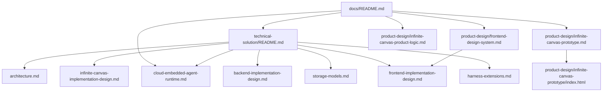

# Docs

仓库文档统一收敛到当前生效的一套说明中维护，不按版本分叉，不按模块散落维护。

## 文档地图

## 入口索引

| 文档 | 角色 | 说明 |
| --- | --- | --- |
| [technical-solution/README.md](technical-solution/README.md) | 技术方案入口 | 汇总已落地架构与当前批准的目标落地设计 |
| [technical-solution/domain-map.md](technical-solution/domain-map.md) | 领域词汇 | Harness/Studio 双域词汇与前后端映射 |
| [product-design/infinite-canvas-prototype.md](product-design/infinite-canvas-prototype.md) | 产品原型 | 定义无限画布的产品定位、页面原型、交互和视觉边界；可直接打开 [交互原型](product-design/infinite-canvas-prototype/index.html) |
| [product-design/infinite-canvas-product-logic.md](product-design/infinite-canvas-product-logic.md) | 产品逻辑 | 定义 Node、Resource、Link、ResourceReference、Function、Workflow、传播、运行和 MVP 闭环标准 |
| [product-design/frontend-design-system.md](product-design/frontend-design-system.md) | 前端设计规范 | 定义全局 token、AppShell、组件与 Agent 面板模块化约定；明确视觉统一进度与迁移清单 |
| [technical-solution/infinite-canvas-implementation-design.md](technical-solution/infinite-canvas-implementation-design.md) | 无限画布技术方案 | 定义领域模块、存储、Command、Function/Workflow Runtime、Web API、前端状态和低耦合 Agent Port |

## 维护规则

| 规则 | 说明 |
| --- | --- |
| 单一事实来源 | 同一主题只维护一份当前有效文档，不维护历史版本分叉 |
| 上下文无关 | 文档应让新接手的 Agent 不依赖会话历史即可理解 |
| 状态边界明确 | 已落地方案必须与代码一致；目标落地设计必须明确其实施边界，不能把尚不存在的类、表或 API 写成现状 |
