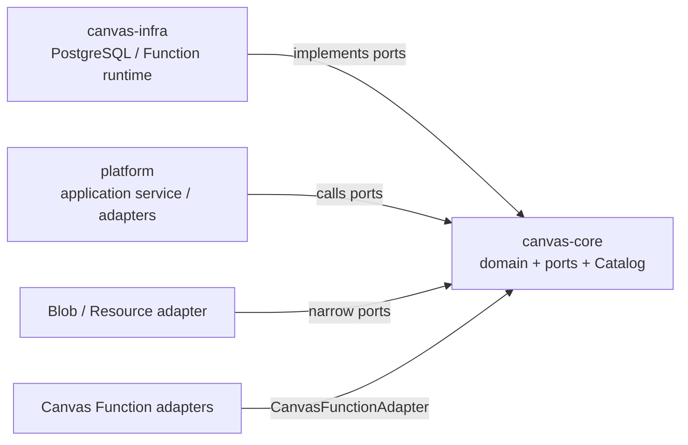

# Canvas Core 模块

## 定位

`canvas-core` 是 Canvas 的 JDK-only 领域模块。它定义
`CanvasDocument` 聚合投影、ResourceNode/Group/Link/Function/Run 值模型、
typed command、Function Catalog 和外层适配所需的 ports；不定义数据库实现、
HTTP DTO 或 Spring 装配。



## Goals

- 用不可变领域类型表达 Canvas graph、Resource ownership 和 Function run 状态。
- 用 typed command + document version CAS + command dedup 描述用户 graph mutation。
- 用窄 ports 隔离 PostgreSQL、Blob、HTTP 和 Function adapter。
- 让 Function 能力在启动时通过单一 `CanvasFunctionCatalog` 冻结并验证。

## Non-goals

- 不引入 `java.sql`、MyBatis、Spring、HTTP、Harness、Platform 或 Share。
- 不执行 PostgreSQL 查询、S3 I/O、Provider 调用、线程调度或 WebSocket 推送。
- 不在 Core 内实现第二份 Function model registry；能力事实只来自
  `CanvasFunctionCatalog` 的 adapter snapshot。
- 不把 Canvas Link 解释为自动执行图；Link 是引用关系，执行由显式 Function
  run service 触发。

## 依赖边界

`canvas/core/pom.xml` 的生产依赖为空，只有 JUnit test dependency。
`CanvasCoreArchitectureTest` 扫描全部 main source，禁止 `java.sql`、
`javax.sql`、`jakarta.persistence`、Spring、MyBatis 以及
`harness/platform/share/web` 包前缀。

外层实现只能通过 Core ports 进入：

| Port 类别 | 当前接口 |
| --- | --- |
| Graph command/query | `CanvasCommandService`、`CanvasStore`、`CanvasQueryService` |
| Resource lifecycle | `CanvasResourceRepository`、`CanvasResourceLifecycle`、`CanvasResourceMaterializer` |
| Function run | `CanvasFunctionRunRepository`、`CanvasFunctionResourcePinRepository`、`CanvasFunctionService` |
| Session ownership | `CanvasSessionRepository` |
| Function capability | `CanvasFunctionAdapter`、`CanvasFunctionBlobAccess`、`CanvasFunctionExecutionContext` |
| Codec | `CanvasFunctionConfigCodecPort`、`CanvasFunctionRunStateCodecPort` |

## 核心模型与 API

### Graph aggregate

```text
CanvasDocument
├── ResourceNode[]
│   ├── Resource[]
│   ├── Function?
│   └── FunctionRun?
├── CanvasGroup[]
└── CanvasLink[]
```

- `CanvasDocument` 保存 identity、标题、version 和时间；`version` 从 0 开始。
- `CanvasResourceNode` 保存 node identity、name、world transform、可选 group、
  Resource、Function 与 Run。
- `CanvasResource` 的 `blobId` 与 `textContent` 恰好一个非空；owner node 与
  resource index 同时存在或同时为空。
- `CanvasGroup` 不嵌套；`CanvasLink` 以
  `(canvasId, sourceNodeId, targetNodeId)` 标识，禁止 self-loop。
- 普通 ResourceNode 需要 Resource；Function node 在首次成功前可以为空。

### Typed commands

`CanvasCommand` 是 sealed interface，包含创建/更新/删除 Text、Resource、
Function、Node、Link、Group，以及批量 transform、Move、Ungroup。每个 command
在构造时校验非空集合、canonical identity、非负 index、有限正 transform 和
link 端点关系；集合使用 defensive copy。

`CanvasStore` 提供 document lock、graph entity CRUD、document version CAS 和
`CommandDedup`。`CanvasCommandService` 的写契约是：

```text
(canvasId, expectedVersion, commandId, commands)
  -> request hash exact replay
  -> stale version / hash mismatch conflict
  -> one successful graph mutation + CanvasPatch
```

`CanvasPatch` 使用 `baseVersion -> version`，并按 Group/Node/Link 分别表达
UPSERT/REMOVE。Snapshot 由 `CanvasQueryService.findSnapshot` 返回完整 document、
nodes、groups、links。

### Function Catalog 与 ports

`CanvasFunctionCatalog.from(Collection<CanvasFunctionAdapter>)` 在启动装配时冻结
能力：

- 每个 adapter 的 `enabled()`、`unavailableReason()`、`models()` 各读取一次；
- model key 按字典序排列且不能重复；
- enabled adapter 必须没有 unavailable reason，disabled adapter 必须有非空
  reason；
- `CanvasFunctionModel` 的 key 符合小写 canonical token，声明 output kind、
  parameter definition 与 reference policy。

`CanvasFunctionAdapter` 只提供 `models/preflight/execute/cancel` 及可用性信息。
`CanvasFunctionBlobAccess` 只暴露 frozen BlobFacts、原件 stream 和 URL port；
Function 执行通过 `CanvasFunctionExecutionContext` 读取冻结输入、checkpoint 和
materialize 预分配 target。

## 主流程

### Graph mutation

```text
HTTP request
  -> Platform 映射为 CanvasCommand
  -> CanvasCommandService
  -> lock document + verify expectedVersion
  -> apply typed commands + write command dedup
  -> advance version
  -> return CanvasPatch
```

Core 只规定 command、CAS、dedup 和 port 形状；document lock、SQL 影响行数和
transaction 由 `canvas-infra` 实现。

### Function run

```text
start
  -> validate node/function/reference policy
  -> freeze config、BlobFacts、manifest、target Resource IDs
  -> CanvasFunctionRun READY
  -> adapter preflight / execute through execution context
  -> checkpoint or terminal transition
```

输入 reference 在 start 时冻结 resource/blob identity，因此执行期间 graph link、
source Resource 或当前 Function 配置的变化不会改变该 Run 的输入。target
Resource 先以无 owner 形式物化，成功时由 lifecycle port attach 到目标 node。

## 不变量与失败恢复

- `CanvasDocument.version >= 0`，`updatedAt >= createdAt`；transform 的四个值有限，
  width/height 为正。
- Resource 内容 XOR 与 owner/index pair 必须满足；Function run 为 READY 时有
  `availableAt` 且无 lease，RUNNING 时有 lease 且无 `availableAt`，terminal
  状态两者都为空。
- `CanvasFunctionConfigCodecPort` 严格拒绝未知字段、重复字段、null、未声明
  parameter 和错误类型，并按 reference 首次出现顺序生成 manifest。
- Core port 返回的 conflict、invalid command 或 frozen fact 不满足时，调用方
  不能推进 graph version；版本 CAS 失败不产生部分 Patch。
- lease、heartbeat、S3 字节和 PostgreSQL rollback 不由 Core 自己处理；Core
  只通过 port 表达可验证的 transition，Infra 以 token fencing 将迟到 adapter
  回调收敛为 no-op 或内部取消。

## 配置与扩展

当前 Function 扩展点是 `CanvasFunctionAdapter` + `CanvasFunctionCatalog`。
adapter 的第三方能力由 Platform 提供，Core 不扫描 classpath、不读取配置目录、
不创建 Spring bean。Catalog 是启动期 snapshot，运行期间通过已冻结的
RegisteredModel 读取 output kind、reference policy 和参数描述。

## 测试与源码入口

源码入口：

- `canvas/core/src/main/java/fun/fengwk/kkstudio/canvas/CanvasDocument.java`
- `canvas/core/src/main/java/fun/fengwk/kkstudio/canvas/CanvasCommand.java`
- `canvas/core/src/main/java/fun/fengwk/kkstudio/canvas/CanvasSnapshot.java`
- `canvas/core/src/main/java/fun/fengwk/kkstudio/canvas/CanvasStore.java`
- `canvas/core/src/main/java/fun/fengwk/kkstudio/canvas/function/CanvasFunctionCatalog.java`
- `canvas/core/src/main/java/fun/fengwk/kkstudio/canvas/function/CanvasFunctionAdapter.java`

测试入口：

- `canvas/core/src/test/java/fun/fengwk/kkstudio/canvas/CanvasCoreArchitectureTest.java`
- `canvas/core/src/test/java/fun/fengwk/kkstudio/canvas/CanvasDomainSmokeTest.java`
- `canvas/core/src/test/java/fun/fengwk/kkstudio/canvas/function/CanvasFunctionCatalogTest.java`
- `canvas/core/src/test/java/fun/fengwk/kkstudio/canvas/function/CanvasFunctionModelTest.java`
- `canvas/core/src/test/java/fun/fengwk/kkstudio/canvas/function/CanvasFunctionFrozenTest.java`

相关模块：[系统设计](../system-design.md)、[Canvas Infra](canvas-infra.md)、
[Share](share.md)。
