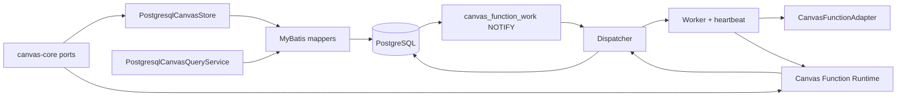

# Canvas Infra 模块

## 定位

`canvas-infra` 是 Canvas Core 的 PostgreSQL/MyBatis 适配与 Function durable
runtime。它把 Core ports 映射到 PostgreSQL 行、SQL CAS、Snapshot query 和唯一
的 Function Run queue；Web 负责装配 Infra，Platform 通过 Core ports 使用这些能力。



## Goals

- 以 MyBatis mapper 和 PostgreSQL transaction 实现 Core 的 document、graph、
  Resource、Session、dedup 与 Function run ports。
- 让 `canvas_function_run` 成为数据库唯一的 Function durable queue，支持
  claim、lease、heartbeat、fencing、reschedule 和 terminal CAS。
- 用 document version 把 graph、Function 状态、Patch 和 Snapshot 放在同一
  durable 坐标上。
- 让 `NOTIFY` 提供低延迟 wake，同时由 periodic poll、lease expiration 和
  Snapshot query 保证恢复。

## Non-goals

- 不在 Infra 中复制 Canvas domain model、HTTP DTO 或 Platform Function adapter
  catalog。
- 不创建内存队列作为 durable queue；worker executor 只负责有界 handoff。
- 不让 stale worker、过期 lease 或丢失通知改变新的 Run owner 或 graph。
- 不直接依赖 Harness、Platform、Web 或 Share 的生产实现。

## 依赖边界

`canvas/infra/pom.xml` 的生产依赖固定为：

| 依赖 | 用途 |
| --- | --- |
| `kk-studio-canvas-core` | domain 与 ports |
| `convention4j-spring-boot-starter` | 应用基础装配 |
| `mybatis-spring-boot-starter` | mapper 与 SQL |
| `jackson-databind` | Function config/state codec |

PostgreSQL、Flyway、Testcontainers 和 schema 只在测试 scope。生产源码包前缀为
`fun.fengwk.kkstudio.canvas.infra`；`CanvasInfraArchitectureTest` 限制 imports
为 Core、Jackson、MyBatis、Spring、JDK 和 convention4j。

自动配置入口是
`canvas/infra/src/main/java/fun/fengwk/kkstudio/canvas/infra/CanvasInfraAutoConfiguration.java`，
资源文件 `canvas/infra/src/main/resources/META-INF/spring/org.springframework.boot.autoconfigure.AutoConfiguration.imports`
只指向该类，并显式启用 `CanvasFunctionRuntimeProperties`。

## 核心模型与 API

### PostgreSQL/MyBatis 适配

当前 mapper 覆盖：

- `CanvasDocumentMapper`：document CRUD、`FOR UPDATE`/`FOR KEY SHARE` 和 version CAS；
- `CanvasNodeMapper`、`CanvasGroupMapper`、`CanvasLinkMapper`：graph entity
  upsert、group membership、link lifecycle；
- `CanvasResourceMapper`：owner attach/detach、text content 和删除；
- `CanvasCommandDedupMapper`：`(canvas_id, command_id)` request hash；
- `CanvasFunctionRunMapper`、`CanvasFunctionResourcePinMapper`：Run、pin 和
  terminal/active 生命周期；
- `CanvasSessionMapper`：Canvas owner relation 的 conditional insert；
- `PostgresqlCanvasQueryService`：聚合 Snapshot 投影。

SQL 由 mapper 注解直接定义。所有 ownership foreign key 的删除行为由 schema
的 `RESTRICT` 约束保护，Infra 通过显式 lifecycle port 完成顺序删除。

### Function durable runtime

`CanvasFunctionRuntimeConfiguration` 装配：

- 单线程 drain executor；
- `SynchronousQueue + AbortPolicy` 的 bounded worker handoff；
- fixed-delay poll scheduler；
- 与 worker concurrency 对齐的 heartbeat scheduler；
- `CanvasFunctionDispatcher`、`CanvasFunctionWorker` 和
  `CanvasFunctionRuntimeService`。

默认属性由 `CanvasFunctionRuntimeProperties` 与测试锁定：

```text
workerConcurrency       = 2
maxDispatchTasks        = 2
leaseDurationMillis     = 30000
heartbeatIntervalMillis = 10000
pollIntervalMillis      = 1000
rejectionDelayMillis    = 1000
```

`maxDispatchTasks` 不得超过 worker concurrency，heartbeat interval 必须小于
lease duration。

## 主流程

### Graph 与 Snapshot

```text
CanvasCommandService
  -> PostgresqlCanvasStore
  -> lock canvas_document
  -> mapper graph mutation + command dedup
  -> compareAndSet / increment version
  -> Patch

CanvasQueryService.findSnapshot
  -> read document/version
  -> read nodes/resources/runs/groups/links
  -> verify aggregate generation
  -> retry when a Function commit changes the generation
```

`PostgresqlCanvasQueryService` 在多查询装配时核对 document version 和 Function
Run 投影；读到不同 generation 时重新读取，避免把 graph 与 Run/Resource 的不同
代次拼成一个 Snapshot。

### Start、claim、execute、terminal

```text
start transaction
  -> lock document -> lock node -> lock current run
  -> validate request / freeze config and references
  -> create or replace READY run + INPUT/OUTPUT pins
  -> advance document version
  -> commit -> canvas_function_work wake

dispatcher
  -> claimNext(now, leaseDuration, leaseToken)
  -> RUNNING + attempt + 1 + lease token/until
  -> bounded worker handoff

worker
  -> schedule heartbeat
  -> adapter preflight / execute
  -> checkpoint or materialize target
  -> completeSuccess / failIfRunning / cancel
```

所有写入口集中在
`canvas/infra/src/main/java/fun/fengwk/kkstudio/canvas/infra/function/CanvasFunctionRunTransactions.java`
的 transactional methods：`start`、`cancel`、`checkpoint`、
`completeSuccess`、`failIfRunning`。事务先锁 document、node、run，再按
`advanceDocumentVersion(expectedVersion, newVersion)` 提交。

成功时先处理当前 owned Resource，再把无 owner target attach 到
`resourceIndex=0`，释放 run pin，并把 Run 置为 `SUCCEEDED`。失败或 cancel
删除仍无 owner 的 target、释放 pin，Run 进入 terminal 状态。

## 不变量与失败恢复

### DB queue、claim 与 fencing

`canvas_function_run` 的主键是 `node_id`，因此每个 Function node 只有一行
当前/最后 Run；queue 不在内存中。`CanvasFunctionWorkMapper.claimNext` 使用
单条 CTE：

```sql
READY and available_at <= now
or RUNNING and lease_until <= now
-> FOR UPDATE SKIP LOCKED LIMIT 1
-> UPDATE status=RUNNING, attempt=attempt+1,
          available_at=null, lease_token=?, lease_until=?
```

dispatcher 用 UUID string 生成 lease token。`renew`、`reschedule`、
`checkpoint`、`transitionTerminal` 和 `countOwned` 都要求 token 匹配且 lease
仍有效；新 owner claim 后，失效 token 的回调返回 false 或抛
`CanvasFunctionInternalCancellation`，不会修改新 Run。

### NOTIFY 与 poll

`canvas_function_work_notify()` 只在 READY、无 lease、`available_at <= now()`
的提交后变更时发送空 payload 到 `canvas_function_work`。Dispatcher 的 fixed-delay
poll 仍会扫描 due row，因此 NOTIFY 丢失、listener 重连或应用启动都能重新
claim。`canvas_version` trigger 只提示 document version，客户端通过 Snapshot
读取完整 graph。

### Worker heartbeat 与失败

Worker 的 heartbeat 只续租当前 Work，不触碰 document version、Run state 或其它
业务事实。续租返回 false、抛数据库异常、Run 被 cancel、node/document 被
删除或 lease 过期时，worker 立即停止 adapter 的新的 checkpoint/terminal 写入。
事务异常整体 rollback，version、pin 和 Resource 不出现部分提交。

adapter 失败进入 fenced `FAILED` transition；成功必须确认所有 target Resource
已经物化且 media type 与 model output kind 匹配；不满足时拒绝 success。重复
requestId 返回既有结果，不重复推进 version；不同 requestId 只允许从 terminal
Run 创建新的 READY generation。

## 配置与扩展

Function runtime 的部署参数由 `CanvasFunctionRuntimeProperties` 读取，自动配置
负责 executor、dispatcher、worker 和 scheduler 生命周期。Function adapter 与
Blob access 来自 Core ports；Infra 不扫描第三方 model，也不维护第二份 Catalog。

## 测试与源码入口

源码入口：

- `canvas/infra/src/main/java/fun/fengwk/kkstudio/canvas/infra/postgresql/PostgresqlCanvasStore.java`
- `canvas/infra/src/main/java/fun/fengwk/kkstudio/canvas/infra/postgresql/PostgresqlCanvasQueryService.java`
- `canvas/infra/src/main/java/fun/fengwk/kkstudio/canvas/infra/postgresql/CanvasFunctionWorkMapper.java`
- `canvas/infra/src/main/java/fun/fengwk/kkstudio/canvas/infra/postgresql/CanvasFunctionWorkStore.java`
- `canvas/infra/src/main/java/fun/fengwk/kkstudio/canvas/infra/function/CanvasFunctionDispatcher.java`
- `canvas/infra/src/main/java/fun/fengwk/kkstudio/canvas/infra/function/CanvasFunctionWorker.java`
- `canvas/infra/src/main/java/fun/fengwk/kkstudio/canvas/infra/function/CanvasFunctionRunTransactions.java`

测试入口：

- `canvas/infra/src/test/java/fun/fengwk/kkstudio/canvas/infra/CanvasInfraArchitectureTest.java`
- `canvas/infra/src/test/java/fun/fengwk/kkstudio/canvas/infra/postgresql/CanvasFunctionWorkStoreIntegrationTest.java`
- `canvas/infra/src/test/java/fun/fengwk/kkstudio/canvas/infra/postgresql/PostgresqlCanvasStoreIntegrationTest.java`
- `canvas/infra/src/test/java/fun/fengwk/kkstudio/canvas/infra/postgresql/PostgresqlCanvasQueryServiceIntegrationTest.java`
- `canvas/infra/src/test/java/fun/fengwk/kkstudio/canvas/infra/function/CanvasFunctionRuntimeFoundationTest.java`
- `canvas/infra/src/test/java/fun/fengwk/kkstudio/canvas/infra/function/CanvasFunctionWorkerHeartbeatTest.java`
- `canvas/infra/src/test/java/fun/fengwk/kkstudio/canvas/infra/function/CanvasFunctionDispatcherTest.java`

---

上级：[系统设计](../system-design.md)。相关文档：[Canvas Core](canvas-core.md)、
[Schema](schema.md)、[Web](web.md)。
