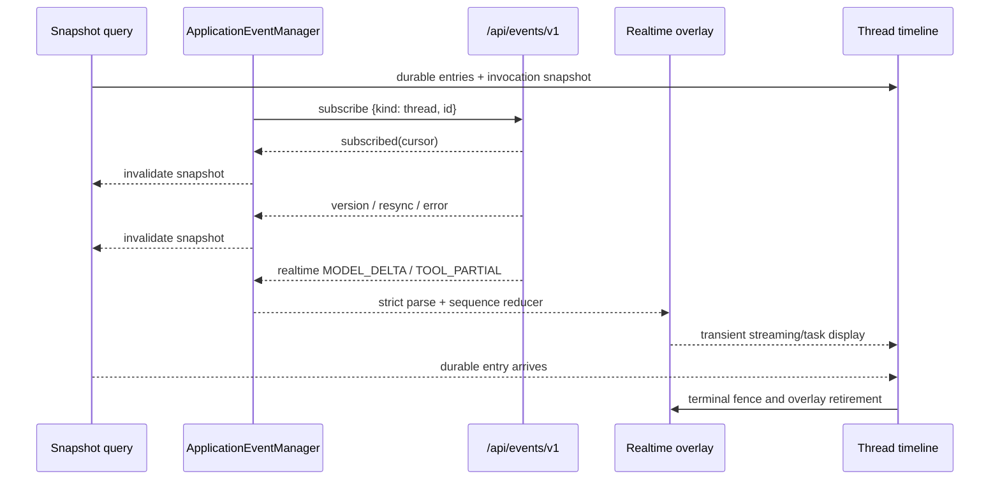
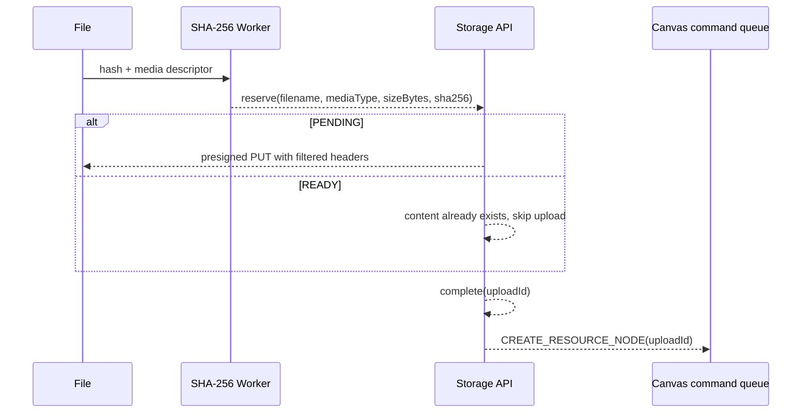

# Frontend 模块

[`frontend/`](../../frontend) 是独立的 React/Vite/TypeScript 工程：它把后端 durable
Snapshot 与有损 realtime 事件还原成可恢复的浏览器工作台。开发期由 Vite 提供页面并把
`/api` 代理到后端；发布期由 Maven `distribution` profile 构建后嵌入 Web Fat JAR。
入口、脚本和工具链见 [frontend/package.json](../../frontend/package.json) 和
[vite.config.ts](../../frontend/vite.config.ts)。

## 浏览器侧事实与同步契约

浏览器侧只有两类事实：来自 REST 的权威 Snapshot，以及浏览器本地 draft（Pane 布局、
未发送输入、上传进度）。WebSocket 事件只负责唤醒对账，或提供可丢失的显示 overlay。

- Extension 是编译期受信任的 React module：host 只接受 `TrustedReactExtension`，
  运行时不会下载、执行或评估远端脚本。
- UI 不把 PostgreSQL 行、S3 bucket/key、Daemon 本机绝对路径或 provider credential
  变成持久事实；提交到 API 的只有 canonical id、cursor 和业务字段。
- 旧 Snapshot、旧 Patch 和旧 version event 不能覆盖较新的本地状态；迟到 delta 不能
  复活已终态的 invocation。
- 网络结果不确定时保留 exact replay；明确的 `409` 交给 ConflictPresenter，不自动
  重放具有业务语义的命令。

## 应用组装与路由

[main.tsx](../../frontend/src/main.tsx) 在 `StrictMode` 下挂载
[AppProviders](../../frontend/src/app/providers.tsx)，provider 顺序是：

```text
QueryClientProvider
└─ ExtensionHostProvider
   └─ BrowserPreferencesProvider
      └─ ApplicationEventProvider
         └─ BrowserRouter
            └─ AppRouter
```

Query 默认 `retry: false`、`refetchOnWindowFocus: false`；ExtensionHost 在 provider
生命周期内只创建一次，ApplicationEventProvider 持有共享的 application-event manager。

[AppRouter](../../frontend/src/app/router.tsx) 把 `/` replace 到 `/chats`，其余路径
交给 [WorkbenchShell](../../frontend/src/platform/workbench/WorkbenchShell.tsx)。
WorkbenchShell 组合 `AppShell` 与动态 `StudioRoutes`，每个 Page contribution 都包裹
`OverlayHost`（无多余空槽）。

[AppShell](../../frontend/src/platform/shell/AppShell.tsx) 从当前匹配的 `PageContribution`
获取所属顶层导航组（`navGroup`）与工作区沉浸布局（`workspace` predicate），不再硬编码业务
path 前缀，platform 也不反向依赖 features：合法 `/chats/:chatId` 与 canonical UUID 的
`/canvas/:canvasId` 使用 immersive shell 并隐藏 topbar；主导航固定组在应用组合根
（`PRIMARY_NAV_ITEMS`）声明一次；Escape 只在没有 blocking modal、焦点不在可编辑控件、
内层 menu 未展开时才关闭导航抽屉。

[createApplicationExtensionHost](../../frontend/src/app/extension-host.ts) 注册五个
内置 extension：

| extension | 页面 | 其他 contribution |
| --- | --- | --- |
| `builtin.ai` | `/chats`、`/chats/:chatId`、`/agents`、`/models`、`/providers`、`/skill-packages`、`/environments`、`/mcp-servers` | 创建/编辑/删除 dialog、`task` tool renderer |
| `builtin.projects` | `/projects`、`/projects/:projectId` | 全局 Project invalidation overlay |
| `builtin.canvas` | `/canvas`、`/canvas/:canvasId` | lazy 加载 Canvas feature |
| `builtin.comfyui` | `/comfyui` | workflow editor/delete dialog |
| `builtin.settings` | `/settings` | lazy 加载 Settings feature |

[ExtensionHost](../../frontend/src/platform/extensions/ExtensionHost.ts) 收敛提供
`pages`、`dialogs`、`overlays` 和 `toolRenderers` 四个具备实际用途的 registry。AI 专用
二级导航由 AI pages 自身的 `navItem` 元数据派生并在 feature 内部本地渲染，不再设立伪通用
Navigation registry，亦不保留零生产消费者的 panels/widgets/inspectors/commands/statuses 槽位。
同一 contribution id 的候选按 `priority` 降序、注册顺序升序选择，卸载高优先级候选后
低优先级候选接管；重复 extension id、非法 contribution id 和非法 page path 在注册时被拒绝。
`OverlayHost` 统一渲染 dialogs 和 overlays。`toolRenderers` 的 `id` 必须与后端冻结的
`rendererKey` 一致；`task` renderer 缺失时 MessageList 使用默认 renderer。

[`src/shared`](../../frontend/src/shared) 不得依赖 `@/features`（ESLint 强制），feature
之间只通过 ExtensionHost 和 shared 协作。Thread panel 是可移植 presentation：只依赖
[thread-timeline-types](../../frontend/src/features/ai/runtime/thread-timeline-types.ts)
和 panel 内部组件，API、React Query、realtime、Canvas 与 controller 都留在宿主层。

## API 与 contract 边界

[client.ts](../../frontend/src/shared/api/client.ts) 以 `/api` 为 base URL，Axios
timeout 为 `60000ms`，请求注入当前 `Accept-Language`，成功时把 `ResultEnvelope`
解包为 `data`。`ApiError` 保留 HTTP status、code 和 errors；`isConflictError` /
`isNotFoundError` 只按 status 判定，`isConflictReason` 额外要求 `errors.reason`
精确匹配，只有精确匹配时才允许按 reason 恢复。

contract 按 HTTP 边界分组，全部是严格 wire 类型：

| 文件 | 内容 |
| --- | --- |
| [base.ts](../../frontend/src/shared/api/contracts/base.ts) | `ResultEnvelope`、分页、时间、canonical decimal、`CatalogVersion`、`CanvasVersion` |
| [ai-runtime.ts](../../frontend/src/shared/api/contracts/ai-runtime.ts) | Session/Entry/Thread、branch settings、command batch、stop/approval、model/tool invocation、Snapshot |
| [ai-catalog.ts](../../frontend/src/shared/api/contracts/ai-catalog.ts) | Provider、Model、Agent、Tool、Git Skill Package catalog 与 structured config |
| [ai-chat.ts](../../frontend/src/shared/api/contracts/ai-chat.ts) | Chat 资源 |
| [ai-environment.ts](../../frontend/src/shared/api/contracts/ai-environment.ts) | Environment Card 与 live capability 投影 |
| [ai-mcp.ts](../../frontend/src/shared/api/contracts/ai-mcp.ts) | MCP Server 安全投影、显式配置与显式 HTTP 创建/更新请求 |
| [studio.ts](../../frontend/src/shared/api/contracts/studio.ts) | Canvas document、node/resource/group/link、Snapshot、Patch、version event、typed command |
| [storage.ts](../../frontend/src/shared/api/contracts/storage.ts) | PENDING/READY upload、presigned PUT、render-time presigned URL |
| [comfyui.ts](../../frontend/src/shared/api/contracts/comfyui.ts) | Workflow、input binding、run、job、cancel |
| [system-settings.ts](../../frontend/src/shared/api/contracts/system-settings.ts) | schema sections/field types、permission、model selection、apply timing |

service 只做路由映射与严格解码：

| service | 路由范围 |
| --- | --- |
| [agent-service.ts](../../frontend/src/shared/api/agent-service.ts) | `/ai/catalog/providers|models|agents|tools`，删除使用 `expectedVersion` CAS |
| [chat-service.ts](../../frontend/src/shared/api/chat-service.ts) | `/ai/chats` 与 owner Session 查询 |
| [mcp-server-service.ts](../../frontend/src/shared/api/mcp-server-service.ts) | `/ai/mcp-servers` name-keyed CRUD、显式配置查询与 discover |
| [environment-service.ts](../../frontend/src/shared/api/environment-service.ts) | `/harness/environments` Card 与 token |
| [harness-service.ts](../../frontend/src/shared/api/harness-service.ts) | `/harness/command-batches|sessions|threads` |
| [studio-service.ts](../../frontend/src/shared/api/studio-service.ts) | `/canvases`、Canvas resource 与 Function Run；自带 `canvasRequest`、AbortSignal 与 strict envelope |
| [storage-service.ts](../../frontend/src/shared/api/storage-service.ts) | upload 生命周期与 blob presigned URL |
| [comfyui-service.ts](../../frontend/src/shared/api/comfyui-service.ts) | workflow/run 与 `blobId` 文件输入 |
| [system-settings-service.ts](../../frontend/src/shared/api/system-settings-service.ts) | `/settings` 聚合 GET/PUT 与 schema |
| [projects-api.ts](../../frontend/src/features/projects/projects-api.ts) | `/projects`、`/issues`；Project 的 DTO 与 codec 就近放在 feature 内 |

所有跨 HTTP 的 entity id 都是 canonical UUID string；Java `long` 游标在 wire 上保持
canonical 非负十进制 string，Canvas version 只比较字符串长度和字典序，不转成
JavaScript number。codec 严格校验 canonical UUID、decimal、枚举、nullability 和嵌套
shape，不把宽松 cast 当成 wire contract。

## Snapshot、realtime 与恢复

Thread 与 Canvas 都先读取权威 Snapshot，再按 resource 订阅 `/api/events/v1`：



- `subscribed`（首次与每次重连）、`version`、`resync` 和资源级 `error` 都触发
  Snapshot 对账；`heartbeat` 只做连接保活。version/resync 触发的快照刷新不会丢弃
  已在 refs 中累积的未决 delta。
- Thread `version` 是结构/控制状态的 durable 提示，不是 Snapshot ETag：Model
  checkpoint 可在同一 version 内推进，因此同 version 的权威回读仍参与对账。
- `realtime` 没有 cursor，只承载 `MODEL_DELTA`/`TOOL_PARTIAL`。MODEL delta 只接受
  `TEXT_DELTA`、`THINKING_DELTA`、`TOOL_CALL_DELTA`，按连续 sequence 追加；tool
  partial 按 `thread:invocation:attempt` 做有界精确去重。
- delta 即时归约进 refs，使 sequence 连续性、缺口检测和去重不依赖 React 刷新时机；
  模型/工具 overlay 的发布合并到单个 `requestAnimationFrame`，每帧发布当前累积内容，
  不做字符级缓动或打字机延时。
- invocation 出现 `resultJson`、`errorJson` 或 `resultEntryId` 后建立 terminal fence，
  迟到 delta/partial 丢弃；Snapshot 的 `modelAttemptFailures` 已记录同一
  `modelInvocationId + attempt` 时，对应迟到 `MODEL_DELTA` 也丢弃并提前结束该 attempt
  的 gap recovery。持久化终态与失败审计优先于任何较新的 transient overlay。
- MODEL sequence 出现 gap 时启动单飞 recovery：重新读取 Snapshot，退避 `200ms` 到
  `2000ms`，最多 `8` 次；即使 Thread version 未变化也读取并合并 durable checkpoint，
  不用事件填补内容。

[thread-events.ts](../../frontend/src/features/ai/runtime/thread-events.ts) 把每个
durable Entry 投影为恰好一条记录，把 active model/tool invocation 和 attempt failure
作为锚定其 Entry 之后的 synthetic record；状态为 `pending`、`running`、`completed`、
`failed`、`stopped`。

### Thread Debug

`/debug` 与 Conversation 互斥使用主区域，包含请求预览、事件列表、详情三个区域。
布局按 Pane 实际宽度切换，而不是按整个浏览器窗口判断：

- **宽面板（≥ 1100px）**：三列等宽，各列独立纵向滚动，外框不滚动。
  未选中事件或检查项时，详情列显示选择提示。
- **窄面板（< 1100px）**：通过「请求预览 / 事件 / 详情」页签切换，
  当前区域占满可用空间。选择事件、Tool、Skill 或 Request 后进入详情；
  关闭详情返回来源区域，焦点回到事件列表或预览中的触发按钮。
- 页签支持左右箭头、Home、End；宽屏事件列表保留上下箭头导航。
  多 Pane 的 DOM ID 按实例隔离，详情内 Escape 仅关闭当前 Pane 的详情。

```text
+----------------------+----------------------+----------------------+
| NEXT REQUEST PREVIEW | EVENTS               | DETAIL               |
| System Prompt        | Entry / Invocation   | Metadata             |
| Tools / Skills       | ...                  | JSON / Tool / Skill  |
| Subagents / Cache    |                      | ...                  |
+----------------------+----------------------+----------------------+
```

System Prompt 正文限制 `max-height: 115px; overflow-y: auto;`，具有有界最大高度与内部滚动（覆盖此前去嵌套滚动设计，仅此 prompt 区域例外）；Tools 与 Skills 自动换行，随预览列滚动。Tools 先列最终发给模型的定义，再以灰色、虚线和 `⊘` 列出因未选择 Environment
被过滤的 Agent 候选；`P`、`P+E`、`E` 分别表示 `NONE`、`OPTIONAL`、`REQUIRED`。
点击任一 Tool 或 Skill 在第 3 列（窄屏下自动切换到详情选项卡）展示：Tool
展示完整 description、input schema、EnvironmentSupport、Contributor、发送/过滤状态；
Skill 展示 Package、description、稳定 path、Platform current/observed commit、Daemon
installed commit 与实际 Prompt XML。
Detail 和 Inspector 独立渲染于第 3 列，不再侵入 `AgentPane` 的底部小部件栈，确保底部的
Composer 和队列控制区在任何分辨率下均保持可见且交互不受遮挡。

Debug API 明确区分 `NEXT_REQUEST_PREVIEW` 与活动 `FROZEN_INVOCATION`。顶部 Rails
属于前者；后者通过 Request 详情展示由冻结 ModelRequestSpec 物化的 canonical
ProviderRequest，其精确 Skill 列表已在冻结 systemInstruction 的 XML 中。预览不能冒充
历史实际请求。详情完整保留可读 JSON，但不展示 credential、Authorization header、
对象存储内部地址或 Base64 正文。前端只调用
`GET /api/harness/threads/{threadId}/model-request-debug`，进入 Debug 拉取一次，并在
Turn 开始/结束时刷新。

运行控制面同样以 Snapshot 为对账依据：

- Stop 请求是 `{stopRequestId, expectedVersion}`。同一个 `stopRequestId` 用于不确定
  失败的 exact replay，成功结果把 `cancelledUserMessages` 按 sequence 前置回
  Composer，`IDLE` 是 no-op。
- Tool approval 使用 `{decision, decisionId, actor: "web", reason: null}`；同一
  Thread、invocation、decision 的重试复用 decision id，ALLOW/DENY 切换生成新 id。
- `task.status` 是完整 heartbeat 而不是 delta，状态为 `queued`、`running_model`、
  `running_tool`、`waiting_approval`；同一子 Thread 的 heartbeat 替换旧帧。

## 变更提交与上传

Composer 命令提示由区域焦点驱动，显隐规则为 `active && !disabled && isFocused && (plusMenuOpen || slashMode)`。
Composer 区域包含编辑器、命令菜单、底栏 controls 与附件栏，区域内部移焦（如 Tab 或点击菜单项）
不关闭菜单以避免点击丢失；离开区域收起菜单并清空 `plusMenuOpen`，完整保留草稿 parts（如 `/th`）。
上层 control menu、Modal、Lightbox 优先处理 Escape；区域聚焦时 Escape 执行 blur 并收起菜单；
未聚焦时当前 active pane 通过 `focusOnEscape` 聚焦编辑器，保留的 slash 文本自动重开菜单。
普通文本同样支持 Escape blur/focus 切换。`+` 按钮支持无 slash 打开，失焦后再聚焦普通文本不重开；
关闭 slash 提示时主动 blur 避免立即再开。菜单可见时 Enter 执行可见选项；收起状态下不执行隐藏命令，
且 `canSend` 阻止 slash 发送普通消息。普通文本与带目标正文的 `/goal` 保持各自的提交路径。

Chat Pane 有两个正交维度。布局支持 1-9 分屏（`single`、`split-2`、`split-3`、`grid-4`、`grid-5`、`grid-6`、`grid-7`、`grid-8`、`grid-9`），使用原生可访问 `<select>` 下拉切换并按 Chat id 保存在 `kk-studio.chat-pane.<chatId>`；其中 5 布局为左侧整高跨两行加右侧 2x2，7 布局为左侧整高跨两行加右侧 3x2，9 布局为 3x3 均匀网格，在窄屏（<=960px）下统一响应式降级为纵向单列滚动。底部 ThreadStatusFooter 严格左对齐并以细竖线分隔各只读单元（`环境 | 上下文 | 累计usage | cache N% | tok/s`），在小屏下自然折行；上下文输入 token 采用最新模型调用估算，同回合内多个 Assistant 调用的 usage 和 cost 予以累计聚合，有效流式时长与解码 token 共同计算 `tok/s` 速率。target 三态是：

| Pane target | 入口 | 本地事实 | 发送结果 |
| --- | --- | --- | --- |
| `NEW_SESSION_DRAFT` | 新建 Pane/Chat，尚无 Session | `BranchDraft`、ordered Composer parts、未发送 settings | 原子 `NEW_SESSION`，成功后绑定新 Thread；Session 默认名由服务端从首条用户文本派生，root Thread 名固定 `main` |
| `NEW_THREAD_DRAFT` | `/tree` 选择同一 Session 的历史 Entry | `sessionId + startEntryId`、BranchDraft、Composer parts | 原子 `NEW_THREAD` 建立分支，Thread 名固定 `branch-<threadId 前 8 位>` |
| `BOUND_THREAD` | 已加载 Thread snapshot | Thread `branchSettings`、head、version、next command sequence | `THREAD` target 携带精确 cursor，batch 进入 mailbox |

`PendingAcceptance` 按 owner 与 pane id 写入 localStorage，包含 frozen request、
BranchDraft、Composer parts、generation 和 `unknownOutcome`；存在 pending acceptance 时
拒绝切换 target，generation 与 target identity 防止旧请求覆盖新 Pane。

`buildAcceptanceRequest` 在网络请求前冻结整批数据：

- `NEW_SESSION` 只发送 `USER_MESSAGE`，完整 BranchDraft 写进 `rootSettings`；
- `NEW_THREAD_DRAFT` 和 `BOUND_THREAD` 在 `USER_MESSAGE` 前按固定顺序追加
  `SET_AGENT`、`SET_MODEL`、`SET_ENVIRONMENT` 的 diff（`environmentName` 可空，null 表示清除）；
  Agent 工具选择由最新 Agent definition 的
  `config.tools` 决定，不生成 branch tool command；
- `BOUND_THREAD` 的 target 携带 `expectedHeadEntryId` 和
  `expectedNextCommandSequence`；YOLO 是 `PUT /yolo` 的直接控制面，不进入 mailbox；
- 每条 command 带 UUID `idempotencyKey`，与 raw command canonical SHA-256 一起构成
  服务端 ordered replay 幂等键。

失败分类决定恢复方式：网络或其他不确定失败保留 exact replay（相同 id、payload、
顺序和 cursor）；明确 `409` 表示 batch 未被接受，保留 command id 与 payload，
只在 `STALE_COMMAND_CURSOR` 且仍是同一 branch 的纯 message batch 时读取最新 Snapshot
并有限重试（最多两次）；其他情况保留本地 Composer parts，不自动重放语义命令。

Canvas 侧由 [CanvasCommandQueue](../../frontend/src/features/canvas/command-queue.ts)
串行化浏览器操作，每批以当前 Snapshot 的 `expectedVersion` 和 UUID `idempotencyKey`
提交，响应是 graph patch：

- `applyEntityPatch` 先要求 `patch.version > snapshot.version` 且
  `patch.baseVersion === snapshot.version`，再分别 upsert/remove nodes、groups、links；
- `version <= current` 是重复/过期 patch，直接忽略；baseVersion 不连续是 gap，读取
  全量 Snapshot；
- HTTP `409` 先读取最新 Snapshot，再抛出 `CanvasCommandConflictError`，queue 不自动
  重放；`replaceSnapshot` 拒绝同一 Canvas 的 version 回退，Canvas version 全程使用
  canonical decimal string；
- 节点 transform 由 [transform-batch.ts](../../frontend/src/features/canvas/transform-batch.ts)
  以 `180ms` debounce 聚合，并以 epoch 归属在途请求；
- [canvas-version-events.ts](../../frontend/src/features/canvas/canvas-version-events.ts)
  订阅 `{kind: "canvas", id}`，首次 `subscribed`、重连、`resync` 和 `error` 都读取
  权威 Snapshot，`version` 只有严格大于本地版本时才触发读取。

上传走分阶段协议，任何中途切换都作废整批：



[canvas-upload.ts](../../frontend/src/features/canvas/canvas-upload.ts) 与 Composer
附件共用同一套顺序：Web Worker SHA-256、`reserveUpload`、PENDING 直传或 READY 跳过、
`completeUpload`、最后提交消费 upload 的命令。每个 await 后校验 batch epoch；切换
Canvas 或 unmount 会作废整批并清理 progress；alias 在 `finally` 释放；已 complete 的
upload handle 不主动删除，由服务端过期策略回收。

Storage contract 不暴露 bucket/key：直传只发送签名响应允许的浏览器安全 headers，
upload handle 只能按 upload id 删除，blob original/preview URL 只在资源实际渲染或下载
时请求，并严格校验 `url`、mediaType 与 safe integer `sizeBytes`。

## Feature 主线

### AI

[`features/ai`](../../frontend/src/features/ai) 分成 catalog、chat、composer、environment、
mcp、plugins、runtime、skills 八个子目录。Catalog 页面按 structured config 渲染 Provider/Model/Agent；
Agent 的 `tools`、`subagents` 用 catalog candidate 校验（candidate 身份就是模型可见
name），`skills` 用 `(packageName, name)` 引用候选，选择器显示 `package / name`。
System Prompt 仍只展示 Skill 自身的 name、description 与 path，相同 name 可以由路径与
描述区分。Agent 表单还显式编辑
`inheritParentEnvironment`（新建默认开启），决定该 Agent 被 `task` 委派时是否继承父
会话当前 Environment。Chat 只持久化 title、agentName 与 YOLO 开关，Environment
是可空的分支选择（`BranchSettings.environmentName`），随每个分支的 branchSettings 独立
保存并逐字段投影。

Environment 卡片只展示 capability 的 canonical `id`，管理弹窗只投影宿主事实
（`EnvironmentHostSection`：OS、时区、Daemon 进程用户、HOME、可选备注与最后活跃
时间）和最近一条 WARN/ERROR。管理弹窗按需轮询最近 200 条连接/Skill 同步运维事件，
不展示原始 stdout、凭据或签名 URL。MCP 卡片只消费不含连接细节的安全投影（name、enabled、
timeout、发现状态与工具数），完整配置（URL 与 headers）仅在打开编辑弹窗时经 `no-store`
端点读取，并用递增 generation fence 防止关闭/重开时的迟到响应覆盖当前弹窗；更新或发现
进行中时所有 mutation 控件禁用。Platform Skill Package 卡片展示 repository、branch、
current commit、最近观察到的 branch HEAD 与检查状态；Check 只更新候选，用户点击 exact
commit 的 Update 后才发布并同步。相关 CRUD 与当前 Skill 候选独立在
[`features/ai/skills`](../../frontend/src/features/ai/skills)。

#### Plugin 设置

Plugin 管理入口是 `/settings` 的静态 **Plugins** 页签。
[`SettingsPage`](../../frontend/src/features/settings/SettingsPage.tsx) 固定把
[`PLUGINS_SETTINGS_TAB`](../../frontend/src/features/settings/settings-tabs.ts) 放在 General
之后；它不来自 `GET /api/settings/schema`，Plugin 凭据也不属于 SystemSettings aggregate。
页签挂载 [`PluginsTab`](../../frontend/src/features/ai/plugins/PluginsTab.tsx)，通过
[`plugins-service`](../../frontend/src/shared/api/plugins-service.ts) 调用 `/api/plugins`。

Plugin 配置是统一的静态 UI，不加载 Plugin 提供的脚本、HTML 或任意表单 schema。页面从
`GET /api/plugins` 只渲染当前 Fat JAR 实际安装的 `StudioPlugin` descriptor；删除 `web`
runtime dependency 并重新构建后，对应卡片自然消失。每张卡片只显示名称、版本、连接状态、
region、token 到期时间、下一次刷新时间和去敏错误，不展示密文、token 或 client identity。
只提供 `HarnessContributor`、不提供 `StudioPlugin` 的 Tool-only Plugin 不会出现在这里。

前端认证 contract 是
[`PluginAuthKindDTO`](../../frontend/src/shared/api/contracts/ai-plugin.ts) 的封闭 union，当前
只有 `DEEP_LINK`。因此新 Plugin 若沿用固定 region + 官方登录页 + 粘贴 callback URL 的交互，
通用卡片和连接弹窗可直接复用，不需要新增 Plugin 专属页面；名称、版本、region 候选与状态均
来自后端安全投影。若要增加其它认证方式或 Plugin 专属设置，必须同步扩展 Share DTO、
Platform 管理协议、TypeScript contract、静态组件、双语 i18n 和测试，不能让 Plugin JAR
注入前端代码。后端 `authKind: null` 表示不提供交互认证，但当前卡片尚未定义无认证 Plugin
的只读状态语义；引入这种 `StudioPlugin` 前必须先补齐并测试该前端行为。

MiniMax Mavis 卡片的 Connect 流程是：

1. 选择 CN 或 EN，调用 `auth/prepare` 取得固定官方登录链接并在新窗口打开；
2. 用户登录后复制 `minimax-cn://auth-callback?...` 或
   `minimax://auth-callback?...` deep link；
3. password 型输入禁用 autocomplete，不写 local/session storage；提交
   `auth/complete` 后无论成功失败都立即清空；
4. 前端重新读取安全状态，成功显示 Connected；`REAUTH_REQUIRED` 只提供重新连接，
   `REFRESH_FAILED` 展示自动重试时间，`REFRESH_UNCERTAIN` 要求重新连接；Disconnect 要
   二次确认。

同一 callback 请求不自动重试；generation fence 防止关闭/重开弹窗后的迟到响应覆盖新状态。

### Projects

[ProjectsPage](../../frontend/src/features/projects/ProjectsPage.tsx) 承载 Project 列表
与 create/edit/archive/delete，表单可设 `yoloEnabled` 与审查打回阈值；[ProjectDetailPage](../../frontend/src/features/projects/ProjectDetailPage.tsx)
只消费一个 `ProjectSnapshotDTO`（Project、未归档 Issues、依赖、blocked、当前审查窗口打回次数、当前/最近 Run）。
[IssueBoard](../../frontend/src/features/projects/components/IssueBoard.tsx)
固定七列需求池、待办、执行中、等待人类、审核中、已阻塞、已完成，已取消的 Issue 单独成道；
BLOCKED 卡片用 Snapshot 中服务端计数与 Project 当前阈值显示「本轮打回次数 / 上限」，不从分页 Activity 推导。
Issue 创建与规格编辑的执行者、审查者从分页 Agent Catalog 完整枚举后受控选择；下线的历史分配名称在编辑时保留为选项，不静默清空。
IssueDetailModal 用 Snapshot 中的 decimal version 做 CAS，成功后重读 Snapshot，
并在 BLOCKED 上提供人工恢复与解除阻塞的理由输入。执行与审核页只对最新 `FAILED`/`UNKNOWN` Run 提供
显式重试：`UNKNOWN` 下必须先填写人工核对说明（说明 trim 后随请求提交，为空时按钮禁用并给出内联校验
提示），`FAILED` 保持原有直接重试。Issue Agent 的会话与工作 Branch 由 Issue 归属驱动，不在
Project 页另建会话入口，Project feature 不维护自己的运行时状态机。

[ProjectsInvalidationBridge](../../frontend/src/features/projects/extensions/projects-extension.tsx)
作为 ExtensionHost overlay 订阅 `{kind: "projects"}`，并通过
[projects-invalidation](../../frontend/src/features/projects/projects-invalidation.ts)
直连 TanStack Query：定向通知失效列表、目标 Project 的 detail/snapshot 与其 Issue
详情；重连、resync 和订阅错误失效整个 Project 查询族。该链路不维护本地事件日志或
module-global listeners。

### Canvas

[CanvasPage](../../frontend/src/features/canvas/CanvasPage.tsx) 只接受 canonical UUID
深链，其他 `canvasId` replace 回 `/canvas`；[CanvasRuntimeContext](../../frontend/src/features/canvas/CanvasRuntimeContext.tsx)
管理 query、Snapshot、controller、viewport、selection、upload 与 Thread dock。
[CanvasStage](../../frontend/src/features/canvas/CanvasStage.tsx) 承载 React Flow 与图
投影，[CanvasToolRail](../../frontend/src/features/canvas/CanvasToolRail.tsx) 与
[CanvasContextMenu](../../frontend/src/features/canvas/CanvasContextMenu.tsx) 负责
node、link、group、Function 编辑，
[CanvasGenerationPanel](../../frontend/src/features/canvas/CanvasGenerationPanel.tsx) 负责
Function 参数与 run/cancel，[nodes/](../../frontend/src/features/canvas/nodes/) 渲染
Text/Image/Video/Audio Resource node。Agent dock 复用 Bound Thread Pane 语义，不把
Thread 写进 Canvas graph。

### ComfyUI 与 Settings

[ComfyuiPage](../../frontend/src/features/comfyui/ComfyuiPage.tsx) 通过
[ComfyuiRuntime](../../frontend/src/features/comfyui/ComfyuiRuntime.tsx) 提供 workflow
list/edit 与 input binding 校验；run 有 `submit`、`refresh`、`cancel` 三种
pending operation，poll interval `1500ms`，polling 集合是 `pending`/`in_progress`/
`running`，terminal 集合覆盖 `succeeded`/`failed`/`cancelled`/`interrupted` 等写法；
文件输入先走 Storage reserve/直传/complete，再以 `blobId + filename` 提交。workflow
editor/delete 是 ExtensionHost dialog contribution。

[SettingsPage](../../frontend/src/features/settings/SettingsPage.tsx) 的 General tab
只保存浏览器偏好（`kkstudio.browser-preferences.v1`），不写入 `/api/settings`；Plugins
tab 挂载上面的统一 Plugin 卡片，但凭据走 `/api/plugins`，不混入 SystemSettings aggregate；
其余 server tabs 完全由 `GET /api/settings/schema` 的 sections、groups、fields 和 label keys 决定。
[SystemSettingsSchemaRenderer](../../frontend/src/features/settings/SystemSettingsSchemaRenderer.tsx)
依据 `BOOLEAN`、`INTEGER`、`LONG`、`TEXT`、`ENUM`、`PERMISSION`、`MODEL_SELECTION` 选择
控件，permission 有 `allow`/`ask`/`deny`，apply timing 有 `NEXT_INVOCATION`、
`NEXT_CHAT`、`RESTART`；editor 以完整 aggregate + `expectedVersion` PUT，`409` 交给
ConflictPresenter。tablist 支持 ArrowLeft/ArrowRight/Home/End。

## 设计系统与共享层

[styles.css](../../frontend/src/styles.css) 的 `:root` 是全局 token 的唯一 owner，
Canvas 专属样式由 [canvas.css](../../frontend/src/features/canvas/canvas.css) 拥有；
新组件复用 token，不在 feature 之间复制全局 token inventory。

组件边界按职责划分：`AppShell` 只拥有 topbar、主导航、immersive route 与 Escape
优先级；Workbench 只拥有 route/slot/contribution composition；feature page 拥有
自己的 controller、query key、domain projection、业务 mutation 和 feature CSS，并通过
shared UI 传入数据与 callback；[shared/ui/console](../../frontend/src/shared/ui/console)、
[shared/ui/markdown](../../frontend/src/shared/ui/markdown)、
[shared/ui/media](../../frontend/src/shared/ui/media) 只提供通用 primitive 与内容渲染。

- [i18n](../../frontend/src/shared/i18n/index.ts) 支持 `zh-CN` 与 `en-US`，locale
  存在 `kk-studio.locale`，默认 `en-US`，`setLocale` 同步 `document.documentElement.lang`；
  catalog 按 `platform`、`ai`、`canvas`、`comfyui`、`settings`、`shared`、`shortcuts`
  分区。
- [ConflictPresenter](../../frontend/src/shared/conflict/ConflictPresenter.tsx) 统一
  展示 `409` 的 `errors.reason`/`code` 与 detail；controller 成功后 invalidate 目标
  query，冲突时保留 refresh/retry/close。
- [shortcuts](../../frontend/src/shared/shortcuts/shortcut-catalog.ts) 只列出已实现
  的 Application、Thread、Debug、Canvas 快捷键；modal、alertdialog 和 lightbox 通过
  [blocking-overlay.ts](../../frontend/src/shared/ui/blocking-overlay.ts) 优先消费
  Escape 与全局快捷键。

## 测试

| 层级 | 覆盖 |
| --- | --- |
| [Bootstrap](../../frontend/src/app/)、[platform](../../frontend/src/platform/) | App redirect、AppShell immersive route 与 Escape、ExtensionHost registry、Workbench slot |
| [AI](../../frontend/src/features/ai/) | catalog form/normalizer、Pane target/layout、Composer 与附件上传、command batch、Thread timeline、snapshot/realtime、stop/approval/task |
| [Projects](../../frontend/src/features/projects/) | list/detail、CAS、Issue Board/actions、BLOCKED 栏、全局 invalidation |
| [Canvas](../../frontend/src/features/canvas/__tests__/) | page/editor/stage、controller、command queue、entity patch、version events、transform batch、upload、nodes、Function run |
| [ComfyUI](../../frontend/src/features/comfyui/) | workflow 校验、page/card/panel/editor、run lifecycle、modal |
| [Settings](../../frontend/src/features/settings/) | schema renderer/validation、draft、permission、browser preference、server CAS |
| [Shared](../../frontend/src/shared/) | API client/service/codec、application-event protocol/manager、i18n、conflict、shortcuts、blocking overlay、Markdown/media |
| E2E support | [test-support/](../../frontend/src/test-support/)、[test-setup.ts](../../frontend/src/test-setup.ts) |

Vitest 使用 jsdom，[test-setup.ts](../../frontend/src/test-setup.ts) 在每个测试前清理
localStorage、固定 `zh-CN`，并为 ResizeObserver、DOMMatrix、SVG geometry、Canvas 2D、
dialog、scrollIntoView 与 React Flow layout 提供确定性 stub。测试文件按 feature 路径
与实现同目录组织，Canvas 集成测试位于
[features/canvas/\_\_tests\_\_](../../frontend/src/features/canvas/__tests__/)。
coverage threshold 是 lines/functions/branches/statements 各 `80`。

关键测试入口：

- [`App.test.tsx`](../../frontend/src/app/App.test.tsx)、
  [`platform-invalidation.integration.test.tsx`](../../frontend/src/app/platform-invalidation.integration.test.tsx)、
  [`ExtensionHost.test.ts`](../../frontend/src/platform/extensions/ExtensionHost.test.ts)。
- [`useHarnessThreadRealtime.test.tsx`](../../frontend/src/features/ai/runtime/useHarnessThreadRealtime.test.tsx)、
  [`thread-notifications.test.ts`](../../frontend/src/features/ai/runtime/thread-notifications.test.ts)、
  [`thread-events.test.ts`](../../frontend/src/features/ai/runtime/thread-events.test.ts)。
- [`useCanvasController`](../../frontend/src/features/canvas/useCanvasController.ts) 所在的
  [`features/canvas/__tests__`](../../frontend/src/features/canvas/__tests__/)、
  [`projects-invalidation.test.ts`](../../frontend/src/features/projects/projects-invalidation.test.ts)、
  [`system-settings-schema-renderer.test.tsx`](../../frontend/src/features/settings/system-settings-schema-renderer.test.tsx)。
- [`client.test.ts`](../../frontend/src/shared/api/client.test.ts) 与
  [`shared/app-events/__tests__`](../../frontend/src/shared/app-events/__tests__)。

构建、lint、coverage 和 E2E 入口统一见
[开发与测试](../operations/development-and-testing.md)；本模块只定义浏览器侧覆盖边界
与测试基座。

---

上级：[系统设计](../system-design.md)。相关文档：[Share](share.md)、
[Canvas Core](canvas-core.md)、[Web](web.md)、
[开发与测试](../operations/development-and-testing.md)。
