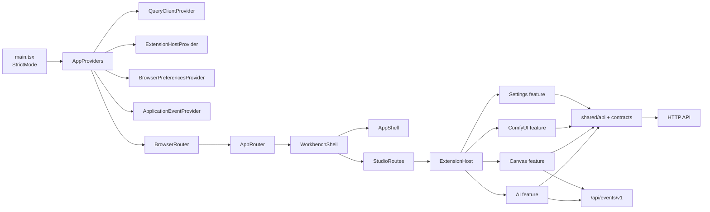
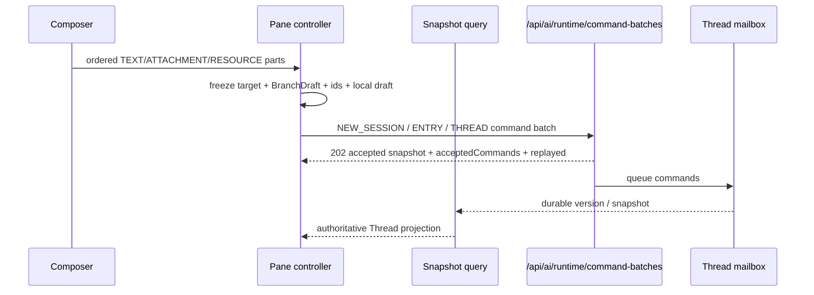
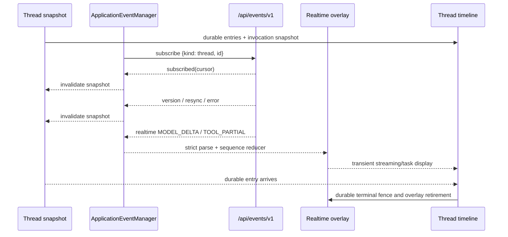
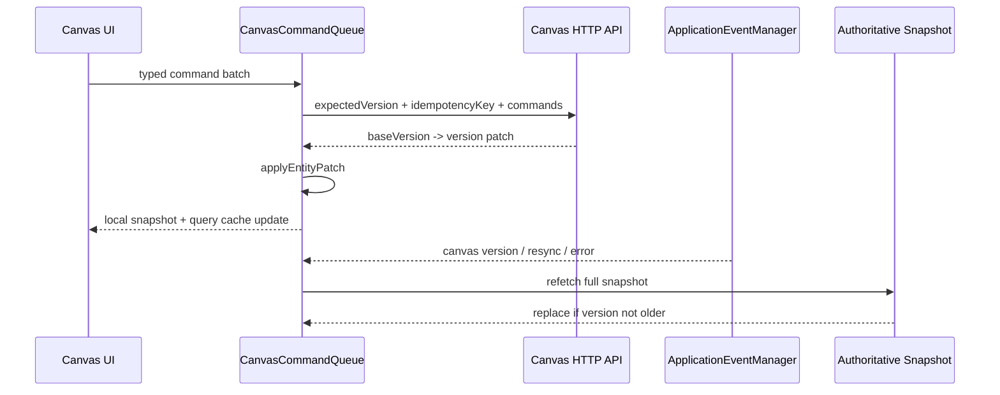
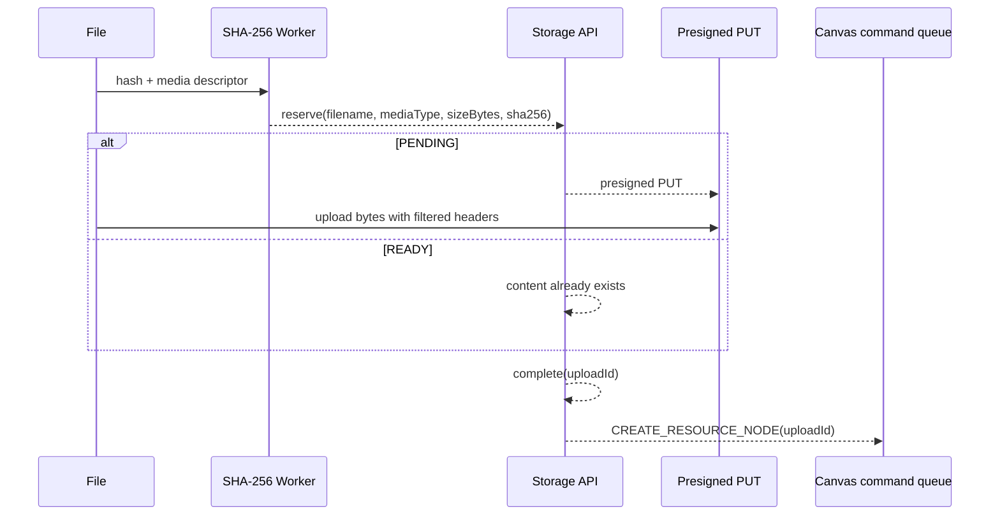

# Frontend 模块

本文是 `frontend/` 当前实现的运行与维护说明。Frontend 是独立的
React/Vite/TypeScript 工程；开发时由 Vite 提供页面，发布时由 Maven
`distribution` profile 构建并嵌入 Web Fat JAR。模块的入口、依赖和脚本以
[frontend/package.json](../../frontend/package.json)、
[vite.config.ts](../../frontend/vite.config.ts) 和源码为准。

## 1. Goals

- 用统一的 Workbench 宿主承载 AI、Canvas、ComfyUI 和 Settings 四个内置
  feature。
- 让 durable snapshot、command batch 和 application-event WebSocket 的职责
  清晰分离：snapshot 是事实，事件负责提示，realtime 只作为可丢失的显示
  overlay。
- 在 Chat 和 Canvas 中复用严格的 API contract、i18n、ConflictPresenter、
  Composer、Storage 和基础 UI。
- 保持 feature 之间通过 ExtensionHost 和 shared 层协作，shared 不反向依赖
  feature。
- 让单元测试、jsdom 测试、coverage 和 Playwright/API E2E 都能从仓库根目录
 复现。

## 2. Non-goals

- Frontend 不在运行时下载、执行或评估第三方 JavaScript；Extension 是编译
  进来的受信任 React module。
- Frontend 不把 PostgreSQL、S3 bucket/key、Daemon workspace 或 provider
  credential 变成 UI 层的持久事实。
- Frontend 不把 lossy realtime notification 当作 durable transcript、Canvas
  graph 或 command cursor。
- Frontend 文档不定义后端领域状态机；它只记录浏览器端的投影、请求和恢复
  边界。

## Invariants 与 failure recovery

- REST Snapshot 是浏览器事实源；Application Event WebSocket 只触发 invalidate、
  version 对账或提供短暂的 streaming overlay。
- Thread 和 Canvas version 只能前进。旧 Snapshot、旧 Patch 和旧 version event
  不得覆盖较新的本地状态；gap、resync、重连和非法事件统一回到完整 Snapshot。
- 每个 mutation controller 冻结 request、target identity、cursor 和 generation。
  不确定的网络结果保留 exact replay，明确的 conflict 交给 ConflictPresenter，
  不自动重放具有业务语义的命令。
- transient model/tool overlay 必须以 durable terminal/result fence 结束；迟到
  delta、partial 和重复事件丢弃。
- upload、signed URL 和 Canvas Function 的分阶段操作在 unmount、Canvas 切换、
  timeout 或失败时清理本地 pending state；服务端以 handle、CAS 和过期策略继续
  收敛。
- shared 层不依赖 feature；feature controller 不把本地 draft、workspace path、
  credential 或对象存储内部字段写入 durable API。

## 3. 总体图



## 4. 定位和依赖

### 4.1 工程边界

| 层 | 当前职责 | 关键入口 |
| --- | --- | --- |
| Bootstrap | 挂载 React、全局 CSS 和 provider | [main.tsx](../../frontend/src/main.tsx)、[App.tsx](../../frontend/src/app/App.tsx) |
| App | 创建 Query、Extension、Browser preference、Application event 和 Router 上下文 | [providers.tsx](../../frontend/src/app/providers.tsx) |
| Platform | AppShell、Workbench、贡献点注册和渲染 | [platform/](../../frontend/src/platform/) |
| Feature | AI、Canvas、ComfyUI、Settings 的页面、controller、投影和 feature CSS | [features/](../../frontend/src/features/) |
| Shared | API client、DTO contract、application events、i18n、冲突展示、基础 UI 和纯函数 | [shared/](../../frontend/src/shared/) |

### 4.2 运行时依赖

- Runtime：React `19`、React DOM、React Router `8`、TanStack React Query
  `5`、Axios。
- UI/内容：`lucide-react`、`@xyflow/react`、`react-markdown`、
  `remark-gfm`、`remark-math`、`rehype-highlight`、`rehype-katex`、
  `mermaid`、`katex`。
- Toolchain：TypeScript `~5.7.3`、Vite `6`、Vitest `4`、jsdom、
  ESLint `10`、Playwright、`@vitest/coverage-v8`。
- Vite dev server 默认只监听 `127.0.0.1` 并保留默认 Host allowlist；容器或
  远程开发必须显式覆盖 host。
- TypeScript 使用 strict、`ES2022`、bundler module resolution、`@/*` 到
  `src/*` 的 alias；应用代码禁止 unused locals/parameters 和未处理的
  fall-through。

## 5. AppProviders、Router 和 ExtensionHost

### 5.1 Provider 顺序

[AppProviders](../../frontend/src/app/providers.tsx) 的当前嵌套顺序是：

```text
QueryClientProvider
└─ ExtensionHostProvider
   └─ BrowserPreferencesProvider
      └─ ApplicationEventProvider
         └─ BrowserRouter
            └─ AppRouter
```

Query 默认 `retry: false`、`refetchOnWindowFocus: false`。ExtensionHost 在
provider 生命周期内只创建一次；ApplicationEventProvider 持有共享的
application-event manager；BrowserPreferencesProvider 保存浏览器级偏好。

### 5.2 路由和页面

[AppRouter](../../frontend/src/app/router.tsx) 将 `/` replace 到 `/chats`，
其余路径交给 [WorkbenchShell](../../frontend/src/platform/workbench/WorkbenchShell.tsx)。
WorkbenchShell 的顺序是 `AppShell`、`header` slot、动态 `StudioRoutes` 和
`status` slot；每一个 Page contribution 都包裹 `OverlayHost`。

当前内置页面：

| Feature | 路径 | 页面职责 |
| --- | --- | --- |
| AI | `/chats` | Chat 列表、创建 Chat、搜索 |
| AI | `/chats/:chatId` | Chat Workspace 和 Pane |
| AI | `/agents`、`/models`、`/providers` | Catalog CRUD |
| AI | `/environments` | Environment 与 workspace 浏览 |
| Canvas | `/canvas` | Canvas Library |
| Canvas | `/canvas/:canvasId` | canonical UUID Canvas Editor |
| ComfyUI | `/comfyui` | Workflow 列表、编辑、运行 |
| Settings | `/settings` | General 与 server schema tabs |

Canvas 深链只接受 canonical UUID；其它 `canvasId` replace 回 `/canvas`。
合法的 Chat Workspace 和 Canvas Editor 使用 immersive shell，隐藏全局
topbar；列表和更深路径保留 topbar。

### 5.3 ExtensionHost

[createApplicationExtensionHost](../../frontend/src/app/extension-host.ts) 当前
注册四个内置 extension：

| id | 注册内容 |
| --- | --- |
| `builtin.ai` | Chat/Agent/Model/Provider/Environment pages、AI navigation、dialogs、`task` tool renderer |
| `builtin.canvas` | `/canvas` 与 `/canvas/:canvasId` pages，lazy load Canvas |
| `builtin.comfyui` | `/comfyui` page、workflow editor/delete dialogs |
| `builtin.settings` | `/settings` page，lazy load Settings |

[ExtensionHost](../../frontend/src/platform/extensions/ExtensionHost.ts) 提供
`pages`、`navigation`、`panels`、`widgets`、`inspectors`、`commands`、
`statuses`、`dialogs`、`overlays` 和 `toolRenderers` 十个 registry。相同
contribution id 的候选按 `priority` 降序、注册顺序升序选择活动项；卸载
高优先级候选后，低优先级候选仍可回退。重复 extension id、非法 contribution
id 和非法 page path 会在注册时拒绝。

[WorkbenchSlots](../../frontend/src/platform/workbench/WorkbenchSlots.tsx) 只
负责把 registry 中的 contribution 渲染到 slot。`OverlayHost` 统一渲染
dialogs 和 overlays。`ToolRendererContribution` 的 `id` 必须与后端稳定的
`rendererKey` 一致；当前 `task` renderer 缺失时由 MessageList 使用默认
renderer。

Extension 合同是不可信输入之外的编译期边界：宿主只接收
`TrustedReactExtension`，不会在运行时加载远端脚本。

## 6. Shared API、contract 和跨 feature 层

### 6.1 HTTP client 和 contract

[shared/api/client.ts](../../frontend/src/shared/api/client.ts) 以 `/api` 为
base URL，Axios timeout 为 `60000ms`，请求注入当前 `Accept-Language`，成功
`ResultEnvelope` 解包为 `data`。`ApiError` 保留 HTTP status、code 和
errors；`409` 由 `isConflictError` 识别，只有 `errors.reason` 精确匹配时才
允许按 reason 恢复，`404` 由 `isNotFoundError` 识别。

主要 contract：

| Contract 文件 | 当前内容 |
| --- | --- |
| [base.ts](../../frontend/src/shared/api/contracts/base.ts) | `ResultEnvelope`、分页、时间、canonical decimal、`CatalogVersion`、`CanvasVersion` |
| [ai-runtime.ts](../../frontend/src/shared/api/contracts/ai-runtime.ts) | Session/Entry/Thread、branch settings、command、stop、approval、model/tool invocation、snapshot、command batch |
| [ai-catalog.ts](../../frontend/src/shared/api/contracts/ai-catalog.ts) | Provider、Model、Agent、Tool catalog 与 config |
| [ai-environment.ts](../../frontend/src/shared/api/contracts/ai-environment.ts) | READY Environment、Capability/Skill/MCP、workspace binding 与目录 |
| [studio.ts](../../frontend/src/shared/api/contracts/studio.ts) | Canvas document、node/resource/group/link、snapshot、patch、version event、typed command |
| [storage.ts](../../frontend/src/shared/api/contracts/storage.ts) | PENDING/READY upload、presigned PUT、render-time presigned URL |
| [comfyui.ts](../../frontend/src/shared/api/contracts/comfyui.ts) | Workflow、input binding、run、job、cancel |
| [system-settings.ts](../../frontend/src/shared/api/contracts/system-settings.ts) | schema sections、field types、permission、model selection、apply timing |

所有跨 HTTP 的 entity id 是 canonical UUID string；Java `long`/`bigint`
游标在 wire 上保持 canonical non-negative decimal string，Canvas version 只
比较字符串的长度和字典序，不转成 JavaScript number。

### 6.2 Service 边界

| Service | 路由范围 | 规则 |
| --- | --- | --- |
| [agent-service.ts](../../frontend/src/shared/api/agent-service.ts) | `/ai/catalog/providers|models|agents|tools` | Provider/Model/Agent CRUD，删除使用 `expectedVersion` CAS |
| [chat-service.ts](../../frontend/src/shared/api/chat-service.ts) | `/ai/chat` | Chat list/create/get/delete |
| [agent-pane-service.ts](../../frontend/src/shared/api/agent-pane-service.ts) | command batches、sessions、threads、entries、snapshot、compact | Agent Pane 的 owner-aware runtime API |
| [environment-service.ts](../../frontend/src/shared/api/environment-service.ts) | `/ai/environment`、directories | Environment READY 查询和单层 workspace directory |
| [harness-service.ts](../../frontend/src/shared/api/harness-service.ts) | yolo、stop、approval、system prompt | Thread 运行控制 |
| [studio-service.ts](../../frontend/src/shared/api/studio-service.ts) | `/canvases` | 自有 `canvasRequest`、strict envelope、AbortSignal、ApiError |
| [storage-service.ts](../../frontend/src/shared/api/storage-service.ts) | `/storage/uploads`、blob presigned URL | upload handle 生命周期和浏览器安全 header |
| [comfyui-service.ts](../../frontend/src/shared/api/comfyui-service.ts) | workflow/run、S3 presigned upload | path segment、header 和 upload 安全过滤 |
| [system-settings-service.ts](../../frontend/src/shared/api/system-settings-service.ts) | `/settings`、`/settings/schema` | 聚合 GET/PUT、`expectedVersion` CAS |

`src/shared` 的 ESLint 规则禁止 import `@/features`；Service、contract 和
纯函数不依赖 React component。Thread panel 还禁止 Query、API、realtime、
Canvas 等 feature 层依赖，只接收 `thread-timeline-types` 和本地 presentation
props。

### 6.3 i18n、conflict 和基础 UI

- [shared/i18n](../../frontend/src/shared/i18n/) 支持 `zh-CN` 和 `en-US`；
  locale 存在 `kk-studio.locale`，默认 `en-US`，`setLocale` 同步
  `document.documentElement.lang`。Catalog 按 `platform`、`ai`、`canvas`、
  `comfyui`、`settings`、`shared`、`shortcuts` 分区。
- [ConflictPresenter](../../frontend/src/shared/conflict/ConflictPresenter.tsx)
  统一展示 `409` 的 `errors.reason`/`code` 和 detail；Controller 成功后
  invalidate 目标 query，冲突时保留可操作的 refresh/retry/close。
- [shared/ui](../../frontend/src/shared/ui/) 提供 `StateBlock`、SearchField、
  modal、form primitive、Markdown、media lightbox 和 blocking overlay。它们
  不持有 feature controller；业务页面传入数据与回调。
- [shared/shortcuts](../../frontend/src/shared/shortcuts/) 只列出已实现的
  Application、Thread、Debug、Canvas 快捷键。Modal、alertdialog、lightbox
  通过 blocking-overlay 守卫优先消费 Escape 和全局快捷键。

## 7. AI feature

### 7.1 Catalog、Chat 和 Environment

AI feature 由 `CatalogRuntime`、`ChatRuntime`、`AgentPane` 和
`EnvironmentWorkspacePanel` 组成：

- Catalog 页面分别渲染 Provider、Model、Agent cards/forms；structured config
  使用 Model variant、limits、modalities、pricing，Agent 的 `toolIds`、
  `skills`、`subagents` 使用 catalog candidate 校验。CRUD mutation 统一
  在成功后失效对应 query，冲突沿用 ConflictPresenter。
- Chat list 使用 `ChatRuntime` + `ChatCardsPanel`；创建 Chat 时先选择 READY
  Environment，再明确确认 workspace，保存完整 `{name, workspacePath}`。
- Environment 页面读取 live Environment、原子 Capability、Skill、MCP 和目录；Capability 只展示
  canonical `id`，不把 capability ID 当作 model Tool name；`"."` 是 workspace root 的 wire 表示，UI 显示为 `@/`。
- `builtin.ai` 的 `task` renderer 只展示宿主投影的 message；approval 和
  状态机操作仍由宿主 controller 负责。

### 7.2 Chat Pane 的三态 target

Chat Pane 有两个正交维度：布局状态和 target 状态。布局是
`single`、`split-2`、`split-3`、`grid-4`、`grid-6`、`grid-8`，按 Chat id
保存在 `kk-studio.chat-pane.<chatId>`；Pane target 的三态是：

| Pane target | 入口 | 本地事实 | 发送后的结果 |
| --- | --- | --- | --- |
| `NEW_SESSION_DRAFT` | 新建 Pane/Chat，尚无 Session | `BranchDraft`、ordered Composer parts、未发送 settings | 原子 `NEW_SESSION` 初始创建，成功后绑定新 Thread |
| `ENTRY_DRAFT` | `/tree` 选择同一 Session 的历史 Entry | `sessionId + startEntryId`、BranchDraft、Composer parts | 原子 `ENTRY` 初始创建，建立新 Thread 的分支 |
| `BOUND_THREAD` | 已加载 Thread snapshot | Thread `branchSettings`、head、version、next command sequence | `THREAD` target 携带精确 cursor，batch 进入 mailbox |

`PendingAcceptance` 按 owner 和 pane id 写入 localStorage，包含 frozen request、
BranchDraft、Composer parts、generation 和 `unknownOutcome`。切换 target 在
pending operation 存在时被拒绝；generation 和 target identity 防止旧请求完成
后覆盖新 Pane。

### 7.3 Command batch 和固定顺序



`buildAcceptanceRequest` 在网络请求前冻结整批数据：

- `NEW_SESSION` 只发送 `USER_MESSAGE`；完整 BranchDraft 写进
  `rootSettings`，避免再发送一组初始 `SET_*`。
- `ENTRY_DRAFT` 和 `BOUND_THREAD` 在 `USER_MESSAGE` 前按固定顺序追加
  `SET_ENVIRONMENT`、`SET_AGENT`、`SET_MODEL` 的 diff；Agent 工具选择由最新 Agent definition 的
  `config.toolIds` 决定，不生成 branch tool command。
- `BOUND_THREAD` 的 target 是 `THREAD`，带
  `expectedHeadEntryId` 和 `expectedNextCommandSequence`；YOLO 是
  `PUT /yolo` 的直接控制面，不进入 mailbox。
- 每条 command 有 UUID `idempotencyKey`，与 raw command canonical SHA-256
  （64 位小写 hex）一起构成服务端 ordered replay 幂等键；响应 DTO 只回
  `idempotencyKey` 与派生 `state`，不回内部 hash 与 applied/cancel marker。
- 网络或其它不确定失败保留 exact replay（相同 id、payload、顺序和原始
  cursor）；明确 4xx 恢复本地 Composer parts。只有
  `STALE_COMMAND_CURSOR` 且仍是同一 branch 的纯 message batch 才读取最新
  snapshot 并有限重试，最多两次；其它 `409` 先刷新，不自动重放语义命令。

### 7.4 Snapshot、realtime overlay 和 event timeline



规则：

- `useHarnessThreadRealtime` 先加载 snapshot，再按 thread resource 订阅
  `/api/events/v1`。`subscribed`、`version`、`resync`、`error` 都会触发
  snapshot 对账；`heartbeat` 只做连接保活。
- Thread `version` 是 durable 提示；`realtime` 没有 cursor，是可丢失的
  `MODEL_DELTA`/`TOOL_PARTIAL`。MODEL delta 只接受
  `TEXT_DELTA`、`THINKING_DELTA`、`TOOL_CALL_DELTA`，按连续 sequence 追加；
  tool partial 按 `thread:invocation:attempt` 做有界精确去重。
- invocation 的 `resultJson`、`errorJson` 或 `resultEntryId` 出现后建立 terminal
  fence，迟到 delta/partial 丢弃。持久化终态优先于任何较新的 transient
  overlay。
- MODEL sequence 出现 gap 时启动单飞 recovery：重新拉 snapshot，退避
  `200ms` 到 `2000ms`，最多 `8` 次；恢复由 durable checkpoint 决定，不能
  通过填补事件猜测内容。
- `thread-events.ts` 把每个 durable Entry 投影为恰好一条记录，把 active
  model/tool invocation 和 attempt failure 作为锚定其 Entry 后的 synthetic
  record。状态为 `pending`、`running`、`completed`、`failed`、`stopped` 五态；
  Provider token 不逐条生成 debug 行。

### 7.5 Stop、approval 和 task

- Stop 请求是 `{stopRequestId, expectedVersion}`。同一个
  `stopRequestId` 用于不确定失败的 exact replay；pending stop sidecar 保存
  thread、head 和 version basis。成功的 `STOPPED`/`REPLAYED` 结果把
  `cancelledUserMessages` 按 sequence 前置回 Composer；`IDLE` 是 no-op。
  snapshot 已前进时会退役旧 basis，下一次 stop 生成新 id。
- Tool approval 使用 `{decision, decisionId, actor: "web", reason: null}`；
  同一个 Thread、invocation、decision 的重试复用 decision id，ALLOW/DENY
  切换生成新 id；子 task 的 approval 显式带子 Thread id。
- `task.status` 是完整 heartbeat，不是 delta。Task state 为 `queued`、
  `running_model`、`running_tool`、`waiting_approval`；TaskStatusWidget 按
  `parentTaskLevel + depth` 聚合 status 和 descendants，同一子 Thread 的
  heartbeat 替换旧帧，approval item 缺少 invocation/tool name 时丢弃。
- Thread controller 的可见控制状态包括 disabled、pending、actionError、
  conflict、working 和 replay pending；`/compact` 只在 snapshot
  `manualCompaction.available` 时执行，并使用当前 version CAS。

## 8. Canvas feature

### 8.1 页面和组件边界

Canvas 使用 `CanvasRuntimeProvider` 管理 query、snapshot、controller、viewport、
selection、upload progress 和 Thread dock：

| 组件 | 当前职责 |
| --- | --- |
| `CanvasLibraryView` | Canvas 列表、创建、删除和打开 Editor |
| `CanvasEditor` | 标题、保存状态、decimal version、Thread 开关、Editor state |
| `CanvasStage` | React Flow、nodes/edges projection、selection、viewport、context menu、upload 和 agent dock |
| `CanvasToolRail` / `CanvasContextMenu` | 创建/编辑/删除 node、link、group 和 Function |
| `CanvasGenerationPanel` | Function model、prompt reference、参数、run/cancel 状态 |
| `CanvasOverlays` | toast、conflict banner、upload progress |
| `nodes/` | Text、Image、Video、Audio resource node 的渲染和媒体预览 |

Canvas document、resource node、group、link、Function run 的 UI projection
来自 [domain.ts](../../frontend/src/features/canvas/domain.ts) 和
[projection.ts](../../frontend/src/features/canvas/projection.ts)。Agent dock
复用相同的 Bound Thread Pane 语义，不把 Thread 写入 Canvas graph。

### 8.2 Command queue、Patch 和 version



[CanvasCommandQueue](../../frontend/src/features/canvas/command-queue.ts) 串行化
浏览器操作；每批以当前 snapshot 的 `expectedVersion` 和 UUID
`idempotencyKey` 提交。响应是 graph patch：

- `applyEntityPatch` 先要求 `patch.version > snapshot.version` 且
  `patch.baseVersion === snapshot.version`，再分别 upsert/remove nodes、groups、
  links。
- `version <= current` 是 duplicate/stale patch，直接忽略；baseVersion 不
  连续是 gap，读取全量 snapshot。
- HTTP `409` 先读取最新 snapshot，再抛出 `CanvasCommandConflictError`；
  queue 不自动重放具有业务语义的 command。
- `replaceSnapshot` 拒绝同一 Canvas 的 version 回退。所有 Canvas version
  继续使用 canonical decimal string。
- 当前 typed commands 覆盖 Text/Resource/Function node、node transform、
  rename/delete、link、group、move/ungroup/delete/rename group。

[useCanvasVersionEvents](../../frontend/src/features/canvas/canvas-version-events.ts)
订阅 `{kind: "canvas", id}`。首次 `subscribed`、重连、`resync`、`error` 都
读取权威 snapshot；`version` payload 只有严格大于本地版本时才触发读取。
version event 本身不携带 graph patch。

Transform 更新使用 [transform-batch.ts](../../frontend/src/features/canvas/transform-batch.ts)
的 `180ms` debounce，并以 epoch 归属在途请求；失败时只恢复没有被后续操作
覆盖的 draft。

### 8.3 Storage upload



[useCanvasUploadPipeline](../../frontend/src/features/canvas/canvas-upload.ts)
逐文件执行：Web Worker SHA-256、`reserveUpload`、PENDING 直传或 READY 跳过、
`completeUpload`、最后提交 `CREATE_RESOURCE_NODE`。每个 await 后检查
batch epoch；切换 Canvas 或 unmount 会作废整批并清理 progress。alias 在
`finally` 释放；完成的 upload handle 不按 blobId 删除，由服务端过期策略处理。

Storage contract 不暴露 bucket/key。直传只发送签名响应中允许的浏览器安全
headers；upload handle 只能按 upload id 删除。Blob original/preview URL 只在
资源实际渲染或下载时请求，并严格校验 `url`、mediaType 和 safe integer
`sizeBytes`。

## 9. ComfyUI feature

[ComfyuiPage](../../frontend/src/features/comfyui/ComfyuiPage.tsx) 通过
`ComfyuiRuntime` 提供 page controller，当前包含：

- workflow list/search、create/update/delete editor；
- input binding 的 `parameter`/`file` 校验和 string/integer/number/boolean/json
  参数转换；
- run modal 和 lifecycle controller：`submit`、`refresh`、`cancel` 三种
  pending operation，poll interval `1500ms`；
- run status 的 polling 集合为 `pending`、`in_progress`、`running`，terminal
  集合为 `succeeded`、`success`、`complete`、`completed`、`failed`、
  `error`、`cancelled`、`canceled`、`interrupted`；
- file input 先走 S3 presigned upload，再提交 workflow run；download payload
  只投影 `downloadUrl` 和 filename/name。

Workflow editor/delete 是 ExtensionHost dialog contribution；页面只负责
loading、error、mutationError 和 panel composition。

## 10. Settings feature

[SettingsPage](../../frontend/src/features/settings/SettingsPage.tsx) 将
`General` 浏览器偏好与 server schema tabs 分开：

- `General` 保存浏览器本地偏好，包括 locale、通知等，不写入
  `/api/settings`。
- server tabs 完全由 `GET /api/settings/schema` 的 sections、groups、fields
  和 label keys 决定；当前 section key 是 `tool`、`aiRuntime`、`environment`、
  `integrations`、`storageMedia`、`advanced`。
- [SystemSettingsSchemaRenderer](../../frontend/src/features/settings/SystemSettingsSchemaRenderer.tsx)
  依据 `BOOLEAN`、`INTEGER`、`LONG`、`TEXT`、`ENUM`、`PERMISSION`、
  `MODEL_SELECTION` 选择控件；`permission` 有 `allow`、`ask`、`deny`，
  apply timing 有 `NEXT_INVOCATION`、`NEXT_CHAT`、`RESTART`。
- editor 以完整 settings aggregate + `expectedVersion` PUT；成功失效 schema/
  settings query，`409` 交给 ConflictPresenter。保存、重置、重试和 reload
  都是当前页面的明确操作。
- tablist 支持 ArrowLeft/ArrowRight/Home/End；server schema 缺失或校验失败
  显示可重试的 StateBlock。

## 11. Design tokens ownership 与组件边界

[styles.css](../../frontend/src/styles.css) 的 `:root` 是全局 token 的唯一
owner，Canvas feature 只拥有 Canvas 专属样式；新组件复用 token，不在 feature
之间复制全局 token inventory。

组件边界：

1. `AppShell` 只拥有 topbar、主导航、immersive route 和全局 Escape 优先级；
   Workbench 只拥有 route/slot/contribution composition。
2. Feature page 拥有 feature controller、query key、domain projection、业务
   mutation 和 feature CSS；它通过 shared UI 传入数据和 callback。
3. `shared/ui/console` 只提供通用 card、form、state、modal primitive；
   `shared/ui/markdown` 和 `shared/ui/media` 只处理内容渲染与展示。
4. Thread panel 是 portable presentation：只依赖
   `thread-timeline-types` 和 panel 内部组件；API、React Query、realtime、
   Canvas 和 controller 都在宿主层。
5. Canvas 的 React Flow node renderer、Canvas CSS 和 graph projection 留在
   Canvas feature；Storage service、URL 解码和 upload header 过滤留在 shared
   API 层。
6. 全局 CSS 只承载 tokens、shell、通用 form/modal/typography；Canvas 专属样式
   由 [canvas.css](../../frontend/src/features/canvas/canvas.css) 负责。

## 12. 测试边界

| 层级 | 当前覆盖 |
| --- | --- |
| Bootstrap/platform | App redirect、AppShell immersive route、Escape guard、ExtensionHost registry、Workbench slot |
| AI | catalog form/normalizer、Chat pane target/layout、Composer、command batch、Thread timeline、snapshot/realtime、stop/approval/task、messages/tool renderer |
| Canvas | page/editor/stage、controller、command queue、entity patch、version events、transform batch、upload、nodes、Function run、viewport |
| ComfyUI | workflow validation、page/card/panel/editor、run lifecycle、modal |
| Settings | schema renderer/validation、draft、permission、browser preference、server CAS、extension |
| Shared | API client/service/codec、application-event protocol/manager、i18n、conflict、shortcuts、blocking overlay、Markdown/media |
| E2E support | [test-support/](../../frontend/src/test-support/)、[test-setup.ts](../../frontend/src/test-setup.ts) |

Vitest 使用 jsdom。`test-setup.ts` 在每个测试前清理 localStorage、固定
`zh-CN`，并为 ResizeObserver、DOMMatrix、SVG geometry、Canvas 2D、
dialog、scrollIntoView 和 React Flow layout 提供确定性测试 stub。测试文件按
feature 路径与实现同目录组织；Canvas 集成测试位于
[features/canvas/\_\_tests\_\_](../../frontend/src/features/canvas/__tests__/)，
shared/service 测试位于各自 source directory。

构建、lint、coverage、E2E 和 Java 报告入口统一见
[开发与测试](../operations/development-and-testing.md)；本模块只定义浏览器
测试覆盖的边界和测试基座。

---

上级：[系统设计](../system-design.md)。相关文档：[Share](share.md)、
[Canvas Core](canvas-core.md)、[Web](web.md)、
[开发与测试](../operations/development-and-testing.md)。
