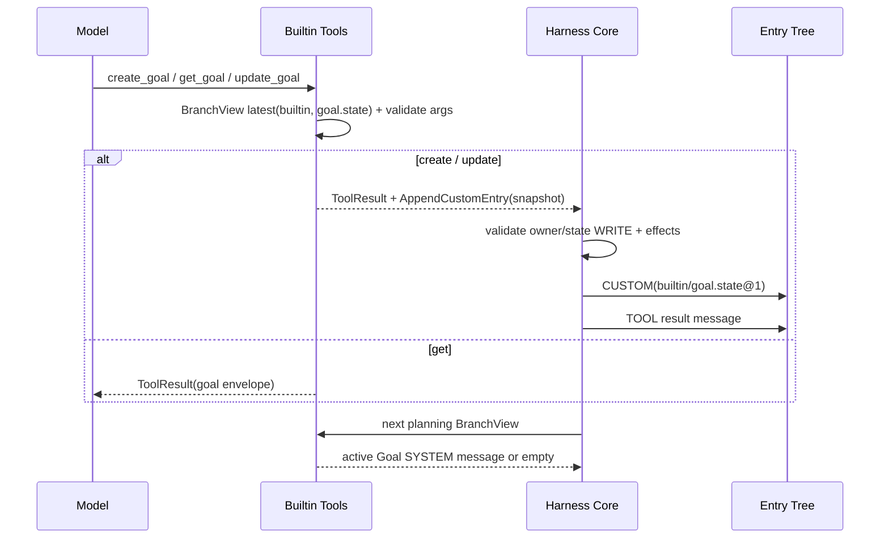

# Harness Builtin

## 定位

`harness-builtin` 是系统第一方内置能力模块，提供全局唯一的 `BuiltinHarnessContributor`（标识为 `builtin`）。模块集中向 `HarnessCatalog` 注册系统内置的 14 个统一工具、`goal.state` 自定义条目所有权以及 Goal 上下文投影器。

14 个内置工具分为三类：
- 9 个面向模型可见、声明 `environmentRequired=true` 的环境能力工具；
- 2 个内部工具：`load_skill` 与 `task`；
- 3 个面向模型可见、通过 `AppendCustomEntry` 副作用维护分支目标的 Goal 管理工具。

所有内置工具在全局拥有稳定的 `AgentToolId`，统一以 `base.*` 为前缀，并在 [`BuiltinToolIds`](../../harness/builtin/src/main/java/fun/fengwk/kkstudio/harness/builtin/BuiltinToolIds.java) 中集中定义。

## 职责

### 核心职责

- 通过单一 `BuiltinHarnessContributor` 和统一 Tool SPI 注册全部 14 个内置工具。
- 将 Goal 表达为分支作用域的 `builtin/goal.state` 全量快照，通过 `AppendCustomEntry` 副作用由 Core 原子追加至会话树。
- 提供 `goal.context` 纯上下文投影器，仅将当前分支活跃的 Goal 投影至下一次模型规划的 SYSTEM 上下文中。
- 将内部工具 `load_skill` 与 `task` 作为标准 `INTERNAL` 工具注册，为 Skill 加载与 Subagent 任务执行提供标准化契约。

### 协作边界

- Goal 的持久化事实完全存储于 `harness_entry` 协议表的 CUSTOM 载荷中，复用 Harness 统一的会话树存储体系。
- 环境通信网络传输与守护进程能力由执行环境及 Daemon 模块实现，`EnvironmentCapabilityTool` 在执行期直接委托注入的 `BoundEnvironment` 调度环境能力。
- 第一方内置能力采用启动期一次性静态装配模式，生命周期与应用进程保持一致。
- 执行任务的分发调度、审批工作流与持久化状态机由 Harness Core 统一驱动。

## 依赖边界

```text
BuiltinHarnessContributor
  -> harness-contributor-api（HarnessContributor / HarnessRegistrar / Tool / BranchView / projector）
  -> harness-environment（CapabilityCatalog / BoundEnvironment 使用的 descriptor）
  -> harness-tool（AgentToolId / ToolDescriptor / ToolResult）
  -> harness-common（PromptTemplate / Loader、ResultContent / InputSchema）

依赖约束：仅允许依赖 harness-common、harness-contributor-api、harness-tool、harness-environment 与 Jackson；
          运行时存储调度、基础设施通信、守护进程、Spring 容器与外部数据库均置于模块外部。
```

POM 见 [`pom.xml`](../../harness/builtin/pom.xml)，包级职责见 [`package-info.java`](../../harness/builtin/src/main/java/fun/fengwk/kkstudio/harness/builtin/package-info.java)。

持久化存储方案统一依托 [`V1__schema.sql`](../../schema/src/main/resources/db/migration/V1__schema.sql) 定义的 Harness 七张核心协议表，Goal 状态直接复用通用条目表承载。

## 包架构

| 包名 | 职责 | 明确边界 |
| --- | --- | --- |
| `fun.fengwk.kkstudio.harness.builtin` | 系统第一方内置能力根包，提供唯一的 `BuiltinHarnessContributor`、`BuiltinToolIds` 全局常量与完成态句柄 | 集中注册 14 个统一内置工具、Goal 自定义类型与投影器；底层网络传输与持久化调度由外层模块负责 |
| `fun.fengwk.kkstudio.harness.builtin.environment` | 内置 Environment capability 工具实现（`EnvironmentCapabilityTool`）与 prompt 模板加载 | 委托执行期注入的 `BoundEnvironment` 执行环境能力；传输协议解析与宿主进程管理由环境守护进程承接 |
| `fun.fengwk.kkstudio.harness.builtin.goal` | 内置 Goal 状态管理工具（`create_goal`、`get_goal`、`update_goal`）、纯上下文投影器（`GoalContextProjector`）、快照模型（`GoalState`）与严格确定性 JSON 编解码器（`GoalStateCodec`） | 依托通用 `harness_entry` 的 CUSTOM 载荷存储，通过 `AppendCustomEntry` 由 Core 原子追加 |
| `fun.fengwk.kkstudio.harness.builtin.skill` | 内部 Skill 加载工具（`LoadSkillTool`）及正文加载契约 | 仅供当前 Thread Agent 选中的 Skill 按需加载，通过环境绑定安全读取而隐藏宿主绝对路径 |
| `fun.fengwk.kkstudio.harness.builtin.subagent` | 内部 Subagent 委派工具适配器（`TaskTool`）、任务请求契约（`SubagentTaskRequest`）、执行端口（`SubagentRunner`）与动态配置接入 | 负责参数校验与委派转发，委托 `SubagentRunner` 执行；多轮调度引擎与持久化状态机由运行时负责 |

## 核心模型 / API

### BuiltinHarnessContributor 注册清单

[`BuiltinHarnessContributor`](../../harness/builtin/src/main/java/fun/fengwk/kkstudio/harness/builtin/BuiltinHarnessContributor.java) 接收 `loadSkillTool` 与 `taskTool`（由 Platform 装配注入），其描述符为 `ContributorId("builtin")`、version `"1"`、无 `requires` 依赖。它统一注册 14 个 Tool、1 个 Custom Entry Type 和 1 个 Context Projector：

| localName | AgentToolId | model name | requirements | visibility | priority | 说明 |
| --- | --- | --- | --- | --- | --- | --- |
| `environment.read` | `base.read` | `read` | Environment | SELECTABLE | 0 | `fs.read`，READ_ONLY |
| `environment.write` | `base.write` | `write` | Environment | SELECTABLE | 0 | `fs.write`，IDEMPOTENT |
| `environment.edit` | `base.edit` | `edit` | Environment | SELECTABLE | 0 | `fs.apply-edit`，NON_IDEMPOTENT |
| `environment.bash` | `base.bash` | `bash` | Environment | SELECTABLE | 0 | `process.exec`，NON_IDEMPOTENT |
| `environment.grep` | `base.grep` | `grep` | Environment | SELECTABLE | 0 | `fs.search`，READ_ONLY |
| `environment.find` | `base.find` | `find` | Environment | SELECTABLE | 0 | `fs.find`，READ_ONLY |
| `environment.lsp-goto-definition` | `base.lsp-goto-definition` | `lsp_goto_definition` | Environment | SELECTABLE | 0 | `lsp.goto-definition`，READ_ONLY |
| `environment.lsp-workspace-symbols` | `base.lsp-workspace-symbols` | `lsp_workspace_symbols` | Environment | SELECTABLE | 0 | `lsp.workspace-symbols`，READ_ONLY |
| `environment.lsp-java-decompile` | `base.lsp-java-decompile` | `lsp_java_decompile` | Environment | SELECTABLE | 0 | `lsp.java-decompile`，READ_ONLY |
| `runtime.load-skill` | `base.load-skill` | `load_skill` | none | INTERNAL | 0 | 内部 Skill 加载 |
| `runtime.task` | `base.task` | `task` | none | INTERNAL | 0 | 内部 Subagent 委派 |
| `goal.create` | `base.goal.create` | `create_goal` | WRITE(`goal.state`) | SELECTABLE | 0 | 创建 Goal snapshot |
| `goal.get` | `base.goal.get` | `get_goal` | READ(`goal.state`) | SELECTABLE | 0 | 读取 Goal snapshot |
| `goal.update` | `base.goal.update` | `update_goal` | WRITE(`goal.state`) | SELECTABLE | 0 | 结束 Goal |

此外注册：
- Custom Entry Type：`goal.state-type`，customType 为 `goal.state`，priority 为 0；
- Context Projector：`goal.context`，[`GoalContextProjector`](../../harness/builtin/src/main/java/fun/fengwk/kkstudio/harness/builtin/goal/GoalContextProjector.java)，priority 为 0。

### Goal state 快照与 Codec

[`GoalState`](../../harness/builtin/src/main/java/fun/fengwk/kkstudio/harness/builtin/goal/GoalState.java) 是完整替换的状态快照：

```text
objective:   non-blank string
tokenBudget: positive long or null
status:      active | complete | blocked
reason:      null for active, non-blank for terminal
createdAt:   Instant
updatedAt:   Instant
```

`GoalStatus.ACTIVE` 是唯一的活跃状态；`COMPLETE` 与 `BLOCKED` 为终结状态。快照要求 `updatedAt >= createdAt`，时间戳在工具执行时统一截断至毫秒精度。

[`GoalStateCodec`](../../harness/builtin/src/main/java/fun/fengwk/kkstudio/harness/builtin/goal/GoalStateCodec.java) 要求载荷的 `schemaVersion=1`，`dataJson` 包含且仅包含以下结构：

```json
{
  "objective": "...",
  "tokenBudget": 1000,
  "status": "active",
  "reason": null,
  "createdAt": "2026-01-01T00:00:00Z",
  "updatedAt": "2026-01-01T00:00:01Z"
}
```

编解码器基于 fail-closed 原则工作：遇到未知字段、缺失必填项、重复键、尾随字符、非法状态枚举、格式错误时间戳、非正预算数值或违反领域不变量时，均立即抛出异常并拒绝处理。

### Branch scope 与 Goal 工具

每个 Goal 工具通过限定于 `builtin` 作用域的 [`BranchView.latestCustomEntry`](../../harness/contributor-api/src/main/java/fun/fengwk/kkstudio/harness/contributor/api/BranchView.java) 查询 `goal.state`，读取当前 Tool 所在 Assistant Entry 自根节点至当前节点的路径：

- [`CreateGoalTool`](../../harness/builtin/src/main/java/fun/fengwk/kkstudio/harness/builtin/goal/CreateGoalTool.java)：要求提供非空 `objective`，可选正整数 `tokenBudget`。创建 `ACTIVE` 状态快照；若当前分支已存在 Goal，保留原始 `createdAt`，返回包含 JSON `goal` 包裹对象的结果与一个 `AppendCustomEntry` 的 WRITE 意图。
- [`GetGoalTool`](../../harness/builtin/src/main/java/fun/fengwk/kkstudio/harness/builtin/goal/GetGoalTool.java)：无入参要求。只读查询当前分支的最新快照；快照不存在时返回提示文本。仅产生查询结果，无追加意图，分支状态保持不变。
- [`UpdateGoalTool`](../../harness/builtin/src/main/java/fun/fengwk/kkstudio/harness/builtin/goal/UpdateGoalTool.java)：要求 `status` 为 `complete` 或 `blocked`，且附带非空 `reason`。操作前提为当前分支已存在 `ACTIVE` 状态 Goal；对已终结的目标尝试更新将直接被拒绝。该工具保持 objective、tokenBudget 与 createdAt 不变，更新 status、reason 与 updatedAt，并返回一个 WRITE 追加意图。
- [`GoalContextProjector`](../../harness/builtin/src/main/java/fun/fengwk/kkstudio/harness/builtin/goal/GoalContextProjector.java)：仅在最新快照状态为 `ACTIVE` 时生成一条 `AgentMessage.system`，内容基于 `active-goal-context.md` 模板与规范的 `goal` 包裹对象构造。快照不存在或已处于终结状态时均返回空列表。

### Skill 与 Subagent 工具

- [`LoadSkillTool`](../../harness/builtin/src/main/java/fun/fengwk/kkstudio/harness/builtin/skill/LoadSkillTool.java)：作为内部工具（`ToolVisibility.INTERNAL`）注册，依据 `ThreadSelectedSkillLookup` 与 `SkillBodyLoader` 按需加载 Skill 正文内容。
- [`TaskTool`](../../harness/builtin/src/main/java/fun/fengwk/kkstudio/harness/builtin/subagent/TaskTool.java)：作为内部工具（`ToolVisibility.INTERNAL`）注册，委托外部注入的 `SubagentRunner` 创建或恢复 Subagent Session 与 Thread，在有界并发与深度控制下执行子任务并返回汇总报告。

## 执行 / 状态 trace



## 不变量、failure / recovery

- **存储结构契约**：Goal 状态完全以快照形式持久化于 `harness_entry` 的 CUSTOM 节点中，条目键固定为 `(contributorId=builtin, customType=goal.state, schemaVersion=1)`，实现统一且可追溯的持久化存储。
- **操作与副作用配对**：创建与更新操作执行成功时必须携带且仅携带一个 `AppendCustomEntry` 副作用；查询操作以及所有错误结果严禁附带任何追加副作用。
- **参数严格校验**：工具调用参数首先经过 `ToolDescriptor` 的模式校验，再由 `GoalToolSupport` 执行强类型与领域校验；遇到未知属性或非法参数时严格执行 fail-closed 拦截。
- **领域状态不变量**：`GoalState` 维持严格的领域不变量：`ACTIVE` 状态的 `reason` 必须为 null；终结状态（`COMPLETE` 与 `BLOCKED`）必须提供非空 `reason`；`tokenBudget` 限定为正整数或 null；`updatedAt` 时间戳不得早于 `createdAt`。
- **单向状态流转**：状态流转严格遵循单向终结约束：更新操作仅允许从 `ACTIVE` 流转至 `COMPLETE` 或 `BLOCKED`；创建操作支持在当前分支覆盖替换活跃快照，并保留原始创建时间戳。
- **原子追加校验**：在工具执行终结并写入前，Core 严格校验 `builtin:goal.state` 的所有权与 WRITE 访问声明；若校验未通过或资源外部化失败，整个操作原子回滚，避免残留不一致的状态条目。
- **分支路径隔离**：分支读取沿自身祖先路径进行；分叉后新增的快照不会出现在兄弟路径中。
- **活跃上下文投影**：快照不存在或已处于终结状态时，投影器静默返回空列表，确保仅将真正活跃的目标注入模型提示词上下文。

## 配置 / 扩展

- Goal 的 schema、Tool description 和 active context 均由 classpath prompt resources 提供，入口是 [`GoalPrompts.java`](../../harness/builtin/src/main/java/fun/fengwk/kkstudio/harness/builtin/goal/GoalPrompts.java)。
- Environment 工具 prompt 模板来自 `harness/builtin/src/main/resources/fun/fengwk/kkstudio/harness/builtin/environment/prompts/`，入口是 [`EnvironmentPrompts.java`](../../harness/builtin/src/main/java/fun/fengwk/kkstudio/harness/builtin/environment/EnvironmentPrompts.java)。
- Subagent 配置由 `SubagentConfigProvider` 在每次决策点从系统配置中实时读取，包含 `maxDepth`、单父级 `maxConcurrency`、全局 `maxTotalConcurrency`、`idleTimeout` 与 `maxTurns`。

## 测试与源码入口

### 源码入口

- [`BuiltinHarnessContributor.java`](../../harness/builtin/src/main/java/fun/fengwk/kkstudio/harness/builtin/BuiltinHarnessContributor.java)、[`BuiltinToolIds.java`](../../harness/builtin/src/main/java/fun/fengwk/kkstudio/harness/builtin/BuiltinToolIds.java)
- [`CreateGoalTool.java`](../../harness/builtin/src/main/java/fun/fengwk/kkstudio/harness/builtin/goal/CreateGoalTool.java)、[`GetGoalTool.java`](../../harness/builtin/src/main/java/fun/fengwk/kkstudio/harness/builtin/goal/GetGoalTool.java)、[`UpdateGoalTool.java`](../../harness/builtin/src/main/java/fun/fengwk/kkstudio/harness/builtin/goal/UpdateGoalTool.java)
- [`GoalFeature.java`](../../harness/builtin/src/main/java/fun/fengwk/kkstudio/harness/builtin/goal/GoalFeature.java)、[`GoalState.java`](../../harness/builtin/src/main/java/fun/fengwk/kkstudio/harness/builtin/goal/GoalState.java)、[`GoalStateCodec.java`](../../harness/builtin/src/main/java/fun/fengwk/kkstudio/harness/builtin/goal/GoalStateCodec.java)
- [`GoalContextProjector.java`](../../harness/builtin/src/main/java/fun/fengwk/kkstudio/harness/builtin/goal/GoalContextProjector.java)、[`GoalToolSupport.java`](../../harness/builtin/src/main/java/fun/fengwk/kkstudio/harness/builtin/goal/GoalToolSupport.java)、[`GoalPrompts.java`](../../harness/builtin/src/main/java/fun/fengwk/kkstudio/harness/builtin/goal/GoalPrompts.java)
- [`LoadSkillTool.java`](../../harness/builtin/src/main/java/fun/fengwk/kkstudio/harness/builtin/skill/LoadSkillTool.java)、[`TaskTool.java`](../../harness/builtin/src/main/java/fun/fengwk/kkstudio/harness/builtin/subagent/TaskTool.java)

### 关键测试守卫

- [`BuiltinHarnessContributorTest.java`](../../harness/builtin/src/test/java/fun/fengwk/kkstudio/harness/builtin/BuiltinHarnessContributorTest.java)：完整 14 工具清单、Tool descriptor/version/schema、ownership 与 Catalog 注册测试。
- [`BuiltinModuleArchitectureTest.java`](../../harness/builtin/src/test/java/fun/fengwk/kkstudio/harness/builtin/BuiltinModuleArchitectureTest.java)：单向依赖方向与模块契约边界守卫。
- [`BuiltinToolIdsTest.java`](../../harness/builtin/src/test/java/fun/fengwk/kkstudio/harness/builtin/BuiltinToolIdsTest.java)：全局 `base.*` 稳定标识校验。
- [`GoalFeatureTest.java`](../../harness/builtin/src/test/java/fun/fengwk/kkstudio/harness/builtin/goal/GoalFeatureTest.java)：branch latest snapshot、fork/sibling 隔离、replacement 时间戳、active projector 静默。
- [`GoalStateCodecTest.java`](../../harness/builtin/src/test/java/fun/fengwk/kkstudio/harness/builtin/goal/GoalStateCodecTest.java)：strict JSON schema codec 与 domain 不变量校验。
- [`LoadSkillToolTest.java`](../../harness/builtin/src/test/java/fun/fengwk/kkstudio/harness/builtin/skill/LoadSkillToolTest.java)：Skill 查找与正文加载超时契约。
- [`TaskToolTest.java`](../../harness/builtin/src/test/java/fun/fengwk/kkstudio/harness/builtin/subagent/TaskToolTest.java)：Subagent 创建、深度预算与执行流程。

---

上级：[系统设计](../system-design.md)。相关文档：[Harness Common](harness-common.md)、[Harness Contributor API](harness-contributor-api.md)、[Harness Runtime](harness-runtime.md)、[Harness Tool](harness-tool.md)、[Web](web.md)。
