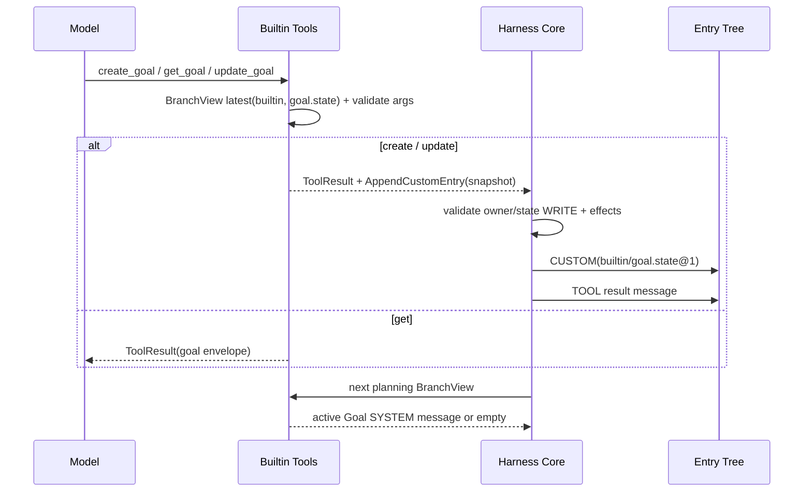

# Harness Builtin

## 定位

`harness-builtin` 是系统第一方内置能力模块，提供唯一的 `BuiltinHarnessContributor`（ID 为 `builtin`）。它将系统内置的 17 个统一 Tool、`goal.state` 自定义 Entry ownership 与 Goal 上下文投影器注册到 `HarnessCatalog`。

17 个内置工具包括：
- 12 个模型可见、声明 `environmentRequired=true` 的 Environment capability Tool；
- 2 个内部 Tool：`load_skill` 与 `task`；
- 3 个模型可见、通过 `AppendCustomEntry` effect 维护 branch Goal 的 Tool。

所有内置工具的全局稳定 AgentToolId 统一保持 `base.*` 前缀，并在 [`BuiltinToolIds`](../../harness/builtin/src/main/java/fun/fengwk/kkstudio/harness/builtin/BuiltinToolIds.java) 中集中定义。

## Goals / Non-goals

### Goals

- 通过单一 `BuiltinHarnessContributor` 和统一 Tool SPI 注册全部 17 个工具。
- 将 Goal 表达为 branch-scoped `builtin/goal.state` 全量快照，不建独立数据库表，通过 `AppendCustomEntry` 由 Core 原子追加。
- 提供 `goal.context` 投影器，仅将当前 branch 活跃的 Goal 投影到下一次 Model planning 的 SYSTEM 上下文中。
- 将内部 `load_skill` 与 `task` 作为普通 `INTERNAL` Tool 注册，为 Skill 加载与 Subagent 任务执行提供标准化契约。

### Non-goals

- 不为 Goal 建立独立数据库表；Goal durable fact 只存在于 `harness_entry` 的 CUSTOM payload 中。
- 不在 Builtin 模块实现 Environment 网络 transport 或 Daemon capability；`EnvironmentCapabilityTool` 只委托执行期 `BoundEnvironment`。
- 不提供热插拔或动态卸载；作为第一方核心能力在系统启动时一次性装配。
- 不实现 host-side 独立 dispatcher 或 approval 工作流；调度和持久化状态机由 Harness Core 负责。

## 依赖边界

```text
BuiltinHarnessContributor
  -> harness-contributor-api（HarnessContributor / HarnessRegistrar / Tool / BranchView / projector）
  -> harness-environment（CapabilityCatalog / BoundEnvironment 使用的 descriptor）
  -> harness-tool（AgentToolId / ToolDescriptor / ToolResult）
  -> harness-common（PromptTemplate / Loader、ResultContent / InputSchema）
```

POM 见 [`pom.xml`](../../harness/builtin/pom.xml)，包级职责见 [`package-info.java`](../../harness/builtin/src/main/java/fun/fengwk/kkstudio/harness/builtin/package-info.java)。Builtin 模块依赖 `harness-common`、`harness-contributor-api`、`harness-tool`、`harness-environment` 与 Jackson；不依赖 runtime、infra、daemon、platform、web、Spring 或外部数据库。

Harness durable schema 的唯一入口是 [`V1__schema.sql`](../../schema/src/main/resources/db/migration/V1__schema.sql)；其中只有 Harness 七张协议表，没有 Goal 专用表。

## 核心模型 / API

### BuiltinHarnessContributor 注册清单

[`BuiltinHarnessContributor`](../../harness/builtin/src/main/java/fun/fengwk/kkstudio/harness/builtin/BuiltinHarnessContributor.java) 接收 `loadSkillTool` 与 `taskTool`（由 Platform 装配提供），其 descriptor 为 `ContributorId("builtin")`、version `"1"`、无 requires。它共注册 17 个 Tool、1 个 Custom Entry Type 和 1 个 Context Projector：

| localName | AgentToolId | model name | requirements | visibility | priority | 说明 |
| --- | --- | --- | --- | --- | --- | --- |
| `environment.read` | `base.read` | `read` | Environment | SELECTABLE | 0 | `fs.read`，READ_ONLY |
| `environment.write` | `base.write` | `write` | Environment | SELECTABLE | 0 | `fs.write`，IDEMPOTENT |
| `environment.edit` | `base.edit` | `edit` | Environment | SELECTABLE | 0 | `fs.apply-edit`，NON_IDEMPOTENT |
| `environment.apply-patch` | `base.apply-patch` | `apply_patch` | Environment | SELECTABLE | 0 | `fs.apply-patch`，NON_IDEMPOTENT |
| `environment.bash` | `base.bash` | `bash` | Environment | SELECTABLE | 0 | `process.exec`，NON_IDEMPOTENT |
| `environment.grep` | `base.grep` | `grep` | Environment | SELECTABLE | 0 | `fs.search`，READ_ONLY |
| `environment.find` | `base.find` | `find` | Environment | SELECTABLE | 0 | `fs.find`，READ_ONLY |
| `environment.lsp-goto-definition` | `base.lsp-goto-definition` | `lsp_goto_definition` | Environment | SELECTABLE | 0 | `lsp.goto-definition`，READ_ONLY |
| `environment.lsp-workspace-symbols` | `base.lsp-workspace-symbols` | `lsp_workspace_symbols` | Environment | SELECTABLE | 0 | `lsp.workspace-symbols`，READ_ONLY |
| `environment.lsp-java-decompile` | `base.lsp-java-decompile` | `lsp_java_decompile` | Environment | SELECTABLE | 0 | `lsp.java-decompile`，READ_ONLY |
| `environment.mcp-list-tools` | `base.mcp-list-tools` | `mcp_list_tools` | Environment | SELECTABLE | 0 | `mcp.list`，READ_ONLY |
| `environment.mcp-call-tool` | `base.mcp-call-tool` | `mcp_call_tool` | Environment | SELECTABLE | 0 | `mcp.call`，NON_IDEMPOTENT |
| `runtime.load-skill` | `base.load-skill` | `load_skill` | none | INTERNAL | 0 | 内部 Skill 加载 |
| `runtime.task` | `base.task` | `task` | none | INTERNAL | 0 | 内部 Subagent 委派 |
| `goal.create` | `base.goal.create` | `create_goal` | WRITE(`goal.state`) | SELECTABLE | 0 | 创建 Goal snapshot |
| `goal.get` | `base.goal.get` | `get_goal` | READ(`goal.state`) | SELECTABLE | 0 | 读取 Goal snapshot |
| `goal.update` | `base.goal.update` | `update_goal` | WRITE(`goal.state`) | SELECTABLE | 0 | 结束 Goal |

此外注册：
- Custom Entry Type：`goal.state-type`，customType 为 `goal.state`，priority 0；
- Context Projector：`goal.context`，[`GoalContextProjector`](../../harness/builtin/src/main/java/fun/fengwk/kkstudio/harness/builtin/goal/GoalContextProjector.java)，priority 0。

### Goal state 快照与 Codec

[`GoalState`](../../harness/builtin/src/main/java/fun/fengwk/kkstudio/harness/builtin/goal/GoalState.java) 是完整替换快照：

```text
objective:   non-blank string
tokenBudget: positive long or null
status:      active | complete | blocked
reason:      null for active, non-blank for terminal
createdAt:   Instant
updatedAt:   Instant
```

`GoalStatus.ACTIVE` 是唯一非 terminal 状态；`COMPLETE` 和 `BLOCKED` 是 terminal。`updatedAt >= createdAt`，时间戳在工具执行时截断到毫秒。

[`GoalStateCodec`](../../harness/builtin/src/main/java/fun/fengwk/kkstudio/harness/builtin/goal/GoalStateCodec.java) 要求 payload `schemaVersion=1`，`dataJson` 包含且仅包含以下字段：

```json
{
  "objective": "...",
  "tokenBudget": 1000,
  "status": "active",
  "reason": null,
  "createdAt": "2026-01-01T00:00:00Z",
  "updatedAt": "2026-01-01T00:00:01Z"
}
```

未知字段、缺失字段、duplicate/trailing、非法 status、非法时间戳、非正 budget 或领域不变量失败均立即拒绝。

### Branch scope 与 Goal 工具

每个 Goal 工具从已 scoped 到 `builtin` 的 [`BranchView.latestCustomEntry`](../../harness/contributor-api/src/main/java/fun/fengwk/kkstudio/harness/contributor/api/BranchView.java) 查询 `goal.state`，只使用当前 Tool 所在 Assistant Entry 的 root-to-head 路径：

- [`CreateGoalTool`](../../harness/builtin/src/main/java/fun/fengwk/kkstudio/harness/builtin/goal/CreateGoalTool.java)：要求 `objective`，可选正 `tokenBudget`。创建 `ACTIVE` 快照；若 branch 已有 Goal，保留原 `createdAt`，返回 JSON `goal` envelope 和一个 `AppendCustomEntry` WRITE intent。
- [`GetGoalTool`](../../harness/builtin/src/main/java/fun/fengwk/kkstudio/harness/builtin/goal/GetGoalTool.java)：无参数。只读当前 branch 的最新快照；不存在时返回无 goal 提示文本。不返回 intent，不改变 branch。
- [`UpdateGoalTool`](../../harness/builtin/src/main/java/fun/fengwk/kkstudio/harness/builtin/goal/UpdateGoalTool.java)：要求 `status` 为 `complete` 或 `blocked`，且 `reason` 非空。必须已有 `ACTIVE` Goal；terminal Goal 不能再次 update。保持 objective/tokenBudget/createdAt 不变，替换 status/reason/updatedAt，并返回一个 WRITE intent。
- [`GoalContextProjector`](../../harness/builtin/src/main/java/fun/fengwk/kkstudio/harness/builtin/goal/GoalContextProjector.java)：只在 latest Goal 状态为 ACTIVE 时生成一条 `AgentMessage.system`，内容由 `active-goal-context.md` 模板与 canonical `goal` envelope 构造。缺失、COMPLETE 或 BLOCKED 均返回空列表。

### Skill 与 Subagent 工具

- [`LoadSkillTool`](../../harness/builtin/src/main/java/fun/fengwk/kkstudio/harness/builtin/skill/LoadSkillTool.java)：内部 Tool，依据 `ThreadSelectedSkillLookup` 与 `SkillBodyLoader` 按需加载 Skill 正文内容。
- [`TaskTool`](../../harness/builtin/src/main/java/fun/fengwk/kkstudio/harness/builtin/subagent/TaskTool.java)：内部 Tool，通过外部 `SubagentRunner` 创建/恢复子 Session 与 Thread，在有界并发限制下执行子任务并返回汇总报告。

## 执行 / 状态 trace



## 不变量、failure / recovery

- Goal state 只存在于 `harness_entry` CUSTOM，entry key 为 `(contributorId=builtin, customType=goal.state, schemaVersion=1)`；没有独立 Goal 表或 side channel。
- create/update 的 successful result 必须携带一个 `AppendCustomEntry`，get 和所有 error result 必须没有 intents。
- Tool 参数先通过 descriptor schema，再由 `GoalToolSupport` 执行严格对象与参数校验；未知/重复字段 fail closed。
- `GoalState` active 不得有 reason，terminal 必须有 reason；tokenBudget 只能是正数或 null；时间不能回退。
- update 只允许 `ACTIVE -> COMPLETE/BLOCKED`；create 可以在当前 branch 完整替换 active 快照，但保留 creation time。
- Core 在 Tool terminal apply 前校验 `builtin:goal.state` ownership 和 WRITE access；校验或 Resource materialization 失败时不追加 CUSTOM Entry。
- fork 读取严格按 branch path；不在该 branch path 上的快照对 sibling branch 完全隔离。
- projector 对 terminal 或 missing state 静默返回空，不把已结束的 Goal 作为 active instruction。

## 配置 / 扩展

- Goal 的 schema、Tool description 和 active context 均由 classpath prompt resources 提供，入口是 [`GoalPrompts.java`](../../harness/builtin/src/main/java/fun/fengwk/kkstudio/harness/builtin/goal/GoalPrompts.java)。
- Environment 工具 prompt 模板来自 `harness/builtin/src/main/resources/fun/fengwk/kkstudio/harness/builtin/environment/prompts/`，入口是 [`EnvironmentPrompts.java`](../../harness/builtin/src/main/java/fun/fengwk/kkstudio/harness/builtin/environment/EnvironmentPrompts.java)。
- Subagent 配置由 `SubagentConfigProvider` 每次决策点从系统设置现读，包括深度、并发度与超时限制。

## 测试与源码入口

### 源码入口

- [`BuiltinHarnessContributor.java`](../../harness/builtin/src/main/java/fun/fengwk/kkstudio/harness/builtin/BuiltinHarnessContributor.java)、[`BuiltinToolIds.java`](../../harness/builtin/src/main/java/fun/fengwk/kkstudio/harness/builtin/BuiltinToolIds.java)
- [`CreateGoalTool.java`](../../harness/builtin/src/main/java/fun/fengwk/kkstudio/harness/builtin/goal/CreateGoalTool.java)、[`GetGoalTool.java`](../../harness/builtin/src/main/java/fun/fengwk/kkstudio/harness/builtin/goal/GetGoalTool.java)、[`UpdateGoalTool.java`](../../harness/builtin/src/main/java/fun/fengwk/kkstudio/harness/builtin/goal/UpdateGoalTool.java)
- [`GoalFeature.java`](../../harness/builtin/src/main/java/fun/fengwk/kkstudio/harness/builtin/goal/GoalFeature.java)、[`GoalState.java`](../../harness/builtin/src/main/java/fun/fengwk/kkstudio/harness/builtin/goal/GoalState.java)、[`GoalStateCodec.java`](../../harness/builtin/src/main/java/fun/fengwk/kkstudio/harness/builtin/goal/GoalStateCodec.java)
- [`GoalContextProjector.java`](../../harness/builtin/src/main/java/fun/fengwk/kkstudio/harness/builtin/goal/GoalContextProjector.java)、[`GoalToolSupport.java`](../../harness/builtin/src/main/java/fun/fengwk/kkstudio/harness/builtin/goal/GoalToolSupport.java)、[`GoalPrompts.java`](../../harness/builtin/src/main/java/fun/fengwk/kkstudio/harness/builtin/goal/GoalPrompts.java)
- [`LoadSkillTool.java`](../../harness/builtin/src/main/java/fun/fengwk/kkstudio/harness/builtin/skill/LoadSkillTool.java)、[`TaskTool.java`](../../harness/builtin/src/main/java/fun/fengwk/kkstudio/harness/builtin/subagent/TaskTool.java)

### 关键测试守卫

- [`BuiltinHarnessContributorTest.java`](../../harness/builtin/src/test/java/fun/fengwk/kkstudio/harness/builtin/BuiltinHarnessContributorTest.java)：完整 17 工具清单、Tool descriptor/version/schema、ownership 与 Catalog 注册测试。
- [`BuiltinModuleArchitectureTest.java`](../../harness/builtin/src/test/java/fun/fengwk/kkstudio/harness/builtin/BuiltinModuleArchitectureTest.java)：Builtin 只依赖 common/contributor-api/tool/environment/Jackson，不依赖 runtime/infra/daemon/platform/web。
- [`BuiltinToolIdsTest.java`](../../harness/builtin/src/test/java/fun/fengwk/kkstudio/harness/builtin/BuiltinToolIdsTest.java)：全局 `base.*` 稳定标识校验。
- [`GoalFeatureTest.java`](../../harness/builtin/src/test/java/fun/fengwk/kkstudio/harness/builtin/goal/GoalFeatureTest.java)：branch latest snapshot、fork/sibling 隔离、replacement 时间戳、active projector 静默。
- [`GoalStateCodecTest.java`](../../harness/builtin/src/test/java/fun/fengwk/kkstudio/harness/builtin/goal/GoalStateCodecTest.java)：strict JSON schema codec 与 domain 不变量校验。
- [`LoadSkillToolTest.java`](../../harness/builtin/src/test/java/fun/fengwk/kkstudio/harness/builtin/skill/LoadSkillToolTest.java)：Skill 查找与正文加载超时契约。
- [`TaskToolTest.java`](../../harness/builtin/src/test/java/fun/fengwk/kkstudio/harness/builtin/subagent/TaskToolTest.java)：Subagent 创建、深度预算与执行流程。

---

上级：[系统设计](../system-design.md)。相关文档：[Harness Common](harness-common.md)、[Harness Contributor API](harness-contributor-api.md)、[Harness Runtime](harness-runtime.md)、[Harness Tool](harness-tool.md)、[Web](web.md)。
