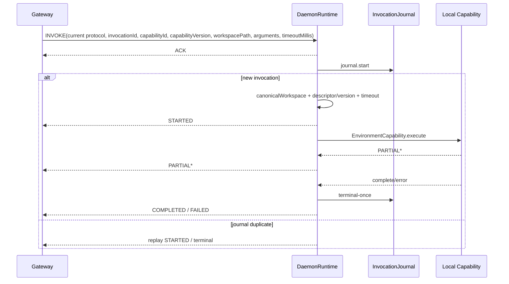

# Harness Daemon

## 定位

Environment Daemon 是独立进程，负责固定 Environment root 内的 coding capabilities、MCP bridge、Skill discovery、目录浏览和 Daemon WebSocket protocol v5。它依赖 `harness-common` 的共享值契约与 `harness-environment` 的 Capability SPI/wire contract，不依赖 Tool、Runtime、Infra、Platform、Spring、数据库或 Model/Agent。

[`DaemonMain`](../../harness/daemon/src/main/java/fun/fengwk/kkstudio/harness/daemon/DaemonMain.java) 是进程入口；[`DaemonRuntime`](../../harness/daemon/src/main/java/fun/fengwk/kkstudio/harness/daemon/DaemonRuntime.java) 管理连接、journal、capability 执行、重连、超时和 shutdown。Daemon 的 invocation journal 是进程内 execution fact；WebSocket 只传递消息。

## Goals / Non-goals

### Goals

- 以 canonical `environmentName` 声明唯一逻辑 route，并在每个 envelope 校验 scope。
- 在连接断开/重连时用 invocation journal 去重 `INVOKE` 并重放 STARTED/terminal。
- 在统一 Environment root 内安全执行 coding capabilities，提供 MCP/Skill 的本地能力摘要和按需调用。
- 以 scheduler + virtual-thread task executor 管理 heartbeat、reconnect、timeout 和阻塞执行。
- 对路径、symlink、wire size、Resource、sequence、cancel 和 shutdown 采用 fail-closed 边界。

### Non-goals

- 不持久化 Agent/Session/Invocation/Work，不实现 Runtime 的模型调用处理器或权限决策。
- 不接受 gateway 下发的 skill 目录、MCP 配置、environment root 或任意本地路径配置。
- 不在 READY capabilities 中暴露 headers、environment values、command、URL、本地绝对路径或完整 MCP schema。
- 不把 WebSocket 连接当作 durable invocation source；连接丢失不清空 journal。

## 依赖边界

```text
DaemonMain
  ├─ DaemonConfig / CodingToolsConfig
  ├─ DaemonSkillRegistry
  ├─ McpServerRegistry
  └─ DaemonRuntime
       ├─ JdkWebSocketTransport
       ├─ DaemonCapabilityRegistry
       ├─ InMemoryDaemonInvocationJournal
       ├─ scheduler (1 thread)
       └─ taskExecutor (virtual-thread-per-task)

Daemon -> harness-common
Daemon -> harness-environment -> harness-common
Daemon -/-> harness-tool / harness-runtime / harness-infra / platform / web
```

POM 和依赖架构守卫见 [`pom.xml`](../../harness/daemon/pom.xml) 与 [`DaemonModuleArchitectureTest.java`](../../harness/daemon/src/test/java/fun/fengwk/kkstudio/harness/daemon/DaemonModuleArchitectureTest.java)。LangChain4j 只出现在 skill/MCP adapter 包；executor 只在 `DaemonRuntime` 创建，架构测试会检查这一生命周期边界。

## 核心模型 / API

### DaemonMain、config 与固定 capability registry

`DaemonMain` 的启动装配为：

```text
CLI -> DaemonConfig
   -> CodingToolsConfig.fromSystemProperties
   -> DaemonSkillRegistry.discover
   -> McpConfigParser / McpServerRegistry.start
   -> DaemonRuntime.create
   -> shutdown hook
   -> runtime.start / awaitTermination
```

[`DaemonConfig`](../../harness/daemon/src/main/java/fun/fengwk/kkstudio/harness/daemon/DaemonConfig.java) 读取：

```text
--gateway-uri (ws / wss)
--environment-name
--daemon-id
--gateway-token
--heartbeat
--reconnect-initial
--reconnect-max
--tool-timeout
--note
--environment-root
--skill-dir (repeatable)
--mcp-config
```

默认 heartbeat 15s、reconnect initial 1s、reconnect max 30s、default capability timeout 5min；environment root 默认启动用户 HOME 的 canonical existing directory；未显式指定 skill dir 时只在 `~/.agents/skills` 存在时纳入。`note` 只接受可信操作者配置或按 OS 生成的稳定默认文本，最多 512 字符单行。

[`DaemonCapabilityRegistry`](../../harness/daemon/src/main/java/fun/fengwk/kkstudio/harness/daemon/DaemonCapabilityRegistry.java) 在 runtime 构造完成时 freeze，freeze 后不能注册新 capability。生产 coding catalog 由 [`CodingCapabilities`](../../harness/daemon/src/main/java/fun/fengwk/kkstudio/harness/daemon/coding/CodingCapabilities.java) 固定注册：

```text
fs.read, fs.write, fs.apply-edit, fs.apply-patch,
process.exec, fs.search, fs.find,
lsp.goto-definition, lsp.workspace-symbols, lsp.java-decompile
```

MCP 无论 server 是否配置都注册固定 `mcp.list` 和 `mcp.call`，保持 Daemon capability registry 与 Environment capability catalog 一致。

### 双 executor lifecycle

`DaemonRuntime` 只拥有两个执行资源：

| 资源 | 所有者 | 用途 |
| --- | --- | --- |
| `ScheduledThreadPoolExecutor(1)` | `DaemonRuntime` | heartbeat、reconnect、capability timeout |
| `Executors.newThreadPerTaskExecutor(Thread.ofVirtual())` | `DaemonRuntime` | Coding/MCP/目录浏览阻塞调用 |

创建顺序是 scheduler → taskExecutor → transport/capability registration → runtime；任一步失败都会释放已创建 transport、MCP registry 和 executor。`start()` schedule heartbeat 和 immediate reconnect；重复 start 无副作用。`close`/terminal failure 先停止 transport 接入，再给 running invocation 发 CANCELLED，最后 `shutdownNow` 两个 executor，并在 5s termination deadline 内等待；单个清理失败不阻断其它资源。

### WebSocket protocol

生产 transport 是 [`JdkWebSocketTransport`](../../harness/daemon/src/main/java/fun/fengwk/kkstudio/harness/daemon/transport/JdkWebSocketTransport.java)，使用 JDK `HttpClient` WebSocket。只接受文本帧；fragment 累积超过默认 16 MiB 字符或出现 binary frame 时发送一次 RFC 6455 close code `1008`，后续帧全部拒绝。

握手与连接状态：

```text
DISCONNECTED -> CONNECTING
  -> HELLO(current protocol, daemonId, protocolVersion=5, gatewayToken, capabilityCatalogVersion)
  <- WELCOME(empty payload)
  -> READY(capabilities version=5, environment + skills + MCP summaries)
  -> READY + HEARTBEAT
```

每个 envelope 都带 protocol version、message type、canonical environmentName、sequence、payload；outbound sequence 由 runtime 递增。单个 connection generation 的 inbound sequence 必须从基线开始严格相邻递增；相同 sequence + 完全相同 envelope 是静默 duplicate，冲突复用、回退或跳号均拒绝；重连后 generation 重新建立基线。

Inbound：

```text
INVOKE / CANCEL           -> invocationId required
WELCOME / ACK / ERROR     -> handshake/control
```

scope 不匹配、未知 protocol/type、缺失/未知 payload 字段、duplicate/trailing 或非 object payload 都在 wire 边界拒绝。Environment name 冲突只认 `ENVIRONMENT_NAME_CONFLICT`，它使 runtime 进入 FAILED、停止重连并让进程非零退出；其它 ERROR 不改变 invocation journal。

### Coding Capabilities 与路径/资源边界

所有 filesystem coding capabilities 通过 [`EnvironmentPathBoundary`](../../harness/daemon/src/main/java/fun/fengwk/kkstudio/harness/daemon/coding/EnvironmentPathBoundary.java)：

- 默认 workdir 来自每个 `EnvironmentCapabilityExecutionRequest.workdir`，由 INVOKE 的 `workspacePath` canonicalize 后写入；
- 相对 path 以 invocation workspace 为基准，absolute path 也必须 real path 位于 environment root；
- `existing` 对已存在目标做 `toRealPath` root check；
- `existingWithoutSymlinks` 拒绝 root→target 的任意 symlink segment；
- `writable` 先校验已存在祖先的 canonical path，再允许新 leaf；
- Platform permission 负责授权，不能放宽 Daemon 的 root/symlink 边界。

`read`、`write`、`edit`、`apply_patch` 共享编码/preview/文件 mutation 边界；`apply_patch`
在一次 invocation 内先完成全部 patch 解析、路径和上下文预检，再用临时文件提交并对已提交
文件做尽力回滚。Add 的父目录逐级使用 NOFOLLOW 检查，并在写目标前重新 canonicalize 到 invocation
workspace；POSIX 可用时 replacement 与 Delete rollback 保留原文件权限。`grep`、`find` 使用 Java NIO/JGit ignore 规则，不启动外部搜索命令；LSP
capabilities 通过可选 `kkstudio.daemon.lsp-bridge`，`lsp_java_decompile` 对可解析 class 目标可用
`javap` fallback。配置见 [`CodingToolsConfig`](../../harness/daemon/src/main/java/fun/fengwk/kkstudio/harness/daemon/coding/CodingToolsConfig.java)：

```text
previewMaxLines = 2000
previewMaxBytes = 51200
bashExecutable = bash
javapExecutable = javap
system properties:
  kkstudio.daemon.resource-directory
  kkstudio.daemon.bash
  kkstudio.daemon.max-resource-bytes
  kkstudio.daemon.lsp-bridge
  kkstudio.daemon.javap
```

Resource store 默认为 Environment root 下 `.kkstudio/resources` 的 content-addressed local store；大/二进制结果转为 resource content。结果由 `DaemonCapabilityResultCodec` 编码：PARTIAL 只允许 text/json，COMPLETED 资源预检后才允许 store read/write；默认资源聚合 8 MiB、最终 payload 16 MiB、contents 64 项。该 codec 直接编码和解码 `EnvironmentCapabilityResult`，不参与 capability 执行 SPI。

### Skills、MCP 与目录浏览

[`DaemonSkillRegistry`](../../harness/daemon/src/main/java/fun/fengwk/kkstudio/harness/daemon/skill/DaemonSkillRegistry.java) 只从 CLI skill dirs 或默认 `~/.agents/skills` 发现 root/直接子目录 `SKILL.md`。同名、元数据非法、目录不存在或读取失败在启动期拒绝；READY 只返回 name/description，`skill.load` 返回去除 front matter 的 body。

[`McpConfigParser`](../../harness/daemon/src/main/java/fun/fengwk/kkstudio/harness/daemon/mcp/McpConfigParser.java) 只接受严格 UTF-8 JSON `{"servers":[...]}`；server name `[a-z][a-z0-9-]{0,63}`。STDIO 只允许 command/environment；streamable-http 只允许 http/https URL；websocket 只允许 ws/wss URL + headers。未知字段、重复 server、transport 不适用字段和非 canonical URL 直接拒绝。

[`McpServerRegistry`](../../harness/daemon/src/main/java/fun/fengwk/kkstudio/harness/daemon/mcp/McpServerRegistry.java) 为每个 server 独立初始化；单 server 失败记录 FAILED，不影响其它 server/coding/skills，启动后状态和 MCP tool specs 冻结；close 对成功 client 恰好一次。错误摘要单行最多 500 字符，并剔除 headers/environment values、command 和 URL。完整 schema 不进 READY wire，固定 bridge capability 按需返回。

目录浏览通过 generic capability `fs.list-directory` 执行；单层列表最多 1000 项，稳定按名称排序，wire path 只使用 Environment root 下 canonical 相对路径，不回显 daemon 绝对路径。实现见 [`EnvironmentDirectoryBrowser`](../../harness/daemon/src/main/java/fun/fengwk/kkstudio/harness/daemon/EnvironmentDirectoryBrowser.java) 和 [`ListDirectoryCapability`](../../harness/daemon/src/main/java/fun/fengwk/kkstudio/harness/daemon/coding/ListDirectoryCapability.java)。

## 执行 / 状态 trace



INVOKE 的 `capabilityId`、`capabilityVersion`、`workspacePath`、`arguments` 和 `timeoutMillis` 先由 capability codec 严格校验。`workspacePath` 再通过共享 `EnvironmentWorkspacePath` 校验和 `resolve + normalize + toRealPath + startsWith(root) + isDirectory`；失败、未知 capability 或 version mismatch 都是 deterministic FAILED，绝不发送 STARTED。timeout 由 scheduler 计时，terminal claim 后调用 capability handle cancel；`CANCEL` 对 RUNNING invocation 发送 CANCELLED 并取消 handle，对 terminal invocation 重放 terminal。

Daemon disconnect 后保留 journal 和 running execution 的进程内事实，连接 generation 进入重连；gateway 重新发送相同 invocationId 时，RUNNING 重放 `STARTED(replayed=true)`，terminal 重放相同 terminal payload。Capability callback 的 callId 不等于 invocationId、result 编码超限、Resource store 失败或 partial 包含 resource/binary 时确定性 FAILED。

## 不变量、failure / recovery

- `environmentName` 是唯一 wire scope；另一个 live daemon 持有相同名称时进入 FAILED，不重连。
- Capability registry 在 runtime 构造期 freeze；READY 后不变更本地 catalog、Skill metadata 或 MCP server/tool snapshot。
- connection generation 内 inbound sequence 只能相邻递增或等值完全 duplicate；重连重新基线。
- Invocation journal `start` 原子去重，`complete` 只允许 RUNNING → terminal，terminal callback fire-once。
- STARTED 只在 workspace、capability ID/version、capability request 和 runtime state 均通过后发送；invalid request 不产生 STARTED。
- timeout/cancel/shutdown 使用 `RunningInvocation` 的 terminal AtomicBoolean，完成、失败、取消和 timeout 只选择一个 terminal。
- 断线不把 WebSocket 当事实源；journal 负责 duplicate replay，Capability 本地 execution 结束后仍按 terminal-once 处理。
- Resource/binary 结果在预检、size、sha、Base64、UTF-8 payload 约束任一失败时 fail closed，不产生成功 terminal。
- 目录浏览、Skill body、MCP error 与 capabilities 都不泄漏未授权本地路径、秘密或连接配置。

## 配置 / 扩展

- Environment Capability 通过 `harness-environment` 的 `EnvironmentCapability` SPI 和 `DaemonCapabilityRegistry`
  注册，并与固定 Environment capability catalog descriptor/version 对齐。
- Coding capabilities 的 executor、scheduler、ResourceStore 由 `DaemonRuntime` 注入；不得建立 static executor 或绕过 runtime 直接启动 virtual thread。
- Skill 只能通过 CLI 本地目录加入；MCP 只能通过启动时 `--mcp-config` 加入，server state 在 `start()` 后冻结。
- 测试可注入内存 `DaemonTransport`、journal、executor 和 ResourceStore；生产使用 JDK WebSocket、InMemory journal 和 runtime-owned executors。
- gateway 可通过 INVOKE 的 `timeoutMillis` 覆盖 descriptor/default timeout，但 `0` 表示不覆盖，最终 deadline 始终有效。

## 测试与源码入口

### 源码入口

- [`DaemonMain.java`](../../harness/daemon/src/main/java/fun/fengwk/kkstudio/harness/daemon/DaemonMain.java)、[`DaemonConfig.java`](../../harness/daemon/src/main/java/fun/fengwk/kkstudio/harness/daemon/DaemonConfig.java)、[`DaemonRuntime.java`](../../harness/daemon/src/main/java/fun/fengwk/kkstudio/harness/daemon/DaemonRuntime.java)
- [`DaemonCapabilityRegistry.java`](../../harness/daemon/src/main/java/fun/fengwk/kkstudio/harness/daemon/DaemonCapabilityRegistry.java)、[`CodingCapabilities.java`](../../harness/daemon/src/main/java/fun/fengwk/kkstudio/harness/daemon/coding/CodingCapabilities.java)、[`EnvironmentPathBoundary.java`](../../harness/daemon/src/main/java/fun/fengwk/kkstudio/harness/daemon/coding/EnvironmentPathBoundary.java)
- [`JdkWebSocketTransport.java`](../../harness/daemon/src/main/java/fun/fengwk/kkstudio/harness/daemon/transport/JdkWebSocketTransport.java)、[`DaemonInvocationJournal.java`](../../harness/daemon/src/main/java/fun/fengwk/kkstudio/harness/daemon/journal/DaemonInvocationJournal.java)
- [`DaemonSkillRegistry.java`](../../harness/daemon/src/main/java/fun/fengwk/kkstudio/harness/daemon/skill/DaemonSkillRegistry.java)、[`McpServerRegistry.java`](../../harness/daemon/src/main/java/fun/fengwk/kkstudio/harness/daemon/mcp/McpServerRegistry.java)、[`McpConfigParser.java`](../../harness/daemon/src/main/java/fun/fengwk/kkstudio/harness/daemon/mcp/McpConfigParser.java)
- [`EnvironmentDirectoryBrowser.java`](../../harness/daemon/src/main/java/fun/fengwk/kkstudio/harness/daemon/EnvironmentDirectoryBrowser.java)

### 关键测试守卫

- [`DaemonModuleArchitectureTest.java`](../../harness/daemon/src/test/java/fun/fengwk/kkstudio/harness/daemon/DaemonModuleArchitectureTest.java)：依赖边界、LangChain4j adapter scope、executor ownership。
- [`DaemonConfigTest.java`](../../harness/daemon/src/test/java/fun/fengwk/kkstudio/harness/daemon/DaemonConfigTest.java)、[`DaemonRuntimeTest.java`](../../harness/daemon/src/test/java/fun/fengwk/kkstudio/harness/daemon/DaemonRuntimeTest.java)：CLI/default、握手、reconnect、journal replay、timeout/cancel/shutdown。
- [`CodingCapabilitiesTest.java`](../../harness/daemon/src/test/java/fun/fengwk/kkstudio/harness/daemon/coding/CodingCapabilitiesTest.java)、[`CodingCapabilitiesEdgeTest.java`](../../harness/daemon/src/test/java/fun/fengwk/kkstudio/harness/daemon/coding/CodingCapabilitiesEdgeTest.java)、[`ApplyPatchCapabilityTest.java`](../../harness/daemon/src/test/java/fun/fengwk/kkstudio/harness/daemon/coding/ApplyPatchCapabilityTest.java)、[`LocalFileResourceStoreTest.java`](../../harness/daemon/src/test/java/fun/fengwk/kkstudio/harness/daemon/coding/LocalFileResourceStoreTest.java)：coding capability、路径/symlink、Resource 和 output boundary。
- [`JdkWebSocketTransportTest.java`](../../harness/daemon/src/test/java/fun/fengwk/kkstudio/harness/daemon/transport/JdkWebSocketTransportTest.java)：文本帧、binary、16 MiB 上限和 policy close。
- [`DaemonSkillRegistryTest.java`](../../harness/daemon/src/test/java/fun/fengwk/kkstudio/harness/daemon/skill/DaemonSkillRegistryTest.java)、[`McpConfigParserTest.java`](../../harness/daemon/src/test/java/fun/fengwk/kkstudio/harness/daemon/mcp/McpConfigParserTest.java)、[`McpServerRegistryTest.java`](../../harness/daemon/src/test/java/fun/fengwk/kkstudio/harness/daemon/mcp/McpServerRegistryTest.java)：Skill/MCP 发现、配置 strictness、独立失败和 close。
- [`EnvironmentDirectoryBrowserTest.java`](../../harness/daemon/src/test/java/fun/fengwk/kkstudio/harness/daemon/EnvironmentDirectoryBrowserTest.java)：root boundary、symlink、stable listing、entry count 和安全 wire path。

---

上级：[系统设计](../system-design.md)。相关文档：[Harness Common](harness-common.md)、[Harness Environment](harness-environment.md)、[Harness Tool](harness-tool.md)、
[Harness Infra](harness-infra.md)、[Platform](platform.md)、[部署与运行](../operations/deployment.md)。
