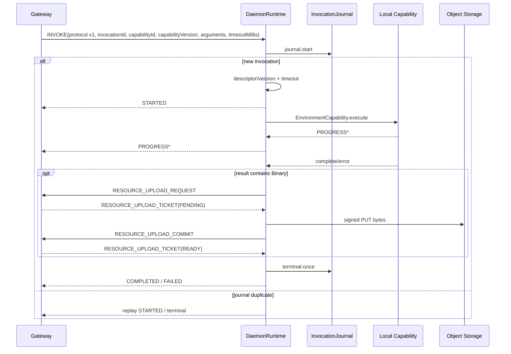

# Harness Daemon

## 定位

Environment Daemon 是独立运行的宿主进程，负责代码能力执行、受管 Skill 来源的发现/持久化/精确加载，以及 Daemon WebSocket 协议 v1 通信。它引入 `harness-common` 的基础值对象与 `harness-environment` 的能力 SPI 及通信协议编解码器，与上层的 Model、Tool、Runtime 状态机及业务数据库保持解耦。

[`DaemonMain`](../../harness/daemon/src/main/java/fun/fengwk/kkstudio/harness/daemon/DaemonMain.java) 是进程入口；[`DaemonRuntime`](../../harness/daemon/src/main/java/fun/fengwk/kkstudio/harness/daemon/DaemonRuntime.java) 统筹网络连接、执行日志（journal）、能力异步调度、重连退避、超时判定以及进程生命周期。Daemon 进程内以 Invocation journal 维护执行状态的权威事实；WebSocket 连接作为纯消息传输管道，连接的中断与重建不会破坏正在进行的执行状态，支持重连后幂等重放。

## 职责

### 核心职责

- 以统一的 `EnvironmentId` 建立网关路由绑定，并在每个协议封包上严格校验作用域。
- 基于进程内 Invocation 日志保障调用的幂等性，在网络重连时准确去重 `INVOKE` 请求并幂等重放 STARTED 与终态（terminal）结果。
- 以每次调用 arguments 中显式携带的绝对 `workdir` 执行文件、进程、检索与 LSP 能力；Skill 与来源管理能力按冻结身份执行，不接受 `workdir`。
- 通过双线程池分工承载运行任务：单线程调度器负责心跳、重连与超时，虚拟线程池负责阻塞执行。
- 对报文大小、资源体积、调用时序及安全关闭等边界执行 fail-closed 校验。

### 协作边界

- 会话生命周期与决策事实：Session、Turn、Entry 树与长期状态持久化归属 Runtime 模块；权限准入策略由 Platform 与 Runtime 判定，Daemon 聚焦于已授权指令的本地能力执行。
- 本地路径与 Skill 配置事实：CLI 只确定 Environment root 和 Daemon data directory；Skill 来源配置由 Platform 持有并通过管理调用下发。Environment root 只用于 READY 展示，不作为资源目录、调用 cwd 或路径边界。
- READY 元数据：能力通告包含操作系统、时区、可信备注、canonical Environment root，以及按来源分组的版本化 Skill 描述和有界诊断；凭证、请求头、环境变量、命令与连接 URL 不进入 READY。
- 执行状态持久性：执行事实独立保存在进程内存日志中；连接断开仅触发传输层重连，执行生命周期不受网络连接波动影响。

## 依赖边界

```text
DaemonMain
  ├─ DaemonConfig / CodingToolsConfig
  ├─ DaemonSkillRegistry
  └─ DaemonRuntime
       ├─ OkHttpWebSocketTransport
       ├─ DaemonResourceTransferClient
       ├─ DaemonCapabilityRegistry
       ├─ InMemoryDaemonInvocationJournal
       ├─ scheduler (1 thread)
       └─ taskExecutor (virtual-thread-per-task)

Daemon -> harness-common
Daemon -> harness-environment -> harness-common
Daemon -> harness-mcp
```

Daemon 的直接生产模块依赖是 `harness-common`、`harness-environment` 与 `harness-mcp`；直接第三方依赖是 Jackson、OkHttp、JGit 与 RE2/J。`harness-tool`、`harness-runtime`、`harness-infra`、`platform` 和 `web` 位于调用侧。调度器与虚拟线程池由 `DaemonRuntime` 统一创建并管理生命周期。模块唯一可分发的产物是 shaded Fat JAR `kk-studio-daemon.jar`：`Main-Class` 与全部 runtime 依赖都内嵌其中，运行时只需 `java -jar`，不依赖 `lib/` 目录或自定义 classpath。详细依赖与结构约束见 [`pom.xml`](../../harness/daemon/pom.xml)，并由 [`DaemonModuleArchitectureTest.java`](../../harness/daemon/src/test/java/fun/fengwk/kkstudio/harness/daemon/DaemonModuleArchitectureTest.java) 自动化守卫。

## 包架构

| 包路径 | 职责与边界 |
| --- | --- |
| `fun.fengwk.kkstudio.harness.daemon` | Environment Daemon 进程启动入口与核心运行时编排。负责解析启动配置（`DaemonConfig`）、冻结能力注册表（`DaemonCapabilityRegistry`）、托管双线程池资源、驱动 WebSocket 握手与重连状态机、解析调用超时与按 message type 校验入站报文。通过通用协议契约与 Platform 通信，聚焦进程内执行管理。 |
| `fun.fengwk.kkstudio.harness.daemon.coding` | 具体编码能力实现（文件读写与编辑、命令执行、原生文本检索与 LSP 桥接）。`EnvironmentPaths` 只解析本次调用 arguments 中的显式绝对 `workdir` 与目标路径，绝不把它当作文件系统沙箱或会话默认目录；大文本经 `TextOutputStore` 落盘为本地日志，二进制结果不落本地存储而是由运行时直传对象存储；调用之间不继承目录。 |
| `fun.fengwk.kkstudio.harness.daemon.journal` | 进程内调用执行事实与去重日志。跟踪 Invocation 的运行态与终态（RUNNING、COMPLETED、FAILED、CANCELLED），通过原子操作确保单次执行并记录终态结果；在网络重连时支持针对重复 `INVOKE` 幂等重放 STARTED 与终态消息，确保单次终态（terminal-once）契约。执行日志在整个进程生命周期中持续生效，网络断开时维持执行状态。 |
| `fun.fengwk.kkstudio.harness.daemon.skill` | Platform-owned PATH/GIT Skill 来源的发现、持久化与精确加载。完整候选快照经校验后原子发布到 `--data-dir`；READY 按来源通告版本、revision、Skill 描述与诊断；`skill.load` 按 `(sourceId, name, revision)` 返回正文与基目录。该包不接受会话 `workdir`。 |
| `fun.fengwk.kkstudio.harness.daemon.mcp` | Local stdio MCP 执行基础与子进程生命周期管理。严格解析 Platform 下发的本地 MCP 配置（`type=local`、`environmentId`、`command`、`cwd` 必填，整值 `${VAR}` 由 Daemon 运行时通过 `System.getenv` 解析，`cwd` 仅强制目标操作系统词法绝对路径，受信任执行且无路径白名单）；`DaemonLocalMcpManager` 按 `(serverId, configVersion)` 懒共享子进程，新版本自动 fencing 旧版本并在活动调用归零后关闭（drain），同版本配置漂移时 fail-closed；对外注册管理专用 `mcp.local.discover`（返回工具 envelope）与模型运行时 `mcp.local.call` 能力，使用单一绝对 deadline 覆盖 lazy 初始化与执行，支持单调用精确取消且不打断并发调用。 |
| `fun.fengwk.kkstudio.harness.daemon.transport` | 底层网络传输抽象与基于 OkHttp WebSocket 的生产实现。提供连接管理、报文收发及传输监听机制，强制协商 `permessage-deflate`；同时执行文本帧检查与单消息累积上限（默认 16 MiB），遇到二进制帧或报文超限时按照 RFC 6455 发送 close code 1008 并关闭连接。 |

## 核心模型 / API

### DaemonMain、config 与固定 capability registry

`DaemonMain` 的启动装配流程如下：

```text
CLI -> DaemonConfig
   -> DaemonDataDirectory.open(dataDir)   # owner-only 布局 + daemon.lock
   -> CodingToolsConfig.fromCli(environmentRoot, dataDir/resources, ...)
   -> DaemonSkillRegistry.open(dataDir, userHome)
   -> DaemonRuntime.create
   -> shutdown hook
   -> runtime.start / awaitTermination
```

[`DaemonConfig`](../../harness/daemon/src/main/java/fun/fengwk/kkstudio/harness/daemon/DaemonConfig.java) 解析命令行选项：

```text
--gateway-uri (ws / wss)
--registration-token-file (required, absolute, owner-only regular file)
--heartbeat
--reconnect-initial
--reconnect-max
--tool-timeout
--note
--environment-root
--data-dir (optional, absolute; defaults to ~/.kk-studio)
--bash-executable (optional; defaults to bash)
--lsp-bridge-command (optional; omitted means disabled)
--javap-executable (optional; defaults to javap)
--help / -h (information command)
--version (information command)
```

注册凭证只以 owner-only 普通文件存在：CLI 只接收 `--registration-token-file` 路径，record 不保存凭证文本，因此 `equals`/`hashCode`/`toString` 与日志都不会扩散秘密；凭证在 HELLO 前按需读取。未知参数（包含 `--registration-token`、`--skill-dir` 这类不存在的选项）一律启动失败，不提供兼容回退。

配置默认值：心跳间隔（heartbeat）15 秒、初始重连退避（reconnect initial）1 秒、最大重连退避（reconnect max）30 秒、能力调用超时 5 分钟；环境根目录（environment root）默认为当前启动用户 HOME 目录对应的真实绝对路径，只作为宿主展示元数据，不参与工具路径解析或资源存储。`data-dir` 省略时为 `~/.kk-studio`，Daemon 会以 owner-only 权限创建固定布局 `{daemon.lock,resources/{text,staging}}`、持有进程独占锁并从中恢复最近一次成功发布的 Skill manifest；启动只清理 `resources/staging` 下遗留的 `*.part`，已发布的 `resources/text` 永不自动删除（durable history 可能仍引用其路径）。`note` 支持操作者显式指定或按操作系统生成稳定默认文本，限制为单行且不超过 512 字符。

[`DaemonCapabilityRegistry`](../../harness/daemon/src/main/java/fun/fengwk/kkstudio/harness/daemon/DaemonCapabilityRegistry.java) 在运行时构造完成时冻结，确保运行期能力集合不可变。生产编码能力集合由 [`CodingCapabilities`](../../harness/daemon/src/main/java/fun/fengwk/kkstudio/harness/daemon/coding/CodingCapabilities.java) 固定注册 9 项能力：

```text
fs.read, fs.write, fs.edit, process.exec,
fs.grep, fs.find,
lsp.goto-definition, lsp.workspace-symbols, lsp.java-decompile
```

[`SkillLoadCapability`](../../harness/daemon/src/main/java/fun/fengwk/kkstudio/harness/daemon/skill/SkillLoadCapability.java) 注册 `skill.load`；[`McpLocalCallCapability`](../../harness/daemon/src/main/java/fun/fengwk/kkstudio/harness/daemon/mcp/McpLocalCallCapability.java) 注册 `mcp.local.call`；三个 `DaemonSkillSourceCapability` 实例注册 `skill.source.refresh/install/update`；[`McpLocalDiscoverCapability`](../../harness/daemon/src/main/java/fun/fengwk/kkstudio/harness/daemon/mcp/McpLocalDiscoverCapability.java) 注册 `mcp.local.discover`。Daemon 共注册 catalog 的 11 项模型可见能力和 4 项管理专用能力，统一使用 INVOKE/CANCEL/结果通道并在装配后冻结 descriptor 集合。管理能力不会注册为模型 Tool；各能力的版本与 schema 都从 catalog 取用。

### 双 executor lifecycle 与 MCP 进程管理

`DaemonRuntime` 统一管理执行与子进程资源：

| 资源 | 所有者 | 用途 |
| --- | --- | --- |
| `ScheduledThreadPoolExecutor(1)` | `DaemonRuntime` | 心跳定时、重连调度、能力调用超时控制 |
| `Executors.newThreadPerTaskExecutor(Thread.ofVirtual())` | `DaemonRuntime` | 编码能力与 Local MCP 调用的阻塞任务执行 |
| `DaemonLocalMcpManager` | `DaemonRuntime` | 本地 MCP stdio 子进程生命周期、版本隔离与优雅排空 |

初始化顺序为调度器 → 虚拟线程执行器 → MCP 管理器与能力注册表 → 运行时实例；装配过程中任一步失败都会尝试释放已创建的资源。调用 `start()` 后，运行时启动心跳定时任务并立即尝试连接，重复调用保持幂等。关闭或致命失败时，运行时先停止传输接入，再取消运行中的 Invocation 并将 CANCELLED 终态写入 journal，关闭 `DaemonLocalMcpManager` 强制终止所有 MCP 子进程树，最后对两个线程池执行 `shutdownNow`；每个线程池最多等待 5 秒，各清理步骤互不阻断。

### WebSocket protocol

生产网络传输使用 [`OkHttpWebSocketTransport`](../../harness/daemon/src/main/java/fun/fengwk/kkstudio/harness/daemon/transport/OkHttpWebSocketTransport.java)，基于 OkHttp WebSocket 构建，并强制要求本次握手协商 `permessage-deflate`：OkHttp 在 upgrade 请求中声明该扩展，服务端未接受时传输以 RFC 6455 close code `1010` 关闭且不交付连接，绝不退化为未压缩会话。传输通道仅接收文本帧；当单条文本超过配置上限（默认 16 MiB 字符）或收到二进制帧时，确定性发送一次 RFC 6455 close code `1008` 策略违规关闭帧，并中断连接。

握手与连接状态跃迁：

```text
DISCONNECTED -> CONNECTING
  -> HELLO(protocolVersion=1, registrationToken, capabilityCatalogVersion=1,
           daemonInstanceId)
  <- WELCOME(environmentId)
  -> READY(capability descriptors, environment + sourceSetVersion + skillSources)
  -> READY + HEARTBEAT
```

每个封包只有五个字段：协议版本、消息类型、规范环境作用域（`EnvironmentId`）、可空 `invocationId` 与载荷。协议没有全局序号，也没有 ACK：消息可靠性来自 `invocationId` 与 Daemon invocation journal，而不是传输层确认，因此运行时不做任何跨消息顺序校验。

入站消息控制：

```text
INVOKE / CANCEL             -> invocationId required
RESOURCE_UPLOAD_TICKET      -> invocationId + transferId required
WELCOME / ERROR             -> handshake/control
```

封包的作用域（`EnvironmentId`）必须与当前已绑定的环境标识完全一致。协议版本、消息类型、载荷或作用域校验失败时，运行时回复 ERROR，并保留现有 Invocation journal。网关返回 `REGISTRATION_REJECTED` 时，运行时跃迁至 FAILED、停止重连并以非零状态码退出；`RETRY_LATER` 触发断线与退避重连；未携带 code 的 ERROR 仅作为控制消息接收。

### 实例身份与同进程重连恢复

运行时在构造期随机生成一次 `daemonInstanceId`，并在每个 HELLO 中声明；同一进程的所有重连复用同一身份，因此 Gateway 能区分「同一 Daemon 重连」与「另一个 Daemon 进程接管」。物理连接失效不改变 journal 事实：Gateway 以相同 `invocationId` 重放 INVOKE 时，journal 的 RUNNING 条目重放 `STARTED(replayed=true)`，已终结条目重放对应终态报文，副作用绝不重复执行。

### Binary Blob 数据面

Daemon 不维护本地二进制 Resource 仓库，也不把字节编码到 WebSocket。能力返回 `BinaryResultContent` 时，[`DaemonCapabilityResultCodec`](../../harness/environment/src/main/java/fun/fengwk/kkstudio/harness/environment/daemon/DaemonCapabilityResultCodec.java) 先对整个终态结果完成条目数、每项及聚合资源预算预检；全部通过后，[`DaemonResourceTransferClient`](../../harness/daemon/src/main/java/fun/fengwk/kkstudio/harness/daemon/DaemonResourceTransferClient.java) 按以下固定流程直传：

```text
Daemon -> Gateway: RESOURCE_UPLOAD_REQUEST(invocationId, transferId, mediaType, name, size, sha256)
Gateway -> Daemon: RESOURCE_UPLOAD_TICKET
  READY  -> 已去重命中，直接生成终态引用
  PENDING(uploadId, presigned PUT)
          -> Daemon -> Object Storage: PUT bytes + 票据指定的原始 headers
          -> Daemon -> Gateway: RESOURCE_UPLOAD_COMMIT(transferId, uploadId)
          -> Gateway -> Daemon: READY | FAILED
Daemon -> Gateway: COMPLETED(resource uploadId + metadata only)
```

一次上传由 `(invocationId, transferId)` 唯一关联，`transferId` 在控制面重试和同进程重连期间保持不变。REQUEST、PUT、COMMIT 只受当前 invocation 的有效 deadline/取消状态约束，不设独立次数上限；连接暂时失效时等待同一实例重连后重放。PUT 只发送票据明确给出的签名 headers，不自造或覆盖 `Content-Type`。预签名 URL、签名 headers 和字节都不进入日志、异常文本、终态 payload 或 history；终态 resource 只携带全局 `uploadId`、媒体类型、名称、大小、SHA-256 与可选预览，且不接受未经内容复核的文本工件元数据。

### Coding Capabilities 与显式 workdir

`workdir` 是每次调用自己的执行目录，不是文件系统沙箱，也没有任何默认值。[`EnvironmentPaths`](../../harness/daemon/src/main/java/fun/fengwk/kkstudio/harness/daemon/coding/EnvironmentPaths.java) 只解析本次调用 arguments 中的路径：

- `workdir` 是必填字段，由 `DaemonWorkdirSyntax` 按本机 OS 做词法校验（拒绝周边空白与未展开的 `~`/环境变量占位符），再由 Daemon 要求自身 `Path` 视角下绝对、现存、为目录且可读，最后返回其真实路径；
- 相对 `path` 以本次 `workdir` 为基准解析，绝对 `path` 直接使用，允许落在 workdir 之外；符号链接照常跟随；
- 不存在目录明确失败：不自动 mkdir、不回退 HOME、不回退 Environment root，也不沿用前一次调用的目录；
- 命令与文件系统的业务授权由 Platform permission 判定，Daemon 不提供额外的路径沙箱。

`fs.read` 与 `write`/`edit` 共享统一的文件编码、预览截断与文件修改边界：
- 文本按既有编码、BOM 与行尾表示写回，同一文件的修改通过进程内锁串行化。
- **流式分页读取**：媒体类型只由文件前缀判定，文本以固定大小字符块流式解码，因此不存在任何“文本文件超过 N MiB 就拒绝”的上界；`process.exec` 落盘的全文可以直接被分页读取。图片仍是 Resource 语义：探测到受支持的图片签名时整文件字节成为 `BinaryResultContent`，由终态编码阶段直传对象存储。
- **纯净编号正文**：`fs.read` 彻底移除正文中的合成截断标记（如 `... (line truncated to 2000 chars)`），`line|` 编号后严格为按 LF 读取协议归一化的真实行片段，可直接完整复制为 `fs.edit` 的 `old_string` 进行精确比对与替换。
- **长行列分页（`column_offset`）**：单行文本超过 2000 码点时按 Unicode 码点切片，不截断代理对（Surrogate Pairs）；支持可选参数 `column_offset`（1-based 正整数码点偏移量，仅限纯文本文件）。指定 `column_offset` 时 `limit` 缺省为 1 且必须等于 1。
- **精确有界输出（<= 48 KiB）**：包含 Header 元数据、编号正文、分隔空行、水平切片尾注与垂直续读尾注在内的完整 UTF-8 输出严格受控于 48 KiB（49,152 字节）上限。多行读取时若下一行导致整体超限则有界截断并给出续读 offset，底层设有终态防御断言，杜绝超大载荷逃逸。
- 越界定位元数据（如 `[Showing 0 lines of N.]` 或 `[Showing 0 columns of N on line X.]`）及续读提示均统一置于非编号尾部，不污染正文编号结构。

`grep` 与 `find` 使用 Java NIO 原生遍历与 JGit 规则解析 `.gitignore`（规则基线取检索目标祖先链上的 `.gitignore`），直接在 JVM 内完成检索；LSP 能力通过可选的本地进程桥接（`--lsp-bridge-command`）承载，当缺少相关工具链时返回明确的不可用提示，其中 `lsp_java_decompile` 对可解析的 class 目标支持回退到 `javap`。`grep` 的单行模式流式扫描，因此不受任何单文件大小上界限制；只有需要整文件视图的 `multiline` 模式保留 64 MiB 上界。参数配置见 [`CodingToolsConfig`](../../harness/daemon/src/main/java/fun/fengwk/kkstudio/harness/daemon/coding/CodingToolsConfig.java)，其唯一权威来源是 CLI：

```text
previewMaxLines = 2000
previewMaxBytes = 51200
bashExecutable = bash（--bash-executable 覆盖）
javapExecutable = javap（--javap-executable 覆盖）
lspBridgeCommand = 空（--lsp-bridge-command 启用）
```

资源布局完全由数据目录决定、与 environment root 无关：Daemon 不持有任何本地内容寻址资源库，二进制结果一律经控制面直传对象存储后只保留全局 `uploadId` 元数据。**大文本不是 Resource**：`process.exec`/`grep`/`find` 的超阈值文本经 [`TextOutputStore`](../../harness/daemon/src/main/java/fun/fengwk/kkstudio/harness/daemon/coding/TextOutputStore.java) 写入 `<data-dir>/resources/staging/*.part`（0600）后原子发布为 `<data-dir>/resources/text/*.log`（durable，永不隐式删除）。终态无论大小都只返回一个 `TextResultContent`：小输出完整内联；大输出为有界 head/tail 预览加绝对路径、总字节/行数与 read/grep 指引，同一事实写入 `detailsJson.textOutput`。

预览与行数都是可被模型直接消费的事实，因此有三条硬约束。**字符边界**：head/tail 的字节上界可能落在多字节字符内部，裁剪按完整字符边界回退后再解码，预览不产生 U+FFFD 替换字符，`bytes omitted` 也始终是精确的原始字节差。**不重复**：输出量小于 head 与 tail 缓冲容量之和时两个窗口覆盖同一段内容，预览会扣除重叠，不会把同一批字节展示两次。**行数一致**：总行数按 CR、LF、CRLF 三种终止符统计（CRLF 只记一次），与 `read` 分页读取同一文件时经 [`TextStreams`](../../harness/daemon/src/main/java/fun/fengwk/kkstudio/harness/daemon/coding/TextStreams.java) 报告的总行数完全一致，模型不会看到两个互相矛盾的总数。发布前对中转文件 `force(true)`，发布后的全文是已落盘的 durable 事实。

输出体积与本地磁盘状态永远不是终止进程的理由：内联阈值（50 KiB / 2000 行）之外转为落盘，达到捕获预算（默认 1 GiB）后只停止文件捕获并继续统计总数，磁盘写失败只降级为无路径的有界预览。三种情况都让子进程自然退出，退出码始终是权威事实；失败路径在删除中转文件前先关闭文件流，既不泄漏文件描述符也不残留幽灵文件。LSP bridge 与 `javap` 子进程经 [`ChildProcessRunner`](../../harness/daemon/src/main/java/fun/fengwk/kkstudio/harness/daemon/coding/ChildProcessRunner.java) 并发排空 stdout/stderr（stdout 是调用方载荷故完整保留，stderr 只保留有界诊断尾部），deadline 绑定 `request.effectiveTimeout()`，超时或取消都终止整棵进程树。

输出结果由 `DaemonCapabilityResultCodec` 编解码：流式 `PROGRESS` 仅允许文本与 JSON 数据；终态 `COMPLETED` 会在任何对象存储副作用之前预检全部资源预算和最终 wire JSON 大小，全部通过后才允许直传。最终 JSON 载荷上限 16 MiB、内容条目上限 64 项，单项和聚合二进制预算来自 WELCOME 中当前 Environment 资源上限（默认 16 MiB）。对象存储 PUT 的总调用时长受 invocation 剩余 deadline 约束；断线唤醒等待者，同实例 READY 后以相同 `(invocationId, transferId)` 恢复。`DaemonCapabilityResultCodec` 专注于流式与终态结果（`EnvironmentCapabilityResult`）的网络报文编解码，底层执行 SPI 则由 `EnvironmentCapability` 独立承载。

### Skills

[`DaemonSkillRegistry`](../../harness/daemon/src/main/java/fun/fengwk/kkstudio/harness/daemon/skill/DaemonSkillRegistry.java) 是进程内目录事实源，持久事实位于 `--data-dir/skills`：

```text
manifest.json                         当前成功发布的来源快照与 retained 索引
bodies/<contentRevision>.md           不可变正文 blob
checkouts/<sourceId>/<commit>/        去除 .git 后的不可变 GIT checkout
staging/                              每次 GIT 操作的独立临时目录
```

来源配置只通过三个管理能力进入 Daemon，三者共享同一严格 schema，且都不接受 `workdir`：

- `skill.source.refresh`：PATH 来源按配置扫描；GIT 来源只扫描已持久化的 `currentlyAppliedRevision`，不联网。
- `skill.source.install`：在独立 staging 中用宿主 `git` 获取并固定 commit，扫描成功后发布。
- `skill.source.update`：无显式 ref 时重新解析远端默认 HEAD；显式 tag/commit/ref 始终固定到 commit。

PATH 来源接受目标宿主绝对路径或 `~/`（仅在来源配置中按 Daemon HOME 展开）；默认来源目录不存在时发布空快照，显式来源不存在则失败。扫描以根 `SKILL.md` 表示单 Skill，否则递归发现；进入 Skill 根后停止下探，并跳过 `.git` 及常见依赖/缓存目录。单个坏 Skill 形成有界诊断，跨来源同名冲突、陈旧 `sourceVersion`/`sourceSetVersion` 或完整候选不合法则拒绝整个发布。

发布在进程内串行完成：先验证 READY 规模、全局名称唯一性与 retained 一致性，再写不可变正文，最后以同目录原子 move 替换 manifest；文件系统不支持原子 move 时 fail-closed。每来源 publication ticket 只裁决同一 `sourceVersion` 的重叠操作，更高 `sourceVersion` 始终优先；全局 `sourceSetVersion` 防止延迟操作裁剪更新的来源集合。失败不会改变当前 READY 快照。启动从 manifest 恢复，并在任一 retained body 缺失或不可读时拒绝 READY。

READY 读取 `DaemonSkillRegistry.inventory()`：它在发布锁内一次性取出集合版本与来源快照，因此报告中的 `sourceSetVersion` 与 `skillSources` 必然来自同一次发布，不会出现“新版本号配旧快照”的混配报告。

`skill.load` 的 arguments 固定为 `{sourceId, name, revision}`，成功结果固定为 `{body, baseDirectory}`。正文按 SKILL.md 原始字节的 SHA-256 revision 保留；请求只精确匹配 frozen revision，不可用时返回 `RESOURCE_CHANGED`，绝不回退到同名当前版本。扫描前会验证成功结果能够落入通用 `JsonResultContent` 的 1 MiB wire 上限。Skill 加载与来源管理均不依赖会话目录。

## 执行 / 状态 trace



入站 `INVOKE` 报文的 `capabilityId`、`capabilityVersion`、`arguments` 与 `timeoutMillis` 首先由编解码器进行格式与结构校验，其中 arguments 必须为 JSON 对象且后续按目标 capability 的 schema 归一化并严格校验。随后运行时解析本次调用的超时时间，优先级为“请求指定值 → 能力描述符声明值 → Daemon 默认值”；需要目录的能力（`EnvironmentCapabilityCatalog.requiresWorkdir(id)`）在 capability 内从自身 arguments 读取必填 `workdir` 并按本机 `Path` 校验。遇到参数非法、未知能力或版本不匹配时，确定性判定为 FAILED 并返回错误，不发送 STARTED 确认。超时判定由单线程调度器负责计时，触发时抢占终态标记并调用底层句柄的 cancel 方法；收到 `CANCEL` 控制消息时，若调用处于 RUNNING 状态则向网关回复 CANCELLED 终态并取消执行句柄，若已处于终态则重放既有终态报文。

网络连接断开时，Daemon 保留日志记录与后台执行任务，连接代际进入重连流程。网关在重连后若重新发送相同 `invocationId` 的请求，处于 RUNNING 状态的调用将重放 `STARTED(replayed=true)`，处于终态的调用则直接重放终态报文。若能力监听器回调中的调用标识不符、报文编码超出体积上限、资源持久化失败或流式事件包含非法的二进制/资源载荷，均确定性作为 FAILED 终态处理。

## 不变量、failure / recovery

- `EnvironmentId` 是当前 Daemon 连接的通信作用域；作用域不匹配按协议错误处理。
- 能力 descriptor 注册表在运行时构造完成后冻结；Skill 快照只由成功的来源管理操作原子替换，并在后续 READY/重连中通告当前 manifest。
- 协议不使用全局序号或 ACK；调用可靠性由 `invocationId`、进程级 `daemonInstanceId` 与 Invocation journal 共同保证。
- 调用日志 `start` 操作执行原子去重，状态跃迁严格遵循 RUNNING 到终态的单向流动，保证终态回调触发一次。
- 能力版本及请求参数全部验证通过后方可发出 STARTED 确认；任何前置校验失败均直接以 FAILED 终态返回。
- 每次调用独立解析自己的绝对 workdir，调用之间不继承目录；Daemon 不提供默认 cwd、HOME 回退或 Environment root 回退。
- 超时控制、主动取消与停机清理依托执行上下文中的原子标记（AtomicBoolean）进行协调，在正常完成、失败、取消与超时之间只接受一个终态。
- 执行日志独立保存运行事实，脱离连接生命周期约束；网络断开后后台任务正常推进，重连到达的重复请求由日志负责幂等重放，并维持单次终态语义。
- 资源与二进制结果在预检、体积、校验和或 UTF-8 编码约束校验中一旦发生违规，立即执行 fail-closed 中止，并以确定性 FAILED 终态结束。
- 二进制结果绝不进入 wire：终态编码前先完成全部预算预检，再按 transfer 幂等直传对象存储，wire 只携带全局 `uploadId` 与权威元数据；预签名 URL、签名 headers 与任何字节都不进入日志、错误消息或终态载荷。

## 配置 / 扩展

- 环境能力通过 `harness-environment` 的 `EnvironmentCapability` SPI 与 `DaemonCapabilityRegistry` 进行装配，并与标准原子能力目录的描述符和版本严格对齐。
- 虚拟线程执行器、定时调度器、本地文本输出存储与资源直传客户端由 `DaemonRuntime` 集中管理，保证进程退出时资源完全回收。
- Skill 来源由 Platform 配置并经管理 capability 下发；Daemon CLI 只提供持久 `--data-dir`，启动恢复最近成功 manifest。
- 测试环境支持注入内存传输通道（`DaemonTransport`）、内存执行日志与专用执行器；生产环境使用基于 OkHttp 的 WebSocket/对象存储客户端、内存执行日志与运行时托管的线程池。
- 网关可通过 `INVOKE` 报文中的 `timeoutMillis` 覆盖能力默认超时，当值为 `0` 时沿用默认配置，调用截止时间始终生效。

## 测试与源码入口

### 源码入口

- [`DaemonMain.java`](../../harness/daemon/src/main/java/fun/fengwk/kkstudio/harness/daemon/DaemonMain.java)、[`DaemonConfig.java`](../../harness/daemon/src/main/java/fun/fengwk/kkstudio/harness/daemon/DaemonConfig.java)、[`DaemonRuntime.java`](../../harness/daemon/src/main/java/fun/fengwk/kkstudio/harness/daemon/DaemonRuntime.java)
- [`DaemonCapabilityRegistry.java`](../../harness/daemon/src/main/java/fun/fengwk/kkstudio/harness/daemon/DaemonCapabilityRegistry.java)、[`CodingCapabilities.java`](../../harness/daemon/src/main/java/fun/fengwk/kkstudio/harness/daemon/coding/CodingCapabilities.java)、[`EnvironmentPaths.java`](../../harness/daemon/src/main/java/fun/fengwk/kkstudio/harness/daemon/coding/EnvironmentPaths.java)
- [`DaemonTransport.java`](../../harness/daemon/src/main/java/fun/fengwk/kkstudio/harness/daemon/transport/DaemonTransport.java)、[`OkHttpWebSocketTransport.java`](../../harness/daemon/src/main/java/fun/fengwk/kkstudio/harness/daemon/transport/OkHttpWebSocketTransport.java)
- [`DaemonResourceTransferClient.java`](../../harness/daemon/src/main/java/fun/fengwk/kkstudio/harness/daemon/DaemonResourceTransferClient.java)：按 `(invocationId, transferId)` 关联票据并把字节直传对象存储的客户端实现。
- [`DaemonInvocationJournal.java`](../../harness/daemon/src/main/java/fun/fengwk/kkstudio/harness/daemon/journal/DaemonInvocationJournal.java)、[`InMemoryDaemonInvocationJournal.java`](../../harness/daemon/src/main/java/fun/fengwk/kkstudio/harness/daemon/journal/InMemoryDaemonInvocationJournal.java)
- [`DaemonSkillRegistry.java`](../../harness/daemon/src/main/java/fun/fengwk/kkstudio/harness/daemon/skill/DaemonSkillRegistry.java)、[`SkillLoadCapability.java`](../../harness/daemon/src/main/java/fun/fengwk/kkstudio/harness/daemon/skill/SkillLoadCapability.java)

### 关键测试守卫

- [`DaemonModuleArchitectureTest.java`](../../harness/daemon/src/test/java/fun/fengwk/kkstudio/harness/daemon/DaemonModuleArchitectureTest.java)：验证模块依赖方向与线程池所有权边界。
- [`DaemonConfigTest.java`](../../harness/daemon/src/test/java/fun/fengwk/kkstudio/harness/daemon/DaemonConfigTest.java)、[`DaemonMainTest.java`](../../harness/daemon/src/test/java/fun/fengwk/kkstudio/harness/daemon/DaemonMainTest.java)、[`DaemonRuntimeTest.java`](../../harness/daemon/src/test/java/fun/fengwk/kkstudio/harness/daemon/DaemonRuntimeTest.java)：验证 `--registration-token-file` 契约与凭证不外泄、`--data-dir` 默认/绝对约束、三个本地执行程序参数、`--help`/`--version` 信息命令、未知参数与 `kkstudio.daemon.*` 系统属性的 fail-closed、握手重连、日志重放、协议 v1 入站校验、资源票据/直传/重连/失败重试及超时取消生命周期。
- [`DaemonDataDirectoryTest.java`](../../harness/daemon/src/test/java/fun/fengwk/kkstudio/harness/daemon/DaemonDataDirectoryTest.java)、[`DaemonTokenFileTest.java`](../../harness/daemon/src/test/java/fun/fengwk/kkstudio/harness/daemon/DaemonTokenFileTest.java)：验证绝对数据目录、0700 目录与 0600 锁文件权限收敛、进程内与跨 JVM 独占锁、重启后锁释放、启动期只清理遗留 `.part` 并保留已发布数据、`defaultRoot` 纯计算，以及凭证文件的绝对路径/普通文件/0600 校验与空白剥离。
- [`CodingCapabilitiesTest.java`](../../harness/daemon/src/test/java/fun/fengwk/kkstudio/harness/daemon/coding/CodingCapabilitiesTest.java)、[`WorkdirPathSemanticsTest.java`](../../harness/daemon/src/test/java/fun/fengwk/kkstudio/harness/daemon/coding/WorkdirPathSemanticsTest.java)、[`CodingCapabilitiesEdgeTest.java`](../../harness/daemon/src/test/java/fun/fengwk/kkstudio/harness/daemon/coding/CodingCapabilitiesEdgeTest.java)、[`NativeSearchCapabilitiesTest.java`](../../harness/daemon/src/test/java/fun/fengwk/kkstudio/harness/daemon/coding/NativeSearchCapabilitiesTest.java)、[`FindGrepCapabilitiesTest.java`](../../harness/daemon/src/test/java/fun/fengwk/kkstudio/harness/daemon/coding/FindGrepCapabilitiesTest.java)：验证编码能力执行、显式 workdir 语义、`.gitignore` 检索、大输出落盘与捕获预算/磁盘失败降级、LSP 有效超时与取消终止进程树，以及检索边界。
- [`OutputSpoolTest.java`](../../harness/daemon/src/test/java/fun/fengwk/kkstudio/harness/daemon/coding/OutputSpoolTest.java)、[`TextOutputStoreTest.java`](../../harness/daemon/src/test/java/fun/fengwk/kkstudio/harness/daemon/coding/TextOutputStoreTest.java)、[`ChildProcessRunnerTest.java`](../../harness/daemon/src/test/java/fun/fengwk/kkstudio/harness/daemon/coding/ChildProcessRunnerTest.java)：验证内联/落盘阈值、有界预览的字符边界与重叠去重、行数与 `TextStreams` 逐行扫描一致、捕获预算与磁盘失败只降级且清理干净不留句柄、原子发布与 durable 语义、stdout 载荷完整保留、stderr 有界诊断、并发排空不死锁，以及 deadline/取消终止整棵进程树。
- [`OkHttpWebSocketTransportTest.java`](../../harness/daemon/src/test/java/fun/fengwk/kkstudio/harness/daemon/transport/OkHttpWebSocketTransportTest.java)：验证强制 `permessage-deflate` 协商门禁（缺失或无关扩展以 1010 拒绝）、文本帧传输、二进制拦截、16 MiB 报文上限与策略违规关闭行为。
- [`DaemonSkillRegistryTest.java`](../../harness/daemon/src/test/java/fun/fengwk/kkstudio/harness/daemon/skill/DaemonSkillRegistryTest.java)、[`DaemonGitManagerTest.java`](../../harness/daemon/src/test/java/fun/fengwk/kkstudio/harness/daemon/skill/DaemonGitManagerTest.java)、[`SkillPathScannerTest.java`](../../harness/daemon/src/test/java/fun/fengwk/kkstudio/harness/daemon/skill/SkillPathScannerTest.java)：验证来源扫描、持久恢复、版本/并发围栏、Git ref 与取消、诊断边界、loadability 及精确 revision 加载。

---

上级：[系统设计](../system-design.md)。相关文档：[Harness Common](harness-common.md)、[Harness Environment](harness-environment.md)、[Harness Tool](harness-tool.md)、[Harness Infra](harness-infra.md)、[Platform](platform.md)、[部署与运行](../operations/deployment.md)。
