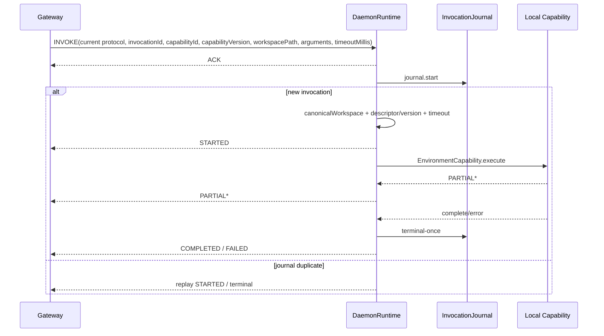

# Harness Daemon

## 定位

Environment Daemon 是独立运行的宿主进程，负责在受限的环境根目录（Environment root）内提供代码能力执行、本地技能发现与按需加载、目录安全浏览以及 Daemon WebSocket 协议 v6 通信。它引入 `harness-common` 的基础值对象与 `harness-environment` 的能力 SPI 及通信协议编解码器，与上层的 Model、Tool、Runtime 状态机及业务数据库保持解耦。

[`DaemonMain`](../../harness/daemon/src/main/java/fun/fengwk/kkstudio/harness/daemon/DaemonMain.java) 是进程入口；[`DaemonRuntime`](../../harness/daemon/src/main/java/fun/fengwk/kkstudio/harness/daemon/DaemonRuntime.java) 统筹网络连接、执行日志（journal）、能力异步调度、重连退避、超时判定以及进程生命周期。Daemon 进程内以 Invocation journal 维护执行状态的权威事实；WebSocket 连接作为纯消息传输管道，连接的中断与重建不会破坏正在进行的执行状态，支持重连后幂等重放。

## 职责

### 核心职责

- 以统一的 `EnvironmentId` 建立网关路由绑定，并在每个协议封包上严格校验作用域。
- 基于进程内 Invocation 日志保障调用的幂等性，在网络重连时准确去重 `INVOKE` 请求并幂等重放 STARTED 与终态（terminal）结果。
- 在受限的环境根目录内安全执行编码与文件能力，并基于本地目录发现与按需提供 Skill 正文。
- 通过双线程池分工承载运行任务：单线程调度器负责心跳、重连与超时，虚拟线程池负责阻塞执行。
- 对文件路径、符号链接、报文大小、资源体积、调用时序及安全关闭等边界执行 fail-closed 校验。

### 协作边界

- 会话生命周期与决策事实：Session、Turn、Entry 树与长期状态持久化归属 Runtime 模块；权限准入策略由 Platform 与 Runtime 判定，Daemon 聚焦于已授权指令的本地能力执行与路径边界校验。
- 本地路径与技能配置事实：环境根目录与技能目录完全由本地启动参数（CLI）确定，远程请求仅能在已建立的本地约束内寻址。
- READY 元数据：能力通告包含操作系统、时区、可信备注、canonical Environment root 展示路径，以及技能名称和描述；凭证、请求头、环境变量、命令与连接 URL 保留在本地。
- 执行状态持久性：执行事实独立保存在进程内存日志中；连接断开仅触发传输层重连，执行生命周期不受网络连接波动影响。

## 依赖边界

```text
DaemonMain
  ├─ DaemonConfig / CodingToolsConfig
  ├─ DaemonSkillRegistry
  └─ DaemonRuntime
       ├─ JdkWebSocketTransport
       ├─ DaemonCapabilityRegistry
       ├─ InMemoryDaemonInvocationJournal
       ├─ scheduler (1 thread)
       └─ taskExecutor (virtual-thread-per-task)

Daemon -> harness-common
Daemon -> harness-environment -> harness-common
```

Daemon 的生产依赖止于 `harness-common` 与 `harness-environment`；`harness-tool`、`harness-runtime`、`harness-infra`、`platform` 和 `web` 位于调用侧。调度器与虚拟线程池由 `DaemonRuntime` 统一创建并管理生命周期。详细依赖与结构约束见 [`pom.xml`](../../harness/daemon/pom.xml)，并由 [`DaemonModuleArchitectureTest.java`](../../harness/daemon/src/test/java/fun/fengwk/kkstudio/harness/daemon/DaemonModuleArchitectureTest.java) 自动化守卫。

## 包架构

| 包路径 | 职责与边界 |
| --- | --- |
| `fun.fengwk.kkstudio.harness.daemon` | Environment Daemon 进程启动入口与核心运行时编排。负责解析启动配置（`DaemonConfig`）、冻结能力注册表（`DaemonCapabilityRegistry`）、托管双线程池资源、驱动 WebSocket 握手与重连状态机、归一化调用请求（`InvocationRequestNormalizer`）以及目录安全浏览。通过通用协议契约与 Platform 通信，聚焦进程内执行管理。 |
| `fun.fengwk.kkstudio.harness.daemon.coding` | 受限环境根目录（Environment root）内的具体编码能力实现（文件读写、补丁应用、命令执行、原生文本检索与 LSP 桥接）。`EnvironmentPathBoundary` 统一校验真实物理路径并防范符号链接越界；大文本与二进制结果写入本地内容寻址存储（`ResourceStore`）；`apply-patch` 采用两阶段预检与尽力回滚，每次调用以对应的 Invocation workspace 为路径基准。 |
| `fun.fengwk.kkstudio.harness.daemon.journal` | 进程内调用执行事实与去重日志。跟踪 Invocation 的运行态与终态（RUNNING、COMPLETED、FAILED、CANCELLED），通过原子操作确保单次执行并记录终态结果；在网络重连时支持针对重复 `INVOKE` 幂等重放 STARTED 与终态消息，确保单次终态（terminal-once）契约。执行日志在整个进程生命周期中持续生效，网络断开时维持执行状态。 |
| `fun.fengwk.kkstudio.harness.daemon.skill` | 本地技能发现与加载机制。在启动时扫描本地配置目录中的 `SKILL.md` 文件，解析并保存元数据与正文；握手阶段通告技能名称和描述，执行 `skill.load` 时返回已加载的正文。技能目录由本地 CLI 配置确定。 |
| `fun.fengwk.kkstudio.harness.daemon.transport` | 底层网络传输抽象与基于 JDK `HttpClient` WebSocket 的生产实现。提供连接管理、报文收发及传输监听机制；强制执行文本帧检查与单消息累积上限（默认 16 MiB），遇到二进制帧或报文超限时按照 RFC 6455 发送 close code 1008 并关闭连接。 |

## 核心模型 / API

### DaemonMain、config 与固定 capability registry

`DaemonMain` 的启动装配流程如下：

```text
CLI -> DaemonConfig
   -> CodingToolsConfig.fromSystemProperties
   -> DaemonSkillRegistry.discover
   -> DaemonRuntime.create
   -> shutdown hook
   -> runtime.start / awaitTermination
```

[`DaemonConfig`](../../harness/daemon/src/main/java/fun/fengwk/kkstudio/harness/daemon/DaemonConfig.java) 解析命令行选项：

```text
--gateway-uri (ws / wss)
--registration-token
--heartbeat
--reconnect-initial
--reconnect-max
--tool-timeout
--note
--environment-root
--skill-dir (repeatable)
```

配置默认值：心跳间隔（heartbeat）15 秒、初始重连退避（reconnect initial）1 秒、最大重连退避（reconnect max）30 秒、能力调用超时 5 分钟；环境根目录（environment root）默认为当前启动用户 HOME 目录对应的真实绝对路径；未显式指定技能目录时，仅在 `~/.agents/skills` 存在时自动纳入。`note` 支持操作者显式指定或按操作系统生成稳定的默认文本，限制为单行且不超过 512 字符。

[`DaemonCapabilityRegistry`](../../harness/daemon/src/main/java/fun/fengwk/kkstudio/harness/daemon/DaemonCapabilityRegistry.java) 在运行时构造完成时冻结，确保运行期能力集合不可变。生产编码能力集合由 [`CodingCapabilities`](../../harness/daemon/src/main/java/fun/fengwk/kkstudio/harness/daemon/coding/CodingCapabilities.java) 固定注册 11 项能力：

```text
fs.read, fs.write, fs.apply-edit, fs.apply-patch,
process.exec, fs.search, fs.find, fs.list-directory,
lsp.goto-definition, lsp.workspace-symbols, lsp.java-decompile
```

[`SkillLoadCapability`](../../harness/daemon/src/main/java/fun/fengwk/kkstudio/harness/daemon/skill/SkillLoadCapability.java) 再注册 `skill.load`，完整覆盖 `EnvironmentCapabilityCatalog` 定义的 12 项原子能力，并在运行时装配就绪后统一冻结。

### 双 executor lifecycle

`DaemonRuntime` 统一管理两个专用执行资源：

| 资源 | 所有者 | 用途 |
| --- | --- | --- |
| `ScheduledThreadPoolExecutor(1)` | `DaemonRuntime` | 心跳定时、重连调度、能力调用超时控制 |
| `Executors.newThreadPerTaskExecutor(Thread.ofVirtual())` | `DaemonRuntime` | 编码能力与目录浏览的阻塞任务执行 |

初始化顺序为调度器 → 虚拟线程执行器 → 传输层与能力注册表 → 运行时实例；装配过程中任一步失败都会尝试释放已创建的资源。调用 `start()` 后，运行时启动心跳定时任务并立即尝试连接，重复调用保持幂等。关闭或致命失败时，运行时先停止传输接入，再取消运行中的 Invocation 并将 CANCELLED 终态写入 journal，最后对两个线程池执行 `shutdownNow`；每个线程池最多等待 5 秒，各清理步骤互不阻断。

### WebSocket protocol

生产网络传输使用 [`JdkWebSocketTransport`](../../harness/daemon/src/main/java/fun/fengwk/kkstudio/harness/daemon/transport/JdkWebSocketTransport.java)，基于 JDK `HttpClient` WebSocket 构建。传输通道仅接收文本帧；当分片累积长度超过配置上限（默认 16 MiB 字符）或收到二进制帧时，确定性发送一次 RFC 6455 close code `1008` 策略违规关闭帧，并中断连接。

握手与连接状态跃迁：

```text
DISCONNECTED -> CONNECTING
  -> HELLO(protocolVersion=6, registrationToken, capabilityCatalogVersion)
  <- WELCOME(environmentId)
  -> READY(capabilities version=6, environment + skills)
  -> READY + HEARTBEAT
```

每个封包均包含协议版本、消息类型、规范环境作用域（`EnvironmentId`）、消息序号及载荷；出站序号由运行时严格递增。在单一连接代际（connection generation）内，入站序号必须从基线开始连续递增；序号与内容完全一致的重复封包会被静默去重，序号冲突、回退或跳号则作为协议错误回复 ERROR，报文不会进入执行流程。连接重连后，新代际重新确立序号基线。

入站消息控制：

```text
INVOKE / CANCEL           -> invocationId required
WELCOME / ACK / ERROR     -> handshake/control
```

封包的作用域（`EnvironmentId`）必须与当前已绑定的环境标识完全一致。协议版本、消息类型、载荷或作用域校验失败时，运行时回复 ERROR，并保留现有 Invocation journal。网关返回 `REGISTRATION_REJECTED` 时，运行时跃迁至 FAILED、停止重连并以非零状态码退出；`RETRY_LATER` 触发断线与退避重连；未携带 code 的 ERROR 仅作为控制消息接收。

### Coding Capabilities 与路径/资源边界

所有文件系统编码能力均通过 [`EnvironmentPathBoundary`](../../harness/daemon/src/main/java/fun/fengwk/kkstudio/harness/daemon/coding/EnvironmentPathBoundary.java) 实施严格边界约束：

- 调用默认工作目录来自 `EnvironmentCapabilityExecutionRequest.workdir`，由请求中的 `workspacePath` 规范化为真实物理路径后写入；
- 相对路径以调用工作区为基准，绝对路径必须经过真实路径（real path）解析后确认完全包含在环境根目录之内；
- 针对已存在路径，调用 `existing` 进行 `toRealPath` 根包含校验；
- 针对安全读取，调用 `existingWithoutSymlinks` 校验从根目录到目标文件的全部路径段，一旦包含符号链接即判定越界；
- 针对写入操作，调用 `writable` 先校验已存在祖先目录的真实路径，再允许创建新的叶子文件；
- 平台的权限判定负责业务层访问授权；无论上层授权结果如何，Daemon 均强制执行环境根目录（root）与符号链接越界防护，底线安全边界不可被跳过。

`read`、`write`、`edit` 与 `apply_patch` 共享统一的文件编码、预览截断与文件修改边界；`apply_patch` 在单次调用内先完成全部补丁的语法解析、目标路径验证与上下文预检，确认无误后通过临时文件提交修改，若后续步骤失败则对已修改文件执行尽力回滚。新增文件的父目录逐级采用 NOFOLLOW 模式检查，并在写入目标前重新解析校验到调用工作区；在 POSIX 环境下，文件替换与删除回滚均保留原有文件权限。`grep` 与 `find` 使用 Java NIO 原生遍历与 JGit 规则解析 `.gitignore`，直接在 JVM 内完成检索；LSP 能力通过可选的本地进程桥接（`kkstudio.daemon.lsp-bridge`）承载，当缺少相关工具链时返回明确的不可用提示，其中 `lsp_java_decompile` 对可解析的 class 目标支持回退到 `javap`。参数配置见 [`CodingToolsConfig`](../../harness/daemon/src/main/java/fun/fengwk/kkstudio/harness/daemon/coding/CodingToolsConfig.java)：

```text
previewMaxLines = 2000
previewMaxBytes = 51200
bashExecutable = bash
javapExecutable = javap
system properties:
  kkstudio.daemon.resource-directory
  kkstudio.daemon.bash
  kkstudio.daemon.max-resource-bytes
  kkstudio.daemon.lsp-bridge
  kkstudio.daemon.javap
```

资源存储默认采用环境根目录下 `.kkstudio/resources` 的本地内容寻址存储（`LocalFileResourceStore`）；大文本与二进制输出统一转换为不可变 Resource 引用。输出结果由 `DaemonCapabilityResultCodec` 编解码：流式 `PARTIAL` 仅允许文本与 JSON 数据，终态 `COMPLETED` 在通过资源预检后方允许执行读写存储；默认资源聚合上限 8 MiB、最终载荷上限 16 MiB、内容条目上限 64 项。`DaemonCapabilityResultCodec` 专注于流式与终态结果（`EnvironmentCapabilityResult`）的网络报文编解码，底层执行 SPI 则由 `EnvironmentCapability` 独立承载。

### Skills 与目录浏览

[`DaemonSkillRegistry`](../../harness/daemon/src/main/java/fun/fengwk/kkstudio/harness/daemon/skill/DaemonSkillRegistry.java) 从命令行显式指定的技能目录或默认的 `~/.agents/skills` 目录发现其根目录及直接子目录下的 `SKILL.md`。扫描阶段遇到同名冲突、元数据非法、目录不存在或读取失败时，启动直接失败；READY 阶段向网关通告技能名称与描述，执行 `skill.load` 时返回启动期已加载并剥离 YAML front matter 的正文。

目录浏览通过通用原子能力 `fs.list-directory` 执行；单层列表最多包含 1000 个条目，按条目名称确定性升序排序。传输报文使用环境根目录下的规范相对路径呈现，向远端屏蔽宿主机的真实物理路径。具体实现见 [`EnvironmentDirectoryBrowser`](../../harness/daemon/src/main/java/fun/fengwk/kkstudio/harness/daemon/EnvironmentDirectoryBrowser.java) 与 [`ListDirectoryCapability`](../../harness/daemon/src/main/java/fun/fengwk/kkstudio/harness/daemon/coding/ListDirectoryCapability.java)。

## 执行 / 状态 trace



入站 `INVOKE` 报文的 `capabilityId`、`capabilityVersion`、`workspacePath`、`arguments` 与 `timeoutMillis` 首先由编解码器进行格式与结构校验。随后，[`InvocationRequestNormalizer`](../../harness/daemon/src/main/java/fun/fengwk/kkstudio/harness/daemon/InvocationRequestNormalizer.java) 借助共享的 `EnvironmentWorkspacePath` 校验工作区相对路径，并依次执行物理路径解析（`resolve + normalize + toRealPath + startsWith(root) + isDirectory`）；同时按照“请求指定值 → 能力描述符声明值 → Daemon 默认值”的优先级解析本次调用的超时时间。遇到参数非法、未知能力或版本不匹配时，确定性判定为 FAILED 并返回错误，不发送 STARTED 确认。超时判定由单线程调度器负责计时，触发时抢占终态标记并调用底层句柄的 cancel 方法；收到 `CANCEL` 控制消息时，若调用处于 RUNNING 状态则向网关回复 CANCELLED 终态并取消执行句柄，若已处于终态则重放既有终态报文。

网络连接断开时，Daemon 保留日志记录与后台执行任务，连接代际进入重连流程。网关在重连后若重新发送相同 `invocationId` 的请求，处于 RUNNING 状态的调用将重放 `STARTED(replayed=true)`，处于终态的调用则直接重放终态报文。若能力监听器回调中的调用标识不符、报文编码超出体积上限、资源持久化失败或流式事件包含非法的二进制/资源载荷，均确定性作为 FAILED 终态处理。

## 不变量、failure / recovery

- `EnvironmentId` 是当前 Daemon 连接的通信作用域；作用域不匹配按协议错误处理。
- 能力注册表与技能元数据在运行时构造完成后冻结，握手后在整个进程生命周期中保持不可变。
- 单连接代际内入站序号严格保持相邻递增或等值重复；网络重连后开启新代际并重新确立基线。
- 调用日志 `start` 操作执行原子去重，状态跃迁严格遵循 RUNNING 到终态的单向流动，保证终态回调触发一次。
- 工作区路径、能力版本及请求参数全部验证通过后方可发出 STARTED 确认；任何前置校验失败均直接以 FAILED 终态返回。
- 超时控制、主动取消与停机清理依托执行上下文中的原子标记（AtomicBoolean）进行协调，在正常完成、失败、取消与超时之间只接受一个终态。
- 执行日志独立保存运行事实，脱离连接生命周期约束；网络断开后后台任务正常推进，重连到达的重复请求由日志负责幂等重放，并维持单次终态语义。
- 资源与二进制结果在预检、体积、校验和或 Base64/UTF-8 编码约束校验中一旦发生违规，立即执行 fail-closed 中止，并以确定性 FAILED 终态结束。
- 目录条目与能力调用使用规范相对路径；READY 明确披露 canonical Environment root 的只读展示路径，凭证、请求头、环境变量、命令和连接 URL 保留在本地。

## 配置 / 扩展

- 环境能力通过 `harness-environment` 的 `EnvironmentCapability` SPI 与 `DaemonCapabilityRegistry` 进行装配，并与标准原子能力目录的描述符和版本严格对齐。
- 虚拟线程执行器、定时调度器与本地资源存储由 `DaemonRuntime` 集中管理与生命周期注入，保证进程退出时资源完全回收。
- 技能目录由本地启动参数确定，元数据与正文随启动期发现结果一起冻结。
- 测试环境支持注入内存传输通道（`DaemonTransport`）、内存执行日志、专用执行器与资源存储；生产环境使用基于 JDK WebSocket 的网络传输、内存执行日志与运行时托管的线程池。
- 网关可通过 `INVOKE` 报文中的 `timeoutMillis` 覆盖能力默认超时，当值为 `0` 时沿用默认配置，调用截止时间始终生效。

## 测试与源码入口

### 源码入口

- [`DaemonMain.java`](../../harness/daemon/src/main/java/fun/fengwk/kkstudio/harness/daemon/DaemonMain.java)、[`DaemonConfig.java`](../../harness/daemon/src/main/java/fun/fengwk/kkstudio/harness/daemon/DaemonConfig.java)、[`DaemonRuntime.java`](../../harness/daemon/src/main/java/fun/fengwk/kkstudio/harness/daemon/DaemonRuntime.java)、[`InvocationRequestNormalizer.java`](../../harness/daemon/src/main/java/fun/fengwk/kkstudio/harness/daemon/InvocationRequestNormalizer.java)
- [`DaemonCapabilityRegistry.java`](../../harness/daemon/src/main/java/fun/fengwk/kkstudio/harness/daemon/DaemonCapabilityRegistry.java)、[`CodingCapabilities.java`](../../harness/daemon/src/main/java/fun/fengwk/kkstudio/harness/daemon/coding/CodingCapabilities.java)、[`EnvironmentPathBoundary.java`](../../harness/daemon/src/main/java/fun/fengwk/kkstudio/harness/daemon/coding/EnvironmentPathBoundary.java)
- [`DaemonTransport.java`](../../harness/daemon/src/main/java/fun/fengwk/kkstudio/harness/daemon/transport/DaemonTransport.java)、[`JdkWebSocketTransport.java`](../../harness/daemon/src/main/java/fun/fengwk/kkstudio/harness/daemon/transport/JdkWebSocketTransport.java)
- [`DaemonInvocationJournal.java`](../../harness/daemon/src/main/java/fun/fengwk/kkstudio/harness/daemon/journal/DaemonInvocationJournal.java)、[`InMemoryDaemonInvocationJournal.java`](../../harness/daemon/src/main/java/fun/fengwk/kkstudio/harness/daemon/journal/InMemoryDaemonInvocationJournal.java)
- [`DaemonSkillRegistry.java`](../../harness/daemon/src/main/java/fun/fengwk/kkstudio/harness/daemon/skill/DaemonSkillRegistry.java)
- [`EnvironmentDirectoryBrowser.java`](../../harness/daemon/src/main/java/fun/fengwk/kkstudio/harness/daemon/EnvironmentDirectoryBrowser.java)

### 关键测试守卫

- [`DaemonModuleArchitectureTest.java`](../../harness/daemon/src/test/java/fun/fengwk/kkstudio/harness/daemon/DaemonModuleArchitectureTest.java)：验证模块依赖方向与线程池所有权边界。
- [`DaemonConfigTest.java`](../../harness/daemon/src/test/java/fun/fengwk/kkstudio/harness/daemon/DaemonConfigTest.java)、[`DaemonRuntimeTest.java`](../../harness/daemon/src/test/java/fun/fengwk/kkstudio/harness/daemon/DaemonRuntimeTest.java)、[`InvocationRequestNormalizerTest.java`](../../harness/daemon/src/test/java/fun/fengwk/kkstudio/harness/daemon/InvocationRequestNormalizerTest.java)：验证配置解析、握手重连、日志重放、路径归一化及超时取消生命周期。
- [`CodingCapabilitiesTest.java`](../../harness/daemon/src/test/java/fun/fengwk/kkstudio/harness/daemon/coding/CodingCapabilitiesTest.java)、[`CodingCapabilitiesEdgeTest.java`](../../harness/daemon/src/test/java/fun/fengwk/kkstudio/harness/daemon/coding/CodingCapabilitiesEdgeTest.java)、[`ApplyPatchCapabilityTest.java`](../../harness/daemon/src/test/java/fun/fengwk/kkstudio/harness/daemon/coding/ApplyPatchCapabilityTest.java)、[`LocalFileResourceStoreTest.java`](../../harness/daemon/src/test/java/fun/fengwk/kkstudio/harness/daemon/coding/LocalFileResourceStoreTest.java)：验证编码能力执行、路径与符号链接防护、补丁原子提交与回滚以及资源存储边界。
- [`JdkWebSocketTransportTest.java`](../../harness/daemon/src/test/java/fun/fengwk/kkstudio/harness/daemon/transport/JdkWebSocketTransportTest.java)：验证文本帧传输、二进制拦截、16 MiB 报文上限与策略违规关闭行为。
- [`DaemonSkillRegistryTest.java`](../../harness/daemon/src/test/java/fun/fengwk/kkstudio/harness/daemon/skill/DaemonSkillRegistryTest.java)：验证技能扫描发现、格式校验与按需正文提取。
- [`EnvironmentDirectoryBrowserTest.java`](../../harness/daemon/src/test/java/fun/fengwk/kkstudio/harness/daemon/EnvironmentDirectoryBrowserTest.java)：验证根目录边界隔离、符号链接防护、稳定排序、条目数量上限与规范相对路径格式。

---

上级：[系统设计](../system-design.md)。相关文档：[Harness Common](harness-common.md)、[Harness Environment](harness-environment.md)、[Harness Tool](harness-tool.md)、[Harness Infra](harness-infra.md)、[Platform](platform.md)、[部署与运行](../operations/deployment.md)。
