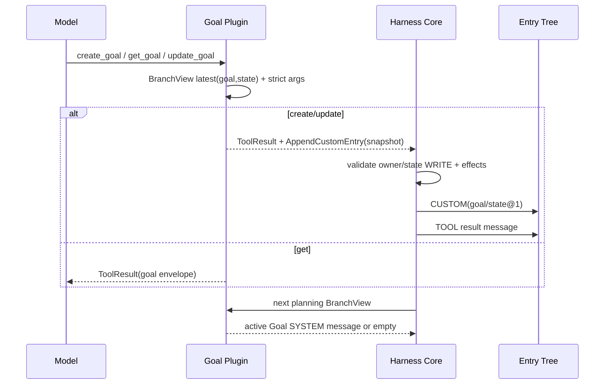

# Harness Plugin Goal

## 定位

`harness-plugin-goal` 是内置 trusted plugin，将 Goal 表达为当前 branch 的 `CUSTOM` 全量快照，并通过三个同步 PluginTool 和一个 ContextProjector 接入 Harness Core。它不建 Goal 专用表，不写 Store，不实现独立 workflow。

插件 descriptor 是 `PluginId("goal")`、version `"2"`、无 requires；注册的 model-visible tools 为 `create_goal@2`、`get_goal@2`、`update_goal@2`，另注册 `state` custom entry ownership 和 active Goal context projector。

## Goals / Non-goals

### Goals

- 以 branch-scoped `goal/state` snapshot 保存 objective、budget、status、reason 和 timestamps。
- 让 create/update 通过声明式 `AppendCustomEntry` 交给 Core 原子追加，让 get 只读当前 branch。
- 只把 active Goal 投影到下一次 Model planning 的 SYSTEM context。
- 保持 fork 可见性、terminal 状态和 snapshot schema 的严格确定性。

### Non-goals

- Goal durable fact 只存在 `harness_entry` 的 CUSTOM payload；插件不拥有独立
  persistence boundary。
- 不实现 host-side `/goal` command、pause/resume、自动 continuation、独立 dispatcher 或 Goal approval。
- 不读取其它 branch、其它 Session 或 Store，也不把 terminal Goal 继续注入 Provider context。
- 不让模型直接修改 Entry；Tool 只返回 intent，Core 负责 ownership、effects 和 durable apply。

## 依赖边界

```text
GoalPlugin
  -> harness-plugin-api（HarnessPlugin / PluginTool / BranchView / projector）
  -> harness-runtime（CustomEntryPayload / AgentMessage / prompt loader）
  -> harness-tool（ToolDescriptor / ToolCall / ToolResult / schema）
```

POM 见 [`pom.xml`](../../harness/plugins/goal/pom.xml)，包级职责见 [`package-info.java`](../../harness/plugins/goal/src/main/java/fun/fengwk/kkstudio/harness/plugins/goal/package-info.java)。Goal plugin 不依赖 infra、Spring、数据库或独立 storage。

Harness durable schema 的唯一入口是 [`V1__schema.sql`](../../schema/src/main/resources/db/migration/V1__schema.sql)；其中只有 Harness 七张协议表，没有 Goal 专用表。

## 核心模型 / API

### Plugin registration

[`GoalPlugin`](../../harness/plugins/goal/src/main/java/fun/fengwk/kkstudio/harness/plugins/goal/GoalPlugin.java) 注册：

| contribution | identity / mode |
| --- | --- |
| custom entry type | `(goal, state)`，schema version 1 |
| `create_goal` | PLUGIN / v2 / SELECTABLE / IDEMPOTENT / WRITE(`state`) |
| `get_goal` | PLUGIN / v2 / SELECTABLE / READ_ONLY / READ(`state`) |
| `update_goal` | PLUGIN / v2 / SELECTABLE / IDEMPOTENT / WRITE(`state`) |
| context projector | `goal:context` |

Tool descriptor 的 timeout 是 `Duration.ZERO`，实际 Tool execution timeout/lease 由 Runtime/Platform 处理。prompt 和 schema 来自 `src/main/resources/fun/fengwk/kkstudio/harness/plugins/goal/prompts/`。

### Goal state snapshot

[`GoalState`](../../harness/plugins/goal/src/main/java/fun/fengwk/kkstudio/harness/plugins/goal/GoalState.java) 是完整替换快照：

```text
objective:   non-blank string
tokenBudget: positive long or null
status:      active | complete | blocked
reason:      null for active, non-blank for terminal
createdAt:   Instant
updatedAt:   Instant
```

`GoalStatus.ACTIVE` 是唯一非 terminal 状态；`COMPLETE` 和 `BLOCKED` 是 terminal。`updatedAt >= createdAt`，timestamp 在工具执行时截断到 milliseconds。

[`GoalStateCodec`](../../harness/plugins/goal/src/main/java/fun/fengwk/kkstudio/harness/plugins/goal/GoalStateCodec.java) 要求 payload `schemaVersion=1`，`dataJson` 是字段集合恰好为：

```json
{
  "objective": "...",
  "tokenBudget": 1000,
  "status": "active",
  "reason": null,
  "createdAt": "2026-01-01T00:00:00Z",
  "updatedAt": "2026-01-01T00:00:01Z"
}
```

未知字段、缺失字段、duplicate/trailing、错误 status、错误 timestamp、非正 budget 或 domain invariant 失败均拒绝。

### Branch scope

每个 Tool 从 [`BranchView.latestCustomEntry`](../../harness/plugin-api/src/main/java/fun/fengwk/kkstudio/harness/plugin/api/BranchView.java) 查询 `(goal,state)`，只使用当前 Tool 所在 Assistant Entry 的 root-to-head path：

```text
fork before goal snapshot -> no goal
fork after active snapshot -> active goal
sibling branch            -> sibling's latest snapshot
terminal snapshot         -> terminal goal on that branch
```

Goal 没有全局单例，也不从其它 Thread 或 Session 回退读取。最新 snapshot 是完整 state replacement，而不是字段 patch。

## 执行 / 状态 trace



### create_goal

[`CreateGoalTool`](../../harness/plugins/goal/src/main/java/fun/fengwk/kkstudio/harness/plugins/goal/CreateGoalTool.java) 要求 `objective`，可选正 `tokenBudget`。它创建 `ACTIVE` snapshot；若 branch 已有 Goal，保留原 `createdAt`，用当前 execution time 更新 objective/budget/status/reason/updatedAt。返回 JSON `goal` envelope 和一个 `AppendCustomEntry` WRITE intent。

### get_goal

[`GetGoalTool`](../../harness/plugins/goal/src/main/java/fun/fengwk/kkstudio/harness/plugins/goal/GetGoalTool.java) 无参数。存在 Goal 时返回当前 branch latest snapshot；不存在时返回成功 ToolResult，文本明确表示该 branch 没有 current goal。它不返回 intent、不改变 branch。

### update_goal

[`UpdateGoalTool`](../../harness/plugins/goal/src/main/java/fun/fengwk/kkstudio/harness/plugins/goal/UpdateGoalTool.java) 要求 `status` 为 `complete` 或 `blocked`，且 `reason` 非空。必须已有 `ACTIVE` Goal；terminal Goal 不能再次 update。objective/tokenBudget/createdAt 保持不变，只替换 status/reason/updatedAt，并返回一个 WRITE intent。

### Context projector

[`GoalContextProjector`](../../harness/plugins/goal/src/main/java/fun/fengwk/kkstudio/harness/plugins/goal/GoalContextProjector.java) 只在 latest Goal 状态为 ACTIVE 时生成一条 `AgentMessage.system`，内容由 `active-goal-context.md` 模板和 canonical `goal` envelope 构造。缺失、COMPLETE 或 BLOCKED 均返回空列表；terminal Goal 仍可由 `get_goal` 读取，但不进入 Provider context。

## 不变量、failure / recovery

- Goal state 只存在 `harness_entry` CUSTOM，entry key 为 `(pluginId=goal, customType=state, schemaVersion=1)`；没有独立 Goal 表或 hidden side channel。
- create/update 的 successful result 必须携带一个 `AppendCustomEntry`，get 和所有 error result 必须没有 intents。
- Tool 参数先通过 descriptor schema，再由 `GoalToolSupport` 做 object、required text、positive integer 和 domain validation；duplicate/unknown fields fail closed。
- `GoalState` active 不得有 reason，terminal 必须有 reason；tokenBudget 只能是正数或 null；时间不能回退。
- update 只允许 `ACTIVE -> COMPLETE/BLOCKED`；create 可在当前 branch 完整替换 active snapshot，但保留 creation time。
- Core 在 Tool terminal apply 前校验 `goal:state` ownership 和 WRITE access；校验或 Resource materialization 失败时不追加 CUSTOM Entry。
- fork 读取严格按 branch path；不在该 branch path 上的 snapshot 不可见于 sibling branch。
- projector 对 terminal/missing state 静默返回空，不把已经结束的 Goal 作为 active instruction。

## 配置 / 扩展

- Goal 的 schema、Tool description 和 active context 均由 classpath prompt resources 提供，入口是 [`GoalPrompts.java`](../../harness/plugins/goal/src/main/java/fun/fengwk/kkstudio/harness/plugins/goal/GoalPrompts.java)。
- 当前 Goal state contract 固定为 schema version 1；`GoalState`、
  `GoalStateCodec` 和 prompt schema 共同拒绝未知字段，并保持
  `ACTIVE -> COMPLETE/BLOCKED` 的状态边界。
- 当前三项 operation 只通过 Plugin API 声明 READ/WRITE state access，继续使用
  branch snapshot 与 Core intent semantics。
- Goal plugin 不配置独立 dispatcher、Store adapter 或数据库表；调度和 durable
  apply 始终由 Harness Core。

## 测试与源码入口

### 源码入口

- [`GoalPlugin.java`](../../harness/plugins/goal/src/main/java/fun/fengwk/kkstudio/harness/plugins/goal/GoalPlugin.java)、[`GoalState.java`](../../harness/plugins/goal/src/main/java/fun/fengwk/kkstudio/harness/plugins/goal/GoalState.java)、[`GoalStateCodec.java`](../../harness/plugins/goal/src/main/java/fun/fengwk/kkstudio/harness/plugins/goal/GoalStateCodec.java)
- [`CreateGoalTool.java`](../../harness/plugins/goal/src/main/java/fun/fengwk/kkstudio/harness/plugins/goal/CreateGoalTool.java)、[`GetGoalTool.java`](../../harness/plugins/goal/src/main/java/fun/fengwk/kkstudio/harness/plugins/goal/GetGoalTool.java)、[`UpdateGoalTool.java`](../../harness/plugins/goal/src/main/java/fun/fengwk/kkstudio/harness/plugins/goal/UpdateGoalTool.java)
- [`GoalToolSupport.java`](../../harness/plugins/goal/src/main/java/fun/fengwk/kkstudio/harness/plugins/goal/GoalToolSupport.java)、[`GoalContextProjector.java`](../../harness/plugins/goal/src/main/java/fun/fengwk/kkstudio/harness/plugins/goal/GoalContextProjector.java)、[`GoalPrompts.java`](../../harness/plugins/goal/src/main/java/fun/fengwk/kkstudio/harness/plugins/goal/GoalPrompts.java)

### 关键测试守卫

- [`GoalPluginTest.java`](../../harness/plugins/goal/src/test/java/fun/fengwk/kkstudio/harness/plugins/goal/GoalPluginTest.java)：覆盖 catalog ownership、Tool descriptor/version/schema、副作用、branch latest snapshot、fork/sibling 隔离、replacement timestamp、invalid input no-intent、active projector silence 和 strict schema codec。

---

上级：[系统设计](../system-design.md)。相关文档：[Harness Plugin API](harness-plugin-api.md)、
[Harness Runtime](harness-runtime.md)、[Harness Infra](harness-infra.md)。
