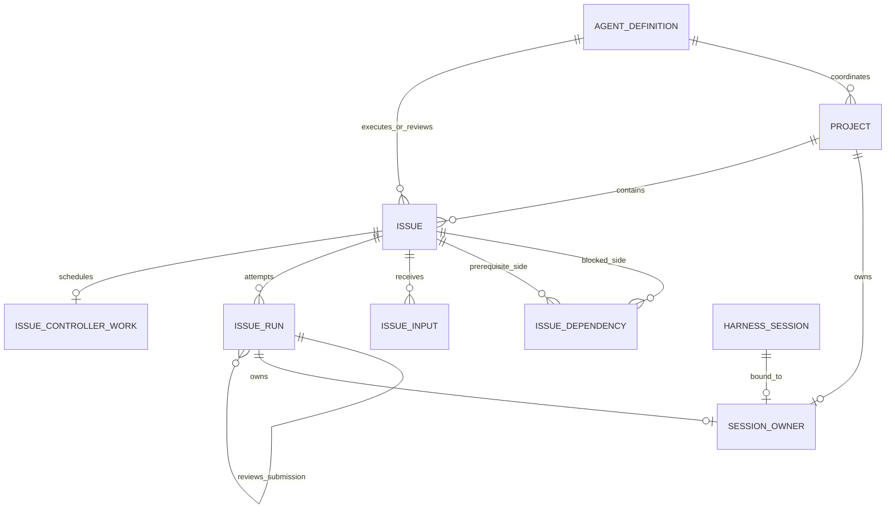
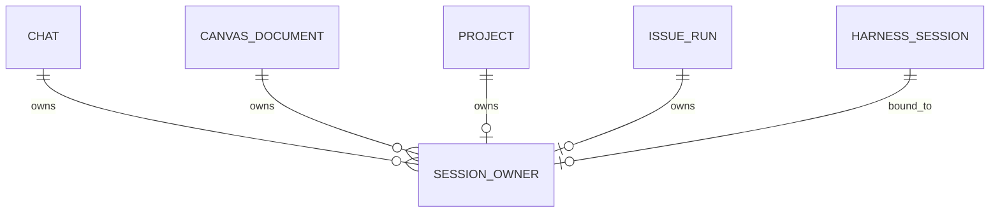
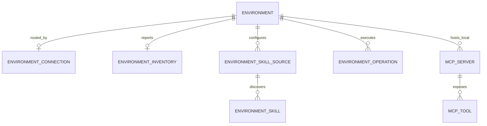
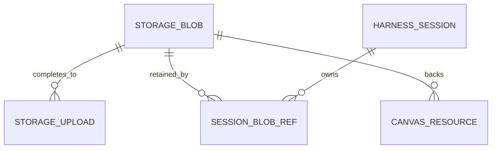

# Schema 模块

## 定位

`schema` 是 PostgreSQL 结构与 profile seed 的唯一资源模块。它不包含 Java 源码、
Spring bean 或运行时 repository；生产 Web 与各集成测试通过 Flyway 加载同一份
`V1__schema.sql`。

```mermaid
flowchart LR
    Schema[schema resources]
    V1[V1__schema.sql]
    Seeds[db/seed/{dev,e2e,canvas-test}]
    Flyway[Flyway]
    PG[(PostgreSQL)]
    Web[web runtime]
    Tests[integration tests]

    Schema --> V1
    Schema --> Seeds
    V1 --> Flyway
    Seeds --> Flyway
    Flyway --> PG
    Web --> Flyway
    Tests --> Flyway
```

## Goals

- 以一个自洽的 `V1__schema.sql` 声明完整当前结构，不保留增量迁移链。
- 以 profile seed 分离 dev、e2e、canvas-test 的可重复数据和运行开关。
- 让生产 Web、Platform、Harness 与 Canvas 集成测试使用相同 PostgreSQL 形状。
- 由架构测试守护唯一 V1、受限 seed 清单、Flyway scope 和单一初始化入口。

## Non-goals

- 不提供 Java domain、DAO、repository、配置读取器或 SQL migration service。
- 不保存 S3 文件字节；Blob 表只保存内容地址、媒体事实、引用计数和生命周期。
- 不提供第二份 SQL mirror、Spring SQL init 或容器 entrypoint 初始化业务表。
- 不把 profile seed 当作业务逻辑；运行时校验和写入由应用模块负责。

## 依赖边界

`schema/pom.xml` 无 `<dependencies>`、无 Java source。资源入口固定为：

```text
schema/src/main/resources/db/migration/V1__schema.sql
schema/src/main/resources/db/seed/dev/R__dev_seed.sql
schema/src/main/resources/db/seed/e2e/R__e2e_seed.sql
schema/src/main/resources/db/seed/canvas-test/R__canvas_test_seed.sql
```

`V1__schema.sql` 是唯一 versioned migration，`db/seed/**` 下只有三份受控
repeatable migration。Web 以 runtime scope 依赖 `kk-studio-schema`；Platform、
Harness Infra 与 Canvas Infra 只在测试 scope 使用它。Schema 不反向依赖任何模块。

## 当前结构

| 区域 | durable 事实 |
| --- | --- |
| Catalog | `agent_provider`、`agent_model`、`agent_definition` |
| MCP / ComfyUI | `mcp_server`、`mcp_tool`、`comfyui_workflow_api` |
| Environment / Skill | `environment`、`environment_connection`、`environment_inventory`、`environment_skill_source`、`environment_skill`、`environment_operation` |
| Chat / Canvas | `chat`、Canvas graph/function/resource 表 |
| Project / Issue | `project`、`issue`、`issue_dependency`、`issue_input`、`issue_run`、`issue_controller_work` |
| Harness | `harness_session`、`harness_entry`、`harness_thread`、`harness_thread_command`、`harness_model_invocation`、`harness_tool_invocation`、`harness_work` |
| Session ownership | `session_owner` |
| Global Storage | `storage_blob`、`storage_upload`、`session_blob_ref` |
| Settings | 单行 `system_setting(id=1)`、JSONB `config`、CAS `version` |

所有业务实体 ID 均由应用生成，不使用 sequence。结构化 payload 使用 JSONB，时间使用
`timestamptz(3)`，状态、配对字段、版本和生命周期由命名 check constraint 防御。

### Project / Issue 关系



- `project` 保存项目目标、Coordinator 和项目内 Issue 编号分配器。
- `issue` 保存当前规格、六态生命周期及执行/评审分配；依赖图独立存入
  `issue_dependency`，复合外键保证依赖两端属于同一 Project，DAG 环检测由应用完成。
- `issue_input` 是有序输入流；`issue_run` 是每次执行或评审尝试，二者不覆盖 Issue
  当前快照。
- `issue_run.submission_run_id` 只允许引用同一 Issue 的执行 Run。
- `issue_controller_work` 每个 Issue 至多一行，只保存 due、wake version 与 lease，
  是可恢复调度信箱而不是第二份 Issue 状态。
- Project 和 IssueRun 通过统一 `session_owner` 排他弧可选地拥有一个 Harness
  Session。

### Session 全局唯一归属



`session_owner` 一行只允许 `chat_id`、`canvas_id`、`project_id`、
`issue_run_id` 中恰好一个非空。`session_id` 主键直接保证一个 Session 全局至多一个
产品 owner；Project 与 IssueRun owner 列的 unique constraint 再保证各自至多一个
长期 Session。该约束无需 guard 表或归属 trigger。

### Environment / Skill / MCP 关系



- `environment_inventory` 是每个 Environment 的来源集合代际与最近 READY 报告。
- `environment_skill_source` 是来源配置，`environment_skill` 只保留每个来源最近成功
  扫描的 inventory，Skill 正文不入库。
- `environment_operation` 统一承载 Skill 与 Local MCP 管理操作。
  `(resource_type, resource_id, resource_version)` 是稳定目标快照；`resource_id` 不建
  多态 FK，以便资源删除后仍保留操作终态。
- `mcp_server.environment_id` 仅 Local MCP 必填；Remote MCP 必须为空。

### Blob 关系



`storage_blob` 是按 SHA-256 与长度去重的不可变内容地址；字节位于 S3。
`session_blob_ref` 让附件和外置 Tool Result 以 Session 为 owner 持有 Blob。所有引用
释放和 `ref_count` 变更均由应用事务显式完成，不依赖 cascade 或数据库 trigger。

## 关键不变量

- Harness Entry 的 ROOT 唯一、parent shape 和 `entry_type` 由 check/partial unique
  index 固定。
- Thread head 必须属于同一 Session；Thread Command 以 `(thread_id, sequence)` 与
  `(thread_id, idempotency_key)` 保证顺序和 exact replay。
- `harness_work` 以 `(target_type, target_id)` 唯一表示 THREAD/MODEL/TOOL 调度事实，
  `wake_version` 为正，lease token 与 lease until 成对存在。
- Canvas ownership、owner relation 与 Blob 引用使用 `ON DELETE RESTRICT`；应用按
  pins、Resource、Session Blob ref 和 Harness facts 的依赖顺序删除。
- `storage_blob` 的 ACTIVE hash 唯一；ACTIVE 必须有正引用，DELETING 的
  `ref_count` 必须为零。
- `harness_thread_version`、`canvas_version`、`canvas_function_work`、
  `issue_controller_work_due`、`project_issue_changed` 和
  `system_settings_changed` 都只是提交后的回读提示，不是事件日志。
- V1 不使用 `IF NOT EXISTS` 隐藏 schema drift；任何声明冲突直接失败。

## Profile seeds 与启动

| profile | 资源 | 内容 |
| --- | --- | --- |
| dev | `db/seed/dev/R__dev_seed.sql` | stub Provider/Model/Agent |
| e2e | `db/seed/e2e/R__e2e_seed.sql` | E2E Catalog、Settings、Environment、inventory 与缺省 Skill 来源 |
| canvas-test | `db/seed/canvas-test/R__canvas_test_seed.sql` | Canvas Function 与集成测试配置 |

```text
Flyway locations
  -> classpath:db/migration
  -> V1__schema.sql
  -> classpath:db/seed/{dev|e2e|canvas-test}
  -> optional repeatable profile seed
  -> Web / Platform / Infra use the same PostgreSQL schema
```

`V1__schema.sql` 直接插入安全的默认 `system_setting` 聚合。NAS `prod` 只加载
`classpath:db/migration`：Main 是共享 schema 的唯一 Flyway owner，Dev 设置
`SPRING_FLYWAY_ENABLED=false`。修改 V1 必须先停止共享数据库的全部使用节点，并在
Human 明确批准的维护窗口内重建空库；普通自迭代不得改写已运行数据库的 V1 历史。
标准重建入口、保留表范围、checksum 围栏及敏感备份约束见
[NAS main/dev 自迭代运行规范](../operations/development-and-testing.md#44-nas-maindev-自迭代运行规范)。

就地放宽既有列的约束（例如 `varchar(n)` -> `text`）可以避免重建空库，但仍属于
维护窗口操作：需要先停止全部 App 节点，执行放宽语句，并把
`flyway_schema_history` 中该 version 的 `checksum` 更新为新 V1 的 checksum，否则
Main 启动时 Flyway 校验失败。`varchar(n)` -> `text` 在 PostgreSQL 是二进制兼容变更，
不重写表数据；放宽后的结构必须与空库直接应用新 V1 的结果一致。

## 测试与源码入口

- `schema/pom.xml`
- `schema/src/main/resources/db/migration/V1__schema.sql`
- `schema/src/main/resources/db/seed/dev/R__dev_seed.sql`
- `schema/src/main/resources/db/seed/e2e/R__e2e_seed.sql`
- `schema/src/main/resources/db/seed/canvas-test/R__canvas_test_seed.sql`
- `web/src/test/java/fun/fengwk/kkstudio/web/FlywayBootstrapArchitectureTest.java`
- `web/src/test/java/fun/fengwk/kkstudio/web/FlywayAutoConfigurationIntegrationTest.java`
- `platform/src/test/java/fun/fengwk/kkstudio/platform/harness/persistence/postgresql/PostgresqlSchemaStructureTest.java`
- `platform/src/test/java/fun/fengwk/kkstudio/platform/harness/persistence/postgresql/PostgresqlBusinessSchemaTest.java`
- `platform/src/test/java/fun/fengwk/kkstudio/platform/project/ProjectSchemaPostgresTest.java`
- `platform/src/test/java/fun/fengwk/kkstudio/platform/project/ProjectChangeNotificationIntegrationTest.java`

---

上级：[系统设计](../system-design.md)。相关文档：[Platform](platform.md)、
[Canvas Infra](canvas-infra.md)、[Harness Infra](harness-infra.md)。
