# Schema 模块

PostgreSQL 里到底有哪些表、哪些列在什么情况下可以为空、版本与租约怎么配对，是这套系统里被引用最多、也最难追溯的一类事实：应用代码可以用 try/catch 兜底，数据库约束一旦缺失就会长期积累脏数据。`schema` 模块把这份事实收敛成一个文件——`V1__schema.sql` 就是**当前全部结构**的完整声明，没有增量迁移链，没有第二份镜像。生产 Web 与各集成测试用同一份 Flyway 资源，因此「测试通过」和「生产建库」走的是同一段 DDL。

模块本身没有 Java 源码、没有运行时依赖（见 [`schema/pom.xml`](../../schema/pom.xml)），资源入口只有四个文件：

```text
schema/src/main/resources/db/migration/V1__schema.sql          唯一 versioned baseline
schema/src/main/resources/db/seed/dev/R__dev_seed.sql          profile seed（repeatable）
schema/src/main/resources/db/seed/e2e/R__e2e_seed.sql
schema/src/main/resources/db/seed/canvas-test/R__canvas_test_seed.sql
```

`V1__schema.sql` 是唯一的 versioned migration；`db/seed/**` 下只有三份受控 repeatable migration。Web 以 runtime scope 依赖 `kk-studio-schema`，Platform、Harness Infra 与 Canvas Infra 只在 test scope 使用它；schema 不反向依赖任何模块。Flyway 的装配位置：
[`application-prod.yml`](../../web/src/main/resources/application-prod.yml) 只加载
`classpath:db/migration`，dev/e2e/canvas-test profile 在此基础上追加各自的 seed
（见 [Web](web.md) 的配置表）。

## 一张图看表之间怎么连

```mermaid
erDiagram
    AGENT_PROVIDER ||--o{ AGENT_MODEL : hosts
    AGENT_MODEL ||--o{ AGENT_DEFINITION : binds
    ENVIRONMENT ||--o| ENVIRONMENT_CONNECTION : leases
    ENVIRONMENT ||--o| ENVIRONMENT_INVENTORY : reports
    ENVIRONMENT ||--o{ ENVIRONMENT_SKILL_SOURCE : configures
    ENVIRONMENT_SKILL_SOURCE ||--o{ ENVIRONMENT_SKILL : discovers
    ENVIRONMENT ||--o{ ENVIRONMENT_OPERATION : executes
    ENVIRONMENT ||--o{ MCP_SERVER : hosts_local
    MCP_SERVER ||--o{ MCP_TOOL : exposes
    HARNESS_SESSION ||--o{ HARNESS_ENTRY : trees
    HARNESS_SESSION ||--o{ HARNESS_THREAD : owns
    HARNESS_THREAD ||--o{ HARNESS_THREAD_COMMAND : mailboxes
    HARNESS_THREAD ||--o{ HARNESS_MODEL_INVOCATION : attempts
    HARNESS_MODEL_INVOCATION ||--o{ HARNESS_TOOL_INVOCATION : siblings
    SESSION_OWNER }o--|| HARNESS_SESSION : binds
    SESSION_OWNER }o--o| CANVAS_DOCUMENT : canvas_owner
    SESSION_OWNER }o--o| CHAT : chat_owner
    SESSION_OWNER }o--o| PROJECT : project_owner
    SESSION_OWNER }o--o| ISSUE_RUN : issue_run_owner
    CANVAS_DOCUMENT ||--o{ CANVAS_NODE : contains
    CANVAS_DOCUMENT ||--o{ CANVAS_GROUP : contains
    CANVAS_NODE ||--o{ CANVAS_LINK : links
    CANVAS_NODE ||--o{ CANVAS_RESOURCE : owns
    CANVAS_NODE ||--o| CANVAS_FUNCTION_RUN : runs
    CANVAS_NODE ||--o{ CANVAS_FUNCTION_RESOURCE_PIN : pins
    STORAGE_BLOB ||--o{ CANVAS_RESOURCE : backs
    STORAGE_BLOB ||--o{ STORAGE_UPLOAD : completes_to
    STORAGE_BLOB ||--o{ SESSION_BLOB_REF : retained_by
    PROJECT ||--o{ ISSUE : contains
    ISSUE ||--o{ ISSUE_DEPENDENCY : blocked_side
    ISSUE ||--o{ ISSUE_INPUT : receives
    ISSUE ||--o{ ISSUE_RUN : attempts
    ISSUE ||--o| ISSUE_CONTROLLER_WORK : schedules
```



`storage_upload.completes_to` 表达的是 PENDING → READY 的状态迁移（`blob_id` 由空变非空），不是级联关系：`blob_id` 是 RESTRICT 外键，而 PENDING 时预分配的 `candidate_blob_id` 故意不建外键，因为 blob 行要到 complete 时才创建。同理 `chat.agent_name` 与 `environment_operation.resource_id` 都没有外键，理由写在各自的列注释里。

表按区域分组，边界可以这样记：

| 区域 | durable 事实 |
| --- | --- |
| Catalog | `agent_provider`、`agent_model`、`agent_definition`、`comfyui_workflow_api` |
| MCP | `mcp_server`、`mcp_tool` |
| Environment / Skill | `environment`、`environment_connection`、`environment_inventory`、`environment_skill_source`、`environment_skill`、`environment_operation` |
| Chat / Canvas | `chat`、`canvas_document`、`canvas_group`、`canvas_node`、`canvas_link`、`canvas_resource`、`canvas_function_run`、`canvas_command_dedup`、`canvas_function_resource_pin` |
| Project / Issue | `project`、`issue`、`issue_dependency`、`issue_input`、`issue_run`、`issue_controller_work` |
| Harness | `harness_session`、`harness_entry`、`harness_thread`、`harness_thread_command`、`harness_model_invocation`、`harness_tool_invocation`、`harness_work` |
| Session 归属 | 单行排他弧 `session_owner` |
| Global Storage | `storage_blob`、`storage_upload`、`session_blob_ref` |
| Settings | 单行 `system_setting(id = 1)` |

`harness_` 前缀只属于 Harness 执行协议的七张表；`session_blob_ref` 是应用层业务表，刻意不加该前缀（[`PostgresqlSchemaStructureTest.java`](../../platform/src/test/java/fun/fengwk/kkstudio/platform/harness/persistence/postgresql/PostgresqlSchemaStructureTest.java) 断言 public schema 的表集合与这份清单完全相等，多一张少一张都失败）。

## 关键表与约束

### Canvas graph

| 表 | 身份与关键约束 |
| --- | --- |
| `canvas_document` | `id` PK；`version >= 0`；标题的规范化由应用负责，DB 侧只要求 `btrim(title) <> ''` |
| `canvas_group` | `id` PK、`(canvas_id, id)` unique；几何 check 要求有限且宽高为正 |
| `canvas_node` | `id` PK、`(canvas_id, id)` unique；`model_key` 与 `function_config_json` 同存同缺（Function 节点），`function_config_json` 必须是 JSON object |
| `canvas_link` | PK `(canvas_id, source_node_id, target_node_id)`；`source <> target`；无独立 link id |
| `canvas_resource` | `id` PK；`owner_node_id` 与 `resource_index` 同存同缺；`blob_id` 与 `text_content` 恰好一个非空；`(canvas_id, owner_node_id, resource_index)` unique；`blob_id` → `storage_blob` RESTRICT |
| `canvas_function_run` | **PK 是 `node_id`**，所以每个 Function 节点只有一行当前/最后 Run；`(node_id, request_id)` unique；status 五态；`attempt >= 0`；lease token/until 成对；READY 必须有 `available_at` 且无 lease，RUNNING 必须无 `available_at` 且有 lease，终态两者皆空 |
| `canvas_command_dedup` | PK `(canvas_id, idempotency_key)`；`request_hash` 是 64 位小写 hex |
| `canvas_function_resource_pin` | PK `(canvas_id, node_id, request_id, role, resource_id)`；`role in ('INPUT','OUTPUT')`；只保护无 owner 资源，不参与 blob refcount |

这些约束和 [canvas-core](canvas-core.md) 里领域类型的构造期校验一一对应：领域负责给出清晰错误，数据库负责在并发与旁路写入下兜底。Canvas 的全部 ownership 外键都是 `ON DELETE RESTRICT`，删除顺序由应用显式编排（见 [canvas-infra](canvas-infra.md)），database 不会替应用级联删掉资源或 pin。

### Session 全局唯一归属

`session_owner` 每行恰好一个非空 owner 列（`ck_session_owner_exactly_one`：`num_nonnulls(chat_id, canvas_id, project_id, issue_run_id) = 1`），`session_id` 是 PK，因此一个 Session 全局至多属于一个产品 owner。Project 与 IssueRun 另有 unique 约束，保证各自至多绑定一个长期 Session；Chat 与 Canvas 可以持有多个 Session。整个约束不需要 guard 表或归属 trigger。

### Blob 生命周期

`storage_blob` 是按 `(sha256, size_bytes)` 去重的不可变内容地址，字节在 S3，行只保存媒体事实与 `ref_count`/`state`。`uk_storage_blob_active_hash` 是部分唯一索引（`where state = 'ACTIVE'`），所以同一内容在 DELETING 期间可以重新上传；`ck_storage_blob_state_ref_count` 固定 ACTIVE 必须有正引用、DELETING 必须为零。`storage_upload.blob_id` 为空表示 PENDING（客户端 PUT 到 `uploads/{id}/original`）、非空表示 READY；`session_blob_ref` 让 Session 以显式边持有 blob。所有释放与 `ref_count` 变更都由应用事务完成，不依赖 cascade 或 trigger。

### 应用拥有的版本与提示

- Harness Entry 的 ROOT 唯一、parent shape 与 `entry_type` 由 check 与部分唯一索引固定；Thread head 必须属于同一 Session；Thread Command 以 `(thread_id, sequence)` 与 `(thread_id, idempotency_key)` 保证顺序与精确回放。
- `harness_work` 以 `(target_type, target_id)` 唯一表示 THREAD/MODEL/TOOL 调度事实，`wake_version` 为正，lease token 与 until 成对；`target_id` 是多态引用，刻意不建外键，因此 `required_environment_id` 非空时由 check 限定只能出现在 TOOL Work 上。
- `system_setting` 恒为一行（`ck_system_setting_id` 要求 `id = 1`），`config` 必须是 JSON object，`version` 是非负 CAS 令牌。
- 六个 NOTIFY 通道都只是提交后的回读提示，不是事件日志：`system_settings_changed`（version 文本）、`issue_controller_work_due`（issue id）、`project_issue_changed`（project id）、`harness_thread_version`（`id:version`）、`canvas_version`（`id:version`）、`canvas_function_work`（空 payload）。触发函数由应用拥有 version，数据库只负责在 version 真正变化或行立刻可调度时发出提示，绝不修改行；`harness_thread_version` 刻意没有子表版本触发器，`canvas_function_work` 只提示「刚写入的行现在可认领」，未来的 READY 与过期租约都靠轮询恢复。
- V1 全文没有 `IF NOT EXISTS`（文件开头的注释明确说明这一点），任何声明冲突都会让迁移直接失败，而不是留下一个 drift 过的库。业务实体 id 全部由应用生成：仓库里没有 `create sequence`、`serial` 或 generated identity，`PostgresqlSchemaStructureTest` 对此有专门断言。

## Profile seeds

| profile | 资源 | 内容 |
| --- | --- | --- |
| dev | [`R__dev_seed.sql`](../../schema/src/main/resources/db/seed/dev/R__dev_seed.sql) | 先删除再插入确定性 stub Provider/Model/Agent（`stub` provider、`acceptance-stub` model、`default-assistant` agent），离线开发可直接跑通对话 |
| e2e | [`R__e2e_seed.sql`](../../schema/src/main/resources/db/seed/e2e/R__e2e_seed.sql) | 八家 Provider 与真实模型目录（含 pricing/abilities/variants）、四张 Environment Card 与 inventory/Skill 来源；同时把 `tool.permission` 覆盖为四个 base 分类各 `* -> ask` |
| canvas-test | [`R__canvas_test_seed.sql`](../../schema/src/main/resources/db/seed/canvas-test/R__canvas_test_seed.sql) | 只覆盖 Docker Canvas test stack 需要缩短或启用的设置：上传有效期、OpenCLI Hub、GPT Image 2、Seedance |

三份都是 `R__` repeatable migration，可重复执行：seed 拥有的行按定义同步（`on conflict ... do update` 或先删后插），用户可能改过的行用 `do nothing` 保护。e2e seed **不含**任何真实凭据，密钥在运行时由环境注入；Provider 只有一个 `'stub'` 之类完全公开的占位值。`V1__schema.sql` 自身插入一行安全的 `system_setting` 默认聚合（`tool.permission` 默认只对 `base.write`/`base.edit`/`base.bash` 要求审批，`base.read` 不受限），[`E2eToolPermissionProfileTest.java`](../../web/src/test/java/fun/fengwk/kkstudio/web/E2eToolPermissionProfileTest.java) 断言源码内默认值与代码中的 `SystemSettings` 默认完全一致。

## 修改 V1 的代价

`V1__schema.sql` 是**不可变 baseline**：它已经被共享数据库执行过，Flyway 校验它的 checksum，因此修改它的含义是「重建数据库」，不是「打补丁」。共享数据库由 NAS 上的两个 App 节点（Main 与 Dev）同时使用，所以这条路径有硬性安全要求：

- 普通自迭代**不得**改写已运行数据库的 V1 历史，也不得重置共享 database 或删除共享 bucket。Dev 分支中未合并的 schema 变更不得应用到共享库；涉及 schema 的改动必须先完成 Review 与 Main 集成。
- 需要重建时，必须先停止两个 App 节点，并在 Human 明确批准的维护窗口内执行。标准入口是 [`scripts/operations/rebuild-database.sh`](../../scripts/operations/rebuild-database.sh)：先用 `--dry-run` 做只读预检，确认后再正式执行。脚本会对比仓库 V1 的 Flyway checksum 与 Main 实际写入的 checksum，不一致就停止回灌并保持 App 关闭。
- 重建会全库 custom-format 备份、按原 owner/locale 建空库、由 Main 执行 V1，然后单事务回灌并逐表校验内容指纹。保留集合仅 `environment`、`environment_skill_source`、`environment_inventory`、`environment_skill`、`agent_provider`、`agent_model`、`agent_definition`；`environment_connection` 是重连后重新生成的租约，`system_setting` 取 V1 默认，会话/Harness/Canvas/Project/Issue/Storage 运行数据都不回灌。
- 备份 archive 含 Provider credential 与 Environment registration token，必须按敏感数据处理：默认写到仓库外的 `~/.local/state/kk-studio/database-rebuild`（目录 `0700`、文件 `0600`），禁止提交到 Git、写进文档、粘贴到日志或工单、上传公共存储。

就地放宽既有列的约束（例如 `varchar(n)` → `text`）可以避免重建空库，但仍属于维护窗口操作：需要先停止全部 App 节点，执行放宽语句，再把 `flyway_schema_history` 中该 version 的 `checksum` 更新为新 V1 的 checksum，否则 Main 启动时 Flyway 校验失败。`varchar(n)` → `text` 在 PostgreSQL 是二进制兼容变更，不重写表数据；放宽后的结构必须与空库直接应用新 V1 的结果完全一致。

完整的执行步骤、脚本参数、失败处理和清理约定见 [NAS main/dev 自迭代运行规范](../operations/development-and-testing.md#44-nas-maindev-自迭代运行规范)。

## 从哪里改

- 加表/加列/改约束：直接改 [`V1__schema.sql`](../../schema/src/main/resources/db/migration/V1__schema.sql)，保持「按区域分组、cycle-closing 外键后置」的既有顺序；然后按上面的规则重建数据库，再同步 mapper 与领域校验。改完先跑结构测试，它会立刻指出列、约束与表集合的偏差。
- 加 profile 数据：写进对应的 `R__*.sql`，使用 `on conflict` 或先删后插保证可重跑；不要放真实凭据。
- 判断约束是否够用：如果一条不变量只写在 Java 里而并发写入可以绕过它，就应该在 SQL 里补 check / unique / FK；反之运行时校验的策略（如 Project DAG 环检测）不要硬塞进数据库。

测试入口：

- [`PostgresqlSchemaStructureTest.java`](../../platform/src/test/java/fun/fengwk/kkstudio/platform/harness/persistence/postgresql/PostgresqlSchemaStructureTest.java)：public schema 表集合精确相等、Harness 七表限定、列契约、jsonb/timestamptz 用法、无 sequence、NOTIFY 触发器清单、FK 全部 NOT DEFERRABLE。
- [`PostgresqlBusinessSchemaTest.java`](../../platform/src/test/java/fun/fengwk/kkstudio/platform/harness/persistence/postgresql/PostgresqlBusinessSchemaTest.java)：Catalog/Chat/Canvas/Environment 的 check 触发路径、提交后 NOTIFY payload、RESTRICT 删除语义。
- [`PostgresqlStorageSchemaTest.java`](../../platform/src/test/java/fun/fengwk/kkstudio/platform/harness/persistence/postgresql/PostgresqlStorageSchemaTest.java)：blob 与 upload 的非法事实、state/ref_count 不变量、ACTIVE 去重范围、FK 不级联。
- [`PostgresqlSchemaSeedTest.java`](../../platform/src/test/java/fun/fengwk/kkstudio/platform/harness/persistence/postgresql/PostgresqlSchemaSeedTest.java)：三份 seed 的幂等性、V1 默认 settings 解码、e2e seed 无凭据。
- [`ProjectSchemaPostgresTest.java`](../../platform/src/test/java/fun/fengwk/kkstudio/platform/project/ProjectSchemaPostgresTest.java) 与 [`ProjectChangeNotificationIntegrationTest.java`](../../platform/src/test/java/fun/fengwk/kkstudio/platform/project/ProjectChangeNotificationIntegrationTest.java)：Project/Issue 约束与提交后/回滚后的通知行为。
- [`FlywayBootstrapArchitectureTest.java`](../../web/src/test/java/fun/fengwk/kkstudio/web/FlywayBootstrapArchitectureTest.java) 与 [`FlywayAutoConfigurationIntegrationTest.java`](../../web/src/test/java/fun/fengwk/kkstudio/web/FlywayAutoConfigurationIntegrationTest.java)：唯一 V1、受控 seed 清单、各模块依赖 scope，以及在空库里真实执行迁移。

---

上级：[系统设计](../system-design.md)。相关文档：[Canvas Infra](canvas-infra.md)、[Platform](platform.md)、[Web](web.md)、[Harness Infra](harness-infra.md)。
