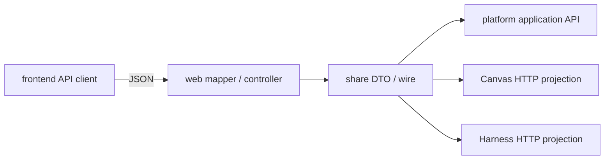

# Share 模块

## 定位

`share` 是 Web、Frontend 与后端应用服务之间的 public DTO / JSON wire 模块。
它把 HTTP 可见的字段、枚举、sealed union 和 Jackson 注解集中在一个轻量产物中；
不拥有领域状态、不访问数据库，也不负责业务编排。



## Goals

- 提供稳定、严格、可反序列化的 public JSON 形状。
- 让 Canvas、Harness、Storage、Catalog、Environment、Settings 和 ComfyUI 的
  HTTP 契约共享同一 DTO 定义。
- 在 DTO 边界拒绝未知字段、错误 union、非法 UUID/cursor 和不应回显的敏感字段。
- 保持生产依赖最小，使契约测试不需要 Spring、PostgreSQL 或 Flyway。

## Non-goals

- 不在 DTO 中执行 CAS、权限、数据库查询、Blob retain/release、Function 调度或
  Harness reducer。
- 不把 domain record、MyBatis row、Spring bean 或 Provider SDK 类型暴露为公共
  wire。
- 不由前端或 share 决定持久化 schema；DTO 的可空字段和版本字符串只表达 HTTP
  契约。

## 依赖边界

`share/pom.xml` 的生产依赖只有 `jackson-annotations`；Jackson databind 与
JUnit 只在 test scope。源码只位于
`share/src/main/java/fun/fengwk/kkstudio/share/`，按公共领域分为：

| 包 | 当前 wire |
| --- | --- |
| `ai.catalog` | Provider、Model、Agent、ModelRef、Tool catalog |
| `ai.chat` | Chat 与 Chat defaults |
| `ai.environment` | Environment directory、live daemon、skill/tool |
| `ai.runtime` | Session、Entry、Thread Snapshot、Command batch、Invocation、approval、stop、compaction |
| `canvas` | Canvas document、Snapshot、Patch、typed command、Resource、Function 与 Run |
| `comfyui` | Workflow API 与运行请求/结果 |
| `storage` | Upload、Blob signed URL、S3 presign |
| `systemsettings` | 六个 settings section、schema 与 update request |

`share` 不依赖 `platform`、`canvas-core`、`canvas-infra`、`harness-runtime`、
`web` 或数据库驱动。领域到 DTO 的映射位于 Platform/Web。

## 核心模型与 API

### 严格 JSON 边界

当前 DTO 普遍使用 `@JsonAnySetter` 将未知字段转为
`IllegalArgumentException`。多态 Canvas command 使用 `type` discriminator，
`CanvasCommandDTO` 的 15 个 subtype 与 Core 的 typed command 一一对应：

```text
CREATE_TEXT_NODE
UPDATE_TEXT_NODE
CREATE_RESOURCE_NODE
CREATE_FUNCTION_NODE
UPDATE_FUNCTION
RENAME_NODE
UPDATE_NODE_TRANSFORMS
DELETE_NODE
CREATE_LINK
DELETE_LINK
CREATE_GROUP
MOVE_GROUP
UNGROUP
DELETE_GROUP
RENAME_GROUP
```

HTTP mapper 对 UUID 与 cursor 继续执行 canonical 校验。Canvas、Harness 的
`version`、`sequence` 等 long cursor 以非负十进制 string 传输；`ModelRef` 使用
`providerName/modelName` 的 canonical 形式，并在第一个 `/` 处分隔。

### 可空与安全输出

wire 中语义上必须出现的 nullable 字段显式使用 `@JsonInclude(ALWAYS)`，例如：

- `CanvasResourceDTO` 的 `blobId`、`textContent`、媒体事实；
- `CanvasResourceNodeDTO` 的 `groupId`、`function`、`run`；
- `HarnessThreadSnapshotDTO` 的 manual compaction sidecar；
- `ChatDTO.environment` 与 Function model/run 的 reason/error。

Provider credential 使用 write-only JSON property。System Settings DTO 的公共
字段只表达非敏感运行策略；`SystemSettingsDtoContractTest` 对敏感字段名和嵌套
unknown field 做反射与 Jackson 检查。

### DTO 组织

DTO 只承载边界需要的值：

- Canvas Snapshot / Patch 把 document version、实体 upsert/remove 和 Function
  run 投影组成前端可渲染的聚合。
- Harness Snapshot 包含 root-to-head entries、queued commands、active
  invocation、tool siblings 与未物化的 model attempt failure。
- Storage DTO 只表达 upload handle、Blob identity、媒体事实和签名响应；全局
  Blob 的普通渲染端点由 Web/Platform 决定 URL policy。
- Settings DTO 包含完整六 section 和 `expectedVersion`，schema DTO 提供 UI
  的 ordered sections/groups/fields。

## 主流程

```text
HTTP JSON
  -> Web RequestMapper
  -> share DTO 校验 / sealed union 解码
  -> Platform application service 或 Core port
  -> domain / PostgreSQL durable mutation
  -> Web response mapper
  -> share response DTO
  -> JSON
```

Share 本身不保存 request hash、不执行 expectedVersion CAS，也不创建 Session、
Thread 或 Canvas；这些动作由调用方在 DTO 已经严格解析后完成。

## 不变量与失败恢复

- unknown field、重复字段、错误 JSON type、非法 canonical UUID 或数字形式都在
  wire 边界失败，不进入领域服务。
- required-nullable 字段即使值为 `null` 也必须序列化，避免客户端把“未返回”误判
  为“无值”。
- DTO collection 在构造后保持不可变，Command batch 不允许调用方通过集合修改
  已解析请求。
- `CanvasDocumentDTO` 不含 `threadId`；Canvas Graph version 与 Harness Thread
  version 是两个独立坐标。
- DTO 不回显 credential、secret 等部署输入；Blob URL 由服务端按请求重新生成，
  disconnect 或过期后由客户端再次读取 Snapshot/URL。

## 测试与源码入口

源码入口：

- `share/src/main/java/fun/fengwk/kkstudio/share/canvas/CanvasCommandDTO.java`
- `share/src/main/java/fun/fengwk/kkstudio/share/canvas/CanvasSnapshotDTO.java`
- `share/src/main/java/fun/fengwk/kkstudio/share/ai/runtime/HarnessThreadSnapshotDTO.java`
- `share/src/main/java/fun/fengwk/kkstudio/share/ai/catalog/ModelRef.java`
- `share/src/main/java/fun/fengwk/kkstudio/share/systemsettings/SystemSettingsDTO.java`

契约测试：

- `share/src/test/java/fun/fengwk/kkstudio/share/canvas/CanvasDtoContractTest.java`
- `share/src/test/java/fun/fengwk/kkstudio/share/ai/runtime/HarnessRuntimeDtoContractTest.java`
- `share/src/test/java/fun/fengwk/kkstudio/share/ai/catalog/ModelRefTest.java`
- `share/src/test/java/fun/fengwk/kkstudio/share/ai/chat/ChatDtoContractTest.java`
- `share/src/test/java/fun/fengwk/kkstudio/share/storage/StorageDtoContractTest.java`
- `share/src/test/java/fun/fengwk/kkstudio/share/systemsettings/SystemSettingsDtoContractTest.java`

相关模块：[系统设计](../system-design.md)、[Canvas Core](canvas-core.md)、
[Schema](schema.md)。
