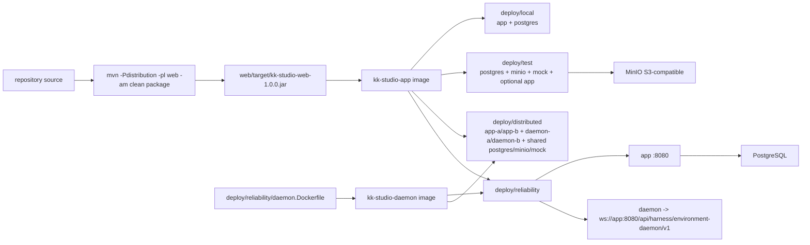

# 部署与运行

本文描述当前可执行的 Fat JAR、`deploy/local`、`deploy/test`、
`deploy/distributed` 和 `deploy/reliability` 运行方式。开发与测试入口见
[开发与测试](development-and-testing.md)；Frontend 代码和发布资源的关系见
[Frontend 模块](../modules/frontend.md)；跨模块边界见
[系统设计](../system-design.md)。

## 1. Goals

- 用同一份源码构建 Spring Boot Fat JAR，并让 React 静态资源由 Web app
  服务。
- 让 local、test、distributed、reliability 四个 Compose project 的网络、数据卷、健康
  检查、凭证和 proxy 边界可观察、可清理。
- App 和 Environment Daemon 使用固定 runtime image、non-root user 和
  明确的 health/smoke contract。
- PostgreSQL、Flyway、MinIO/S3 和 Environment daemon 的职责与连接地址
  可由当前配置直接复现。

## 2. Non-goals

- 当前部署由 App Fat JAR 直接服务 UI、API 和 SPA fallback；拓扑不包含额外的
  frontend service。
- `deploy/test` 是 disposable offline test stack，不承载真实 Provider、真实
  credential 或生产数据。
- reliability 的 `workspace-init` 只初始化 named volume owner；它不是长期
  root runtime。

## 3. 发布图和拓扑



| Stack | 服务 | 宿主暴露 | 用途 |
| --- | --- | --- | --- |
| local | `postgres`、`app` | app `127.0.0.1:8080`、PostgreSQL `127.0.0.1:5432` | 本地 UI/API 与 durable PostgreSQL |
| test | `postgres`、`minio`、`minio-init`、`http-mock`、可选 `app` profile | `15432`、`19000`、`18089`、可选 `18088` | Canvas/Storage/Function/离线 Chat smoke |
| distributed | `postgres`、`minio`、`minio-init`、`http-mock`、`app-a`、`app-b`、`workspace-init`、`daemon-a`、`daemon-b` | app-a `127.0.0.1:18082`、app-b `127.0.0.1:18083`、`15433`、`19001`、`18090` | 双节点零 App-to-App 网络的分布式 E2E mock topology |
| reliability | `postgres`、`app`、`workspace-init`、`daemon` | 只有 app `127.0.0.1:18091` | Environment daemon、工具隔离和显式 reliability matrix |

每个 stack 使用自己的 Compose project、network 和 named volume；容器内端口
保持固定，环境变量只改变允许覆盖的宿主 mapping 或职责配置。

## 4. Fat JAR

### 4.1 构建

```bash
env JAVA_HOME="$JAVA_HOME_21" \
  mvn -B -ntp -Pdistribution -pl web -am clean package
test -f web/target/kk-studio-web-1.0.0.jar
"$JAVA_HOME_21/bin/java" -jar web/target/kk-studio-web-1.0.0.jar
```

[web/pom.xml](../../web/pom.xml) 的 `distribution` profile 当前流程：

1. `frontend-maven-plugin` 在 `frontend/` 安装 Node `v24.14.0` 和 npm
   `11.9.0`；
2. 执行 `npm ci`；
3. 执行 `npm run build -- --outDir web/target/frontend-dist --emptyOutDir`；
4. 清空当前构建的 `target/classes/static`，复制 frontend-dist 到
   `web/target/classes/static`；
5. `spring-boot-maven-plugin` repackage，将 static 资源写入
   `BOOT-INF/classes/static`。

检查 Fat JAR 内容：

```bash
jar tf web/target/kk-studio-web-1.0.0.jar \
  | grep -E '^BOOT-INF/classes/static/(index.html|assets/)'
```

### 4.2 运行时

```bash
env JAVA_HOME="$JAVA_HOME_21" \
  "$JAVA_HOME_21/bin/java" -jar web/target/kk-studio-web-1.0.0.jar \
  --server.address=127.0.0.1 \
  --server.port=8080
curl -fsS http://127.0.0.1:8080/actuator/health
```

Spring Boot `server.port` 默认 `8080`，压缩开启，Actuator 暴露
`health,prometheus,offline,online`。SPA BrowserRouter 路径由 Web app
fallback 到 `index.html`。

## 5. App image

[deploy/local/Dockerfile](../../deploy/local/Dockerfile) 是 App、local/test/
performance 和 supply-chain App scan 的共同 Dockerfile：

| Stage | 当前内容 |
| --- | --- |
| builder | `maven:3.9.11-eclipse-temurin-21`，BuildKit Maven/npm cache，`mvn -U -Pdistribution -pl web -am -DskipTests -B -ntp clean package` |
| runtime | `eclipse-temurin:21.0.8_9-jre-jammy`，安装 `ffmpeg`/`ffprobe`，清理 apt lists |
| user | `kkstudio:kkstudio`，uid/gid `10001`，`USER kkstudio` |
| process | `java -jar /app/app.jar`，`JAVA_TOOL_OPTIONS=-XX:MaxRAMPercentage=75.0` |
| health | `curl -fsS http://127.0.0.1:8080/actuator/health`，15s interval、5s timeout、60s start period、6 retries |

builder 接收 `KK_STUDIO_BUILD_HTTP_PROXY`、`KK_STUDIO_BUILD_HTTPS_PROXY`、
`KK_STUDIO_BUILD_NO_PROXY` 和 `KK_STUDIO_MAVEN_BUILD_OPTS`；这些值只用于
build，不复制进 runtime image。App runtime 不含 Maven、Node 或 source。

## 6. `deploy/local`：App + PostgreSQL

### 6.1 拓扑和连接

[deploy/local/compose.yaml](../../deploy/local/compose.yaml) 的 project name
是 `kk-studio-local`：

| 服务 | image/端口 | health/依赖 | volume |
| --- | --- | --- | --- |
| `postgres` | `postgres:17-alpine`，容器 `5432`，默认宿主 `127.0.0.1:5432` | `pg_isready -U kk_studio -d kk_studio` | `kk-studio-postgres:/var/lib/postgresql/data` |
| `app` | `kk-studio-app:local`，容器 `8080`，默认宿主 `127.0.0.1:8080` | `postgres: service_healthy`；`curl /actuator/health` | 无应用数据卷 |

App 只连接 Compose 内的 `postgres:5432`；宿主端口只用于浏览器、curl 和
本地 PostgreSQL 客户端。默认地址：

```text
UI:         http://127.0.0.1:8080/
Health:     http://127.0.0.1:8080/actuator/health
PostgreSQL: jdbc:postgresql://127.0.0.1:5432/kk_studio
```

### 6.2 启动、状态、关闭

```bash
docker compose -f deploy/local/compose.yaml up -d --build --wait
docker compose -f deploy/local/compose.yaml ps
docker compose -f deploy/local/compose.yaml logs -f app
docker compose -f deploy/local/compose.yaml logs -f postgres
curl -fsS http://127.0.0.1:8080/actuator/health
docker compose -f deploy/local/compose.yaml down
docker compose -f deploy/local/compose.yaml down -v
```

`down` 删除容器和端口 mapping，保留 `kk-studio-postgres`；`down -v` 额外
删除 PostgreSQL volume，下次启动重新执行 Flyway。

### 6.3 PostgreSQL 和 Flyway

PostgreSQL 是唯一 durable database。默认 profile 是 `dev`，Flyway locations
是：

```text
classpath:db/migration
classpath:db/seed/dev
```

`e2e` profile 使用 `classpath:db/migration,classpath:db/seed/e2e`；
`canvas-test` profile 使用 `classpath:db/migration,classpath:db/seed/dev,
classpath:db/seed/canvas-test`。Flyway 通过
`flyway_schema_history` 保证已执行 migration 不重复执行。

### 6.4 local env group

| 职责组 | 变量 |
| --- | --- |
| host mapping | `KK_STUDIO_APP_HOST`、`KK_STUDIO_APP_PORT`、`KK_STUDIO_PG_HOST`、`KK_STUDIO_PG_PORT` |
| database identity | `KK_STUDIO_PG_DATABASE`、`KK_STUDIO_PG_USER`、`KK_STUDIO_PG_PASSWORD` |
| Spring profile | `KK_STUDIO_SPRING_PROFILES_ACTIVE` |
| Harness dispatcher | `KK_STUDIO_HARNESS_DISPATCHER_MAX_DISPATCH_TASKS`、`KK_STUDIO_HARNESS_DISPATCHER_LEASE_DURATION`、`KK_STUDIO_HARNESS_DISPATCHER_POLL_INTERVAL`、`KK_STUDIO_HARNESS_DISPATCHER_REJECTION_DELAY`、`KK_STUDIO_HARNESS_DISPATCHER_WORKER_CONCURRENCY`、`KK_STUDIO_HARNESS_DISPATCHER_WORKER_QUEUE_CAPACITY` |
| admission | `KK_STUDIO_MODEL_MAX_CONCURRENCY`、`KK_STUDIO_TOOL_MAX_CONCURRENCY`、`KK_STUDIO_SUBAGENT_MAX_CONCURRENCY` |
| Environment gateway | `KK_STUDIO_ENVIRONMENT_GATEWAY_MAX_MESSAGE_BYTES`、`KK_STUDIO_ENVIRONMENT_GATEWAY_QUEUE_CAPACITY`、`KK_STUDIO_ENVIRONMENT_GATEWAY_MAX_BYTES`、`KK_STUDIO_ENVIRONMENT_GATEWAY_SEND_TIMEOUT` |
| trusted runtime | `KK_STUDIO_TRUSTED_CONTRIBUTOR_DIRECTORY`、Canvas Function runtime variables、`KK_STUDIO_CANVAS_H3_COMFY_BEARER_TOKEN` |

Dispatcher、Admission、gateway frame/queue cap 和 trusted contributor directory
属于启动配置，不由 SystemSettings editor 修改。

## 7. `deploy/test`：Canvas/Storage offline stack

### 7.1 拓扑

[deploy/test/compose.yaml](../../deploy/test/compose.yaml) 的 project name 是
`kk-studio-canvas-test`，所有宿主 port 只绑定 `127.0.0.1`，服务位于
dedicated `canvas-test` bridge network：

| 服务 | 当前职责 |
| --- | --- |
| `postgres` | `canvas_test` database；`pg_isready`；宿主 `15432` |
| `minio` | S3-compatible object store；`/minio/health/live`；宿主 `19000` |
| `minio-init` | 用 `mc` 创建 `canvas-test` bucket 并保持 health |
| `http-mock` | Python 3.12 mock；`/health`、确定性 OpenAI SSE 和 fake Hub；aliases 为 `stub.local`、`opencli-hub`、`comfyui`；宿主 `18089` |
| `app` | `profiles: ["app"]`，复用 `deploy/local/Dockerfile`；`dev,canvas-test` profile；宿主 `18088` |

App 的 S3 group：

```text
KK_STUDIO_STORAGE_S3_ENDPOINT=http://minio:9000
KK_STUDIO_STORAGE_S3_PUBLIC_ENDPOINT=http://127.0.0.1:19000
KK_STUDIO_STORAGE_S3_REGION=us-east-1
KK_STUDIO_STORAGE_S3_BUCKET=canvas-test
KK_STUDIO_STORAGE_S3_ACCESS_KEY=canvas-test
KK_STUDIO_STORAGE_S3_SECRET_KEY=canvas-test-only
```

Canvas media group 使用 `ffprobe`、`ffmpeg` 和 `/tmp`；fake Function
`KK_STUDIO_CANVAS_FUNCTION_FAKE_ENABLED=true`。MinIO 数据在
`minio-data`，PostgreSQL 数据在 `postgres-data`。

### 7.2 启动和 smoke

推荐使用 [deploy/test/run.sh](../../deploy/test/run.sh)：

```bash
./deploy/test/run.sh
./deploy/test/run.sh --with-app
```

脚本顺序是 Compose config、清理同名 project、构建 App image、启动依赖、
等待 health、检查 runtime `kkstudio`/ffmpeg/ffprobe、PostgreSQL
`SELECT 1`、MinIO bucket、HTTP mock SSE；`--with-app` 再执行：

- global Blob reserve/checksummed PUT/complete；
- Canvas Resource node、preview signed GET 和 version contract；
- fake image Function node、start/poll/terminal snapshot；
- OpenCLI fake Hub 的 GPT Image/Seedance adapter smoke；
- dev seed 的 stub Chat create/thread/message/quiescent。

手动启动和清理：

```bash
docker compose -f deploy/test/compose.yaml up -d --wait
docker compose -f deploy/test/compose.yaml --profile app up -d --build --wait
docker compose -f deploy/test/compose.yaml --profile app down -v --remove-orphans
```

### 7.3 test env 和 proxy group

| 职责组 | 变量 |
| --- | --- |
| host ports | `CANVAS_TEST_PG_PORT`、`CANVAS_TEST_MINIO_PORT`、`CANVAS_TEST_MOCK_PORT`、`CANVAS_TEST_APP_PORT` |
| image/build | `CANVAS_TEST_APP_IMAGE`、`CANVAS_TEST_BUILD_NETWORK`、`CANVAS_TEST_BUILD_MAVEN_OPTS`、`CANVAS_TEST_BUILD_HTTP_PROXY`、`CANVAS_TEST_BUILD_HTTPS_PROXY`、`CANVAS_TEST_BUILD_NO_PROXY` |
| mock | `CANVAS_TEST_MOCK_ROUTES` |
| S3/Canvas runtime | `KK_STUDIO_STORAGE_S3_*`、`KK_STUDIO_CANVAS_RESOURCE_FFPROBE_BINARY`、`KK_STUDIO_CANVAS_RESOURCE_FFMPEG_BINARY`、`KK_STUDIO_CANVAS_RESOURCE_TEMP_DIR`、`KK_STUDIO_CANVAS_FUNCTION_FAKE_ENABLED` |

`deploy/test/run.sh` 从标准大小写 `HTTP_PROXY`/`HTTPS_PROXY`/`NO_PROXY`
继承 build proxy。proxy 是 loopback (`127.0.0.1`、`localhost`、`::1`) 且
未显式指定 `CANVAS_TEST_BUILD_NETWORK` 时，build 使用 `host` network，
并生成 Java proxy options；proxy 值不会写进 runtime image。

## 8. `deploy/distributed`：双节点零 App-to-App 网络 E2E 栈

### 8.1 拓扑和网络

[deploy/distributed/compose.yaml](../../deploy/distributed/compose.yaml) 的
project name 是 `kk-studio-distributed`。它是免费 mock topology：App 镜像复用
`deploy/local/Dockerfile`，Daemon 镜像复用
`deploy/reliability/daemon.Dockerfile`，HTTP mock 直接挂载 `deploy/test/mock`
的 server/routes/fixtures。

| 服务 | 网络 | 职责 |
| --- | --- | --- |
| `postgres` | `node-a-db` + `node-b-db` | 两个 App 共享的单一 `kk_studio_distributed` database，宿主 `127.0.0.1:15433` |
| `minio` / `minio-init` | MinIO 加入 `node-a-db` + `node-b-db`；init 只加入 `node-a-db` | 两个 App 共享的 `kk-studio-distributed` bucket，宿主 `127.0.0.1:19001` |
| `http-mock` | `node-a-db` + `node-b-db` | 复用 `deploy/test` mock（`stub.local`/`opencli-hub`/`comfyui` 别名在两个 DB 网络中均可用），宿主 `127.0.0.1:18090` |
| `app-a` | `node-a-db` + `daemon-a` + `app-ingress-a` | 节点 A 的 App，宿主 `127.0.0.1:18082` |
| `app-b` | `node-b-db` + `daemon-b` + `app-ingress-b` | 节点 B 的 App，宿主 `127.0.0.1:18083` |
| `daemon-a` / `daemon-b` | 各自的 `daemon-a` / `daemon-b` | 通过 `ws://app-a:8080/...` / `ws://app-b:8080/...` 连接各自 App |
| `workspace-init` | `daemon-a`（仅 volume 初始化） | `chown 10001:10001` 两个 daemon workspace volume |

`node-a-db`、`node-b-db`、`daemon-a`、`daemon-b` 都是 `internal: true`；宿主
端口只经 `app-ingress-a`/`app-ingress-b` 与共享依赖发布。没有任何网络同时包含
App-A 和 App-B，两节点没有 DNS/IP 路径。不变量由
`scripts/e2e/tests/distributed_topology.py` 静态验证，
`deploy/distributed/run.sh verify` 是它的入口。

### 8.2 节点身份与共享数据面

节点身份使用固定、可覆盖的 disposable 变量：

```text
DISTRIBUTED_ENV_A_NAME=distributed-a  # environment 展示名
DISTRIBUTED_ENV_B_NAME=distributed-b
DISTRIBUTED_DAEMON_A_REGISTRATION_TOKEN=e2e-token-dist-a
DISTRIBUTED_DAEMON_B_REGISTRATION_TOKEN=e2e-token-dist-b
DISTRIBUTED_APP_A_PORT=18082
DISTRIBUTED_APP_B_PORT=18083
```

两个 App 共享同一 PostgreSQL database 与 MinIO bucket；`node-a-db` 可被
`disconnect-db-a` 单独断开，`daemon-a` 网络与 daemon workspace 不受影响。本栈
不读取宿主真实 Provider 凭据；真实模型仍只能经 `scripts/e2e.sh` 显式 `--real` 同步。

### 8.3 生命周期入口

[deploy/distributed/run.sh](../../deploy/distributed/run.sh) 是唯一生命周期
入口：`up [--skip-build]`、`status`、`logs`、`disconnect-db-a`、
`reconnect-db-a`、`verify`、`down [--volumes]`。`up` 等待依赖 health、两个 App
`/actuator/health` 和两个 Environment `READY` 投影；`disconnect-db-a`/
`reconnect-db-a` 是按容器与网络精确操作的幂等 helper，不做进程级 kill。
`scripts/e2e.sh --distributed` 通过该入口启停栈并在退出时清理。

## 9. `deploy/reliability`：App + Environment Daemon

### 9.1 拓扑和网络

[deploy/reliability/compose.yaml](../../deploy/reliability/compose.yaml) 的
project name 是 `kk-studio-reliability`：

| 服务 | image/运行用户 | 当前职责 |
| --- | --- | --- |
| `postgres` | `postgres:17-alpine` | `kk_studio_reliability` durable database，internal network |
| `app` | `kk-studio-app:reliability`，App non-root | `e2e` profile，宿主只发布 `127.0.0.1:${RELIABILITY_APP_PORT:-18091}:8080` |
| `workspace-init` | `kk-studio-daemon:reliability`，临时 `0:0` | `chown 10001:10001 /workspace`，完成即退出 |
| `daemon` | `kk-studio-daemon:reliability`，uid/gid `10001` | Environment gateway client，workspace named volume |

`reliability` network 是 `internal: true`；App 另加入 `app-ingress` 以发布
loopback API。Daemon 不发布宿主端口，只经：

```text
ws://app:8080/api/harness/environment-daemon/v1
```

Daemon command 当前固定：

```text
--gateway-uri ws://app:8080/api/harness/environment-daemon/v1
--registration-token ${RELIABILITY_REGISTRATION_TOKEN:-e2e-token-reliability}
--note "Isolated Docker reliability environment."
--environment-root /workspace
```

### 9.2 Daemon image 和 non-root

[deploy/reliability/daemon.Dockerfile](../../deploy/reliability/daemon.Dockerfile)
分三阶段：

1. Maven JDK 21 builder 构建 `harness/daemon` 及 runtime dependencies；
2. Node `22.19.0-bookworm-slim` stage 固定 npm `11.19.0`；
3. `eclipse-temurin:21.0.8_9-jdk-jammy` runtime 安装 bash、ca-certificates、
   git，创建 `kkdaemon` uid/gid `10001`，运行
   `DaemonMain`。

runtime 具备 JDK/`javap`、Node `22.19.x`、npm `11.19.0`、bash、git；不
安装 `rg` 或 `fd`。Daemon 只挂载一个 `/workspace` named volume，无宿主
bind mount；`workspace-init` 完成 owner 初始化后才允许 Daemon 启动。

### 9.3 启动、health、smoke 和关闭

```bash
./scripts/reliability/stack.sh up
./scripts/reliability/stack.sh status
curl -fsS http://127.0.0.1:${RELIABILITY_APP_PORT:-18091}/actuator/health
./scripts/reliability/stack.sh inspect
./scripts/reliability/stack.sh tool-smoke
./scripts/reliability/stack.sh logs postgres app workspace-init daemon
./scripts/reliability/stack.sh down
./scripts/reliability/stack.sh down --volumes
```

向 Daemon named volume 写入跨仓基线是独立的显式操作，不使用任何宿主目录
默认值：

```bash
PI_ANCHOR=/path/to/pi \
PI_BASE_ANCHOR=/path/to/pi-base \
  ./scripts/reliability/stack.sh snapshot
```

`up` 等待 PostgreSQL health、App `/actuator/health` 和公共
`GET /api/harness/environments` 的 `status=READY`。`inspect` fail closed 检查：

- Daemon uid 不是 root；
- mount 只有 `volume -> /workspace` 且可写；
- JDK/`javap`/Node/npm/git/bash 可执行；
- `rg`/`fd` 不存在；
- workspace 可写、Environment READY；
- Compose config 不含 provider credential 和 bind mount。

`tool-smoke` 将 [NativeToolSmoke.java](../../scripts/reliability/NativeToolSmoke.java)
经 stdin 送入 Daemon 容器，在容器内编译并运行 Find/Grep/Bash assertions；
它不经过 Agent、Provider 或 App command batch。

## 10. PostgreSQL、MinIO/S3 和 Environment daemon

### 10.1 PostgreSQL/Flyway

三种 stack 都使用 PostgreSQL 17；App 容器内连接 service name 和容器端口，
宿主端口只是访问映射：

| Stack | JDBC database | App profile | Flyway locations |
| --- | --- | --- | --- |
| local | `kk_studio` | `dev` | migration + `db/seed/dev` |
| test | `canvas_test` | `dev,canvas-test` | migration + `db/seed/dev` + `db/seed/canvas-test` |
| reliability | `kk_studio_reliability` | `e2e` | migration + `db/seed/e2e` |

Flyway history 保存在 PostgreSQL；删卷才会回到空库。

### 10.2 MinIO/S3

MinIO 只属于 `deploy/test`。`minio-init` 负责创建 private
`canvas-test` bucket；App 使用 `minio:9000` 访问对象，signed URL 的
public endpoint 是宿主 `127.0.0.1:19000`。Storage API 只接收 upload
handle 和 presigned URL contract，不把 bucket/key 暴露给 Frontend。

### 10.3 Environment daemon

Environment Daemon 是独立 JVM 进程，连接 App 的
`/api/harness/environment-daemon/v1` WebSocket gateway。App 负责：

- Daemon handshake、Environment binding、Tool/Skill capability projection；
- inbound/outbound frame size、queue capacity、send timeout；
- `/api/harness/environments` 的 public READY projection。

Daemon 负责 workspace 内的工具执行和目录访问；reliability stack 用
`daemon-workspace` named volume 保存 anchor/case workspace，Daemon 不通过
宿主 bind mount 读取任意路径。

## 11. Env groups、secrets 和 proxy boundary

### 11.1 运行配置分组

| Stack/用途 | 责任组 | 典型变量 |
| --- | --- | --- |
| local | host mapping/database/profile | `KK_STUDIO_APP_*`、`KK_STUDIO_PG_*`、`KK_STUDIO_SPRING_PROFILES_ACTIVE` |
| local | Harness dispatcher | `KK_STUDIO_HARNESS_DISPATCHER_*` |
| local/reliability | admission/gateway | `KK_STUDIO_MODEL_MAX_CONCURRENCY`、`KK_STUDIO_TOOL_MAX_CONCURRENCY`、`KK_STUDIO_SUBAGENT_MAX_CONCURRENCY`、`KK_STUDIO_ENVIRONMENT_GATEWAY_*` |
| test | ports/build/mock | `CANVAS_TEST_*` |
| test | S3/media/fake runtime | `KK_STUDIO_STORAGE_S3_*`、`KK_STUDIO_CANVAS_RESOURCE_*`、`KK_STUDIO_CANVAS_FUNCTION_FAKE_ENABLED` |
| distributed | node identity/ports | `DISTRIBUTED_ENV_A_NAME`、`DISTRIBUTED_ENV_B_NAME`、`DISTRIBUTED_DAEMON_A_REGISTRATION_TOKEN`、`DISTRIBUTED_DAEMON_B_REGISTRATION_TOKEN`、`DISTRIBUTED_APP_A_PORT`、`DISTRIBUTED_APP_B_PORT` |
| reliability | stack identity | `RELIABILITY_APP_PORT`、`RELIABILITY_ENV_NAME`、`RELIABILITY_REGISTRATION_TOKEN` |
| supply-chain | reports/images/cache | `SUPPLY_CHAIN_REPORT_ROOT`、`SUPPLY_CHAIN_APP_IMAGE`、`SUPPLY_CHAIN_DAEMON_IMAGE`、`SUPPLY_CHAIN_TRIVY_CACHE_VOLUME`、`TRIVY_SKIP_DB_UPDATE` |
| explicit `--real` E2E | host-only credential sync | `TEST_GOOGLE_*`、`TEST_OPENAI_*`、`TEST_ANTHROPIC_*`、`TEST_DEEPSEEK_*` |
| reliability Agent matrix | host-only credential sync | `TEST_MINIMAX_BASE_URL`、`TEST_MINIMAX_API_KEY` |
| explicit Seedance prepare-only | external Hub/workspace | `OPENCLI_HUB_BASE_URL`、`SEEDANCE_WORKSPACE_ID`、可选 `OPENCLI_HUB_INSTANCE_ID` |

### 11.2 Secrets

- `.dockerignore` 和 `.gitignore` 排除 `.env`、key/cert/credential 文件、
  `credentials*`、service account JSON 和 `secrets/`。
- local/test 的固定 `kk_studio`、`canvas_test` 和 MinIO test password 只属于
  disposable local/test compose，不代表生产 credential；宿主绑定地址一旦
  改为非 loopback，就必须显式覆盖这些默认值。
- `integrations.openCliHub` 默认 disabled 且 `baseUrl=null`；`deploy/test`
  仅由 `canvas-test` seed 将其启用并指向隔离网络内的
  `http://opencli-hub:8080` fake Hub。真实 prepare-only smoke 必须显式提供
  外部 Hub origin。
- `scripts/e2e.sh` 只在显式 `--real` 时消费 Google、OpenAI Responses、
  MiniMax Anthropic 和 DeepSeek 的四组完整 credential pair；reliability stack
  独立消费旧 `TEST_MINIMAX_BASE_URL`/`TEST_MINIMAX_API_KEY` pair。两条路径都只经
  HTTP 写入各自专用 database，不把 credential 放入 Compose environment、
  Dockerfile、image layer、backend/Daemon command 或报告。
- 各测试栈的 registration token 是测试隔离配置，用于栈内 gateway handshake；
  不写入公共 Environment projection 或报告。
- `NVD_API_KEY` 只由 supply-chain 脚本写入临时 mode-600 Maven settings；
  不写入 command line、POM、image 或报告。

### 11.3 Proxy

App image build 支持 `KK_STUDIO_BUILD_HTTP_PROXY`、
`KK_STUDIO_BUILD_HTTPS_PROXY`、`KK_STUDIO_BUILD_NO_PROXY` 和
`KK_STUDIO_MAVEN_BUILD_OPTS`。`deploy/test/run.sh` 和
`scripts/performance.sh` 会从宿主 proxy 变量生成 build 参数；loopback
proxy 使用 host build network，非 loopback 默认使用 Docker default network，
显式 `CANVAS_TEST_BUILD_NETWORK` 优先。

Proxy 只作用于 build、npm/Maven dependency fetch 或显式 Trivy network；
它不进入 App/Daemon runtime image，也不作为运行时业务配置。

## 12. 清理和运行边界

```bash
# local：保留或删除 PostgreSQL 数据
docker compose -f deploy/local/compose.yaml down
docker compose -f deploy/local/compose.yaml down -v

# test：删除容器、网络和 PostgreSQL/MinIO volumes
docker compose -f deploy/test/compose.yaml --profile app down -v --remove-orphans

# distributed：删除双节点栈的容器、网络和 PostgreSQL/MinIO/daemon workspace volumes
./deploy/distributed/run.sh down --volumes

# reliability：保留或删除 PostgreSQL/workspace named volumes
./scripts/reliability/stack.sh down
./scripts/reliability/stack.sh down --volumes

# 确认宿主端口
ss -ltnp | grep -E ':8080|:5432|:15432|:15433|:18082|:18083|:18088|:18089|:18090|:19000|:19001|:18091' || true
```

Healthcheck 通过后才能把服务交给上层脚本；任何 app、database、MinIO、
mock、Daemon READY 或 smoke 失败都保留诊断并进入失败路径。清理命令只作用
于对应 Compose project，不删除其它 project 的容器、network 或 volume。

---

上级：[系统设计](../system-design.md)。相关文档：[开发与测试](development-and-testing.md)、
[Frontend](../modules/frontend.md)、[Web](../modules/web.md)。
