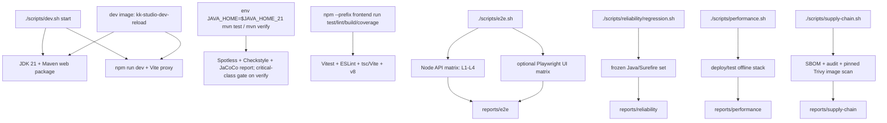

# 开发与测试

本文记录当前仓库的开发入口、质量检查、E2E/可靠性/性能/供应链门禁、报告
目录和故障处理。Frontend 的模块边界见
[Frontend 模块](../modules/frontend.md)；Fat JAR、Compose 拓扑和运行时
边界见 [部署](deployment.md)。

## 1. Goals

- 用 JDK 21、锁定的 Node 依赖和仓库脚本复现本地开发与验证。
- 让免费检查、真实 Provider、Daemon、Canvas Storage、性能和供应链检查
  各自有明确的开关、成本和报告。
- 对缺少工具、依赖、在线数据、健康检查、测试证据或扫描报告的情况
  fail closed。
- 让每一次有状态运行都能通过 `reports/` 下的 timestamped report 追溯。

## 2. Non-goals

- 默认开发和默认 E2E 不调用真实 Provider，不产生模型费用或付费 Tool
  side effect。
- 性能 baseline 是同一台机器上的固定门禁，不是容量规划、生产 SLA 或用户
  数量承诺。
- `mvn verify` 默认不启动在线供应链 profile；SBOM、audit 和 image scan
  只由显式命令启动。

## 3. 入口图



## 4. 唯一开发入口和 JDK 21

### 4.1 本地开发服务

本地同时启动 backend 和 Vite frontend 使用仓库根目录的
[scripts/dev.sh](../../scripts/dev.sh)：

```bash
./scripts/dev.sh start
./scripts/dev.sh status
./scripts/dev.sh logs all
./scripts/dev.sh stop
```

当前默认值：

| 项 | 默认值 |
| --- | --- |
| backend | `http://127.0.0.1:18080`，`SPRING_PROFILES_ACTIVE=e2e` |
| frontend | `http://127.0.0.1:5173` |
| 工作目录 | `runtime/dev`，可由 `DEV_WORK_DIR` 覆盖 |
| backend log/JAR | `runtime/dev/backend.log`、`web/target/kk-studio-web-1.0.0.jar` |

`start` 会停止受管进程、检查端口、用 Maven clean package backend、按需执行
`npm install`，等待 backend API ready 后启动 Vite。`e2e` profile 启用时，
宿主同步器按需读取 Google、OpenAI Responses、MiniMax Anthropic 和 DeepSeek
四组完整 credential pair，经 backend API 写入 E2E database 中对应的 seed
Provider row；Backend、Vite 和 Daemon 长驻进程都会显式移除这些宿主变量，这些
变量仅向短生命周期同步器显式透传。credential 不进入 seed SQL/resource，密钥与
endpoint 不打印。

Vite 配置默认只监听 `127.0.0.1`，并使用 Vite 自带的 Host allowlist。需要容器
或远程开发时由调用方通过命令行 `--host` 显式覆盖，仓库默认不向全部网卡开放。

### 4.2 JDK 21 命令

仓库根 POM 的 `maven.compiler.release` 是 `21`。所有 Maven 命令显式使用
`JAVA_HOME_21`：

```bash
test -x "$JAVA_HOME_21/bin/java"
"$JAVA_HOME_21/bin/java" -version
env JAVA_HOME="$JAVA_HOME_21" mvn -B -ntp validate
env JAVA_HOME="$JAVA_HOME_21" mvn -B -ntp test
```

`scripts/dev.sh`、`scripts/e2e/lib.sh`、`scripts/reliability/regression.sh`
和 `scripts/supply-chain.sh` 都检查 `JAVA_HOME_21`（或作为 fallback 的
`JAVA_HOME`）是否指向 JDK 21。Docker builder 和 runtime 也使用 Temurin
JDK/JRE 21。

### 4.3 Java build lifecycle

根 POM 当前 reactor 为 `share`、`schema`、`canvas`、`harness`、`platform`、
`web`。发布构建：

```bash
env JAVA_HOME="$JAVA_HOME_21" mvn -B -ntp -Pdistribution -pl web -am clean package
"$JAVA_HOME_21/bin/java" -jar web/target/kk-studio-web-1.0.0.jar
```

`distribution` profile 在 `prepare-package` 中安装 Node `v24.14.0` 和
npm `11.9.0`，对 `frontend/` 执行 `npm ci` 和 `npm run build`，再把 Vite
产物复制到 `web/target/classes/static`；Spring Boot Maven Plugin 在
`package` 阶段把它们打入 `BOOT-INF/classes/static`。普通 `mvn test` 或
普通 `mvn package` 不激活该 profile。

### 4.4 NAS main/dev 自迭代运行规范

NAS 自迭代使用共享数据面的两个 App 节点。它们属于同一个 KK Studio 集群，
不是数据隔离的测试环境：

| 节点 | Git branch | Human 入口 | 运行形态 |
| --- | --- | --- | --- |
| `vps-kk-studio` | `main` | `https://studio.kk1.fun` | 不含源码和构建工具的不可变 Fat JAR 镜像；唯一 Harness worker 与 Flyway owner |
| `vps-kk-studio-dev` | `dev` | `https://studio-dev.kk1.fun` | 持久源码工作区、JDK/Maven、Node/Vite、关闭 Harness worker/Flyway 的 Backend 和 Environment Daemon |

两个节点连接同一 PostgreSQL database 和 S3 bucket。异步 Harness 执行只有 Main
一个执行者：Dev Backend 的进程内 dispatcher 关闭后不再 claim Work，但仍提供
Vite、HTTP API、查询投影和应用事件 WebSocket，因此 Dev 入口是同步 preview 面：

| 面 | 节点 |
| --- | --- |
| 异步 Work（Thread/Model/Tool processor、含 Dev Daemon Environment 的 Tool） | 仅 `vps-kk-studio` 的 worker |
| Dev 入口的 Vite/HMR、HTTP API、查询投影、应用事件 WebSocket | `vps-kk-studio-dev` 的 Backend |

Human 在 Dev 入口提交命令时，同步 HTTP 处理使用 Dev 代码，随后产生的异步 Harness
Work 使用 Main 代码，因此同一用户流程仍可能跨两个版本边界。Harness 持久状态、
Entry JSON、Provider/Tool wire、Storage 生命周期和数据库约束必须保持向后兼容。
Dev 中修改 processor/runtime 等异步执行路径不会在普通 Dev preview 中生效，这些
改动必须由自动化测试（定向单测/E2E）或显式隔离环境验证后才能验收；普通 Dev
preview 只覆盖前端、同步 API 和查询行为。

运行职责固定为：

```text
vps-kk-studio
  main immutable image
  workers enabled
  Flyway enabled
  bundled frontend + API

vps-kk-studio-dev
  dev persistent workspace
  workers disabled
  Flyway disabled
  Vite + API/query preview + Environment Daemon
```

Main 是共享 schema 的唯一 Flyway owner。Dev 使用与 Main 相同的生产 profile，
但必须设置 `SPRING_FLYWAY_ENABLED=false` 与
`KK_STUDIO_HARNESS_RUNTIME_WORKERS_ENABLED=false`，且不得加载 dev/e2e seed。
Dev 分支中的未合并 schema 不得应用到共享 database；涉及 schema 的变更必须先由
Human 完成 Review 和 Main 集成。仓库只保留完整声明当前结构的
`V1__schema.sql`，不维护增量 migration 链；修改 V1 必须先停止两个 App 节点，并在
Human 明确批准的维护窗口内由 Main 重建空库。普通自迭代不得重置共享 database 或
删除共享 bucket。

Dev 容器内的 Environment Daemon 经内部 Docker 网络连接 Main App，既不连接
Dev Backend，也不经过公共 Gateway。Main 的 HTTP(S) origin 统一保存在外部 Compose
项目的 `.env`，`docker-compose.yml` 只做同名变量映射；entrypoint 再派生出 Daemon
的 WebSocket 地址：

```dotenv
# .env
KK_STUDIO_CONTROL_PLANE_BASE_URL=http://vps-kk-studio:8080
```

```yaml
# docker-compose.yml
environment:
  KK_STUDIO_CONTROL_PLANE_BASE_URL: ${KK_STUDIO_CONTROL_PLANE_BASE_URL}
```

origin 必须是使用 DNS/IPv4 host 与可选端口的裸 HTTP(S) origin，可选一个结尾 `/`；
`https` 派生 `wss`。entrypoint 拒绝空值、`ws`/`wss` 等其它 scheme、路径、query、
fragment、userinfo、空白和非法端口，错误信息不回显输入值。非法值在准备 workspace
和启动服务之前就让容器启动失败。上面的 `.env` 值最终派生为
`ws://vps-kk-studio:8080/api/harness/environment-daemon/v1`。

两个容器内的服务端访问不得绕到公网域名：

```text
PostgreSQL -> vps-postgres:5432
S3 API     -> http://vps-s3:9000
OpenCLI    -> 同一 vps 网络的 Hub 容器 HTTP origin
Daemon     -> http://vps-kk-studio:8080（entrypoint 派生出 ws://vps-kk-studio:8080/api/harness/environment-daemon/v1）
```

OpenCLI 的 `baseUrl` 由 System Settings 配置；上传、执行轮询和产物下载都从该
origin 构造，并拒绝跨源产物 URL，因此 NAS 配置必须填写 Hub 的容器内地址而不是
公网域名。S3 的 public endpoint 只用于返回给浏览器的预签名直传/直下 URL，服务端 `PUT`/`GET`/
`HEAD`/`COPY`/`DELETE` 始终使用 `vps-s3:9000`。

它的 `environment-root` 指向持久源码工作区。Frontend 由 Vite 监听容器网络，
`/api` 和应用事件 WebSocket 代理到同容器 Backend。Gateway 将
`studio-dev.kk1.fun` 的 HTTP、应用事件 WebSocket 和 Vite HMR WebSocket 统一
转发到 Vite；Main 域名直接转发到 Fat JAR App。

Agent 在 Dev 节点遵循以下闭环：

1. 只修改、提交和 push `dev`；不得直接修改或 push `main`。
2. 开始前检查 Git 状态并保留 Human 的并行修改，不覆盖未提交工作。
3. 对实际变更执行定向测试；Java 关键路径同时遵守覆盖率门禁。
4. 普通 Frontend 变更由 Vite HMR 生效；Java 变更先增量构建，再重启 Dev
   Backend/Vite 受管进程，不重启 Main 或 Daemon。只有 Dev 容器、镜像入口或
   Daemon 代码变化才需要重建并重启 Dev 容器，那会重建 Main 与 Daemon 的连接。
5. 重启前提交源码和必要的 durable 进度。`kk-studio-dev-reload` 通过 Main
   控制面执行时不会中断当前 Environment Tool，等待 Dev Backend/Vite readiness
   后可正常返回；Dev 浏览器的 HTTP、应用事件与 HMR 连接会在 reload 期间短暂断开并
   自动重连。只有重启 Dev 容器或 Daemon 本身时，当前 Tool outcome 才可能不确定，
   这类操作必须作为当前 Agent 回合最后一个 Tool 操作。
6. 验证 Dev health、Frontend、应用事件 WebSocket 和 Daemon `READY` 后继续下一轮。
7. 功能达到可验收状态后 push `dev` 并向 Human 报告变更、验证和已知风险；只有
   Human 决定何时合入 `main` 和更新稳定节点。涉及 processor/runtime 等异步执行
   路径的改动必须附带自动化测试证据或显式隔离环境验证，因为 Dev preview 由 Main
   的 worker 执行。

当前仓库脚本可用于 Backend/Vite 重启。Dev 节点镜像由
[deploy/dev/Dockerfile](../../deploy/dev/Dockerfile) 提供：Maven 3.9.11/JDK 21 与
Node 24.14.0/npm 11.9.0 工具链、`git`/`curl`/`jq`/`lsof`/`python3`/`ffmpeg`/`ffprobe`、
`openssh-client` 与 GitHub CLI `2.100.0`、来自同一源码构建的 Environment Daemon
runtime。容器以 uid/gid `10001` 运行，`/workspace` 是持久 Git 工作区根（checkout
位于 `/workspace/kk-studio`），`/home/kkdaemon/.m2`、`/home/kkdaemon/.npm` 与
`/home/kkdaemon/.config/gh` 是持久 cache/凭据目录；这四处 volume 必须由外部 Compose
以 `10001:10001` 属主挂载。

首次启动只在工作区不存在或为空时初始化它：

- 配置 `KK_STUDIO_GIT_REMOTE_URL`（SSH remote，例如
  `git@github.com:<owner>/kk-studio.git`）时执行 Git clone，分支由
  `KK_STUDIO_GIT_BRANCH` 指定（默认 `dev`）；
- 只有显式设置 `KK_STUDIO_DEV_ALLOW_SOURCE_SEED=true` 时才回退到镜像内源码快照；
- 已存在的 checkout、未提交工作和未 push 的提交永不被覆盖；checkout 不在
  `KK_STUDIO_GIT_BRANCH` 时启动失败。

容器每次启动都会先校验持久 checkout 的修订，只有无损快进是可接受的自动变更：

- 工作区没有 `.git`（源码快照工作区）时不参与同步，按原样启动；
- 有 `.git` 但没有 `origin` remote 时启动失败：修订无法验证；
- `git fetch origin $KK_STUDIO_GIT_BRANCH` 失败时启动失败，节点不会用未验证的修订
  继续启动；错误信息不回显远端 URL 或凭据，提示检查挂载的 SSH 凭据与网络后重启；
- fetch 成功后比较 `HEAD` 与 `origin/$KK_STUDIO_GIT_BRANCH`：相同则按当前修订启动；
  `HEAD` 是该分支的祖先（落后）时执行 `merge --ff-only`，只有快进被 git 接受才继续，
  git 拒绝快进（本地修改或未跟踪文件会被传入修订覆盖）时启动失败；
  `HEAD` 包含该分支（存在未 push 的本地提交）时按原样启动并提示 ahead，节点继续服务
  本地提交；两侧互不包含（历史分叉）时启动失败，历史必须显式处理；
- 是否会被覆盖完全由 git 判定，entrypoint 不预判工作区状态。未跟踪文件不阻止快进，
  不冲突的本地修改会随快进保留。entrypoint 只执行 `merge --ff-only`，永不 reset、
  rebase、stash 或 checkout，也不会强推。

同步完成后按修订 stamp 决定是否重建构建产物，避免同一次源码状态被重复编译：

- 后端 JAR 的修订记录在 `web/target/.kk-studio-revision`（与 JAR 同目录，`mvn clean`
  会同时移除二者）。启动时 `DEV_SKIP_PACKAGE=true` 只在 JAR 存在且 stamp 记录的修订
  等于当前 `HEAD` 时跳过 Maven；stamp 缺失、不匹配或 JAR 不存在都触发一次
  `mvn -pl web -am -DskipTests clean package`，成功后写入当前修订。非 Git 工作区没有
  修订可比，JAR 存在即复用；`deploy/dev/reload.sh` 的增量 package 成功后写入同一
  stamp，因此 reload 过的修订在容器重启时不会重复全量构建。
- 前端依赖的锁摘要记录在 `frontend` 下的 `node_modules/.kk-studio-package-lock.sha`，
  内容是 `frontend/package-lock.json` 的内容哈希。`node_modules` 不存在时执行
  `npm install`；存在但摘要与当前 lock 不一致时执行 `npm ci` 并更新 stamp；一致时
  直接复用。`DEV_SKIP_NPM_INSTALL=true` 仍完全跳过这一步，`package-lock.json` 缺失时
  也沿用“已安装即复用”的行为。

SSH 凭据只在运行时注入：外部 Compose 把宿主 SSH key 以只读 volume 挂到
`KK_STUDIO_SSH_CREDENTIALS_DIR`（默认 `/run/kk-studio/ssh`），entrypoint 在 clone
之前把其中的 `id_*` 私钥/公钥复制到 `/home/kkdaemon/.ssh`（私钥 `0600`、`.pub`
`0644`）。私钥要使用 `id_ed25519`/`id_rsa` 等 ssh 默认身份名，因为源目录的 `config`、
`known_hosts` 和 `authorized_keys` 都不复制；挂载目录缺失、不可读或没有私钥时容器直接
启动失败。github.com 的官方 host key 固化在镜像内的 `/etc/ssh/ssh_known_hosts`，因此
clone/fetch/push 不需要交互确认；镜像级 SSH 配置同时启用 `BatchMode`、
`IdentitiesOnly` 与严格 host key 校验，认证异常直接失败而不会挂起等待输入。

`gh` 使用默认配置目录 `/home/kkdaemon/.config/gh`（由外部 Compose 持久化）。首次在
NAS 上执行一次交互式登录即可：SSH key 只让 Git 能读写仓库，`gh` 的 API 权限继承登录
账号自身的权限和下面请求的 scope：

```bash
docker exec -it vps-kk-studio-dev gh auth login --hostname github.com --git-protocol ssh --web --skip-ssh-key --scopes repo,workflow,read:org,gist
docker exec vps-kk-studio-dev gh auth status
```

token 只保存在容器的 `/home/kkdaemon/.config/gh/hosts.yml`，不进入本仓库、镜像、
环境变量或日志。

entrypoint 用仓库既有 lifecycle 启动 Backend/Vite（prod profile、Flyway disabled、
Harness worker disabled、Backend `127.0.0.1:8080`、Vite `0.0.0.0:5173` 并代理
Backend），随后以前台 Environment Daemon 作为容器主进程，按
`KK_STUDIO_CONTROL_PLANE_BASE_URL` 派生的 WebSocket 地址连接 Main，
environment-root 为 `/workspace`。entrypoint 对 `prod` profile、
`SPRING_FLYWAY_ENABLED=false`、`KK_STUDIO_HARNESS_RUNTIME_WORKERS_ENABLED=false`、
control-plane origin 和 Daemon registration token fail closed，避免错误配置触碰
共享 schema 或复制出第二个 Harness dispatcher。healthcheck 同时探测 Backend
`/actuator/health` 与 Vite `/threads`。

空 cache volume 的首次启动要完整构建 Backend 并安装前端依赖（实测 ~29 分钟，其中
Maven 25:44、npm 2:00），因此 entrypoint 把 readiness 预算
`DEV_READY_TIMEOUT_SECONDS` 提升到 `600s`：超过预算仍不就绪时直接以非零状态退出，
而不是留下一个半启动的容器。同一镜像 healthcheck 的 start period 为 `2700s`，覆盖冷
cache 首次启动；已有 workspace 的重启按修订 stamp 决定重建量：修订未变化时
（`DEV_SKIP_PACKAGE=true`、JAR 与前端依赖都对应当前修订）只重启受管进程，实测 41 秒
内恢复健康；修订前进时先无损快进工作区，再重建后端产物。

普通迭代只运行稳定命令 `kk-studio-dev-reload`（增量 package 后重启受管进程，
Daemon 与容器保持存活，Main 与 Daemon 的连接不中断，并等待两端 readiness）。
容器内等价手写路径为：

```bash
cd /workspace/kk-studio
env JAVA_HOME="$JAVA_HOME" mvn -B -ntp -pl web -am -DskipTests package

env SPRING_PROFILES_ACTIVE=prod \
  SPRING_FLYWAY_ENABLED=false \
  KK_STUDIO_HARNESS_RUNTIME_WORKERS_ENABLED=false \
  BACKEND_HOST=127.0.0.1 \
  BACKEND_PORT=8080 \
  FRONTEND_HOST=0.0.0.0 \
  FRONTEND_PORT=5173 \
  DEV_SKIP_PACKAGE=true \
  ./scripts/dev.sh restart
```

`kk-studio-dev-reload` 与 entrypoint 使用同一组默认值和 fail-closed 校验：即使
ad hoc 覆盖 `KK_STUDIO_HARNESS_RUNTIME_WORKERS_ENABLED`，reload 也会拒绝执行，
不会让 Dev Backend 变成第二个 Harness worker。

Dev 容器运行环境变量（外部 Compose 只引用名称，真实值由 NAS 私密环境文件注入）：

| 变量 | 职责 |
| --- | --- |
| `KK_STUDIO_WORKSPACE_ROOT` | Daemon environment-root 与持久工作区根，默认 `/workspace` |
| `KK_STUDIO_REPOSITORY_DIR` | 源码 checkout，默认 `/workspace/kk-studio` |
| `KK_STUDIO_GIT_REMOTE_URL` / `KK_STUDIO_GIT_BRANCH` | 首次 clone 的 SSH remote 与每次启动 fetch/快进的目标分支，默认不带 remote / `dev` |
| `KK_STUDIO_SSH_CREDENTIALS_DIR` | 只读 SSH key 挂载目录，默认 `/run/kk-studio/ssh`；`id_*` 在启动时复制到 `/home/kkdaemon/.ssh` |
| `KK_STUDIO_DEV_ALLOW_SOURCE_SEED` | 是否允许用镜像内源码快照初始化非 Git 工作区，默认 `false` |
| `KK_STUDIO_SOURCE_SEED` | 源码快照路径，默认 `/opt/kk-studio/source` |
| `SPRING_PROFILES_ACTIVE` / `SPRING_FLYWAY_ENABLED` | Backend profile 与 Flyway 开关，默认 `prod` / `false`（Main 独占 migration） |
| `KK_STUDIO_HARNESS_RUNTIME_WORKERS_ENABLED` | Dev Backend 的 Harness worker 开关，必须为 `false`（Main 独占 Harness 异步执行） |
| `KK_STUDIO_CONTROL_PLANE_BASE_URL` | Main App 的 HTTP(S) origin，必填；值保存在外部 Compose 项目的 `.env` 并同名映射，entrypoint 派生出 Daemon 的 ws(s) gateway 地址 |
| `BACKEND_HOST` / `BACKEND_PORT` / `FRONTEND_HOST` / `FRONTEND_PORT` / `DEV_WORK_DIR` | `scripts/dev.sh` 的监听地址、端口与 log/PID 目录 |
| `DEV_READY_TIMEOUT_SECONDS` | Backend/Vite readiness 预算，容器内默认 `600`（仓库默认 `90`） |
| `KK_STUDIO_DAEMON_REGISTRATION_TOKEN` / `KK_STUDIO_DAEMON_NOTE` | Daemon 注册 token 与 Environment note |

`main` 与 `dev` 分支的镜像发布由 `.github/workflows/docker-publish.yml` 承担：先跑
Java/frontend/docs/security 门禁，再以 Buildx 构建 linux/amd64 并推送
`<namespace>/kk-studio:main` 或 `<namespace>/kk-studio-dev:dev` 以及对应的 commit SHA tag。
同一分支有更新提交时取消旧 workflow，防止较旧构建后完成并覆盖可变分支 tag。

Agent 必须停止自动重启并交给 Human 决策的变更包括：

- 未合入 Main 的 Flyway migration 或破坏性 schema 变更；
- 删除或重命名持久 JSON 字段、数据库枚举值或 wire 字段；
- 改变 Work/Invocation 状态机、claim/lease/fencing 语义；
- 改变 S3 object key、Blob 引用计数或 cleanup 生命周期；
- 需要重建 Dev 镜像、重启 Daemon，或使 Main 与 Dev 中任一节点无法读取共享 durable
  状态的数据变更。

源码仓库、Dockerfile 和 image layer 只保存环境变量名与无敏感默认值。数据库、
S3、Provider、Gateway 和 Daemon registration credential 由 NAS 私密环境文件在运行时
注入，Git key 由只读挂载提供，`gh` OAuth credential 位于持久配置 volume；Dev 镜像中的
源码快照、构建日志、测试报告和 Git 历史不得包含真实值。database 与 bucket 仍使用应用
专用权限；Git/`gh` 则有意继承所挂载 SSH key 与登录账号可访问的仓库和 API 权限。

完整协作顺序是：

```text
Agent modifies dev
  -> targeted tests
  -> commit and push dev
  -> reload vps-kk-studio-dev
  -> Human observes and validates studio-dev
  -> Human merges dev into main
  -> main workflow builds immutable image
  -> Human updates vps-kk-studio
  -> Dev synchronizes the new main baseline
```

## 5. Java 质量检查

### 5.1 Spotless

`validate` 阶段执行 Spotless Maven Plugin `2.43.0`：

- Google Java Format `1.18.0`，`GOOGLE` style；
- `removeUnusedImports`；
- import order：`#,,fun.fengwk.kkstudio,javax,java`。

Spotless 只在发生 Java 变更的 module 执行：

```bash
env JAVA_HOME="$JAVA_HOME_21" mvn -B -ntp spotless:check
env JAVA_HOME="$JAVA_HOME_21" mvn -B -ntp -pl <changed-module> spotless:apply
```

`spotless:apply` 会修改源码；`<changed-module>` 使用实际发生 Java 变更的
Maven module，避免对无关模块执行全仓格式化。

### 5.2 Checkstyle

`validate` 阶段执行 Checkstyle `3.3.0`，读取根目录
[checkstyle.xml](../../checkstyle.xml)，包含 test source，`failsOnError=true`。
当前规则集中在两类：

- code body 使用 import，禁止全限定类名；
- `if`、`else`、`for`、`while`、`do` 等控制流必须有 braces。

直接检查：

```bash
env JAVA_HOME="$JAVA_HOME_21" mvn -B -ntp checkstyle:check
```

### 5.3 JaCoCo

kk-studio 根 POM 直接配置并提供 JaCoCo `0.8.11`：

- `prepare-agent` 注入 test JVM；
- `test` phase 执行 `report`；
- 各模块报告位于对应 `target/site/jacoco/`。

`harness/common`、`harness/tool`、`harness/environment`、`harness/environment-server`、
`harness/runtime`、`harness/contributor-api`、`harness/builtin`、`platform` 与 `web` 在自己的 module
POM 中增加了绑定到 `verify` 的 JaCoCo `check` execution，只按 `CLASS` include
检查当前关键类，要求 `LINE COVEREDRATIO >= 0.90`：

```bash
env JAVA_HOME="$JAVA_HOME_21" mvn -B -ntp -pl web -am verify
find . -path '*/target/site/jacoco/index.html' -print
```

当前自动门禁的目标类是：

- `fun.fengwk.kkstudio.harness.contributor.api.HarnessCatalog`
- `fun.fengwk.kkstudio.harness.builtin.BuiltinHarnessContributor`
- `fun.fengwk.kkstudio.harness.builtin.goal.GoalStateCodec`
- `fun.fengwk.kkstudio.harness.runtime.ManualCompactionControl`
- `fun.fengwk.kkstudio.harness.runtime.invocation.model.ModelInvocation`
- `fun.fengwk.kkstudio.harness.runtime.processor.ModelExecution`
- `fun.fengwk.kkstudio.harness.runtime.compaction.AutomaticCompactionPlanner`
- `fun.fengwk.kkstudio.harness.runtime.compaction.CompactionHistory`
- `fun.fengwk.kkstudio.harness.runtime.thread.ResolvedRequestValidator`
- `fun.fengwk.kkstudio.harness.runtime.thread.ThreadContextProbe`
- `fun.fengwk.kkstudio.harness.runtime.invocation.model.ModelRequestSpec`
- `fun.fengwk.kkstudio.harness.runtime.invocation.tool.ToolBinding`
- `fun.fengwk.kkstudio.harness.runtime.invocation.codec.ToolBindingJsonCodec`
- `fun.fengwk.kkstudio.harness.tool.codec.AgentToolDefinitionJsonCodec`
- `fun.fengwk.kkstudio.harness.environment.server.EnvironmentDaemonServer`
- `fun.fengwk.kkstudio.platform.environment.gateway.EnvironmentDaemonGateway`
- `fun.fengwk.kkstudio.platform.harness.tool.gateway.ToolExecutionGateway`
- `fun.fengwk.kkstudio.web.runtime.HarnessRuntimeResponseMapper`

因此普通 `mvn test` 仍只生成报告；对上述关键类低于 90% line coverage
的构建会在 `mvn verify` 的 `jacoco:check` 阶段失败。branch coverage 作为
参考指标，具体数字以对应 module 的 `target/site/jacoco/jacoco.csv` 为准。

## 6. Frontend lint、test、coverage、build

Frontend 的完整脚本绑定见 [package.json](../../frontend/package.json)：

```bash
npm --prefix frontend ci
npm --prefix frontend run test
npm --prefix frontend run lint
npm --prefix frontend run build
npm --prefix frontend run coverage
```

| 命令 | 当前行为 | 结果 |
| --- | --- | --- |
| `npm --prefix frontend run test` | `vitest run` | jsdom 单元/组件测试 |
| `npm --prefix frontend run lint` | `eslint .` | TypeScript/React hooks/分层 import 规则 |
| `npm --prefix frontend run build` | `tsc -b && vite build` | strict type-check + Vite production bundle |
| `npm --prefix frontend run coverage` | `vitest run --coverage` | v8 text/html 报告和阈值门禁 |

[vite.config.ts](../../frontend/vite.config.ts) 的 coverage include 是
`src/**/*.{ts,tsx}`，排除 `src/main.tsx` 和 `src/test-setup.ts`；lines、
functions、branches、statements 均要求 `80%`。报告目录是
`frontend/coverage/`。

Frontend 测试的分层：

1. App/Platform：路由 redirect、AppShell immersive route、导航 Escape、
   ExtensionHost registry、Workbench slot。
2. AI：Catalog form/codec、Chat layout/target、Composer、batch/replay、
   Thread timeline、snapshot/realtime、stop/approval/task、message/tool
   renderer。
3. Canvas：Library/Editor/Stage、projection、command queue、entity patch、
   version event、transform、upload、node、Function run、viewport。
4. ComfyUI：workflow validation、CRUD、run lifecycle、modal。
5. Settings：schema renderer、draft、permission、browser preference、server
   CAS。
6. Shared：API service/codec、application event protocol/manager、i18n、
   conflict、shortcuts、blocking overlay、Markdown/media。

浏览器测试环境由
[frontend/src/test-setup.ts](../../frontend/src/test-setup.ts) 固定：
每个测试清空 localStorage、设置 `zh-CN`，并为 ResizeObserver、DOMMatrix、
SVG geometry、Canvas 2D、dialog、scrollIntoView 和 React Flow layout 提供
确定性 stub。

## 7. Compose、static 和 documentation checks

### 7.1 Compose 配置检查

```bash
docker compose -f deploy/local/compose.yaml config --quiet
docker compose -f deploy/test/compose.yaml config --quiet
docker compose -f deploy/test/compose.yaml --profile app config --quiet
docker compose -f deploy/reliability/compose.yaml config --quiet
./deploy/distributed/run.sh verify
```

`deploy/distributed/run.sh verify` 静态校验双节点 Compose config 和网络不变量，
不启动任何容器。

`deploy/test/run.sh` 将配置检查、镜像构建、依赖 health、非 root runtime、
PostgreSQL、MinIO bucket 和 HTTP mock smoke 组合为一个可清理的入口：

```bash
./deploy/test/run.sh
./deploy/test/run.sh --with-app
```

`--with-app` 还覆盖全局 Blob、Canvas Resource、signed GET、fake Function、
容器内 OpenCLI fake Hub 和离线 Chat；成功或失败都会执行
`down --volumes --remove-orphans`。

### 7.2 Static、敏感数据和文档检查

Fat JAR 的 static 资源检查由 `-Pdistribution` 的
`frontend-maven-plugin + maven-resources-plugin + spring-boot-maven-plugin`
完成；应用在 `/actuator/health` 通过后再检查浏览器入口。

文档质量入口：

```bash
node scripts/e2e/run-matrix.mjs --docs
node scripts/docs/check.mjs
python3 scripts/security/check-sensitive-data.py
git diff --check
```

`--docs` 必须以 `Total registered: 97` 结束；精确 case inventory、标题和
requires 以 `--list/--docs` 输出为准。`check.mjs` 负责固定文档布局、Markdown
链接、H1、源码路径和旧词守卫。敏感数据门禁扫描当前 tracked 文件和非 ignored
未跟踪文件，覆盖高置信密钥、Webhook、个人绝对路径和已知私有环境标识；命中时
只输出规则与 `path:line`。该入口不扫描 Git 历史，历史审计是公开策略中的独立步骤。

## 8. E2E：API levels、flags 和当前 97-case matrix

### 8.1 入口和 flags

标准入口：

```bash
./scripts/e2e.sh
./scripts/e2e.sh --rebuild
./scripts/e2e.sh --real
./scripts/e2e.sh --with-tools
./scripts/e2e.sh --real --with-branch
./scripts/e2e.sh --with-canvas-storage
./scripts/e2e.sh --with-canvas-function
./scripts/e2e.sh --real --with-tools --with-canvas-storage
./scripts/e2e.sh --distributed
./scripts/e2e.sh --ui
./scripts/e2e.sh --only CASE_ID
./scripts/e2e.sh --level L1
./scripts/e2e.sh --list
./scripts/e2e.sh --docs
```

`./scripts/e2e.sh` 的全部 flags：

| Flag | 当前语义 |
| --- | --- |
| `--rebuild` | Java 21 clean package，重启 backend/frontend；带 tools 时也处理 Daemon |
| `--real` | 启用四模型真实 Provider cases，要求四组完整的 `TEST_*_BASE_URL` / `TEST_*_API_KEY` |
| `--with-tools` | 启用 Daemon/Tool cases |
| `--with-branch` | 启用 branch case，并自动打开 `--real` |
| `--with-canvas-storage` | 启用 Canvas Resource/Blob contract，backend 必须有 S3 配置 |
| `--with-canvas-function` | 启用 fake Canvas Function；隐含 storage、rebuild 和 `KK_STUDIO_CANVAS_FUNCTION_FAKE_ENABLED=true` |
| `--distributed` | 启停 `deploy/distributed` 双节点 mock topology，并在可适用免费矩阵上启用分布式 cases；不启动宿主单实例栈，不读取宿主真实 Provider 凭据 |
| `--ui` | 在 API matrix 后执行 Playwright UI matrix |
| `--only CASE_ID` | 只运行指定 case，可重复 |
| `--level L1\|L2\|L3\|L4\|L5` | 过滤 API level，可重复；UI 不属于此过滤器 |
| `--list` | 只列出 API matrix |
| `--docs` | 只打印 API case 的标题、requires 和 contract 文档 |
| `-h/--help` | 打印入口帮助 |

直接运行 Node runner 时还可使用：

```text
--base-url URL
--base-url-b URL
--frontend-url URL
--daemon-env NAME
--real
--with-tools
--with-branch
--with-canvas-storage
--with-canvas-function
--distributed
--only CASE_ID
--level L1|L2|L3|L4|L5
--list
--docs
--report-root DIR
--no-report
```

当前默认 backend URL 是 `http://127.0.0.1:18081`，frontend URL 是
`http://127.0.0.1:5173`；`scripts/e2e.sh` 会把两者传给 runner。

只有 `--real` 会读取并同步四组宿主 Provider credential。免费、`--rebuild`、
`--with-tools`、`--ui` 与 `--with-canvas-function` 都忽略这些宿主凭据。Backend、
Vite 与 Daemon 启动时按前缀动态剥离全部 `TEST_*` 环境变量；只有短生命周期的
credential synchronizer 会显式接收四组允许的变量，新增宿主测试变量也不会静默进入
长期运行进程。
未带 `--real` 时，API 与 UI runner 会在首个 case 前检查 catalog 中每个 Provider
都必须明确为 `configured=false` 且无 `baseUrl`；复用曾执行真实 E2E 的 database
会 fail-closed，需改用全新未配置的 E2E database。

`--rebuild` 默认允许 Maven 在线解析依赖；只有显式设置
`E2E_MAVEN_OFFLINE=true` 时 backend 与 Daemon/runtime classpath
两条 Maven 路径才增加 `-o`。`E2E_WORK_DIR` 默认是 `runtime/e2e`，
Daemon environment root 默认是其下的 `environment`，可由
`DAEMON_ENV_ROOT` 覆盖，并由入口导出给 Node matrix。

### 8.2 Level 统计和开关

| Level | 注册数 | 默认/开关 | 当前覆盖 |
| --- | ---: | --- | --- |
| L1 | 77 | 默认执行 73（单实例带 `--frontend-url`；distributed 模式不含 frontend proxy 与两个 host-mock case，为 70）；storage/function/attachment case 需显式开关 | 免费 API contract、CRUD、Project/Issue、Environment Skill 来源/操作、MCP JSON/Local 发现操作、Session/Thread（含默认名派生与重命名持久化）、command batch、CAS、idempotency、i18n、全局 invalidation、model attempt、Canvas API |
| L2 | 10 | `--real` 默认选择四模型文本缓存、多推理级别烟雾与 stop；task delegation 还需 `--with-tools` | 四模型文本与 Prompt Cache、四模型多推理级别烟雾、真实 task delegation、stop partial/replay/continue |
| L3 | 1 | `--real --with-branch` | 同 Session `NEW_THREAD` 分支 Thread |
| L4 | 6 | `--with-tools`；四模型 Tool 需再加 `--real`，Resource 外部化需再加 `--with-canvas-storage` | Environment READY 与 capability 投影、四模型 terminal replay、approval 后 Resource 外部化 |
| L5 | 3 | `--distributed` | 双节点分布式 mock topology：跨节点 Environment CRUD、租约投影与 DB loss recovery |
| UI/L5 | 注册 39，默认 36 | `--ui`；额外 `--with-tools`、`--real` | Playwright 页面、Composer、debug、settings 和 runtime UI |

L1 的默认关闭 categories 是 storage upload、attachment 和 fake Function；
它们分别需要 `--with-canvas-storage` 或 `--with-canvas-function`。

因此 `--with-canvas-function` 会同时打开 storage、fake Function、rebuild，
让 L1 的 77 个 case 都可选择；它不等于真实 Provider。

### 8.3 API categories 与精确 inventory

L1 的 categories 是 seed/catalog、Thread command、CRUD、Project/Issue、
Environment Skill 来源/操作、MCP JSON/Local 发现操作、i18n、
settings/events、model attempt 和 Canvas API；storage、attachment 和 fake Function 由显式开关
启用。L2 的 categories 是真实文本 turn、多推理级别烟雾、task delegation 和 stop/partial/replay；
L3 是同一 Session 的 `NEW_THREAD` 分支；L4 是 Environment READY 与原子 capability
投影、approval 和 Resource externalization；L5 是双节点分布式 mock topology，
覆盖跨节点 Environment CRUD、租约投影一致性与 DB loss fail-closed/recovery。对应 gates 分别是 `--real`、`--real --with-branch`、
`--with-tools`、`--distributed`，需要真实 Tool history 时再加 `--with-canvas-storage`。

精确的 API case ID、标题和 `requires` 只由
`node scripts/e2e/run-matrix.mjs --list` 与 `--docs` 提供。

### 8.4 UI matrix：注册 39，默认 36

UI 由 `scripts/e2e/ui-smoke.mjs`、`scripts/e2e/ui/composer-matrix.mjs` 和
`scripts/e2e/ui/workspace-contracts.mjs` 注册；它不是 97 个 API case 的一部分。
UI categories 是页面/runtime、Composer/debug 和 Workspace contract；`--ui` 是
总 gate，默认执行 36 项无成本/无 daemon 用例；`--with-tools` 增加 2 项
（Agent-owned Environment Chat 创建与 ToolCard approval/layout），`--real` 增加 1 项真实
Provider 覆盖。精确 UI inventory 以这些脚本中的注册表为准。

UI 单独入口的当前帮助格式：

```bash
node scripts/e2e/ui-smoke.mjs \
  --base-url http://127.0.0.1:5173 \
  --backend-url http://127.0.0.1:18081 \
  --report-dir reports/e2e/ui-standalone
```

执行该入口前必须完成 `npm --prefix frontend ci`，因为 Playwright 从
`frontend/package.json` 加载。

### 8.5 Real credentials 和付费边界

- 真实 E2E 要求以下四组完整 pair，任一组缺失或只提供一半都会在同步前失败：
  - `TEST_GOOGLE_BASE_URL` + `TEST_GOOGLE_API_KEY`
  - `TEST_OPENAI_BASE_URL` + `TEST_OPENAI_API_KEY`
  - `TEST_ANTHROPIC_BASE_URL` + `TEST_ANTHROPIC_API_KEY`
  - `TEST_DEEPSEEK_BASE_URL` + `TEST_DEEPSEEK_API_KEY`
- 对应模型固定为 `google/gemini-3.8-flash`、`openai/gpt-5.6-luna`、
  `minimax-anthropic/MiniMax-M3` 和 `deepseek/deepseek-v4-flash`，不会静默换
  provider/model。OpenAI 与 DeepSeek Base URL 去除尾部斜杠并补齐 `/v1`；
  Gemini 与 MiniMax Anthropic 只去除尾部斜杠，保留调用方提供的协议 base path。
- 只有显式 `--real` 才调用宿主同步器，并通过 backend API 将四组 pair 写入
  E2E database 中对应的 seed Provider row；credential 不进入 seed SQL/resource。
  Compose、Dockerfile、image layer、backend/Daemon environment 和报告不接收这些值。
  不要把 `docker inspect`、完整 endpoint 或数据库 credential 内容放进报告。
- 未带 `--real` 时，runner 对整个 Provider catalog 执行 fail-closed 检查，任何
  configured row 或非空 `baseUrl` 都会阻止免费矩阵运行。
- reliability 的八用例 Agent 矩阵继续使用独立的
  `TEST_MINIMAX_BASE_URL` + `TEST_MINIMAX_API_KEY`，只更新其隔离 database 中的
  `minimax` Responses Provider，不扩大四模型 E2E 的输入集合。
- 默认 L1、性能 baseline、`deploy/test/run.sh` 和
  `scripts/reliability/regression.sh` 不调用真实 Provider。
- 真实 Seedance prepare-only 只能显式执行：

  ```bash
  RUN_REAL_SEEDANCE_PREPARE_SMOKE=1 \
  SEEDANCE_WORKSPACE_ID=... \
  OPENCLI_HUB_BASE_URL=https://your-opencli-hub.example \
    ./scripts/seedance-prepare-smoke.sh --confirm-prepare-only
  ```

  当前固定 `seedance2.0fast`、`duration=4`、`submit=0`、`retry=0`，不创建
  Canvas FunctionRun、不生成或导入视频。Hub URL 没有默认值，必须是无
  userinfo、path、query 和 fragment 的 HTTP(S) origin。

### 8.6 Distributed 双节点 mock topology

`--distributed` 是正交 capability，不重定义 L1-L5：它启停
[deploy/distributed](../../deploy/distributed/compose.yaml) 的双 App/双 Daemon
栈，并且与 `--real`、`--with-tools`、`--ui`、`--with-canvas-*` 互斥。拓扑完全
免费：App 镜像复用 `deploy/local/Dockerfile`，Daemon 镜像复用
`deploy/reliability/daemon.Dockerfile`，HTTP mock 直接挂载 `deploy/test/mock`，
不复制任何实现。

```bash
./deploy/distributed/run.sh up [--skip-build]
./deploy/distributed/run.sh status
./deploy/distributed/run.sh logs [services...]
./deploy/distributed/run.sh disconnect-db-a   # 幂等 DB 故障注入
./deploy/distributed/run.sh reconnect-db-a
./deploy/distributed/run.sh verify            # 静态拓扑校验，不启动容器
./deploy/distributed/run.sh down [--volumes]
```

网络不变量由 `scripts/e2e/tests/distributed_topology.py` 静态验证：

- PostgreSQL、MinIO、HTTP mock 同时加入 `node-a-db` 与 `node-b-db` 两个隔离
  internal 网络；
- App-A 只加入 `node-a-db` + `daemon-a` + `app-ingress-a`；App-B 只加入
  `node-b-db` + `daemon-b` + `app-ingress-b`；两个 Daemon 各只加入自己的
  daemon 网络；
- 没有任何网络同时包含 App-A 和 App-B，两节点没有 DNS/IP 路径；
- 宿主只发布两个 App 端口（默认 `18082`/`18083`）和 PostgreSQL/MinIO/mock
  测试端口（默认 `15433`/`19001`/`18090`），全部绑定 `127.0.0.1`。

两个 App 共享同一 PostgreSQL database（`kk_studio_distributed`）与 MinIO
bucket（`kk-studio-distributed`），节点身份用固定可覆盖的变量表达：
`DISTRIBUTED_ENV_A_NAME`/`DISTRIBUTED_ENV_B_NAME`（environment name）、
`DISTRIBUTED_DAEMON_A_REGISTRATION_TOKEN`/`DISTRIBUTED_DAEMON_B_REGISTRATION_TOKEN`（各自的 registration token，与预置 seed Card 对应）。全部是 disposable test value；本栈不读取宿主
MiniMax 凭据，真实模型仍需独立 `--real`。

`--distributed` 运行通过 `deploy/distributed/run.sh` 启停栈，并在报告中记录
topology、两个 backend URL 和双 app/daemon 容器日志（进 `logs/`，写盘前经
凭据脱敏）。在适用免费矩阵的基础上，3 个 `level: 'L5'`、`requires: ['distributed']`
的分布式 case 随显式开关启用；双 URL 上下文由 runner 的 `ctx.baseUrls`、
`ctx.callNode('a'|'b', ...)` 与受限白名单控制 helper `ctx.runDistributedCommand`
提供，普通单实例运行的 case 与报告格式不变。

三条 L5 分布式契约：
1. **跨节点 CRUD 共享状态（`distributed.shared_state`）**：在 node A POST 随机临时 Environment Card，
   在 node B GET 与更新，回 node A 验证更新内容与 CAS version，再跨节点删除并在两节点验证 404；
   使用 `finally` 尽力清理，禁止将一次性 registrationToken 写入 artifact/log。
2. **租约投影一致性（`distributed.lease_routing`）**：固定 Environment 分别连接 app-a 与 app-b，
   两个 App 都必须把两者投影为 READY；同一 Environment 的身份、状态、`rootPath` 与 capability
   列表在两个节点逐项一致，且 coding capability 为 `fs.read@1`。
3. **DB loss fail-closed 与 recovery（`distributed.db_loss_fail_closed`）**：断开 node A 的 DB
   网络后，其 DB 权威 Environment 读取必须失败而不能回退本机 WebSocket；`finally` 无条件恢复网络，
   随后有界等待两个节点重新投影相同的 READY route。

## 9. Reliability：确定性回归和 Agent matrix

### 9.1 `regression.sh`

```bash
./scripts/reliability/regression.sh --help
./scripts/reliability/regression.sh --iterations 1
./scripts/reliability/regression.sh --iterations 3 --report-root reports/reliability
```

全部 flags：

| Flag | 当前语义 |
| --- | --- |
| `--iterations N` | `1..100`，默认 `3`；首轮失败即停止后续轮次 |
| `--report-root DIR` | 默认 `reports/reliability`，写 timestamped regression report |
| `--help/-h` | 只打印帮助，不运行 Maven |

该 runner 没有 level flag，也不启动 backend/frontend/daemon/Compose；从仓库
根目录以 JDK 21 执行：

```text
mvn --batch-mode -pl web,canvas/infra,harness/infra,platform -am
  -Dtest=<regression.sh 中 TARGET_FQCNS 的逗号连接值>
  -Dsurefire.failIfNoSpecifiedTests=false
  -Dstyle.color=never test
```

`regression.sh` 内的 `TARGET_MODULES` 与 `TARGET_FQCNS` 是可靠性回归的唯一
精确 inventory。它覆盖 Web event/transport、Canvas Function Work/dispatcher、
Harness Work/notification 和 Platform Storage cleanup；每轮要求目标模块的
Surefire XML 证明 `tests > 0`、`failures = 0`、`errors = 0` 且不是全 skipped。
缺类、invalid XML、Maven `[ERROR]`、`Surefire is going to kill` 或非零退出都
失败。

### 9.2 Reliability stack 和真实 Agent matrix

隔离栈命令：

```bash
./scripts/reliability/stack.sh up
PI_ANCHOR=/path/to/pi \
PI_BASE_ANCHOR=/path/to/pi-base \
  ./scripts/reliability/stack.sh snapshot
./scripts/reliability/stack.sh inspect
./scripts/reliability/stack.sh tool-smoke
./scripts/reliability/stack.sh status
./scripts/reliability/stack.sh logs app daemon
./scripts/reliability/stack.sh down
./scripts/reliability/stack.sh down --volumes
```

`stack.sh` 的命令集是 `up`、`snapshot`、`case-reset <id> <pi|pi-base>`、
`case-deps <id>`、`inspect`、`tool-smoke`、`logs [services...]`、`status`、
`down [--volumes]`、`help`。`up` 等待 app health 和 Environment `READY`；
`inspect` 检查 non-root、单一 named volume、工具可用性、`rg`/`fd` 不存在、
workspace 可写和 credential/config 隔离。`snapshot` 不猜测宿主目录；
`PI_ANCHOR` 和 `PI_BASE_ANCHOR` 都必须显式指向 clean Git worktree。

真实 Agent runner 只在显式执行时调用 Provider：

```bash
node scripts/reliability/run-agent-matrix.mjs --help
node scripts/reliability/run-agent-matrix.mjs --list
node scripts/reliability/run-agent-matrix.mjs \
  --only CASE_ID
node scripts/reliability/reassess-agent-run.mjs <runId>
```

其 flags：

| Flag | 默认/语义 |
| --- | --- |
| `--list` | 列出冻结八 case，不做 HTTP/model call |
| `--only CASE_ID` | 可重复选择 case |
| `--base-url URL` | `http://127.0.0.1:18091` |
| `--daemon-env NAME` | `docker-reliability` |
| `--report-root DIR` | `reports/reliability` |
| `--max-cost-usd N` | `0..5`，硬上限默认 USD 5 |
| `--help/-h` | 打印帮助 |

矩阵为 `2 models × 2 anchors × 2 task classes`：

| Model | Variant | `pi` | `pi-base` |
| --- | --- | --- | --- |
| `minimax/MiniMax-M2.7` | `high` | `m27-pi-investigate`、`m27-pi-repair` | `m27-pi-base-investigate`、`m27-pi-base-repair` |
| `minimax/MiniMax-M3` | `high` | `m3-pi-investigate`、`m3-pi-repair` | `m3-pi-base-investigate`、`m3-pi-base-repair` |

Runner 固定 Agent config 为
`toolIds=[base.read,base.write,base.edit,base.bash,base.grep,base.find]`、
`skills=[]`、`subagents=[]`，Provider 请求中的 model-visible tool names
对应为 `read,write,edit,bash,grep,find`。每个 case 独立 Chat/Thread；
真实执行前要求 provider、model、variant、Tool catalog 和 Environment READY
全部匹配。未知 cost、超过 USD 5、测试/工作区/凭证隔离证据缺失都 fail closed。

## 10. Performance baseline

入口和 flags：

```bash
./scripts/performance.sh --help
./scripts/performance.sh
./scripts/performance.sh --duration-seconds 5
./scripts/performance.sh --skip-build
./scripts/performance.sh --report-root /tmp/kk-studio-performance
```

| Flag | 当前值 |
| --- | --- |
| `--duration-seconds N` | `1..120`，默认 `10`；每场景先 warmup `1s` |
| `--report-root DIR` | 默认 `reports/performance`；拒绝 root、仓库根、非目录和 symlink |
| `--skip-build` | 复用 `kk-studio-app:performance-baseline` |
| `--help/-h` | 打印帮助 |

Runner 使用 Node built-in `fetch`，每个请求 timeout `5000ms`，固定使用
`deploy/test` 离线 mock，不读真实凭证、不启动 Daemon，端口固定为 app
`18088`、PostgreSQL `15432`、MinIO `19000`、HTTP mock `18089`。

| 场景 | 并发 | 请求 | error | p95 | throughput RPS | 最少样本 |
| --- | ---: | --- | ---: | ---: | ---: | ---: |
| `health` | 16 | `GET /actuator/health`，验证 `status=UP` | 0 | `<=250ms` | `>=50` | 20 |
| `catalog` | 16 | `GET /api/ai/catalog/models?pageNumber=1&pageSize=20`，验证严格 catalog fields | 0 | `<=500ms` | `>=25` | 20 |
| `canvas` | 4 | `POST /api/canvases` 后 `DELETE /api/canvases/{id}`，验证 UUID/decimal version | 0 | `<=1500ms` | `>=5` | 20 |

百分位是 nearest-rank，按 `ceil(p / 100 × n)` 取值；错误请求仍计入延迟，
少于 20 个测量样本 fail closed。Canvas worker 按 run title prefix 清理
已知和扫描出的资源；正常、失败、超时、INT、TERM 都执行
`down --volumes --remove-orphans`。

## 11. Supply-chain gate

### 11.1 入口

```bash
./scripts/supply-chain.sh sbom
./scripts/supply-chain.sh audit
./scripts/supply-chain.sh image
./scripts/supply-chain.sh all
./scripts/supply-chain.sh test
./scripts/supply-chain.sh help
```

| 子命令 | 内容 |
| --- | --- |
| `sbom` | backend/frontend CycloneDX JSON SBOM，校验文件非空可解析 |
| `audit` | frontend `npm audit` + Maven OWASP Dependency-Check |
| `image` | 构建 App/Daemon，运行功能 smoke，再用 pinned Trivy 扫描 |
| `all` | `sbom`、`audit`、`image` 的合取结果 |
| `test` | `scripts/supply-chain/tests/supply-chain.test.mjs`，不联网 |
| `help` | 帮助 |

根 POM 的 `supply-chain` profile 是显式 profile：

- CycloneDX Maven Plugin `2.9.3`，`makeAggregateBom`、JSON schema `1.6`、
  不含 test scope；
- OWASP Dependency-Check `13.0.0`，HTML/JSON/SARIF、`failBuildOnCVSS=0`、
  `failOnError=true`、关闭 OSS Index、启用 NVD update；
- 两个插件由 root aggregate 执行，报告目录由
  `supply-chain.report.directory` 指定。

### 11.2 NVD、Trivy、cache 和零漏洞策略

- `NVD_API_KEY` 可选。有 key 时脚本在临时目录创建 mode `600` 的
  `settings.xml`，使用 server id `kk-studio-supply-chain-nvd`；Maven 进程
  不继承 key，key 不进入 command line、POM、summary 或 log。无 key 时使用
  NVD 官方 JSON 2.0 feed：
  `https://nvd.nist.gov/feeds/json/cve/2.0/nvdcve-2.0-{0}.json.gz`。
- 在线源、Maven Central、npm registry、NVD 或 report generation 不可用时
  保持 `FAIL`；缺失数据不能生成 `PASS`。供应链策略实行零 suppression 与零漏洞
  （zero suppressions / zero vulnerabilities），Dependency-Check 与 npm audit
  均不配置任何白名单或 suppression 文件，全量依赖漏洞数必须为零。
- Trivy image 固定为：
  `aquasec/trivy@sha256:62b1e65e8869bc4b4c6aa4fa2b21595256c7c2f6018a9d9ad61caf87187c1969`
  （脚本当前 immutable digest），并校验版本 `0.74.0`。数据库仓库为
  `public.ecr.aws/aquasecurity/trivy-db:2` 和
  `public.ecr.aws/aquasecurity/trivy-java-db:1`。
- cache volume 默认 `kk-studio-trivy-cache`，可用
  `SUPPLY_CHAIN_TRIVY_CACHE_VOLUME` 覆盖。已有完整 cache 时设置
  `TRIVY_SKIP_DB_UPDATE=true`，脚本同时使用
  `--skip-db-update --skip-java-db-update --offline-scan`；cache 不完整仍
  失败。
- 扫描过滤 `HIGH,CRITICAL` 并忽略无修复版本；Trivy 非零、JSON 缺失/不可
  解析、二次解析发现任一 HIGH/CRITICAL、镜像 smoke 失败或默认 user 为
  root，都保持 `FAIL`。`all` 以所有步骤的合取结果发布。

### 11.3 Image smoke

`image` 构建：

| 镜像 | Dockerfile | 默认 tag | 覆盖变量 |
| --- | --- | --- | --- |
| App | `deploy/local/Dockerfile` | `kk-studio-app:supply-chain` | `SUPPLY_CHAIN_APP_IMAGE` |
| Daemon | `deploy/reliability/daemon.Dockerfile` | `kk-studio-daemon:supply-chain` | `SUPPLY_CHAIN_DAEMON_IMAGE` |

App smoke 在默认 non-root user 下检查 Java、`ffmpeg`、`ffprobe`、`curl`；
Daemon 额外检查 Node `v22.19.x`、npm `11.19.0`、bash、git，并以
`npm init --yes` + `npm install --package-lock-only --ignore-scripts --no-audit
--no-fund lodash@4.17.21` 验证 npm 工具链。

## 12. Report 目录

所有 report 目录都被 Git ignore；每个入口仍保留 timestamped run 和 latest
副本：

```text
reports/e2e/
  <runId>/{report.md,summary.json,cases/,artifacts/,logs/}
  latest/{report.md,summary.json,cases/,artifacts/,logs/}
  LATEST_RUN.txt

reports/performance/
  <timestamp>-<id>/{report.md,summary.json}
  latest/{report.md,summary.json}
  LATEST_RUN.txt

reports/reliability/
  <timestamp>-regression-<pid>/{report.md,summary.json,iterations/}
  latest-regression/
  <runId>/{report.md,summary.json,cases/,artifacts/}
  latest-agent/
  LATEST_AGENT_RUN.txt

reports/supply-chain/
  <timestamp>-<pid>/{backend-sbom,frontend-sbom,frontend-audit,backend-audit,image,logs/,summary.md,summary.json}
  latest/
  LATEST_RUN.txt
```

`latest-agent` 是目录副本，不是 symlink。Supply-chain 报告包含 backend/
frontend SBOM、npm audit、Dependency-Check HTML/JSON/SARIF、App/Daemon
Trivy JSON、image id/digest、smoke log 和 summary。

## 13. 清理和故障排查

### 13.1 常用清理

```bash
./scripts/dev.sh stop
docker compose -f deploy/local/compose.yaml down
docker compose -f deploy/local/compose.yaml down -v
docker compose -f deploy/test/compose.yaml --profile app down --volumes --remove-orphans
./deploy/distributed/run.sh down --volumes
./scripts/reliability/stack.sh down
./scripts/reliability/stack.sh down --volumes
```

`down` 保留 local PostgreSQL named volume；`down -v` 清空它。`deploy/test`
和 performance 入口每次运行都清理 PostgreSQL/MinIO/test network；reliability
不带 `--volumes` 保留 PostgreSQL 和 daemon workspace；`deploy/distributed`
栈由 `--distributed` 入口在退出时自动清理，手动 `down --volumes` 删除全部
容器、网络和 PostgreSQL/MinIO/daemon workspace volumes。

### 13.2 故障定位表

| 现象 | 先执行 | 边界 |
| --- | --- | --- |
| JDK/compile/checkstyle 失败 | `"$JAVA_HOME_21/bin/java" -version`；`env JAVA_HOME="$JAVA_HOME_21" mvn -B -ntp validate` | 必须是 JDK 21；先修复 Spotless/Checkstyle |
| Frontend 找不到依赖或 Playwright | `npm --prefix frontend ci`；`npm --prefix frontend run test` | 依赖由 `package-lock.json` 固定 |
| dev 端口占用 | `./scripts/dev.sh status`；`ss -ltnp \| grep -E ':18080\|:5173'` | 使用 `DEV_KILL_PORTS=true` 或换端口 |
| local app unhealthy | `docker compose -f deploy/local/compose.yaml ps`；`docker compose -f deploy/local/compose.yaml logs app postgres` | 先确认 PostgreSQL health，再检查 `/actuator/health` |
| Canvas test 健康失败 | `docker compose -f deploy/test/compose.yaml ps`；`docker compose -f deploy/test/compose.yaml logs` | 检查 MinIO bucket、mock `/health`、ffmpeg/ffprobe |
| E2E 只跑少数 case | `node scripts/e2e/run-matrix.mjs --list`；确认 `--real`、`--with-tools`、`--with-canvas-storage`、`--with-canvas-function` | 通过 `requires` 和 level 过滤是当前行为 |
| 真实 Provider 不可用 | 检查 8 个 `TEST_{GOOGLE,OPENAI,MINIMAX_ANTHROPIC,DEEPSEEK}_{BASE_URL,API_KEY}` 变量是否均非空 | 必须显式 `--real`，只用宿主同步器；不要放入 Compose/image/container |
| reliability 环境未 READY | `./scripts/reliability/stack.sh status`；`./scripts/reliability/stack.sh logs app daemon` | `inspect` 先检查 non-root、volume 和 gateway |
| 敏感数据门禁失败 | `python3 scripts/security/check-sensitive-data.py` | 只按输出的规则和位置排查；不要把完整敏感值复制到日志或 Issue |
| performance/supply-chain 失败 | 阅读 `reports/performance/latest/report.md` 或 `reports/supply-chain/latest/summary.md` | 阈值、在线源、JSON 完整性和 zero-vulnerability 都不能放宽 |
| loopback proxy 下 build 失败 | 检查 `HTTP_PROXY`/`HTTPS_PROXY`、`CANVAS_TEST_BUILD_NETWORK`；再执行 `./deploy/test/run.sh --with-app` | loopback proxy 使用 host build network，代理值不进入镜像 |

## 14. 测试层级总览

```text
L0  validate / Spotless / Checkstyle / type-check / sensitive-data gate
    ├─ Java unit + integration + JaCoCo report（critical-class gate on verify）
    └─ Frontend Vitest + ESLint + Vite build + v8 coverage
L1  free API contract matrix (default 73 / registered 77)
L2  real Provider text-cache/task/stop (10 registered; explicit --real)
L3  real same-session branch (explicit --with-branch)
L4  Environment/Tool/approval (6 registered; explicit --with-tools; Resource case adds S3)
L5  distributed two-node mock topology (3 registered; explicit --distributed)
UI  Playwright UI (default 36 / registered 39; --ui + gates)
R   reliability regression + optional eight-case Agent matrix
P   offline performance three-scenario threshold
S   SBOM/audit/image supply-chain gate
```

---

上级：[系统设计](../system-design.md)。相关文档：[部署与运行](deployment.md)、
[Frontend](../modules/frontend.md)、[Web](../modules/web.md)。
