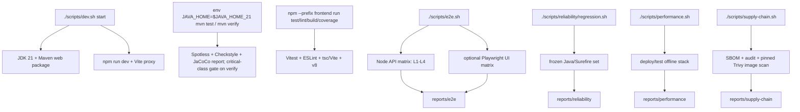

# 开发与测试

本文记录当前仓库的开发入口、质量检查、E2E/可靠性/性能/供应链门禁、报告
目录和故障处理。Frontend 的模块边界见
[Frontend 模块](../modules/frontend.md)；Fat JAR、Compose 拓扑和运行时
边界见 [部署](deployment.md)。

## 1. Goals

- 用 JDK 21、锁定的 Node 依赖和仓库脚本复现本地开发与验证。
- 让免费检查、真实 Provider、Daemon、Canvas Storage、性能和供应链检查
  各自有明确的开关、成本和报告。
- 对缺少工具、依赖、在线数据、健康检查、测试证据或扫描报告的情况
  fail closed。
- 让每一次有状态运行都能通过 `reports/` 下的 timestamped report 追溯。

## 2. Non-goals

- 默认开发和默认 E2E 不调用真实 Provider，不产生模型费用或付费 Tool
  side effect。
- 性能 baseline 是同一台机器上的固定门禁，不是容量规划、生产 SLA 或用户
  数量承诺。
- `mvn verify` 默认不启动在线供应链 profile；SBOM、audit 和 image scan
  只由显式命令启动。

## 3. 入口图



## 4. 唯一开发入口和 JDK 21

### 4.1 本地开发服务

本地同时启动 backend 和 Vite frontend 使用仓库根目录的
[scripts/dev.sh](../../scripts/dev.sh)：

```bash
./scripts/dev.sh start
./scripts/dev.sh status
./scripts/dev.sh logs all
./scripts/dev.sh stop
```

当前默认值：

| 项 | 默认值 |
| --- | --- |
| backend | `http://127.0.0.1:18080`，`SPRING_PROFILES_ACTIVE=e2e` |
| frontend | `http://127.0.0.1:5173` |
| 工作目录 | `runtime/dev`，可由 `DEV_WORK_DIR` 覆盖 |
| backend log/JAR | `runtime/dev/backend.log`、`web/target/kk-studio-web-1.0.0.jar` |

`start` 会停止受管进程、检查端口、用 Maven clean package backend、按需执行
`npm install`，等待 backend API ready 后启动 Vite。`e2e` profile 启用时，
宿主同步器将 `TEST_MINIMAX_BASE_URL` 与 `TEST_MINIMAX_API_KEY` 的完整 pair
经 backend API 写入 E2E database 中由 seed 创建的 Provider row；credential
不进入 seed SQL/resource，密钥不打印。

Vite 配置默认只监听 `127.0.0.1`，并使用 Vite 自带的 Host allowlist。需要容器
或远程开发时由调用方通过命令行 `--host` 显式覆盖，仓库默认不向全部网卡开放。

### 4.2 JDK 21 命令

仓库根 POM 的 `maven.compiler.release` 是 `21`。所有 Maven 命令显式使用
`JAVA_HOME_21`：

```bash
test -x "$JAVA_HOME_21/bin/java"
"$JAVA_HOME_21/bin/java" -version
env JAVA_HOME="$JAVA_HOME_21" mvn -B -ntp validate
env JAVA_HOME="$JAVA_HOME_21" mvn -B -ntp test
```

`scripts/dev.sh`、`scripts/e2e/lib.sh`、`scripts/reliability/regression.sh`
和 `scripts/supply-chain.sh` 都检查 `JAVA_HOME_21`（或作为 fallback 的
`JAVA_HOME`）是否指向 JDK 21。Docker builder 和 runtime 也使用 Temurin
JDK/JRE 21。

### 4.3 Java build lifecycle

根 POM 当前 reactor 为 `share`、`schema`、`canvas`、`harness`、`platform`、
`web`。发布构建：

```bash
env JAVA_HOME="$JAVA_HOME_21" mvn -B -ntp -Pdistribution -pl web -am clean package
"$JAVA_HOME_21/bin/java" -jar web/target/kk-studio-web-1.0.0.jar
```

`distribution` profile 在 `prepare-package` 中安装 Node `v24.14.0` 和
npm `11.9.0`，对 `frontend/` 执行 `npm ci` 和 `npm run build`，再把 Vite
产物复制到 `web/target/classes/static`；Spring Boot Maven Plugin 在
`package` 阶段把它们打入 `BOOT-INF/classes/static`。普通 `mvn test` 或
普通 `mvn package` 不激活该 profile。

## 5. Java 质量检查

### 5.1 Spotless

`validate` 阶段执行 Spotless Maven Plugin `2.43.0`：

- Google Java Format `1.18.0`，`GOOGLE` style；
- `removeUnusedImports`；
- import order：`#,,fun.fengwk.kkstudio,javax,java`。

Spotless 只在发生 Java 变更的 module 执行：

```bash
env JAVA_HOME="$JAVA_HOME_21" mvn -B -ntp spotless:check
env JAVA_HOME="$JAVA_HOME_21" mvn -B -ntp -pl <changed-module> spotless:apply
```

`spotless:apply` 会修改源码；`<changed-module>` 使用实际发生 Java 变更的
Maven module，避免对无关模块执行全仓格式化。

### 5.2 Checkstyle

`validate` 阶段执行 Checkstyle `3.3.0`，读取根目录
[checkstyle.xml](../../checkstyle.xml)，包含 test source，`failsOnError=true`。
当前规则集中在两类：

- code body 使用 import，禁止全限定类名；
- `if`、`else`、`for`、`while`、`do` 等控制流必须有 braces。

直接检查：

```bash
env JAVA_HOME="$JAVA_HOME_21" mvn -B -ntp checkstyle:check
```

### 5.3 JaCoCo

effective Maven POM 当前由 parent 提供 JaCoCo `0.8.11`：

- `prepare-agent` 注入 test JVM；
- `test` phase 执行 `report`；
- 各模块报告位于对应 `target/site/jacoco/`。

`harness/tool`、`harness/runtime`、`platform` 与 `web` 在自己的 module POM 中增加了
绑定到 `verify` 的 JaCoCo `check` execution，只按 `CLASS` include 检查本次关键类，
要求 `LINE COVEREDRATIO >= 0.90`：

```bash
env JAVA_HOME="$JAVA_HOME_21" mvn -B -ntp -pl web -am verify
find . -path '*/target/site/jacoco/index.html' -print
```

当前自动门禁的目标类是：

- `fun.fengwk.kkstudio.harness.contributor.api.HarnessCatalog`
- `fun.fengwk.kkstudio.harness.builtin.BuiltinHarnessContributor`
- `fun.fengwk.kkstudio.harness.builtin.goal.GoalStateCodec`
- `fun.fengwk.kkstudio.harness.runtime.processor.ResolvedRequestValidator`
- `fun.fengwk.kkstudio.harness.runtime.invocation.model.ModelRequestSpec`
- `fun.fengwk.kkstudio.harness.runtime.invocation.tool.ToolBinding`
- `fun.fengwk.kkstudio.harness.runtime.invocation.codec.ToolBindingJsonCodec`
- `fun.fengwk.kkstudio.harness.tool.codec.AgentToolDefinitionJsonCodec`
- `fun.fengwk.kkstudio.platform.environment.gateway.EnvironmentDaemonGateway`
- `fun.fengwk.kkstudio.platform.harness.tool.gateway.PlatformToolGateway`
- `fun.fengwk.kkstudio.web.runtime.HarnessRuntimeResponseMapper`

因此普通 `mvn test` 仍只生成报告；对上述关键类低于 90% line coverage
的构建会在 `mvn verify` 的 `jacoco:check` 阶段失败。branch coverage 作为
参考指标，具体数字以对应 module 的 `target/site/jacoco/jacoco.csv` 为准。

## 6. Frontend lint、test、coverage、build

Frontend 的完整脚本绑定见 [package.json](../../frontend/package.json)：

```bash
npm --prefix frontend ci
npm --prefix frontend run test
npm --prefix frontend run lint
npm --prefix frontend run build
npm --prefix frontend run coverage
```

| 命令 | 当前行为 | 结果 |
| --- | --- | --- |
| `npm --prefix frontend run test` | `vitest run` | jsdom 单元/组件测试 |
| `npm --prefix frontend run lint` | `eslint .` | TypeScript/React hooks/分层 import 规则 |
| `npm --prefix frontend run build` | `tsc -b && vite build` | strict type-check + Vite production bundle |
| `npm --prefix frontend run coverage` | `vitest run --coverage` | v8 text/html 报告和阈值门禁 |

[vite.config.ts](../../frontend/vite.config.ts) 的 coverage include 是
`src/**/*.{ts,tsx}`，排除 `src/main.tsx` 和 `src/test-setup.ts`；lines、
functions、branches、statements 均要求 `80%`。报告目录是
`frontend/coverage/`。

Frontend 测试的分层：

1. App/Platform：路由 redirect、AppShell immersive route、导航 Escape、
   ExtensionHost registry、Workbench slot。
2. AI：Catalog form/codec、Chat layout/target、Composer、batch/replay、
   Thread timeline、snapshot/realtime、stop/approval/task、message/tool
   renderer。
3. Canvas：Library/Editor/Stage、projection、command queue、entity patch、
   version event、transform、upload、node、Function run、viewport。
4. ComfyUI：workflow validation、CRUD、run lifecycle、modal。
5. Settings：schema renderer、draft、permission、browser preference、server
   CAS。
6. Shared：API service/codec、application event protocol/manager、i18n、
   conflict、shortcuts、blocking overlay、Markdown/media。

浏览器测试环境由
[frontend/src/test-setup.ts](../../frontend/src/test-setup.ts) 固定：
每个测试清空 localStorage、设置 `zh-CN`，并为 ResizeObserver、DOMMatrix、
SVG geometry、Canvas 2D、dialog、scrollIntoView 和 React Flow layout 提供
确定性 stub。

## 7. Compose、static 和 documentation checks

### 7.1 Compose 配置检查

```bash
docker compose -f deploy/local/compose.yaml config --quiet
docker compose -f deploy/test/compose.yaml config --quiet
docker compose -f deploy/test/compose.yaml --profile app config --quiet
docker compose -f deploy/reliability/compose.yaml config --quiet
```

`deploy/test/run.sh` 将配置检查、镜像构建、依赖 health、非 root runtime、
PostgreSQL、MinIO bucket 和 HTTP mock smoke 组合为一个可清理的入口：

```bash
./deploy/test/run.sh
./deploy/test/run.sh --with-app
```

`--with-app` 还覆盖全局 Blob、Canvas Resource、signed GET、fake Function、
容器内 OpenCLI fake Hub 和离线 Chat；成功或失败都会执行
`down --volumes --remove-orphans`。

### 7.2 Static、敏感数据和文档检查

Fat JAR 的 static 资源检查由 `-Pdistribution` 的
`frontend-maven-plugin + maven-resources-plugin + spring-boot-maven-plugin`
完成；应用在 `/actuator/health` 通过后再检查浏览器入口。

文档质量入口：

```bash
node scripts/e2e/run-matrix.mjs --docs
node scripts/docs/check.mjs
python3 scripts/security/check-sensitive-data.py
git diff --check
```

`--docs` 必须以 `Total registered: 75` 结束；精确 case inventory、标题和
requires 以 `--list/--docs` 输出为准。`check.mjs` 负责固定文档布局、Markdown
链接、H1、源码路径和旧词守卫。敏感数据门禁扫描当前 tracked 文件和非 ignored
未跟踪文件，覆盖高置信密钥、Webhook、个人绝对路径和已知私有环境标识；命中时
只输出规则与 `path:line`。该入口不扫描 Git 历史，历史审计是公开策略中的独立步骤。

## 8. E2E：API levels、flags 和当前 75-case matrix

### 8.1 入口和 flags

标准入口：

```bash
./scripts/e2e.sh
./scripts/e2e.sh --rebuild
./scripts/e2e.sh --real
./scripts/e2e.sh --with-tools
./scripts/e2e.sh --real --with-branch
./scripts/e2e.sh --with-canvas-storage
./scripts/e2e.sh --with-canvas-function
./scripts/e2e.sh --real --with-tools --with-canvas-storage
./scripts/e2e.sh --ui
./scripts/e2e.sh --only CASE_ID
./scripts/e2e.sh --level L1
./scripts/e2e.sh --list
./scripts/e2e.sh --docs
```

`./scripts/e2e.sh` 的全部 flags：

| Flag | 当前语义 |
| --- | --- |
| `--rebuild` | Java 21 clean package，重启 backend/frontend；带 tools 时也处理 Daemon |
| `--real` | 启用真实 Provider cases，要求 `TEST_MINIMAX_BASE_URL` 和 `TEST_MINIMAX_API_KEY` |
| `--with-tools` | 启用 Daemon/Tool cases |
| `--with-branch` | 启用 branch case，并自动打开 `--real` |
| `--with-canvas-storage` | 启用 Canvas Resource/Blob contract，backend 必须有 S3 配置 |
| `--with-canvas-function` | 启用 fake Canvas Function；隐含 storage、rebuild 和 `KK_STUDIO_CANVAS_FUNCTION_FAKE_ENABLED=true` |
| `--ui` | 在 API matrix 后执行 Playwright UI matrix |
| `--only CASE_ID` | 只运行指定 case，可重复 |
| `--level L1\|L2\|L3\|L4` | 过滤 API level，可重复；UI 不属于此过滤器 |
| `--list` | 只列出 API matrix |
| `--docs` | 只打印 API case 的标题、requires 和 contract 文档 |
| `-h/--help` | 打印入口帮助 |

直接运行 Node runner 时还可使用：

```text
--base-url URL
--frontend-url URL
--daemon-env NAME
--real
--with-tools
--with-branch
--with-canvas-storage
--with-canvas-function
--only CASE_ID
--level L1|L2|L3|L4
--list
--docs
--report-root DIR
--no-report
```

当前默认 backend URL 是 `http://127.0.0.1:18081`，frontend URL 是
`http://127.0.0.1:5173`；`scripts/e2e.sh` 会把两者传给 runner。

`--rebuild` 默认允许 Maven 在线解析依赖；只有显式设置
`E2E_MAVEN_OFFLINE=true` 时 backend、Daemon 和 Daemon runtime classpath
三条 Maven 路径才增加 `-o`。`E2E_WORK_DIR` 默认是 `runtime/e2e`，
Daemon environment root 默认是其下的 `environment`，可由
`DAEMON_ENV_ROOT` 覆盖，并由入口导出给 Node matrix。

### 8.2 Level 统计和开关

| Level | 注册数 | 默认/开关 | 当前覆盖 |
| --- | ---: | --- | --- |
| L1 | 68 | 默认执行 64；storage/function/attachment case 需显式开关 | 免费 API contract、CRUD、Session/Thread、command batch、CAS、idempotency、i18n、model attempt、Canvas API |
| L2 | 3 | `--real` | 真实文本 turn、真实 task delegation、stop partial/replay/continue |
| L3 | 1 | `--real --with-branch` | 同 Session `ENTRY` 分支 Thread |
| L4 | 3 | `--with-tools`；真实 Tool turn 还需 `--real --with-tools --with-canvas-storage` | Environment READY 与 12 个原子 capability 投影、directories、approval 后 Resource 外部化 |
| UI/L5 | 注册 39，默认 37 | `--ui`；额外 `--with-tools`、`--real` | Playwright 页面、Composer、debug、settings 和 runtime UI |

L1 的默认关闭 categories 是 storage upload、attachment 和 fake Function；
它们分别需要 `--with-canvas-storage` 或 `--with-canvas-function`。

因此 `--with-canvas-function` 会同时打开 storage、fake Function、rebuild，
让 L1 的 68 个 case 都可选择；它不等于真实 Provider。

### 8.3 API categories 与精确 inventory

L1 的 categories 是 seed/catalog、Thread command、CRUD、i18n、settings/events、
model attempt 和 Canvas API；storage、attachment 和 fake Function 由显式开关
启用。L2 的 categories 是真实文本 turn、task delegation 和 stop/partial/replay；
L3 是同一 Session 的 `ENTRY` 分支；L4 是 Environment READY 与原子 capability
投影、directory、approval 和 Resource externalization。对应 gates 分别是 `--real`、
`--real --with-branch`、`--with-tools`，需要真实 Tool history 时再加
`--with-canvas-storage`。

精确的 API case ID、标题和 `requires` 只由
`node scripts/e2e/run-matrix.mjs --list` 与 `--docs` 提供。

### 8.4 UI matrix：注册 39，默认 37

UI 由 `scripts/e2e/ui-smoke.mjs`、`scripts/e2e/ui/composer-matrix.mjs` 和
`scripts/e2e/ui/workspace-contracts.mjs` 注册；它不是 75 个 API case 的一部分。
UI categories 是页面/runtime、Composer/debug 和 Workspace contract；`--ui` 是
总 gate，`--with-tools` 与 `--real` 分别增加 Environment 和真实 Provider
覆盖。精确 UI inventory 以这些脚本中的注册表为准。

UI 单独入口的当前帮助格式：

```bash
node scripts/e2e/ui-smoke.mjs \
  --base-url http://127.0.0.1:5173 \
  --backend-url http://127.0.0.1:18081 \
  --report-dir reports/e2e/ui-standalone
```

执行该入口前必须完成 `npm --prefix frontend ci`，因为 Playwright 从
`frontend/package.json` 加载。

### 8.5 Real credentials 和付费边界

- 真实 E2E 只接受完整 pair：`TEST_MINIMAX_BASE_URL` +
  `TEST_MINIMAX_API_KEY`。Base URL 去除尾部斜杠并补为 `/v1`；真实 case
  固定校验 `minimax/MiniMax-M2.7`，不会静默换 provider/model。
- pair 只由宿主同步器通过 backend API 写入 E2E database 中由 seed 创建的
  Provider row；credential 不进入 seed SQL/resource。Compose、Dockerfile、
  image layer 和 container environment 不接收这两个值。不要把 `docker
  inspect`、完整 endpoint 或数据库 credential 内容放进报告。
- 默认 L1、性能 baseline、`deploy/test/run.sh` 和
  `scripts/reliability/regression.sh` 不调用真实 Provider。
- 真实 Seedance prepare-only 只能显式执行：

  ```bash
  RUN_REAL_SEEDANCE_PREPARE_SMOKE=1 \
  SEEDANCE_WORKSPACE_ID=... \
  OPENCLI_HUB_BASE_URL=https://your-opencli-hub.example \
    ./scripts/seedance-prepare-smoke.sh --confirm-prepare-only
  ```

  当前固定 `seedance2.0fast`、`duration=4`、`submit=0`、`retry=0`，不创建
  Canvas FunctionRun、不生成或导入视频。Hub URL 没有默认值，必须是无
  userinfo、path、query 和 fragment 的 HTTP(S) origin。

## 9. Reliability：确定性回归和 Agent matrix

### 9.1 `regression.sh`

```bash
./scripts/reliability/regression.sh --help
./scripts/reliability/regression.sh --iterations 1
./scripts/reliability/regression.sh --iterations 3 --report-root reports/reliability
```

全部 flags：

| Flag | 当前语义 |
| --- | --- |
| `--iterations N` | `1..100`，默认 `3`；首轮失败即停止后续轮次 |
| `--report-root DIR` | 默认 `reports/reliability`，写 timestamped regression report |
| `--help/-h` | 只打印帮助，不运行 Maven |

该 runner 没有 level flag，也不启动 backend/frontend/daemon/Compose；从仓库
根目录以 JDK 21 执行：

```text
mvn --batch-mode -pl web,canvas/infra,harness/infra,platform -am
  -Dtest=<regression.sh 中 TARGET_FQCNS 的逗号连接值>
  -Dsurefire.failIfNoSpecifiedTests=false
  -Dstyle.color=never test
```

`regression.sh` 内的 `TARGET_MODULES` 与 `TARGET_FQCNS` 是可靠性回归的唯一
精确 inventory。它覆盖 Web event/transport、Canvas Function Work/dispatcher、
Harness Work/notification 和 Platform Storage cleanup；每轮要求目标模块的
Surefire XML 证明 `tests > 0`、`failures = 0`、`errors = 0` 且不是全 skipped。
缺类、invalid XML、Maven `[ERROR]`、`Surefire is going to kill` 或非零退出都
失败。

### 9.2 Reliability stack 和真实 Agent matrix

隔离栈命令：

```bash
./scripts/reliability/stack.sh up
PI_ANCHOR=/path/to/pi \
PI_BASE_ANCHOR=/path/to/pi-base \
  ./scripts/reliability/stack.sh snapshot
./scripts/reliability/stack.sh inspect
./scripts/reliability/stack.sh tool-smoke
./scripts/reliability/stack.sh status
./scripts/reliability/stack.sh logs app daemon
./scripts/reliability/stack.sh down
./scripts/reliability/stack.sh down --volumes
```

`stack.sh` 的命令集是 `up`、`snapshot`、`case-reset <id> <pi|pi-base>`、
`case-deps <id>`、`inspect`、`tool-smoke`、`logs [services...]`、`status`、
`down [--volumes]`、`help`。`up` 等待 app health 和 Environment `READY`；
`inspect` 检查 non-root、单一 named volume、工具可用性、`rg`/`fd` 不存在、
workspace 可写和 credential/config 隔离。`snapshot` 不猜测宿主目录；
`PI_ANCHOR` 和 `PI_BASE_ANCHOR` 都必须显式指向 clean Git worktree。

真实 Agent runner 只在显式执行时调用 Provider：

```bash
node scripts/reliability/run-agent-matrix.mjs --help
node scripts/reliability/run-agent-matrix.mjs --list
node scripts/reliability/run-agent-matrix.mjs \
  --only CASE_ID
node scripts/reliability/reassess-agent-run.mjs <runId>
```

其 flags：

| Flag | 默认/语义 |
| --- | --- |
| `--list` | 列出冻结八 case，不做 HTTP/model call |
| `--only CASE_ID` | 可重复选择 case |
| `--base-url URL` | `http://127.0.0.1:18091` |
| `--daemon-env NAME` | `docker-reliability` |
| `--report-root DIR` | `reports/reliability` |
| `--max-cost-usd N` | `0..5`，硬上限默认 USD 5 |
| `--help/-h` | 打印帮助 |

矩阵为 `2 models × 2 anchors × 2 task classes`：

| Model | Variant | `pi` | `pi-base` |
| --- | --- | --- | --- |
| `minimax/MiniMax-M2.7` | `high` | `m27-pi-investigate`、`m27-pi-repair` | `m27-pi-base-investigate`、`m27-pi-base-repair` |
| `minimax/MiniMax-M3` | `high` | `m3-pi-investigate`、`m3-pi-repair` | `m3-pi-base-investigate`、`m3-pi-base-repair` |

Runner 固定 Agent config 为
`toolIds=[base.read,base.write,base.edit,base.apply-patch,base.bash,base.grep,base.find]`、
`skills=[]`、`subagents=[]`，Provider 请求中的 model-visible tool names
对应为 `read,write,edit,apply_patch,bash,grep,find`。每个 case 独立 Chat/Thread；
真实执行前要求 provider、model、variant、Tool catalog 和 Environment READY
全部匹配。未知 cost、超过 USD 5、测试/工作区/凭证隔离证据缺失都 fail closed。

## 10. Performance baseline

入口和 flags：

```bash
./scripts/performance.sh --help
./scripts/performance.sh
./scripts/performance.sh --duration-seconds 5
./scripts/performance.sh --skip-build
./scripts/performance.sh --report-root /tmp/kk-studio-performance
```

| Flag | 当前值 |
| --- | --- |
| `--duration-seconds N` | `1..120`，默认 `10`；每场景先 warmup `1s` |
| `--report-root DIR` | 默认 `reports/performance`；拒绝 root、仓库根、非目录和 symlink |
| `--skip-build` | 复用 `kk-studio-app:performance-baseline` |
| `--help/-h` | 打印帮助 |

Runner 使用 Node built-in `fetch`，每个请求 timeout `5000ms`，固定使用
`deploy/test` 离线 mock，不读真实凭证、不启动 Daemon，端口固定为 app
`18088`、PostgreSQL `15432`、MinIO `19000`、HTTP mock `18089`。

| 场景 | 并发 | 请求 | error | p95 | throughput RPS | 最少样本 |
| --- | ---: | --- | ---: | ---: | ---: | ---: |
| `health` | 16 | `GET /actuator/health`，验证 `status=UP` | 0 | `<=250ms` | `>=50` | 20 |
| `catalog` | 16 | `GET /api/ai/catalog/models?pageNumber=1&pageSize=20`，验证严格 catalog fields | 0 | `<=500ms` | `>=25` | 20 |
| `canvas` | 4 | `POST /api/canvases` 后 `DELETE /api/canvases/{id}`，验证 UUID/decimal version | 0 | `<=1500ms` | `>=5` | 20 |

百分位是 nearest-rank，按 `ceil(p / 100 × n)` 取值；错误请求仍计入延迟，
少于 20 个测量样本 fail closed。Canvas worker 按 run title prefix 清理
已知和扫描出的资源；正常、失败、超时、INT、TERM 都执行
`down --volumes --remove-orphans`。

## 11. Supply-chain gate

### 11.1 入口

```bash
./scripts/supply-chain.sh sbom
./scripts/supply-chain.sh audit
./scripts/supply-chain.sh image
./scripts/supply-chain.sh all
./scripts/supply-chain.sh test
./scripts/supply-chain.sh help
```

| 子命令 | 内容 |
| --- | --- |
| `sbom` | backend/frontend CycloneDX JSON SBOM，校验文件非空可解析 |
| `audit` | frontend `npm audit` + Maven OWASP Dependency-Check |
| `image` | 构建 App/Daemon，运行功能 smoke，再用 pinned Trivy 扫描 |
| `all` | `sbom`、`audit`、`image` 的合取结果 |
| `test` | `scripts/supply-chain/tests/supply-chain.test.mjs`，不联网 |
| `help` | 帮助 |

根 POM 的 `supply-chain` profile 是显式 profile：

- CycloneDX Maven Plugin `2.9.3`，`makeAggregateBom`、JSON schema `1.6`、
  不含 test scope；
- OWASP Dependency-Check `13.0.0`，HTML/JSON/SARIF、`failBuildOnCVSS=0`、
  `failOnError=true`、关闭 OSS Index、启用 NVD update；
- 两个插件由 root aggregate 执行，报告目录由
  `supply-chain.report.directory` 指定。

### 11.2 NVD、Trivy、cache 和零漏洞策略

- `NVD_API_KEY` 可选。有 key 时脚本在临时目录创建 mode `600` 的
  `settings.xml`，使用 server id `kk-studio-supply-chain-nvd`；Maven 进程
  不继承 key，key 不进入 command line、POM、summary 或 log。无 key 时使用
  NVD 官方 JSON 2.0 feed：
  `https://nvd.nist.gov/feeds/json/cve/2.0/nvdcve-2.0-{0}.json.gz`。
- 在线源、Maven Central、npm registry、NVD 或 report generation 不可用时
  保持 `FAIL`；缺失数据不能生成 `PASS`。当前精确 suppression 文件是
  [dependency-check-suppressions.xml](../../config/supply-chain/dependency-check-suppressions.xml)，
  结果仍要求非 suppressed vulnerability 数为零。
- Trivy image 固定为：
  `aquasec/trivy@sha256:62b1e65e8869bc4b4c6aa4fa2b21595256c7c2f6018a9d9ad61caf87187c1969`
  （脚本当前 immutable digest），并校验版本 `0.74.0`。数据库仓库为
  `public.ecr.aws/aquasecurity/trivy-db:2` 和
  `public.ecr.aws/aquasecurity/trivy-java-db:1`。
- cache volume 默认 `kk-studio-trivy-cache`，可用
  `SUPPLY_CHAIN_TRIVY_CACHE_VOLUME` 覆盖。已有完整 cache 时设置
  `TRIVY_SKIP_DB_UPDATE=true`，脚本同时使用
  `--skip-db-update --skip-java-db-update --offline-scan`；cache 不完整仍
  失败。
- 扫描过滤 `HIGH,CRITICAL` 并忽略无修复版本；Trivy 非零、JSON 缺失/不可
  解析、二次解析发现任一 HIGH/CRITICAL、镜像 smoke 失败或默认 user 为
  root，都保持 `FAIL`。`all` 以所有步骤的合取结果发布。

### 11.3 Image smoke

`image` 构建：

| 镜像 | Dockerfile | 默认 tag | 覆盖变量 |
| --- | --- | --- | --- |
| App | `deploy/local/Dockerfile` | `kk-studio-app:supply-chain` | `SUPPLY_CHAIN_APP_IMAGE` |
| Daemon | `deploy/reliability/daemon.Dockerfile` | `kk-studio-daemon:supply-chain` | `SUPPLY_CHAIN_DAEMON_IMAGE` |

App smoke 在默认 non-root user 下检查 Java、`ffmpeg`、`ffprobe`、`curl`；
Daemon 额外检查 Node `v22.19.x`、npm `11.19.0`、bash、git，并以
`npm init --yes` + `npm install --package-lock-only --ignore-scripts --no-audit
--no-fund lodash@4.17.21` 验证 npm 工具链。

## 12. Report 目录

所有 report 目录都被 Git ignore；每个入口仍保留 timestamped run 和 latest
副本：

```text
reports/e2e/
  <runId>/{report.md,summary.json,cases/,artifacts/,logs/}
  latest/{report.md,summary.json,cases/,artifacts/,logs/}
  LATEST_RUN.txt

reports/performance/
  <timestamp>-<id>/{report.md,summary.json}
  latest/{report.md,summary.json}
  LATEST_RUN.txt

reports/reliability/
  <timestamp>-regression-<pid>/{report.md,summary.json,iterations/}
  latest-regression/
  <runId>/{report.md,summary.json,cases/,artifacts/}
  latest-agent/
  LATEST_AGENT_RUN.txt

reports/supply-chain/
  <timestamp>-<pid>/{backend-sbom,frontend-sbom,frontend-audit,backend-audit,image,logs/,summary.md,summary.json}
  latest/
  LATEST_RUN.txt
```

`latest-agent` 是目录副本，不是 symlink。Supply-chain 报告包含 backend/
frontend SBOM、npm audit、Dependency-Check HTML/JSON/SARIF、App/Daemon
Trivy JSON、image id/digest、smoke log 和 summary。

## 13. 清理和故障排查

### 13.1 常用清理

```bash
./scripts/dev.sh stop
docker compose -f deploy/local/compose.yaml down
docker compose -f deploy/local/compose.yaml down -v
docker compose -f deploy/test/compose.yaml --profile app down --volumes --remove-orphans
./scripts/reliability/stack.sh down
./scripts/reliability/stack.sh down --volumes
```

`down` 保留 local PostgreSQL named volume；`down -v` 清空它。`deploy/test`
和 performance 入口每次运行都清理 PostgreSQL/MinIO/test network；reliability
不带 `--volumes` 保留 PostgreSQL 和 daemon workspace。

### 13.2 故障定位表

| 现象 | 先执行 | 边界 |
| --- | --- | --- |
| JDK/compile/checkstyle 失败 | `"$JAVA_HOME_21/bin/java" -version`；`env JAVA_HOME="$JAVA_HOME_21" mvn -B -ntp validate` | 必须是 JDK 21；先修复 Spotless/Checkstyle |
| Frontend 找不到依赖或 Playwright | `npm --prefix frontend ci`；`npm --prefix frontend run test` | 依赖由 `package-lock.json` 固定 |
| dev 端口占用 | `./scripts/dev.sh status`；`ss -ltnp \| grep -E ':18080\|:5173'` | 使用 `DEV_KILL_PORTS=true` 或换端口 |
| local app unhealthy | `docker compose -f deploy/local/compose.yaml ps`；`docker compose -f deploy/local/compose.yaml logs app postgres` | 先确认 PostgreSQL health，再检查 `/actuator/health` |
| Canvas test 健康失败 | `docker compose -f deploy/test/compose.yaml ps`；`docker compose -f deploy/test/compose.yaml logs` | 检查 MinIO bucket、mock `/health`、ffmpeg/ffprobe |
| E2E 只跑少数 case | `node scripts/e2e/run-matrix.mjs --list`；确认 `--real`、`--with-tools`、`--with-canvas-storage`、`--with-canvas-function` | 通过 `requires` 和 level 过滤是当前行为 |
| 真实 Provider 不可用 | `test -n "$TEST_MINIMAX_BASE_URL"`；`test -n "$TEST_MINIMAX_API_KEY"` | 只用宿主同步器；不要放入 Compose/image/container |
| reliability 环境未 READY | `./scripts/reliability/stack.sh status`；`./scripts/reliability/stack.sh logs app daemon` | `inspect` 先检查 non-root、volume 和 gateway |
| 敏感数据门禁失败 | `python3 scripts/security/check-sensitive-data.py` | 只按输出的规则和位置排查；不要把完整敏感值复制到日志或 Issue |
| performance/supply-chain 失败 | 阅读 `reports/performance/latest/report.md` 或 `reports/supply-chain/latest/summary.md` | 阈值、在线源、JSON 完整性和 zero-vulnerability 都不能放宽 |
| loopback proxy 下 build 失败 | 检查 `HTTP_PROXY`/`HTTPS_PROXY`、`CANVAS_TEST_BUILD_NETWORK`；再执行 `./deploy/test/run.sh --with-app` | loopback proxy 使用 host build network，代理值不进入镜像 |

## 14. 测试层级总览

```text
L0  validate / Spotless / Checkstyle / type-check / sensitive-data gate
    ├─ Java unit + integration + JaCoCo report（critical-class gate on verify）
    └─ Frontend Vitest + ESLint + Vite build + v8 coverage
L1  free API contract matrix (default 64 / registered 68)
L2  real Provider text/task/stop (explicit --real)
L3  real same-session branch (explicit --with-branch)
L4  Environment/Tool/approval (explicit --with-tools; real tool adds S3)
L5  Playwright UI (default 37 / registered 39; --ui + gates)
R   reliability regression + optional eight-case Agent matrix
P   offline performance three-scenario threshold
S   SBOM/audit/image supply-chain gate
```

---

上级：[系统设计](../system-design.md)。相关文档：[部署与运行](deployment.md)、
[Frontend](../modules/frontend.md)、[Web](../modules/web.md)。
