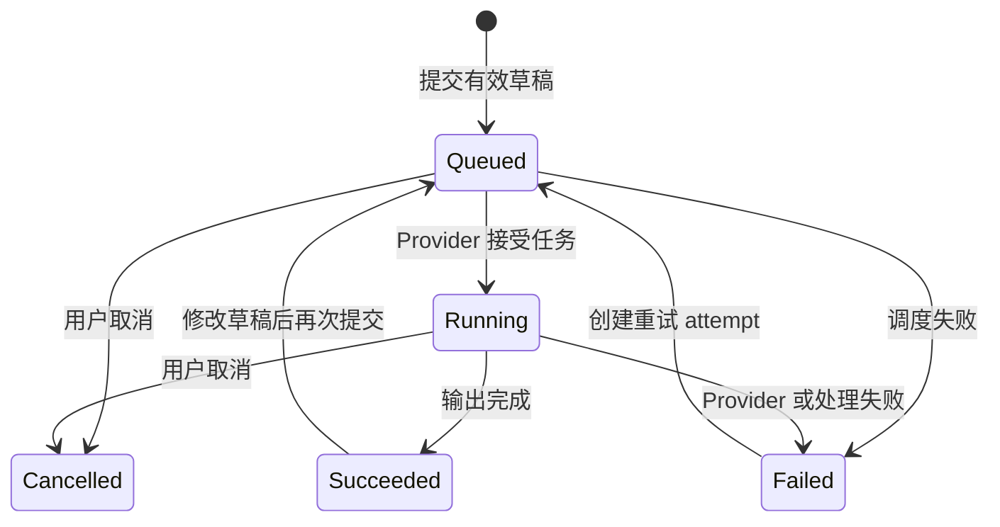
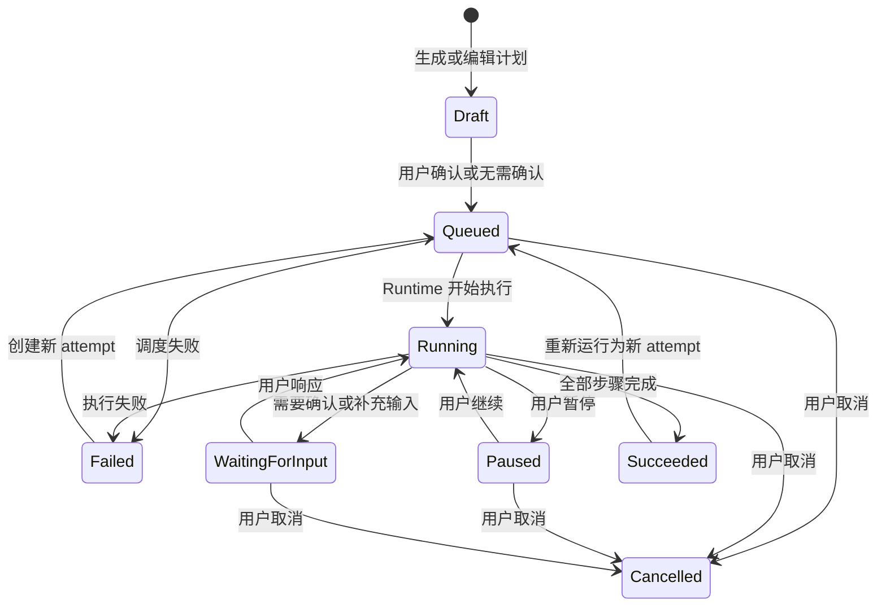

# 无限画布产品逻辑

> 产品定位、页面结构、交互原型和视觉规范见 [`infinite-canvas-prototype.md`](infinite-canvas-prototype.md)。本文是无限画布对象、状态、流程、约束和异常恢复规则的产品逻辑事实源。

## 1. 产品逻辑结论

无限画布的核心不是“在一个大平面上放节点”，而是让用户和 Agent 围绕同一份可持久化文档协作：

```text
创建或导入内容
-> 明确选择上下文
-> 发起直接生成或 Agent 任务
-> 观察可暂停、可恢复的执行过程
-> 结果稳定落位并保留来源
-> 用户继续编辑、生成、组织或撤销画布变更
```

产品存在两条互补的 AI 执行路径：

| 路径 | 入口 | 适用任务 | 产品结果 |
| --- | --- | --- | --- |
| Agent 任务 | 底部 Agent Dock | 跨对象理解、规划、多步骤编排和批量创建 | 创建独立 Agent Run，产出一个或多个可编辑对象 |
| 直接生成 | 固定类型 Generator 节点 | 单个文本、图片或视频生成任务 | 保持节点身份和位置不变，成功后原地切换当前输出 |

两条路径共享以下基座：

- 明确且不可变的上下文快照。
- 独立于画布文档的执行记录。
- 统一资产引用和来源追踪。
- 统一画布命令、自动保存和撤销恢复。
- 权限、成本、错误和重试规则。

### 1.1 动作路由

对象工具条、快捷添加和 Agent Dock 最终都路由到有限的产品执行类型：

| 动作特征 | 执行类型 | 示例 |
| --- | --- | --- |
| 纯本地、确定性修改 | Canvas Command | 编辑文本、移动、成组、调整 Frame |
| 单一模态、显式参数、原地输出 | Generation Run | 文本生成、图片生成、视频生成 |
| 跨对象、多步骤、需要规划 | Agent Run | 归纳资料、建立矩阵、生成一组页面方向 |
| 外部内容进入画布 | Import Job | 上传文件、解析 URL、OCR |
| 发布、删除或高成本副作用 | 等待用户确认后执行 | 批量覆盖、外部发布、高额生成 |

对象动作只声明输入类型、执行类型和结果落位策略，不能直接调用某个页面组件或任意修改 Store。

## 2. 状态归属

产品状态按职责分为五层，不能全部堆入一个前端 Store 或 `metadata` 字段。

| 状态层 | 内容 | 持久化 | 协作语义 |
| --- | --- | --- | --- |
| 画布文档 | Item、Relation、层级、位置、样式、文档 revision | 服务端持久化 | 多用户共享 |
| 执行记录 | Agent Run、Generation Run、步骤、上下文快照、成本、错误 | 服务端持久化 | 多用户可见 |
| 资产 | 原始文件、生成媒体、缩略图、索引和元数据 | 工作区资产存储 | 按权限共享 |
| 用户视图 | 当前 viewport、上次打开位置、个人显示偏好 | 用户级持久化 | 不覆盖他人视图 |
| 临时交互 | 选区、当前工具、打开的浮层、拖拽中位置、输入法组合态 | 当前会话 | 不进入共享文档 |

关键边界：

- 当前选区不是文档内容。
- 当前 viewport 不是多人共享状态；文档可以保存一个公共“首页视图”，但每个用户的实时视口独立。
- Agent Run 和 Generation Run 不能只存在于消息列表，也不能依赖节点组件存活。
- Generator 的当前输出属于画布对象，生成过程属于执行记录。
- Dock 输入草稿属于用户和画布，可单独恢复，但不进入撤销历史。

## 3. 领域对象

### 3.1 Workspace、Project 与 CanvasDocument

用户首期只感知“画布”，内部仍保留稳定分层：

```text
Workspace
-> Project
-> CanvasDocument
-> CanvasItem / CanvasRelation
```

| 对象 | 核心字段 | 逻辑职责 |
| --- | --- | --- |
| Workspace | `id`, `name`, `members`, `policy` | 权限、资产、模型和用量边界 |
| Project | `id`, `title`, `coverAssetId`, `updatedAt` | 聚合一组画布和共享资产 |
| CanvasDocument | `id`, `schemaVersion`, `revision`, `title`, `lifecycle`, `homeViewport?` | 画布内容的唯一共享事实源 |

`CanvasDocument.lifecycle` 使用 `draft / active / archived`；`revision` 在每个成功命令后单调递增。客户端提交变更时必须携带基准 revision，禁止静默覆盖更新后的文档。

### 3.2 CanvasItem

所有可见对象共享以下通用字段：

```ts
interface CanvasItem {
  id: string
  type: string
  revision: number
  parentId?: string
  transform: {
    x: number
    y: number
    width: number
    height: number
    rotation?: number
  }
  zIndex: number
  locked: boolean
  hidden: boolean
  data: unknown
  origin?: {
    actor: 'user' | 'agent' | 'generator' | 'importer'
    runId?: string
    provisional?: boolean
  }
}
```

通用规则：

1. `id` 创建后永久稳定，`revision` 在对象内容或通用字段变更后递增。
2. `type` 创建后不可原地修改；“转换”通过创建新对象并建立来源关系完成。
3. 位置、尺寸、层级、锁定和可见性属于通用字段，不进入类型私有数据。
4. `parentId` 只能指向同一文档内的 Frame，且层级关系不得形成环。
5. Item 的 transform 使用世界坐标；移动 Frame 时以同一命令批量平移全部后代。
6. 所有坐标和尺寸必须是有限数值，宽高必须大于零。
7. Item 删除后，当前文档不得保留指向它的悬空 Relation；历史执行记录仍保留原始引用。

### 3.3 Item 类型

| 类型 | 核心语义 | 关键状态 |
| --- | --- | --- |
| Text | 可直接编辑的文本内容 | 编辑中、已保存 |
| Image / Video / Audio | 引用工作区 Asset 的媒体内容 | 处理中、可用、失败 |
| File / Web Card | 外部资料和提取结果 | 上传、解析、索引状态 |
| Frame | 空间容器和上下文边界 | 折叠、布局策略 |
| Generator | 固定模态的生成配置和当前输出 | 草稿脏状态、当前输出、活跃 Generation Run |
| Agent Run Item | Agent Run 的画布投影 | 从执行记录派生状态 |
| Result Group | 一次执行的多个候选结果 | 主结果、展开状态 |
| Structured Data | 表格、矩阵或结构化结果 | schema、排序和筛选状态 |

### 3.4 GeneratorItem

Generator 节点创建时固定为 `text`、`image` 或 `video`，操作台不提供类型切换。

```ts
interface GeneratorItemData {
  generatorType: 'text' | 'image' | 'video'
  draft: {
    prompt: string
    capabilityId: string
    parameters: Record<string, unknown>
    referenceItemIds: string[]
  }
  draftRevision: number
  currentOutput?: {
    runId: string
    sourceDraftRevision: number
    text?: string
    assetIds?: string[]
    summary?: string
    generatedAt: string
  }
  lastRunId?: string
}
```

Generator 节点没有单一的 `draft / generated` 业务状态。界面状态由三个正交维度派生：

- 是否已有 `currentOutput`。
- `draftRevision` 是否不同于 `currentOutput.sourceDraftRevision`。
- 是否存在活跃或失败的 Generation Run。

每次 Prompt、能力、参数或参考素材变化都递增 `draftRevision`。提交时记录该 revision 和完整配置快照；后续编辑不会改变正在运行的任务。

因此，用户修改一个已经生成过的节点时，旧输出继续保留，节点显示“已有结果 + 未提交修改”，不能因为 Prompt 改动而丢失当前结果。

### 3.5 AgentThread、AgentRun 与 GenerationRun

每张画布拥有一个默认 Agent Thread，用于保存 Dock 中的用户消息、Agent 消息和运行摘要。

| 对象 | 核心职责 |
| --- | --- |
| AgentThread | 持久化画布内的消息顺序和默认 Agent Session 引用 |
| AgentRun | 表达一次逻辑任务、计划、上下文、步骤、输出和当前尝试 |
| AgentRunAttempt | 表达一次实际 runtime 执行；重试产生新 attempt |
| GenerationRun | 表达一次 Generator 提交的配置快照、状态、成本和输出 |

```ts
interface AgentRun {
  id: string
  threadId: string
  goal: string
  status: 'draft' | 'queued' | 'running' | 'paused' | 'waiting-for-input'
    | 'succeeded' | 'failed' | 'cancelled'
  contextSnapshotId: string
  currentAttemptId?: string
  outputItemIds: string[]
}

interface AgentRunAttempt {
  id: string
  runId: string
  attemptNo: number
  retryOfAttemptId?: string
  status: 'queued' | 'running' | 'paused' | 'waiting-for-input'
    | 'succeeded' | 'failed' | 'cancelled'
  stepIds: string[]
  error?: { code: string; message: string }
}

interface GenerationRun {
  id: string
  generatorItemId: string
  status: 'queued' | 'running' | 'succeeded' | 'failed' | 'cancelled'
  configSnapshotRef: string
  contextSnapshotId: string
  outputText?: string
  outputAssetIds: string[]
  estimatedCost?: number
  actualCost?: number
}
```

Agent Run 的画布卡片只保存 `runId` 和布局信息，标题、步骤和状态从执行记录读取。删除画布卡片不能删除执行审计记录。

### 3.6 CanvasRelation

```ts
interface CanvasRelation {
  id: string
  kind: 'references' | 'derived-from' | 'sequence' | 'manual'
  sourceItemId: string
  targetItemId: string
  createdBy: 'user' | 'system'
  hidden?: boolean
}
```

| 关系 | 语义 | 生命周期 |
| --- | --- | --- |
| `references` | 对象或 Run 使用另一个对象作为输入 | 输入快照创建时生成 |
| `derived-from` | 结果由 Run、Generator 或其他对象产生 | 系统生成，不允许破坏来源事实 |
| `sequence` | 内容的业务顺序 | 用户或模板创建 |
| `manual` | 用户表达的自定义逻辑连接 | 用户可自由创建和删除 |

关系是语义数据，连接线只是它的视图。隐藏连接线不能删除关系。

### 3.7 Asset

```ts
interface Asset {
  id: string
  workspaceId: string
  kind: 'image' | 'video' | 'audio' | 'file'
  status: 'processing' | 'ready' | 'failed'
  uri?: string
  mimeType: string
  checksum?: string
  metadata: Record<string, unknown>
  originRunId?: string
}
```

Asset 保存二进制内容和处理结果，CanvasItem 只持有 Asset ID 与展示数据。相同 checksum 的导入可以复用底层内容，但每个画布对象仍保持独立身份、布局和来源关系。

## 4. 全局不变量

以下规则对所有流程成立：

1. 画布文档只能通过 Canvas Command 修改。
2. Agent、Generator、Importer 和用户使用同一命令入口，不能直接写前端状态。
3. 每个执行任务使用提交时生成的不可变上下文和参数快照。
4. 用户在运行期间移动、编辑或删除来源对象，不会隐式改变已经提交的任务。
5. 空选区不允许偷偷回退到“默认资料”；界面必须明确显示本次只使用用户当前输入。
6. 同一张画布在 MVP 中只允许一个会修改画布的活跃 Agent Run。
7. 同一个 Generator 节点同一时间只允许一个活跃 Generation Run；不同 Generator 可并行。
8. 重试创建新的执行尝试，不删除上一次输出、运行记录或用户已编辑内容。
9. Agent 和 Generator 结果必须能够追溯到运行记录、输入对象和参数快照。
10. 生成成功只原子替换 Generator 的当前输出，不修改节点类型、ID 和世界坐标。
11. 运行失败不能覆盖已有成功结果。
12. 活跃 Run、非空 Frame 和有下游来源关系的对象不能被静默破坏。
13. 保存状态必须反映真实持久化结果，定时器或动画不能伪造“已保存”。
14. 当前文档中的 Relation 两端必须存在，Frame 层级必须无环。
15. 锁定 Item 不能被普通编辑、删除或 Agent 命令修改；解锁必须是显式用户动作。
16. 用户手动移动过的结果不会在重试、刷新或状态同步后被自动拉回默认位置。

## 5. 选择与上下文

### 5.1 选择

选择是用户当前会话状态：

- 单击替换选区。
- `Shift` 单击追加或取消。
- 框选不默认选中 Frame；直接单击 Frame 才选择容器。
- 多选动作只展示所有对象都支持的能力交集。
- 选择 Generator 且选区只有一个对象时，打开对应节点操作台。

### 5.2 上下文范围

Dock 提供以下上下文范围：

| 范围 | 输入 |
| --- | --- |
| 当前选区 | 提交瞬间选中的合格对象 |
| 当前 Frame | 选中 Frame 及其全部可访问后代 |
| 整张画布 | 当前文档内可访问、可见且适合作为输入的对象和关系摘要 |

MVP 界面可先展示“当前选区 / 整张画布”，但领域模型保留 Frame 范围。

当前选区为零时：

- “当前选区”明确显示 `0` 和“仅使用当前输入”。
- Prompt 非空时仍可提交，ContextSnapshot 的对象列表为空。
- 不使用硬编码对象、上次选区或不可见默认资料补足上下文。

### 5.3 ContextSnapshot

提交 Agent 或生成任务时创建快照：

```ts
interface ContextSnapshot {
  canvasId: string
  canvasRevision: number
  scope: 'selection' | 'frame' | 'whole' | 'references'
  itemRefs: Array<{
    itemId: string
    itemRevision: number
    snapshotRef: string
  }>
  relations: Array<{
    kind: 'references' | 'derived-from' | 'sequence' | 'manual'
    sourceItemId: string
    targetItemId: string
  }>
  assetRefs: string[]
  capturedAt: string
}
```

`snapshotRef` 指向提交时固化的上下文材料，而不是运行时重新读取当前 Item。关系也按提交时的结构复制到快照，因此来源对象后续变化或删除不会改变已开始的任务。Agent Run 使用选区、Frame 或整图范围；Generation Run 使用 Generator 中显式配置的 `references`。

组装规则：

1. Text、结构化数据和已解析文件提供文本内容或摘要。
2. Image、Video、Audio 提供 Asset 引用、缩略信息和可用索引。
3. Frame 展开为后代对象，并保留层级和顺序信息。
4. Generator 默认提供当前成功输出；没有输出的草稿仅在显式选中时提供配置摘要。
5. Agent Run 卡默认不进入整图上下文；显式选中时提供目标、状态和输出摘要。
6. 隐藏、已删除、无权限和尚未解析完成的内容不进入快照，并在提交前给出可解释提示。
7. 整图上下文通过 Indexer 和摘要控制输入预算，不直接把所有二进制内容拼入 Prompt。

## 6. 对象创建与导入

| 入口 | 创建逻辑 |
| --- | --- |
| `T` 或双击空白处 | 创建普通 Text Item，并立即进入编辑 |
| Dock `+ -> 文本生成` | 创建固定类型的 Text Generator |
| Dock `+ -> 图片生成` | 创建固定类型的 Image Generator |
| Dock `+ -> 视频生成` | 创建固定类型的 Video Generator |
| Dock `+ -> 文件` | 打开文件选择器并创建 Import Job |
| Dock `+ -> Frame` | 在当前视口安全区创建空 Frame |
| 粘贴文本、图片、URL | 按内容类型创建对应对象 |
| 拖入多个文件 | 创建临时 Frame，Import Job 完成后填入子对象 |

从已有对象执行“生成图片”“生成视频”等跨模态动作时，在来源附近创建目标类型 Generator，并自动填入 `referenceItemIds`；不修改来源对象类型，也不把来源对象替换为结果。

新对象位置遵循以下顺序：

1. 用户指针附近。
2. 当前视口安全区中心。
3. 对象来源或选区右侧。
4. 无碰撞搜索位置。

创建位置是世界坐标，不被固定世界尺寸夹回；必要时只平移 viewport 使对象避开 Dock 和屏幕边界。

### 6.1 Import Job

文件和 URL 导入是异步任务：

```text
queued -> acquiring -> processing -> succeeded
                                 \-> failed
                                 \-> cancelled
```

- 用户选择文件或提交 URL 后立即创建稳定占位对象，避免重复操作。
- 成功后原地补齐 Asset、预览、文本提取和索引。
- 失败对象保留在原位，显示错误、重试和替换文件入口。
- 重试复用对象身份，不创建重复卡片。

## 7. Generator 产品逻辑

### 7.1 Generation Run 状态机



### 7.2 提交流程

1. 校验 Generator 类型、Prompt、参数和参考素材。
2. 确认同一节点没有活跃 Generation Run。
3. 解析引用对象权限和 Asset 可用状态。
4. 计算成本预估；达到确认阈值时先请求用户确认。
5. 保存当前草稿并创建不可变配置快照。
6. 创建 `queued` Generation Run，节点显示运行状态，但保留旧输出。
7. Provider 执行期间允许用户移动节点；草稿编辑只影响下一次提交。
8. 成功后写入新 Asset，并原子更新 `currentOutput`。
9. 旧输出进入历史，可在操作台中恢复或比较。
10. Thread 追加完成摘要，但不强制展开或覆盖用户滚动位置。

### 7.3 失败与重试

- 没有旧输出时，节点显示错误占位和重试入口。
- 有旧输出时，继续展示旧输出，同时标记“上次生成失败”。
- 重试默认使用失败 attempt 的配置快照；“使用当前草稿重试”创建另一条新 attempt。
- Provider 已开始处理后产生的实际费用进入运行记录；调度前失败不计费。
- Run 取消后的晚到结果只进入审计和历史，不得自动替换 `currentOutput`。
- 删除活跃 Generator 时必须先确认并取消运行，不能由键盘删除静默中止。

### 7.4 多结果

当模型返回多个候选结果时：

- Generator 节点继续保持单一位置。
- `currentOutput` 指向用户或系统默认选中的主结果。
- 其余候选保存在该 Generation Run 的输出列表中。
- 用户展开候选后可创建 Result Group，或把某个候选拖出为独立内容对象。

## 8. Agent Dock 与 Agent Run

### 8.1 Dock 逻辑

- 每张画布拥有一个默认持久化 Thread。
- 上下文范围属于下一条待发送消息，而不是已经运行的任务。
- 输入框为空时不提交。
- 存在活跃 Agent Run 时不接受第二个会修改画布的任务，并保留用户输入草稿。
- Thread 收起只影响显示，不停止运行或丢失消息。
- Run 的状态更新不会强制滚动正在阅读旧消息的用户。

### 8.2 Agent Run 状态机



### 8.3 状态与动作

| 状态 | 用户动作 | 画布表现 |
| --- | --- | --- |
| Draft | 编辑计划、确认、取消 | Run 卡显示计划和预计影响 |
| Queued | 取消 | 显示排队和预估等待 |
| Running | 暂停、取消、查看步骤 | 当前步骤和增量输出可见 |
| Paused | 继续、重新开始、取消 | 保留进度和已完成步骤 |
| WaitingForInput | 选择、补充输入、取消 | 在 Run 卡原地展示问题，不弹全局对话框 |
| Succeeded | 查看输出、再次运行、从画布移除卡片 | 输出可编辑且来源可追溯 |
| Failed | 查看错误、重试、更换配置 | 保留已完成步骤和失败占位 |
| Cancelled | 查看记录、重新运行、从画布移除卡片 | 保留审计和已产生输出 |

`Queued`、`Running`、`Paused` 和 `WaitingForInput` 都属于 active 状态，都会占用当前画布唯一的 Agent 执行槽位。

暂停采用安全边界语义：点击暂停后设置 `pauseRequested`，正在进行的模型或 Tool 调用允许完成，但不会调度下一步；到达步骤边界后才进入 `Paused`。等待期间界面显示“正在暂停”，不能把按钮点击瞬间伪装成已暂停。

取消同样是协作式操作。设置 `cancelRequested` 后禁止新的 Tool 和 Canvas Command；已经发出的外部调用可以结束并写入审计，但其晚到结果不能在 Run 进入 `Cancelled` 后自动接纳到画布。

“重试”和“继续”不同：

- 继续恢复同一个 attempt。
- 重试或重新开始创建新 attempt，并通过 `retryOfAttemptId` 关联旧 attempt。
- 从 Paused 重新开始需要确认，旧 attempt 转为 Cancelled。

### 8.4 发送流程

```text
用户提交消息
-> 校验角色、活跃 Run 和上下文
-> 创建 ContextSnapshot
-> 事务写入用户消息、逻辑 AgentRun 和 queued attempt
-> 在来源附近创建 Agent Run Item
-> Runtime 执行并流式写入步骤事件
-> Agent 通过 Canvas Command 创建临时骨架和结果
-> 成功后完成结果，失败时保留错误与可重试状态
```

### 8.5 Agent 修改画布

Agent 只能提交意图级命令：

```text
CreateItems
UpdateItems
MoveItems
ResizeItems
DeleteItems
CreateRelations
GroupItems
AcceptRunOutputs
```

规则：

1. 新建、补充和整理 Agent 自己创建的对象可自动执行。
2. 删除用户已有内容、覆盖高价值内容、发布外部资源或产生高额费用时进入 `WaitingForInput`。
3. 运行中创建的骨架和结果带 `origin.runId` 和 `origin.provisional = true`，完成前显示为不可编辑的临时状态。
4. 成功后通过 `AcceptRunOutputs` 将临时结果批量转为可编辑内容；失败或取消时保留错误占位，用户可保留或清理。
5. 用户编辑已完成输出后，该对象成为普通可编辑内容但继续保留 `origin.runId`；后续重试不得覆盖。

### 8.6 与现有 Agent 运行时的边界

现有运行链路和存储状态见 [`cloud-embedded-agent-runtime.md`](../technical-solution/cloud-embedded-agent-runtime.md) 与 [`storage-models.md`](../technical-solution/storage-models.md)。

当前 Agent Session 已具备 `queued / running / succeeded / failed` 和“同一 Session 一个 active run”约束。画布 MVP 可让一张 CanvasDocument 绑定一个默认 Agent Session，并复用消息、事件、Run 和 SSE 能力。

产品层的逻辑 `AgentRun` 聚合多个 attempt；现有存储中的 `agent_run` 对应一次实际执行，应映射为 `AgentRunAttempt`。正式实现需要新增逻辑任务聚合，或在现有 Run 上补充稳定的 `rootRunId / retryOfRunId` 关系，不能把重试覆盖成同一条记录。

以下产品状态需要运行时扩展后才能真实提供：

- `Draft` 计划确认。
- `Paused` 与继续。
- `WaitingForInput`。
- `Cancelled`。
- Canvas Command 事件和运行输出引用。

在运行时支持前，正式产品不得仅用前端定时器或按钮伪造这些状态。

## 9. 结果、来源与落位

### 9.1 来源链

Agent 任务使用稳定阅读方向：

```text
输入对象或 Frame
-> Agent Run Item
-> Result / Result Group
```

- 输入对象到 Run 使用 `references`。
- Run 到结果使用 `derived-from`。
- 结果保存 `origin.runId`。
- 选中结果时可查看输入快照、参数、模型、时间和成本。

Generator 原地生成不创建新的画布节点，但 `currentOutput.runId` 必须指向 Generation Run。

### 9.2 默认落位

1. 没有画布来源：Run 位于当前视口安全区中心，结果位于 Run 右侧。
2. 单一来源：Run 位于来源右侧，结果位于 Run 右侧。
3. 多选来源：以选区包围盒为锚点。
4. Frame 来源：以 Frame 右侧为锚点，避免覆盖内部内容。
5. 多个结果：先创建 Result Group，再按网格展开。
6. 碰撞时按列和行搜索最近空位。
7. 屏幕空间不足时平移 viewport，使新对象位于 Dock 上方；不改写已经确定的世界坐标。
8. 用户手动移动后记录 `placementMode = 'manual'`，后续同步不再自动重排。

## 10. Frame 逻辑

Frame 是结构容器，不只是背景矩形。

- Item 进入 Frame 后设置 `parentId`。
- 移动 Frame 同步移动全部后代，保持相对位置。
- 调整 Frame 尺寸不缩放内部内容。
- 将 Item 拖出边界并释放后移除 `parentId`。
- 选择 Frame 作为上下文时展开全部可访问后代，并保留层级顺序。
- Frame 折叠只改变视图，后代仍存在且可被 Agent 引用。
- Frame 层级必须无环；MVP 交互只开放一层 Frame，schema 保留后续嵌套能力。
- 删除空 Frame 可立即执行。
- 删除非空 Frame 必须确认；默认动作是“仅移除 Frame，内容留在原位”，另提供“删除 Frame 与全部内容”。

## 11. 保存、命令与撤销

### 11.1 Canvas Command

```ts
interface CanvasCommand {
  commandId: string
  canvasId: string
  baseRevision: number
  actor: { type: 'user' | 'agent' | 'system'; id: string }
  operations: unknown[]
  createdAt: string
}
```

- 一个用户意图对应一个命令批次。
- 对象拖拽、连续输入和尺寸调整在结束时合并为单个撤销单元；用户 viewport 缩放不进入文档撤销历史。
- 命令服务原子校验、应用并递增文档 revision。
- 同一 `commandId` 重复提交必须幂等。
- Agent Run 的外部调用、费用和执行记录不可通过画布撤销删除。

### 11.2 自动保存状态

| 状态 | 准确定义 |
| --- | --- |
| 已保存 | 本地无待提交命令，最新服务端 revision 已确认 |
| 保存中 | 存在正在提交或等待确认的命令 |
| 保存失败 | 至少一个命令未持久化，需要重试或解决冲突 |

客户端先乐观应用命令，再进入持久化队列。刷新时加载服务端文档，并在基准 revision 仍有效时重放本地未确认命令。

### 11.3 撤销与重做

- 撤销通过逆向 Canvas Command 完成，不回滚数据库事务历史。
- 删除、移动、编辑、Frame 层级、关系和 Agent 结果接纳均可撤销。
- 撤销 Agent 结果只移除其画布影响，Run、消息、费用和审计记录保留。
- 如果用户已经编辑 Agent 输出，撤销整次运行前必须提示哪些对象会受影响。
- 协作阶段通过基于 revision 的补偿命令处理，不使用前端快照覆盖远端内容。

## 12. 删除与恢复

| 对象 | 删除规则 |
| --- | --- |
| 普通 Item | 通过命令删除，关系同步清理，可撤销 |
| 非空 Frame | 必须选择保留或删除后代 |
| 活跃 Agent Run Item | 先取消 Run；不能静默删除卡片和定时器 |
| 终态 Agent Run Item | 可从画布移除，Run 记录和 Thread 摘要保留 |
| 活跃 Generator | 先确认取消 Generation Run |
| Generator | 删除节点不立即物理删除已生成 Asset |
| 有下游结果的来源对象 | 删除前提示受影响结果数；结果继续存在，来源面板显示“来源已删除” |

Asset 只有在没有任何 Item、Run 或历史版本引用并超过保留期后才可物理清理。

## 13. 权限、成本与高风险动作

### 13.1 角色

| 动作 | Owner | Editor | Viewer |
| --- | --- | --- | --- |
| 查看、平移、缩放、检查来源 | 允许 | 允许 | 允许 |
| 创建和编辑 Item | 允许 | 允许 | 禁止 |
| 发起 Agent / Generation Run | 允许 | 允许，受工作区策略限制 | 禁止 |
| 删除画布、管理成员和策略 | 允许 | 禁止 | 禁止 |
| 导出 | 允许 | 按策略 | 按策略 |

Agent 和 Skill 继承发起用户的有效权限，不能绕过工作区策略访问 Asset 或执行动作。

### 13.2 需要确认的动作

- 删除或覆盖用户已有内容。
- 发布、分享或写入外部系统。
- 访问受限 Asset。
- 预计成本超过工作区阈值。
- 一次批量修改超过配置数量。
- 从 Paused 状态重新开始并放弃当前 attempt。

确认发生在对应 Run 卡或 Generator 操作台内，不使用脱离上下文的全局弹窗。

## 14. 异常与恢复

| 场景 | 产品行为 |
| --- | --- |
| 保存失败 | 保留本地命令和未保存标识，提供重试，不显示“已保存” |
| revision 冲突 | 拉取新 revision，尝试重放无冲突命令；无法合并时展示受影响对象 |
| Agent 调度失败 | Run 进入 Failed，不创建伪造结果，可重试 |
| Agent 部分完成 | Run 进入 Failed 并展示已完成步骤；已有临时输出不自动删除 |
| Generation 失败 | 保留旧输出和当前草稿，显示错误与重试 |
| 上传或解析失败 | 占位对象保留，支持重试或替换来源 |
| 页面刷新 | 恢复文档、用户 viewport、Thread 和所有非终态 Run |
| SSE 断开 | 标记状态可能过期并重连；通过 Run 查询校准终态 |
| 来源被删除 | 已提交快照继续执行；结果来源面板显示缺失对象 |
| 权限被撤销 | 阻止新命令，取消或失败仍需访问资源的执行 |
| 余额不足 | 提交前阻止运行，保留输入和配置 |

## 15. 画布库与新建流程

### 15.1 画布卡片

画布卡片信息必须由真实数据派生：

- 对象数只统计未删除的 CanvasItem，不把 Relation 计入“对象”。
- 运行状态来自最新活跃 Agent Run 或 Generation Run。
- 更新时间来自最后一个成功持久化命令。
- 所有者和协作者来自权限数据。
- 缩略图由当前公共首页视图或自动内容包围盒生成。

### 15.2 新建画布

| 入口 | 流程 |
| --- | --- |
| 空白画布 | 创建空 CanvasDocument，进入编辑器 |
| 一句话创建 | 创建 Draft Canvas -> Agent 生成计划 -> 用户确认 -> 执行计划 |
| 导入资料 | 创建 CanvasDocument -> 创建 Import Job -> 自动形成资料 Frame |
| 使用模板 | 实例化对象和关系 -> 填写模板变量 -> 进入编辑器 |

“一句话创建”在用户确认前不得调用高成本生成能力或批量修改画布。用户拒绝计划时保留 Draft Canvas 和输入内容，可继续编辑计划或切换为空白画布。

## 16. 当前原型逻辑对照

状态定义：

- **可交互**：原型中已有真实前端状态转换。
- **模拟**：界面可演示，但使用定时器、硬编码结果或 Toast。
- **方案**：产品文档已定义，原型未实现。
- **需纠正**：原型行为与本文确定的产品逻辑不一致。

| 逻辑 | 当前状态 | 证据或差异 |
| --- | --- | --- |
| 平移、缩放、选择、框选、拖动 | 可交互 | `infinite-canvas-prototype/app.js:612-984` |
| 固定类型 Generator 创建与独立配置 | 可交互 | `app.js:254-267`, `app.js:1581-1615` |
| Generator 原地更新 | 模拟 | `app.js:1617-1643` 立即成功，无异步 Run |
| Generator 输出与草稿分离 | 需纠正 | 当前 `draft/generated` 在 Prompt 修改后覆盖显示状态 |
| Add Menu、Thread、Generator 面板互斥 | 可交互 | `app.js:1223-1266` |
| Agent 暂停、继续、重试 | 模拟 | `app.js:1016-1127` 使用单个定时器和固定 Run |
| Agent 上下文快照 | 需纠正 | `app.js:475-498` 空选区隐式回退硬编码资料 |
| Agent Run 历史与 retry attempt | 需纠正 | 当前复用 `id = run`，重试前删除生成结果 |
| Agent 失败、等待输入、取消 | 方案 | 原型只覆盖 running、paused、succeeded |
| 自动保存 | 需纠正 | `app.js:641-650` 只用 420ms 定时器切换文案 |
| 删除与恢复 | 模拟 | 删除 Run 会直接停止定时器；重置恢复硬编码场景 |
| Frame 容器和子对象联动 | 方案 | 当前 Frame 只有视觉节点，没有 `parentId` 行为 |
| Relation 语义 | 需纠正 | 当前只保存 `[sourceId, targetId]`，没有 `kind` 和稳定 ID |
| 结果来源与落位 | 模拟 | 有无碰撞落位和连线，但没有持久化来源记录 |
| 从想法创建计划确认 | 需纠正 | `app.js:1907-1916` 直接打开预设演示画布 |
| 文件导入、Frame 创建、参考选择 | 模拟 | `app.js:1886-1896`, `app.js:1965` 仅 Toast |
| Library 对象数 | 需纠正 | `app.js:595-597` 把 Node 和 Relation 一起计数 |
| Thread、消息和 Run 恢复 | 方案 | 当前全部保存在内存 State |
| 命令历史、撤销重做和 revision | 方案 | 原型直接修改对象数组 |
| 权限、费用和高风险确认 | 方案 | 原型仅展示静态积分估算 |
| 无限坐标空间 | 需纠正 | 原型 SVG 和 MiniMap 仍使用 `2600 x 1600` 固定世界尺寸 |

## 17. 逻辑缺口优先级

### P0：进入正式 MVP 开发前必须闭环

| 主题 | 闭环标准 |
| --- | --- |
| 状态归属 | 文档、执行、资产、用户视图和临时交互分层明确 |
| Canvas Command | 所有文档修改统一经过命令、revision 和真实保存状态 |
| ContextSnapshot | 无隐式上下文，提交后不可变，可追溯 item revision |
| Agent Run | 一个 active run、完整状态机、attempt 历史、重试不删结果 |
| Generator | 固定类型，草稿、当前输出和 Generation Run 分离 |
| Asset 基础 | 上传和生成媒体具备稳定 Asset ID、权限和引用生命周期 |
| Frame | `parentId`、移动联动、上下文展开和安全删除规则落地 |
| 来源与删除 | 每个结果可追溯，删除和撤销不破坏运行审计 |
| 新建画布 | 一句话创建必须经过计划确认 |
| 持久化恢复 | 刷新后恢复文档、Thread 和非终态执行 |

### P1：形成完整可用的创作闭环

| 主题 | 闭环标准 |
| --- | --- |
| Import Job 与索引 | 多文件/URL 获取、解析、OCR、索引和失败重试 |
| Result Group | 多候选主结果、展开、比较和继续生成 |
| 成本与权限 | 预估、余额、阈值确认、角色和高风险动作策略 |
| 异常恢复 | 保存冲突、SSE 重连、Provider 失败和部分输出处理 |
| 无限空间 | 解除固定世界尺寸，完成大画布性能与虚拟化策略 |
| 分享与导出 | Viewer 权限、只读分享和来源可见性 |

### P2：协作与生态

- 实时协作、Presence 和协作撤销。
- 多 Agent Thread 和任务队列。
- Playbook / Skill 参数化保存与复用。
- 创作过程回放和公开作品。
- 模板、Skill 和作品市场。
- 工作区用量、配额和商业授权策略。

## 18. Agent 原生 MVP 产品逻辑验收

以下标准覆盖画布基座和首个 Agent 闭环，全部满足后产品才具备对外可用的 Agent 原生 MVP 逻辑。

1. 用户可以从空白、想法、导入和模板四种入口创建画布。
2. 一句话创建在实际执行前展示可编辑计划并等待确认。
3. Text、媒体、文件、Frame、Generator 和 Agent Run 均有稳定身份和持久化字段。
4. Frame 移动会联动内部对象，选择 Frame 可正确组装后代上下文。
5. 当前选区为空时不会读取隐藏默认资料。
6. 每个任务都保存提交时的 ContextSnapshot 和参数快照。
7. 同一画布只允许一个会修改画布的活跃 Agent Run，用户输入草稿不会因此丢失。
8. Agent Run 的暂停、继续、等待输入、失败、取消和重试具有明确语义。
9. 重试创建新 attempt，不删除旧结果或用户已编辑内容。
10. Generator 类型固定，修改 Prompt 不会删除当前成功输出。
11. Generation Run 失败时保留旧输出，成功时原子替换当前输出。
12. 所有 Agent 和 Generator 结果都能追溯输入、运行、模型、参数、时间和成本。
13. 自动保存状态与服务端确认一致，刷新后恢复最后持久化文档和非终态运行。
14. 删除、Frame 层级、关系和 Agent 结果接纳可撤销；执行审计和费用不可被普通撤销抹除。
15. 运行中对象、非空 Frame 和高风险动作不会被静默删除或覆盖。
16. 画布卡片对象数、运行状态和更新时间均由真实数据派生。
17. 新结果默认落在来源附近，避让已有内容和 Dock，用户移动后不被自动重排。
