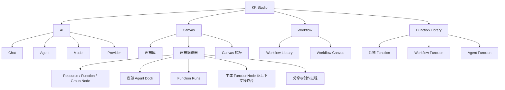
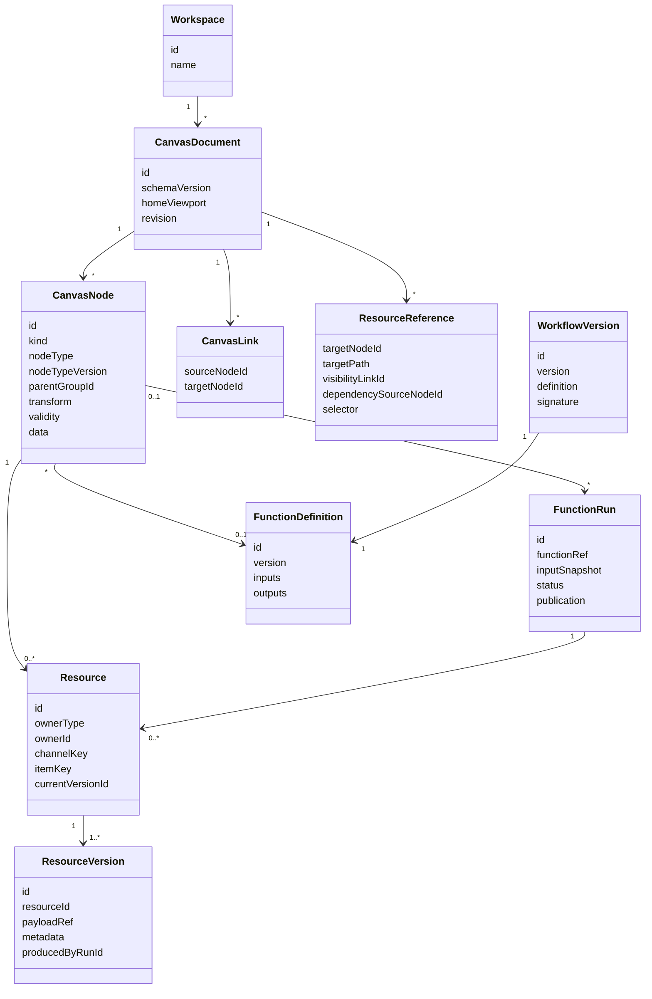

# 无限画布产品原型方案

> 交互原型：直接打开 [`infinite-canvas-prototype/index.html`](infinite-canvas-prototype/index.html)，无需安装依赖或启动服务。
>
> Node、Resource、Link、ResourceReference、Function、Workflow、保存撤销和异常恢复规则见 [`infinite-canvas-product-logic.md`](infinite-canvas-product-logic.md)。

## 1. 方案结论

`kk-studio` 的画布应定位为 **供人和总控 Agent 共同使用的多模态资源工作台**：用户把想法、资料和已有产物放入空间，通过 Link 暴露资源、通过 `@ResourceReference` 选择实际输入，并用 Function 持续加工出新的 Resource。

产品不以“通用白板”或“节点工作流编辑器”为最终形态，也不把漫剧生产流程固化进底层。Canvas 操作当前实际 Resource；可重复的自动执行过程在独立 Workflow Canvas 中定义，发布后作为 Function 回到 Canvas 使用。

核心产品表达：

```text
把资料放进来形成 Resource
-> 用 Link 建立可见范围，用 @Reference 选择实际输入
-> 由人或总控 Agent 配置并执行 Function
-> 过程可见、结果原地发布、版本与来源可追溯
-> 将稳定过程提取为 Workflow Function
```

首个原型应证明四件事：

1. 画布基础操作自然、低学习成本。
2. 文本、图片、文件、生成结果和 Agent Activity 能在同一空间连续组织。
3. 固定类型生成节点、上下文操作台和底部 Agent Dock 能支撑连续创作。
4. 当前视觉对象可以无歧义地映射到 ResourceNode、FunctionNode、GroupNode 和 FunctionRun，而无需保留旧领域模型。

## 2. 产品定位

### 2.1 目标用户

| 用户 | 核心任务 |
| --- | --- |
| AI 创作者 | 从灵感、参考图和提示词连续生成、对比和整理多模态结果 |
| Agent 使用者 | 把零散资料交给 Agent，观察执行过程并调整中间结果 |
| 产品与研发人员 | 在同一空间整理需求、架构、资料和 Agent 产出 |
| 内容生产者 | 通过模板把大纲、资产、分镜、图片和视频串成可重复流程 |

### 2.2 核心价值

| 传统形态 | 画布形态 |
| --- | --- |
| Chat 中上下文线性堆叠 | 空间中的对象可并列、分组、引用和分支 |
| AI 只返回最终答案 | Function 的输入快照、运行状态、成本和输出均可见 |
| 结果离开会话后难复用 | 结果成为有稳定身份和版本的 Resource |
| 能力入口按模型和工具堆叠 | 系统、Workflow 和 Agent 能力统一进入 Function Library |
| 成功流程依赖人工记忆 | 可提取、测试和发布为 Workflow Function |

### 2.3 产品原则

1. **资源优先**：用户操作 Node 与 Resource，不直接面对底层模型 API。
2. **直接操纵优先**：拖拽、框选、就地编辑和上下文工具条承担高频操作。
3. **人机同构**：用户和总控 Agent 通过相同 Command 与 Function 边界工作。
4. **过程可见**：Function 长任务展示输入、步骤、耗时、成本、失败原因和重试入口。
5. **输出身份稳定**：Function 原地发布 ResourceVersion，不因每次执行制造无关 Node。
6. **渐进式复杂度**：默认界面轻量，高级配置只在需要时展开。
7. **能力可注册**：NodeDefinition、Function、Resource Adapter 和 Tool Adapter 通过稳定契约扩展。
8. **文档模型与渲染解耦**：画布数据不绑定某个前端组件库，便于迁移、协作和服务端处理。

## 3. 信息架构

Canvas 与 Workflow 是 AI 控制台之外的 Workspace 级产品域，使用独立路由，不作为 AI 页面内部 Tab；Function Library 为两者提供统一能力入口。



建议路由：

| 路由 | 页面 |
| --- | --- |
| `/workspaces/:workspaceId/canvases` | 画布库 |
| `/workspaces/:workspaceId/canvases/:canvasId` | 画布编辑器 |
| `/workspaces/:workspaceId/canvases/:canvasId/share` | 只读分享与创作过程 |
| `/workspaces/:workspaceId/workflows` | Workflow Library |
| `/workspaces/:workspaceId/workflows/:workflowId` | Workflow Canvas |
| `/workspaces/:workspaceId/functions` | Function Library |

## 4. 核心对象模型

### 4.1 领域层级



CanvasDocument 直接归属 Workspace，不引入无独立行为的 Project 占位层。Workflow 使用独立 Workflow Canvas 构建，发布后作为 Function 被普通 FunctionNode 引用。

### 4.2 Node 分类

| Node | 原型对象 | 产品语义 |
| --- | --- | --- |
| ResourceNode | 文本、图片、视频、文件、网页卡片 | 承载已经存在的 Resource |
| FunctionNode | 文本生成、图片生成、视频生成、Agent Run | 引用 Function，绑定输入并发布 Resource |
| GroupNode | Frame、Result Group | 组织成员并聚合成员当前 Resource |

Function 来源包括系统基础 Function、Workflow Function 和后续接入的 Agent Function。Generator 是 FunctionNode 的一种产品视图，不再拥有独立领域模型。

### 4.3 Link 与引用

```text
CanvasLink
  控制 Source Resource 对 Target 的可见范围

@ResourceReference
  表示 Target 实际使用了某个可见 Resource
```

任意 Node 都可以在没有 Resource 时提前建立 Link。只有实际存在且当前有效的 Resource 才进入下游 `@` 选择器；仅有 Link 不形成依赖，也不触发变化传播。
Canvas 常驻连线只绘制 Link；实际 ResourceReference 以输入 token、Inspector 和选中时的依赖高亮呈现，避免同一关系绘制两套重叠边。Workflow Canvas 的连线只表示 Workflow Binding。

## 5. 页面原型

### 5.1 画布库

画布库结合 NeoWOW 的模板入口、个人/协作分类和画布管理能力，但保持 `kk-studio` 的简洁控制台风格。

```text
┌─────────────────────────────────────────────────────────────────────────────┐
│ KK Studio                     AI   [画布]                       Workspace  ● │
├─────────────────────────────────────────────────────────────────────────────┤
│                                                                             │
│  画布                                                        搜索画布  新建 │
│  把想法、资料和 Agent 产出放在同一个空间                                    │
│                                                                             │
│  ┌───────────────────────────────────────────────────────────────────────┐  │
│  │  告诉我你想完成什么…                         [从想法创建] [导入资料]  │  │
│  └───────────────────────────────────────────────────────────────────────┘  │
│                                                                             │
│  快速开始                                                                   │
│  [ 空白画布 ] [ 研究与归纳 ] [ 视觉方向探索 ] [ 故事与分镜 ] [ 技术方案 ] │
│                                                                             │
│  全部   我的   与我协作                          文件夹  多选  网格/列表    │
│                                                                             │
│  ┌──────────────────┐ ┌──────────────────┐ ┌──────────────────┐            │
│  │ 产品视觉方向探索 │ │ Agent 工具设计   │ │ 短片概念草案     │            │
│  │ 预览缩略图       │ │ 预览缩略图       │ │ 预览缩略图       │            │
│  │ 18 项 · 刚刚编辑 │ │ 42 项 · 昨天     │ │ 26 项 · 3 天前   │            │
│  └──────────────────┘ └──────────────────┘ └──────────────────┘            │
└─────────────────────────────────────────────────────────────────────────────┘
```

### 关键行为

- “从想法创建”先让 Agent 生成画布骨架，用户确认后再执行耗时能力。
- “导入资料”支持文件、图片、URL 和粘贴内容，导入后生成可编辑对象。
- 模板卡只表达用户目标，不直接暴露模型名。
- 画布卡展示内容缩略图、Node 数、运行状态和更新时间。
- 个人/协作分类、文件夹、多选、搜索、网格密度沿用成熟商业产品的信息架构。

### 5.2 新建画布

```text
┌──────────────────────── 新建画布 ────────────────────────┐
│                                                          │
│  从哪里开始？                                            │
│                                                          │
│  ○ 空白画布        自由添加内容                          │
│  ○ 一句话创建      Agent 先生成结构和待办                │
│  ○ 导入资料        文件、图片、网页或粘贴内容            │
│  ○ 使用模板        从 Canvas 模板创建可编辑骨架           │
│                                                          │
│  画布名称  [ 未命名画布                              ]   │
│                                                          │
│                                      取消    创建画布     │
└──────────────────────────────────────────────────────────┘
```

“一句话创建”示例：

```text
整理这些竞品资料，输出产品定位、功能矩阵和一个 MVP 原型
```

Agent 返回待确认计划：

```text
1. 创建资料区
2. 提取竞品卡片
3. 生成对比矩阵
4. 生成 MVP 页面框架
5. 将结论放入总结 Group
```

用户确认后，总控 Agent 通过 Command 创建初始 GroupNode、ResourceNode 和 FunctionNode；运行过程投影到现有 Agent Run 演示卡片。

### 5.3 画布编辑器

```text
┌─────────────────────────────────────────────────────────────────────────────┐
│ ← 画布库   产品视觉方向探索     已保存        帮助  分享  导出  ···          │
├─────────────────────────────────────────────────────────────────────────────┤
│        ┌────────── 参考资料 Frame ──────────┐                               │
│        │  [网页卡]  [图片]  [PDF]           │                               │
│        └────────────────────────────────────┘                               │
│                         │                                                   │
│               ┌──── Agent Run ────┐       [方向 A]  [方向 B]                │
│               │ 正在归纳 · 3 / 4  │                                         │
│               │ 暂停 / 继续 / 重试 │                                         │
│               └────────────────────┘                                        │
│                                                                             │
│                    ┌──── 图片生成节点 ────┐                                 │
│                    │ 当前输出 · 未提交修改 │                                 │
│                    └──────────────────────┘                                 │
│                    ┌──── 节点上下文操作台 ───────────────────────┐          │
│                    │ 固定类型 · 能力 · 参考 · Prompt · 参数 · 提交 │          │
│                    └──────────────────────────────────────────────┘          │
│  Space 平移                                                Mini map  72%    │
│             ┌──────── Agent 消息（按需向上展开，可滚动） ────────┐          │
│             │ [当前选区 3] [整张画布]  Agent 计划 / 运行 / 完成    │          │
│             └────────────────────────────────────────────────────┘          │
│             ┌──────────────────────────────────────────────────────┐        │
│             │   ＋   告诉 Agent 下一步要完成什么…              ↑    │        │
│             └──────────────────────────────────────────────────────┘        │
└─────────────────────────────────────────────────────────────────────────────┘
```

### 区域职责

| 区域 | 职责 |
| --- | --- |
| 顶栏 | 返回、标题、保存状态、帮助、分享、导出和低频菜单 |
| 中央 Stage | 全高画布，负责 ResourceNode、FunctionNode、GroupNode、Link 与结果组织 |
| 底部 Agent Dock | 以“添加、输入、发送”为主行；承接总控 Agent 的自然语言任务和快捷键聚焦 |
| Dock 上方 thread | 展示 Agent Session、计划、Tool Activity、运行状态和最终报告；消息独立滚动 |
| 生成节点 | 系统生成 Function 的 FunctionNode 视图，承载 Config、可见资源、`@` 引用、当前输出和运行状态 |
| 节点上下文操作台 | 作为 Stage 的屏幕空间浮层跟随当前 FunctionNode，优先位于节点下方并避让顶部、左右边界与 Dock |
| 右下角 | 缩放、适应视图、小地图，与 Dock 分离 |

编辑器不保留长期占位的左侧工具栏或右侧 Copilot。选择、平移和普通文本等基础工具通过快捷键与画布手势保持可用；Dock 的添加菜单负责创建内容，生成配置围绕对应节点就地出现。

### 5.4 上下文工具条

选中对象后在对象上方显示浮动工具条：

```text
[编辑] [让 AI 处理 ▾] [加入上下文] [成组] [更多 ···]
```

不同对象注册自己的高频动作：

| 对象 | 高频动作 |
| --- | --- |
| 文本 ResourceNode | 编辑、Link 到 Function、作为 `@` 输入、下载 |
| 图片 ResourceNode | 查看、Link 到 Function、作为 `@` 输入、提取版本、下载 |
| 生成 FunctionNode | 打开操作台、选择可见 Resource、编辑 `@` 引用、调整 Config、执行 |
| 文件 ResourceNode | 预览、解析、Link 到 Function、提取内容 |
| GroupNode | 聚合资源、自动整理、Link 到下游、提取 Workflow |
| Agent Function Activity | 查看步骤、暂停、继续、取消、重试失败步骤 |
| 多资源输出 | 切换预览、引用整个通道、选择单项、提取为 ResourceNode |

复杂模型参数放入二级面板，不在首层工具条平铺。

### 5.5 Function Run 与 Agent Activity

所有可执行节点使用统一 FunctionRun 表达运行；Agent Function 可以在运行详情中继续展示 Session、Turn、Tool 和 Subagent Activity。运行事实独立于 Dock 消息和 Node 组件。

状态：

```text
Queued -> Running | Cancelled
Running -> Waiting | Succeeded | Failed | Cancelled
Waiting -> Running | Failed | Cancelled
```

FunctionNode 展示：

- Function 名称与版本。
- 当前输入 ResourceReference。
- 当前 Config 与未提交修改。
- 运行状态、进度、成本和错误。
- 当前输出 Resource 与历史版本。
- 取消、重试和从当前输入重新运行入口。

Agent Function 额外展示 Agent、Session、步骤、Tool、Subagent 和最终报告；Workflow Function 额外展示 Step Run 树、ForEach 进度和等待确认项。

## 6. 核心用户流程

### 6.1 自由创作

```text
新建空白 Canvas
-> 粘贴文本或拖入图片形成 ResourceNode
-> 创建生成 FunctionNode
-> 建立 Link
-> 在操作台选择 @Resource
-> 执行 Function
-> FunctionNode 原地发布 Resource
-> 用户继续 Link、引用，或提取后编辑
```

### 6.2 预先搭建链路

```text
创建空的图片生成 FunctionNode
-> 提前 Link 到视频生成 FunctionNode
-> 视频节点暂时没有可选 @图片
-> 图片生成成功
-> 视频节点资源列表出现图片
-> 用户选择 @图片后建立实际依赖
```

### 6.3 多资源与 Group

```text
生图 Function 输出四张候选图
-> 下游 many 输入引用整个 images 通道
或
-> 选择其中一项作为 one 输入
或
-> 提取为独立 ResourceNode
-> 将角色、场景和文档放入 Group
-> Link Group 以整体提供资源
```

### 6.4 传播与更新

```text
上游 Resource 或 Config 变化
-> 实际引用它的后代标记 stale
-> Link 但未 @ 引用的节点不受影响
-> 用户选择运行当前节点、更新到此处或更新后续链路
```

Canvas 传播只更新有效性，不自动调用高成本 Function。

### 6.5 Workflow 复用

```text
首次由人或总控 Agent 在 Canvas 调试
-> 选择稳定 FunctionNode 子图
-> 提取为 Workflow Draft
-> 在独立 Workflow Canvas 定义 Input、Step、ForEach 和 Output
-> 测试并发布 Workflow Version
-> Workflow 进入 Function Library
-> 下一张 Canvas 通过一个 FunctionNode 使用
```

## 7. 交互规范

### 7.1 指针与视口

采用设计工具和主流白板的一致习惯：

| 操作 | 行为 |
| --- | --- |
| 空白处左键拖动 | 框选 |
| `Space` + 左键拖动 | 平移 |
| 中键拖动 | 平移 |
| 触控板双指 | 平移 |
| `Ctrl/Cmd` + 滚轮或双指捏合 | 以指针为中心缩放 |
| 双击空白处 | 快速创建文本或打开快捷添加 |
| `0` | 适应全部内容 |
| `1` | 100% 缩放 |
| `F` | 聚焦当前选区 |

不采用本地开源项目“空白处左键拖动即平移、`Ctrl/Cmd + 拖动`才框选”的交互，避免与 Figma、Miro、tldraw 等主流习惯相反。

### 7.2 选择与编辑

- 单击选择，`Shift` 追加或取消选择。
- 拖动选区保持相对位置。
- 双击进入对象编辑。
- `Enter` 进入编辑，`Esc` 退出编辑或清除选择。
- `Cmd/Ctrl + A` 优先选择当前 Group 内 Node，再次执行选择全画布。
- 多选时工具条只展示所有对象都支持的动作。
- 对媒体对象默认保持原始比例，显式进入自由变形后才允许拉伸。

### 7.3 创建与粘贴

- 粘贴文本创建 Text ResourceNode 并发布 Text Resource。
- 粘贴图片创建 Image ResourceNode 并发布 Image Resource。
- 粘贴 URL 创建 Document/Web ResourceNode，并由导入 Function 补充标题、摘要和封面。
- 拖入多个文件时自动形成临时 GroupNode，防止对象堆叠。
- Dock 的 `+` 菜单从 Dock 左侧上方向上展开，使用类似右键菜单的单列竖向排列；原型中的文本、图片、视频生成入口分别创建对应系统 FunctionNode。
- FunctionNode 创建后可以立即建立 Link；只有执行成功产生实际 Resource 后，下游才出现对应 `@` 选项。
- 新 Node 创建在视口中心或指针附近，不在世界坐标原点。

### 7.4 Function 输出

- FunctionNode 原地承载当前输出，不因每次运行自动创建脱离来源的新 Node。
- 单资源输出直接展示当前 Resource；多资源输出使用集合预览，并支持整体引用、单项引用和提取为 ResourceNode。
- 运行期间保持上一份成功输出；首次运行可以显示与目标输出尺寸一致的骨架。
- 失败保留旧输出和错误详情，提供重试、修改 Config 和查看历史入口。
- 用户主动提取输出时，新 ResourceNode 默认放在 FunctionNode 右侧，并保留来源与 Run。

### 7.5 保存与撤销

- Node、Link、ResourceReference、Group 层级和 Function 输出接纳统一进入 Canvas Command 历史。
- 连续对象拖拽、尺寸调整和文本输入合并为单个撤销单元；用户 viewport 缩放不进入文档撤销历史。
- Function 的外部副作用、成本和运行审计不通过普通撤销删除；撤销输出只恢复当前 Resource 指针。
- 顶栏持续展示由服务端 revision 确认的 `保存中 / 已保存 / 保存失败`。
- 页面刷新后恢复最后持久化文档、active Run 和当前用户的视口。

## 8. 扩展基座

扩展性通过少量稳定注册协议实现，不在首期引入重量级插件运行时。

### 8.1 NodeDefinition

```ts
interface CanvasNodeDefinition<TData> {
  type: string
  kind: 'resource' | 'function' | 'group'
  version: number
  dataSchema: unknown
  createDefault(): TData
  rendererKey: string
  inspectorKey: string
  migrate?(data: unknown, fromVersion: number): TData
}
```

NodeDefinition 负责 subtype data、默认尺寸、渲染器、Inspector 和迁移；位置、层级、锁定、有效性、Link 和 ResourceReference 属于 Canvas 通用模型。

### 8.2 Function Catalog

```ts
interface FunctionDefinition {
  id: string
  version: string
  name: string
  inputs: FunctionInput[]
  outputs: FunctionOutput[]
  configSchema: unknown
  rendererKey: string
}
```

Catalog 统一提供系统 Function、已发布 Workflow Function 和后续接入的唯一 Agent Function。Canvas 与 Workflow 始终保存具体 Function Version。

### 8.3 Workflow Registry

Workflow Draft 在独立 Workflow Canvas 编辑，发布后形成不可变 WorkflowVersion 和 FunctionDefinition。Workflow Function 可以继续被其他 Workflow 调用，但首期禁止递归依赖。

### 8.4 Resource 扩展

| 扩展 | 职责 |
| --- | --- |
| ResourceStore | 保存和读取大 Payload |
| Previewer | PDF、视频、音频、网页和代码预览 |
| Import System Function | 文件、URL、剪贴板和外部项目包转换为 Resource |
| Export System Function | PNG、PDF、媒体文件、项目包和分享页 |
| Index System Function | 文本提取、OCR、向量索引和缩略图 |

ResourceStore 与 Previewer 只处理 Payload 和展示；导入、导出和索引属于行为，通过 System Function 或受控 Command 接入，不能绕过 Resource 身份、版本与权限规则。

### 8.5 Agent 边界

Canvas 与 Workflow 只依赖 Agent Catalog、Agent Execution 和 Tool Registration 三个窄接口。Canvas/Workflow Tool 必须调用 Command Service；Agent 不直接修改前端 Store 或领域表。

### 8.6 命令与事件

画布内部通过意图级命令修改文档：

```text
UpdateCanvasMetadata
SetCanvasLifecycle
CreateNodes
UpdateNodes
MoveNodes
DuplicateNodes
DeleteNodes
CreateLinks
DeleteLinks
BindResourceReferences
UnbindResourceReferences
CreateGroup
PublishFunctionOutputs
UpgradeFunctionVersion
```

Workflow 使用独立 Workflow Command。命令层为 revision、撤销、协作、审计和 Agent 操作提供统一边界。

## 9. 节点与能力分期

### 9.1 原型视图

| 原型视图 | 正式 Node 映射 |
| --- | --- |
| Text / Image / File / Web Card | ResourceNode |
| Frame / Result Group | GroupNode |
| Generator | 引用文本、图片或视频系统 Function 的 FunctionNode |
| Agent Run | Agent FunctionRun Activity 的 Canvas 投影 |

### 9.2 MVP 能力

- Text、Image、Video、Audio、Document、JSON Resource。
- ResourceNode、FunctionNode、GroupNode。
- Link、`@ResourceReference` 和多资源输出通道。
- 系统 Function Catalog 与 FunctionRun。
- Workflow Draft、独立 Workflow Canvas、ForEach 和 Workflow Function。
- Table / Structured Data、Sequence 和基础 Shape 视图。

### 9.3 后续扩展

- 画笔与标注。
- 代码与交互式 Resource Preview。
- 分镜、角色、场景等垂直 Function Renderer。
- 实时协作者光标与选区。
- Function、Workflow、模板和 Skill 市场。
- 创作过程回放与公开社区。

## 10. 视觉方向

### 10.1 与现有产品一致

- 外层 Shell、画布库、编辑器顶栏、调研面板和反馈沿用 KK Studio 的深色绿色强调设计；绿色、橙色、蓝色和紫色用于表达层级、状态与模板类型。
- 顶级导航承载 AI、Canvas 和 Workflow；Function Library 作为 Canvas/Workflow 共用入口，不在编辑器内重复 AI 控制台子导航。
- 画布页面使用全高 `stage`，不使用卡片列表页的固定内容 padding。
- 所有可执行节点统一展示 FunctionRun `queued / running / waiting / succeeded / failed / cancelled` 语义。

### 10.2 画布视觉规则

- 只有 Stage 使用中性近黑/炭灰底色，细点阵与 Link 保持低对比；Group 是略亮的中性工作区域，不使用绿色地面。
- Node 延续深色绿色强调的产品层级；边框默认弱化，只在悬停、选中、stale、broken 和运行状态时增强。
- 控制面按需出现：底部 Dock 固定但紧凑，可保持中性黑灰；添加菜单、消息 thread 和节点上下文操作台不激活时不占用画布。
- 图片和视频预览优先显示当前 Resource；多资源输出使用集合计数、缩略图和当前项标识。
- FunctionRun 使用明确但克制的状态色，运行中不使用持续大面积动画，并尊重 `prefers-reduced-motion`。

### 10.3 文本、图片与视频生成

- 从 Dock 的单列竖向添加菜单选择文本生成、图片生成或视频生成，在当前视口安全区创建引用对应系统 Function Version 的 FunctionNode。
- FunctionNode 以“当前 Resource、Config 是否 stale、active/failed FunctionRun”组合表达状态；节点保持可拖动、可聚焦和可继续编辑。
- 选中 FunctionNode 时，在节点附近打开 Stage 直接承载的屏幕空间操作台。操作台随节点拖动、视口平移、缩放和窗口尺寸变化重新定位，并避让边界与 Dock。
- 操作台展示 Function、可见上游 Resource、结构化 `@` 引用、Prompt、参数、成本、提交与关闭；参考素材列表从 incoming Link 派生。
- Function ID 创建后固定；同一 Function 的 Version 只能显式升级，文本、图片和视频之间的转换通过新建目标 FunctionNode 完成。
- 执行成功后原地发布当前 Resource；旧 ResourceVersion 保留在历史中，多结果使用输出集合视图，thread 只追加 Activity 记录且不自动展开。

### 10.4 避免的形态

- 永久占据画布的工具栏、Copilot 侧栏或大面积参数面板。
- 将所有节点类型、模型和生成参数平铺为十几个图标。
- 把 Canvas Link、`@ResourceReference` 和 Workflow Binding 混成一种连线。
- 把聊天侧栏作为唯一 AI 入口。
- 用统一 `metadata` 容器堆积各业务字段。
- 在普通 Canvas 中自动按 Link 执行高成本 Function 或隐式 ForEach。

## 11. 原型范围与迭代顺序

### 11.1 阶段 A：交互原型

目标：验证页面结构和核心交互，不连接真实生成接口。

- 画布库、新建画布、平移、缩放、框选、拖拽和多选。
- Text、Image、File、Frame、Generator、Agent Run 和 Result Group 的视觉投影。
- 底部 Agent Dock、单列添加菜单、消息 thread 和节点操作台。
- 模拟生成、Agent Activity、暂停/继续/重试和结果落位。
- 深色视觉与现有 Shell 集成。

### 11.2 阶段 B：Canvas 地基

目标：形成可靠的 Node 与 Resource 工作台。

- CanvasDocument、ResourceNode、FunctionNode、GroupNode。
- Resource/ResourceVersion、Link、`@ResourceReference` 和传播。
- Command、revision、撤销重做、自动保存和恢复。
- System Function Catalog、FunctionRun 和多资源输出。
- 导入导出、性能和大对象加载策略。

### 11.3 阶段 C：Workflow 闭环

目标：把稳定创作过程固化为可复用 Function。

- 独立 Workflow Canvas。
- Input、FunctionStep、Binding、ForEach 和 Output。
- Workflow Draft、Test、Version、Run 和 DSL/AST。
- Workflow 发布到 Function Library。
- 从 Canvas 提取 Workflow，并通过 FunctionNode 复用。

### 11.4 阶段 D：Agent、协作与生态

目标：让总控 Agent 使用 Canvas/Workflow，并形成商业产品闭环。

- Agent Catalog/Execution 与 Tool Adapter。
- Agent Activity、Subagent 和最终报告 Resource。
- 实时协作、Presence、权限和只读分享。
- Function、Workflow、模板、Skill 和作品市场。
- 用量、积分、成本和授权策略。

## 12. 初步技术取向

### 12.1 推荐基座

首期建议以 **React Flow** 作为节点与视口交互基座：

- MIT 许可。
- React 节点天然支持富文本、媒体、表单和 Agent 状态组件。
- 内置拖拽、平移、缩放、多选、连接、MiniMap、Controls、NodeToolbar 和 NodeResizer。
- 当前官方 peer dependency 支持 React `>=17`，与项目 React 19 兼容。
- 数据结构天然接近 `nodes + visual edges + viewport`，可分别投影 Canvas Link 与 Workflow Binding。
- 可以先交付节点工作区，再按实际性能瓶颈引入虚拟化或图形渲染层。

React Flow 只承担交互与渲染，不作为领域模型：

```text
CanvasDocument
-> View Model Adapter
-> React Flow nodes / edges
-> React components
```

### 12.2 暂不直接采用的路线

| 路线 | 当前判断 |
| --- | --- |
| tldraw SDK | 产品级白板体验强，但其自定义许可默认仅限开发/测试；生产使用需要官方 trial、commercial 等 license key。许可文本声明包含 license 校验、环境检测和 watermark 展示等技术强制措施；其 shape/whiteboard 模型也不是本方案富业务节点的最短路径。 |
| Konva / Fabric / PixiJS / LeaferJS | 适合设计器或大量图元场景，但富 DOM 节点、连接、撤销、协作和 Agent UI 需要更多自建 |
| 纯 DOM/CSS 自研 | 可控但交互细节和长期维护成本高；本地开源项目已展示单体页面和交互偏差风险 |
| 直接复用本地 `infinite-canvas` | 项目为 AGPL-3.0；若修改版支持远程网络交互，AGPL-3.0 §13 要求向相关用户提供获取对应源码的机会，具体合规边界需法务评估。适合作为行为和模块边界参考，不直接复制源码。 |

### 12.3 与当前仓库的集成边界

- Canvas、Workflow 和 Function Library 作为 Workspace 下独立页面注册，不扩展 AI 控制台内部 Tab。
- `features/canvas` 与 `features/workflow` 可以复用图形基础设施，但使用独立领域 Store 和命令。
- 服务端快照继续使用 React Query，高频 viewport/selection/drag 使用 feature-local store。
- 文档数据只通过带 revision 的 Canvas/Workflow Command 修改。
- Agent 只通过 Catalog/Execution Port 和模块 Tool Adapter 接入，不依赖其内部 Session、Run 或前端页面。
- 编辑器路由按需懒加载，避免图形依赖增加其他 Workspace 页面首屏体积。

## 13. 竞品结论

| 产品 | 值得借鉴 | 对本方案的约束 |
| --- | --- | --- |
| NeoWOW | 首页想法输入、画布库、模板分类、个人/协作画布、Skill 商城、Agent 与作品社区闭环 | 底层不绑定漫剧领域；借鉴产品闭环而非未公开的编辑器细节 |
| WorkRally | Yjs 协作、8 类明确节点、Agent/CLI 可操作画布、任务状态与素材体系 | 避免向用户暴露项目/画布双重概念；垂直节点通过扩展提供 |
| Seko | “输入灵感 -> AI 自动策划”、空白画布与模板双入口、作品广场 | 一句话创建应先展示计划，避免黑盒一键成片 |
| Miro AI | 整张画布作为 Prompt、Agent 在画布上构建结构、流程模板化 | 底部 Agent Dock 必须同时支持选区和整图上下文 |
| tldraw Computer | 组件连接、分支、循环和自然语言计算 | 执行过程应成为可见对象，但不要求普通用户手工搭工作流 |
| 即梦类视觉画布 | 选中对象后继续生成、结果回到画布、多模态连续操作 | 强化对象上下文工具条和稳定落位 |
| 本地 `infinite-canvas` | CSS 视口变换、节点/存储分层、导入导出、MCP 操作画布 | 不沿用反常框选方式、永久大 Dock、业务字段堆积和大页面耦合 |

## 14. 原型验收标准

### 14.1 产品验收

1. 原型可以通过 `file://` 直接打开，并在画布库与编辑器之间切换。
2. 用户可以平移、缩放、框选、多选、拖动、Fit View，并通过 Mini-map 理解当前视口。
3. 底部 Agent Dock 保持“添加、输入、发送”主行，Add Menu 与 Thread 向上展开且互斥。
4. 文本、图片和视频 Generator 创建时固定类型，选中后在 Stage 内打开对应上下文操作台并原地生成。
5. Agent Run 演示能够展示运行、暂停、继续、失败重试、结果落位和来源关系。
6. 页面在桌面、窄屏和低高度视口下仍可操作，键盘、焦点和 reduced-motion 行为可用。
7. 原型只验证上述交互投影；Link、ResourceReference、Workflow 和真实持久化以产品逻辑与技术方案为准。

### 14.2 正式基座验收

1. ResourceNode、FunctionNode 和 GroupNode 使用统一 NodeDefinition 扩展，不修改画布核心分发逻辑。
2. Link 只控制可见性，实际引用依赖形成无环图并支持 stale 传播。
3. Resource 使用稳定身份和不可变版本，Run 冻结具体版本。
4. Canvas 与 Workflow 使用独立 Command、revision 和领域 Store。
5. Workflow 发布不可变 Version，并通过统一 Function Catalog 被 Canvas 引用。
6. 用户与 Agent 通过同一 Command Service 修改 Canvas/Workflow。
7. 运行状态与文档内容分离，刷新后均可恢复；500 Node / 1000 Link 基线保持可交互。

## 15. 推荐的首个演示场景

原型使用“竞品研究与产品方案”作为默认演示模板，能够同时覆盖多类型 Resource、Link、引用、FunctionRun 和 Agent Activity：

```text
用户导入 3 个竞品页面和 2 张截图
-> 形成 Document 与 Image ResourceNode
-> 总控 Agent 创建并配置研究 FunctionNode
-> Link 资料并建立实际 @ResourceReference
-> 发布功能矩阵与信息架构 Resource
-> 生图 Function 输出三张页面线框图
-> 用户选择单项继续 Link、引用和细化
```

该场景比单纯生图更能证明 `kk-studio` 的 Agent 能力，也不会把画布基座过早限定为视觉或短剧工具。

## 16. 证据来源

### 当前仓库

- `frontend/src/platform/shell/AppShell.tsx`：AI 与画布为顶级导航，画布当前为禁用按钮。
- `frontend/src/app/router.tsx`：当前仅有 `/agent/*` 路由。
- `frontend/package.json`：React 19、React Router 7、React Query 5、Vite 6。
- `frontend/src/styles.css`：现有深色主题、绿色主色和全高 `stage`。

### 本地开源项目

- `/home/fengwk/proj/infinite-canvas/README.md`
- `/home/fengwk/proj/infinite-canvas/web/src/components/canvas/infinite-canvas.tsx`
- `/home/fengwk/proj/infinite-canvas/web/src/components/canvas/canvas-toolbar.tsx`
- `/home/fengwk/proj/infinite-canvas/web/src/types/canvas.ts`
- `/home/fengwk/proj/infinite-canvas/web/src/stores/canvas/use-canvas-store.ts`
- `/home/fengwk/proj/infinite-canvas/canvas-agent/src/schemas.ts`
- `/home/fengwk/proj/infinite-canvas/LICENSE`

### 产品与技术资料

- NeoWOW：https://neodomain.cn/neo-tv
- NeoWOW 画布库：https://neodomain.cn/workflows
- NeoWOW 超创站：https://neodomain.cn/inputSection
- WorkRally：https://github.com/Tencent/workrally
- WorkRally 画布指南：https://raw.githubusercontent.com/Tencent/workrally/main/references/canvas-guide.md
- Seko：https://seko.sensetime.com/explore
- Miro AI：https://miro.com/ai/ai-overview/
- tldraw Computer：https://computer.tldraw.com/
- React Flow：https://reactflow.dev/
