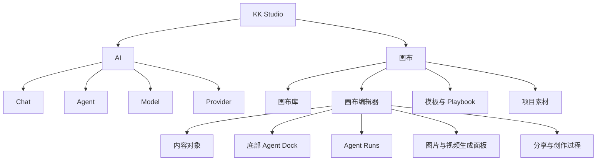
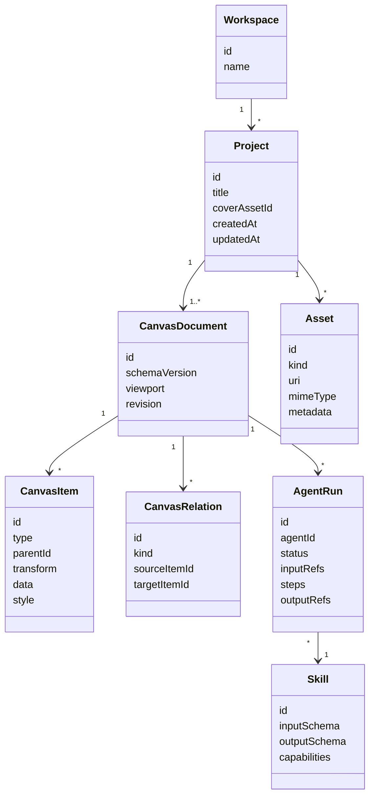

# 无限画布产品原型方案

> 交互原型：直接打开 [`infinite-canvas-prototype/index.html`](infinite-canvas-prototype/index.html)，无需安装依赖或启动服务。

## 1. 方案结论

`kk-studio` 的画布应定位为 **Agent 原生的多模态创作工作区**：用户把想法、资料和已有产物放入空间，Agent 在同一空间理解上下文、展示执行过程，并把可继续编辑的结果放回画布。

产品不以“通用白板”或“节点工作流编辑器”为最终形态，也不把漫剧生产流程固化进底层。底层承载通用内容、关系、执行和扩展协议；漫剧、视觉设计、研究整理、技术方案等能力通过模板、Skill 和 Agent 组合提供。

核心产品表达：

```text
把资料放进来
-> 选中局部或使用整张画布作为上下文
-> 让 Agent 规划并执行
-> 过程可见、结果落位、来源可追溯
-> 将有效流程保存为模板或 Skill
```

首个原型应证明四件事：

1. 画布基础操作自然、低学习成本。
2. 文本、图片、文件和 AI 结果能在同一空间连续组织。
3. Agent 能理解选区或整张画布，并以可中断的步骤执行。
4. 节点、动作、Skill、模型和导入导出能力可以独立扩展。

## 2. 产品定位

### 2.1 目标用户

| 用户 | 核心任务 |
| --- | --- |
| AI 创作者 | 从灵感、参考图和提示词连续生成、对比和整理多模态结果 |
| Agent 使用者 | 把零散资料交给 Agent，观察执行过程并调整中间结果 |
| 产品与研发人员 | 在同一空间整理需求、架构、资料和 Agent 产出 |
| 内容生产者 | 通过模板把大纲、资产、分镜、图片和视频串成可重复流程 |

### 2.2 核心价值

| 传统形态 | 画布形态 |
| --- | --- |
| Chat 中上下文线性堆叠 | 空间中的对象可并列、分组、引用和分支 |
| AI 只返回最终答案 | Agent 的计划、运行状态和结果均可见 |
| 结果离开会话后难复用 | 结果天然成为可编辑、可引用的画布对象 |
| 能力入口按模型和工具堆叠 | 用户围绕对象选择下一步动作，Skill 负责封装复杂能力 |
| 成功流程依赖人工记忆 | 可保存为模板、Playbook 或 Skill |

### 2.3 产品原则

1. **对象优先**：用户操作内容对象，不直接面对底层模型 API 或工作流参数。
2. **直接操纵优先**：拖拽、框选、就地编辑和上下文工具条承担高频操作。
3. **AI 是参与者，不是独立页面**：Agent 读取画布上下文并在画布中工作。
4. **过程可见**：长任务展示计划、步骤、耗时、失败原因和重试入口。
5. **结果落位稳定**：结果出现在来源附近，保留来源关系，不让用户寻找产物。
6. **渐进式复杂度**：默认界面轻量，高级配置只在需要时展开。
7. **能力可注册**：节点类型、上下文动作、Skill、模型适配器和导入器均通过稳定契约扩展。
8. **文档模型与渲染解耦**：画布数据不绑定某个前端组件库，便于迁移、协作和服务端处理。

## 3. 信息架构

画布是与 AI 控制台并列的顶级产品域，使用独立路由，不作为 `AiConsoleTab` 的子页。



建议路由：

| 路由 | 页面 |
| --- | --- |
| `/canvas` | 画布库 |
| `/canvas/new` | 新建画布入口，可用弹窗替代独立页面 |
| `/canvas/:canvasId` | 画布编辑器 |
| `/canvas/:canvasId/share` | 只读分享与创作过程 |

## 4. 核心对象模型

### 4.1 领域层级



产品界面首期只展示“画布”概念；`Project` 与 `CanvasDocument` 的分层属于内部模型，为后续多页面、资产复用和复杂项目预留，避免向用户暴露 WorkRally 式“项目 ID / 画布 ID”双重概念。

### 4.2 对象分类

| 分类 | 对象 | 产品语义 |
| --- | --- | --- |
| 内容 | 文本、图片、视频、音频、文件、网页卡片 | 用户直接阅读和编辑的内容 |
| 结构 | Frame、Group、Section、Sequence | 组织空间、表达层级和顺序 |
| 执行 | Agent Run、Skill Run、生成任务 | 表达进行中、成功、失败和可重试的工作 |
| 结果 | 文本结果、媒体结果、结构化结果、变体组 | Agent 或工具产生的可继续编辑对象 |
| 关系 | 引用、派生、顺序、手动连接 | 表达来源和语义，不只是一条视觉连线 |

### 4.3 关系语义

连接线不应默认铺满画布。关系分为：

| `kind` | 用途 | 默认展示 |
| --- | --- | --- |
| `derived-from` | 结果由哪个对象或运行产生 | 选中相关对象时显示 |
| `references` | 一个对象引用另一个对象 | 选中或悬停时显示 |
| `sequence` | 分镜、步骤或时间顺序 | 所在 Frame 内持续显示 |
| `manual` | 用户主动创建的逻辑连接 | 持续显示 |

## 5. 页面原型

### 5.1 画布库

画布库结合 NeoWOW 的模板入口、个人/协作分类和项目管理能力，但保持 `kk-studio` 的简洁控制台风格。

```text
┌─────────────────────────────────────────────────────────────────────────────┐
│ KK Studio                     AI   [画布]                       Workspace  ● │
├─────────────────────────────────────────────────────────────────────────────┤
│                                                                             │
│  画布                                                        搜索画布  新建 │
│  把想法、资料和 Agent 产出放在同一个空间                                    │
│                                                                             │
│  ┌───────────────────────────────────────────────────────────────────────┐  │
│  │  告诉我你想完成什么…                         [从想法创建] [导入资料]  │  │
│  └───────────────────────────────────────────────────────────────────────┘  │
│                                                                             │
│  快速开始                                                                   │
│  [ 空白画布 ] [ 研究与归纳 ] [ 视觉方向探索 ] [ 故事与分镜 ] [ 技术方案 ] │
│                                                                             │
│  全部   我的   与我协作                          文件夹  多选  网格/列表    │
│                                                                             │
│  ┌──────────────────┐ ┌──────────────────┐ ┌──────────────────┐            │
│  │ 产品视觉方向探索 │ │ Agent 工具设计   │ │ 短片概念草案     │            │
│  │ 预览缩略图       │ │ 预览缩略图       │ │ 预览缩略图       │            │
│  │ 18 项 · 刚刚编辑 │ │ 42 项 · 昨天     │ │ 26 项 · 3 天前   │            │
│  └──────────────────┘ └──────────────────┘ └──────────────────┘            │
└─────────────────────────────────────────────────────────────────────────────┘
```

### 关键行为

- “从想法创建”先让 Agent 生成画布骨架，用户确认后再执行耗时能力。
- “导入资料”支持文件、图片、URL 和粘贴内容，导入后生成可编辑对象。
- 模板卡只表达用户目标，不直接暴露模型名。
- 项目卡展示内容缩略图、对象数、运行状态和更新时间。
- 个人/协作分类、文件夹、多选、搜索、网格密度沿用成熟商业产品的信息架构。

### 5.2 新建画布

```text
┌──────────────────────── 新建画布 ────────────────────────┐
│                                                          │
│  从哪里开始？                                            │
│                                                          │
│  ○ 空白画布        自由添加内容                          │
│  ○ 一句话创建      Agent 先生成结构和待办                │
│  ○ 导入资料        文件、图片、网页或粘贴内容            │
│  ○ 使用模板        从 Playbook 创建可编辑骨架            │
│                                                          │
│  画布名称  [ 未命名画布                              ]   │
│                                                          │
│                                      取消    创建画布     │
└──────────────────────────────────────────────────────────┘
```

“一句话创建”示例：

```text
整理这些竞品资料，输出产品定位、功能矩阵和一个 MVP 原型
```

Agent 返回待确认计划：

```text
1. 创建资料区
2. 提取竞品卡片
3. 生成对比矩阵
4. 生成 MVP 页面框架
5. 将结论放入总结 Frame
```

用户确认后，系统创建初始 Frame 和运行对象。

### 5.3 画布编辑器

```text
┌─────────────────────────────────────────────────────────────────────────────┐
│ ← 画布库   产品视觉方向探索     已保存        帮助  分享  导出  ···          │
├─────────────────────────────────────────────────────────────────────────────┤
│        ┌────────── 参考资料 Frame ──────────┐                               │
│        │  [网页卡]  [图片]  [PDF]           │                               │
│        └────────────────────────────────────┘                               │
│                         │                                                   │
│               ┌──── Agent Run ────┐       [方向 A]  [方向 B]                │
│               │ 正在归纳 · 3 / 4  │                                         │
│               │ 暂停 / 继续 / 重试 │                                         │
│               └────────────────────┘                                        │
│                                                                             │
│  Space 平移                                                Mini map  72%    │
│                                                                             │
│             ┌──────── Agent 消息（首次发送后展开，可滚动） ────────┐        │
│             │ [当前选区 3] [整张画布]  Agent 计划 / 运行 / 完成     │        │
│             └──────────────────────────────────────────────────────┘        │
│             ┌──────────────────────────────────────────────────────┐        │
│             │   ＋   告诉 Agent 下一步要完成什么…              ↑    │        │
│             └──────────────────────────────────────────────────────┘        │
└─────────────────────────────────────────────────────────────────────────────┘
```

### 区域职责

| 区域 | 职责 |
| --- | --- |
| 顶栏 | 返回、标题、保存状态、帮助、分享、导出和低频菜单 |
| 中央 Stage | 全高画布，负责内容编辑、空间组织、Agent Run 与结果落位 |
| 底部 Agent Dock | 以“添加、输入、发送”为主行；承接自然语言任务和快捷键聚焦 |
| Dock 上方 thread | 在首次任务后展示选区/整图上下文、用户消息、计划、运行状态和完成消息；消息独立滚动 |
| Dock 上方生成面板 | 按需展示图片或视频生成的参考素材、提示词、参数和成本，不成为永久侧栏 |
| 右下角 | 缩放、适应视图、小地图，与 Dock 分离 |

编辑器不保留长期占位的左侧工具栏或右侧 Copilot。选择、平移和文本等基础工具通过快捷键与画布手势保持可用；所有核心 AI 交互聚合至底部 Agent Dock。

### 5.4 上下文工具条

选中对象后在对象上方显示浮动工具条：

```text
[编辑] [让 AI 处理 ▾] [加入上下文] [成组] [更多 ···]
```

不同对象注册自己的高频动作：

| 对象 | 高频动作 |
| --- | --- |
| 文本 | 编辑、总结、改写、生成结构、生成图片 |
| 图片 | 查看、变体、局部编辑、生成视频、下载 |
| 文件 | 预览、提取、总结、拆分为卡片 |
| Frame | 作为上下文、自动整理、生成总结、保存为模板 |
| Agent Run | 查看步骤、暂停、继续、取消、重试失败步骤 |
| 结果组 | 切换变体、并排展开、选为主结果、继续生成 |

复杂模型参数放入二级面板，不在首层工具条平铺。

### 5.5 Agent Run 对象

Agent Run 是一等对象，不应只存在于 Dock 的消息记录中。

状态：

```text
Draft -> Queued -> Running -> WaitingForInput -> Succeeded
                         \-> Failed
                         \-> Cancelled
```

运行对象展示：

- 任务目标。
- 使用的 Agent / Skill。
- 当前步骤与总步骤。
- 已完成、进行中、等待输入和失败步骤。
- 输入对象引用。
- 已生成结果数量。
- 暂停、继续、取消和重试入口。
- 预估或实际资源消耗，存在计费时展示。

Agent 需要用户确认时，运行对象进入 `WaitingForInput`，并在原地展示选择项，不通过全局弹窗打断用户。

## 6. 核心用户流程

### 6.1 自由创作

```text
新建空白画布
-> 粘贴文本或拖入图片
-> 空白处双击创建文本
-> 框选多个对象
-> 执行“生成三个方向”
-> Agent Run 出现在选区右侧
-> 结果组出现在 Run 右侧
-> 用户选择一个结果继续编辑
```

### 6.2 资料研究

```text
导入网页 / PDF / 图片
-> 自动创建资料 Frame
-> 选择 Frame 作为上下文
-> 输入“提取关键信息并建立对比”
-> Agent 创建摘要卡和对比表
-> 用户修订结论
-> 将 Frame 保存为研究模板
```

### 6.3 从想法生成结构

```text
在画布库输入目标
-> Agent 返回执行计划
-> 用户确认计划
-> 创建画布骨架
-> 各步骤以 Run 和结果对象呈现
-> 用户可在任一步骤暂停、替换输入或重新执行
```

### 6.4 对象驱动的连续生成

```text
选中文本
-> 生成图片
-> 选择图片变体
-> 生成视频
-> 生成音频或配音
-> 将结果放入 Sequence Frame
```

每一步都保留 `derived-from` 关系，用户选中结果时可以查看来源和生成参数。

### 6.5 模板与 Skill 复用

```text
选择一组 Frame + Run
-> 保存为 Playbook
-> 定义可替换输入
-> 下一次从模板创建
-> 用户只填写目标和素材
-> Skill / Agent 执行同一结构
```

## 7. 交互规范

### 7.1 指针与视口

采用设计工具和主流白板的一致习惯：

| 操作 | 行为 |
| --- | --- |
| 空白处左键拖动 | 框选 |
| `Space` + 左键拖动 | 平移 |
| 中键拖动 | 平移 |
| 触控板双指 | 平移 |
| `Ctrl/Cmd` + 滚轮或双指捏合 | 以指针为中心缩放 |
| 双击空白处 | 快速创建文本或打开快捷添加 |
| `0` | 适应全部内容 |
| `1` | 100% 缩放 |
| `F` | 聚焦当前选区 |

不采用本地开源项目“空白处左键拖动即平移、`Ctrl/Cmd + 拖动`才框选”的交互，避免与 Figma、Miro、tldraw 等主流习惯相反。

### 7.2 选择与编辑

- 单击选择，`Shift` 追加或取消选择。
- 拖动选区保持相对位置。
- 双击进入对象编辑。
- `Enter` 进入编辑，`Esc` 退出编辑或清除选择。
- `Cmd/Ctrl + A` 优先选择当前 Frame 内对象，再次执行选择全画布。
- 多选时工具条只展示所有对象都支持的动作。
- 对媒体对象默认保持原始比例，显式进入自由变形后才允许拉伸。

### 7.3 创建与粘贴

- 粘贴文本创建文本卡。
- 粘贴图片创建图片对象。
- 粘贴 URL 创建网页卡，并在后台抓取标题、摘要和封面。
- 拖入多个文件时自动形成临时 Frame，防止对象堆叠。
- 新对象创建在视口中心或指针附近，不在世界坐标原点。

### 7.4 AI 结果落位

- 单一来源的结果默认放在来源右侧。
- 多选来源的结果默认放在选区包围盒右侧。
- 结果数量大于一个时先形成变体组，避免一次铺满画布。
- 运行对象位于来源和结果之间，形成稳定的“输入 -> 运行 -> 结果”阅读方向。
- 结果生成期间先放置骨架，占位尺寸与最终对象一致，防止布局跳动。
- 失败保留在原位，展示错误、重试和更换模型入口。

### 7.5 保存与撤销

- 所有用户可见变更进入统一命令历史，包括节点、关系、Frame、视口书签和 Agent 结果接纳。
- 连续拖拽、缩放和文本输入合并为单个撤销单元。
- Agent 运行的外部副作用不通过普通撤销删除；撤销只移除其画布结果，运行记录仍可追溯。
- 顶栏持续展示 `保存中 / 已保存 / 保存失败`。
- 页面刷新后恢复最后持久化状态和视口。

## 8. 扩展基座

扩展性通过少量稳定注册协议实现，不在首期引入重量级插件运行时。

### 8.1 节点类型注册

```ts
interface CanvasItemDefinition<TData> {
  type: string
  version: number
  dataSchema: unknown
  createDefault(): TData
  render: unknown
  inspector?: unknown
  getContextActions(item: CanvasItem<TData>): CanvasActionRef[]
  serialize(item: CanvasItem<TData>): unknown
  migrate?(data: unknown, fromVersion: number): TData
}
```

每个节点类型负责：

- 数据 schema。
- 默认尺寸和创建数据。
- 渲染器与检查器。
- 支持的上下文动作。
- 序列化与版本迁移。

通用位置、尺寸、层级、锁定、可见性和关系不放入节点私有 `metadata`。

### 8.2 动作注册

```ts
interface CanvasActionDefinition {
  id: string
  title: string
  accepts: CanvasSelectionPredicate
  inputSchema?: unknown
  execute(context: CanvasActionContext): Promise<CanvasActionResult>
  placement?: CanvasResultPlacement
}
```

动作可以来自：

- 内置编辑能力。
- Agent 工具。
- Skill。
- 模型能力。
- 第三方扩展。

动作只声明可接受对象和输入输出，不直接操作页面组件。

### 8.3 Skill 协议

| 字段 | 作用 |
| --- | --- |
| `id / name / description` | 展示与检索 |
| `inputSchema` | 所需参数和可接受对象类型 |
| `outputSchema` | 结果对象类型和数量 |
| `capabilities` | 文本、图像、视频、文件、网络等权限 |
| `executionMode` | 同步、异步或多步骤 Agent |
| `placement` | 结果默认落位策略 |
| `costPolicy` | 计费预估和确认策略 |
| `visibility` | 私有、工作区、公开市场 |

### 8.4 模型适配器

模型不直接成为产品一级入口。模型适配器提供能力描述：

```text
text.generate
image.generate
image.edit
video.generate
speech.synthesize
embedding.create
```

Skill 和动作根据能力选择模型；只有高级用户需要在运行前覆盖模型和参数。

### 8.5 导入导出扩展

| 扩展 | 输入或输出 |
| --- | --- |
| Importer | 文件、URL、剪贴板、外部项目包 |
| Exporter | PNG、PDF、JSON 项目包、只读分享页 |
| Previewer | PDF、视频、音频、网页和代码预览 |
| Indexer | 文本提取、OCR、向量索引和缩略图 |

### 8.6 命令与事件

画布内部通过意图级命令修改文档：

```text
CreateItems
UpdateItems
MoveItems
ResizeItems
DeleteItems
CreateRelations
GroupItems
StartAgentRun
AcceptRunOutputs
```

命令层为撤销、协作、审计和服务端 Agent 操作提供统一边界。Agent 不直接改前端状态，而是提交同一组画布命令。

## 9. 节点与能力分期

### 9.1 原型节点

| 节点 | 原型能力 |
| --- | --- |
| Text | 就地编辑、Markdown 展示、AI 改写 |
| Image | 预览、下载、变体、生成视频入口 |
| File | 文件名、类型、摘要、预览入口 |
| Web Card | 标题、URL、摘要和封面 |
| Frame | 命名、折叠、自动布局、作为上下文 |
| Agent Run | 计划、步骤、状态、控制和结果引用 |
| Result Group | 变体叠放、展开、主结果选择 |

### 9.2 MVP 节点

在原型节点基础上增加：

- Video。
- Audio。
- Table / Structured Data。
- Sequence。
- 基础 Shape 与 Connector。

### 9.3 后续扩展

- 画笔与标注。
- 代码与可执行组件。
- 分镜、角色、场景等垂直领域节点。
- 实时协作者光标与选区。
- 公共模板和 Skill 市场。
- 创作过程回放与公开社区。

## 10. 视觉方向

### 10.1 与现有产品一致

- 外层 Shell、画布库、编辑器顶栏、调研面板和反馈沿用 KK Studio 的深色绿色强调设计；绿色、橙色、蓝色和紫色用于表达层级、状态与模板类型。
- 顶级导航保留 AI / 画布两域，不在画布内重复 AI 控制台子导航。
- 画布页面使用全高 `stage`，不使用卡片列表页的固定内容 padding。
- 异步运行状态沿用现有 Agent `queued / running / succeeded / failed` 语义。

### 10.2 画布视觉规则

- 只有 Stage 使用中性近黑/炭灰底色，细点阵与关系线保持低对比；Frame 是略亮的中性工作区域，不使用绿色地面。
- 节点延续深色绿色强调的产品层级；边框默认弱化，只在悬停、选中和错误时增强，选中和 Run 状态可使用克制绿色。
- 控制面按需出现：底部 Dock 固定但紧凑，可保持中性黑灰；添加菜单、消息 thread 和生成面板不激活时不占用画布。
- 图片和视频预览可以保留抽象色彩，优先显示媒体内容；视频预览保留比例、播放和时长标识。
- Agent Run 使用明确但克制的状态色，运行中不使用持续大面积动画，并尊重 `prefers-reduced-motion`。

### 10.3 图片与视频生成

- 从 Dock 的添加菜单选择图片生成或视频生成，在 Dock 上方打开集中生成面板。
- 面板包含图片/视频模式切换、三个参考素材缩略块与添加槽、大型提示词输入、随模式变化的参数 chips、模拟成本和圆形发送按钮。
- 图片模式提供模型、比例、数量或风格；视频模式提供模型、分辨率或比例、时长、运动或镜头控制。
- 提交后面板收起，thread 记录生成任务和完成状态；画布从 Agent Run 右下方开始寻找无碰撞空位，创建保持来源关系的媒体结果节点。

### 10.4 避免的形态

- 永久占据画布的工具栏、Copilot 侧栏或大面积参数面板。
- 将所有节点类型、模型和生成参数平铺为十几个图标。
- 每次生成都创建高对比可见连线，导致关系网遮挡内容。
- 把聊天侧栏作为唯一 AI 入口。
- 用统一 `metadata` 容器堆积各业务字段。
- 让用户手工创建“配置节点”才能完成常见生成。

## 11. 原型范围与迭代顺序

### 11.1 阶段 A：交互原型

目标：验证页面结构和核心交互，不连接真实生成接口。

- 画布库。
- 新建画布流程。
- 基础平移、缩放、框选、拖拽和多选。
- Text、Image、File、Frame、Agent Run、Result Group。
- 底部 Agent Dock、按需展开的消息 thread 与集中生成面板。
- 选区/整图上下文切换与选区上下文工具条。
- 模拟 Agent Run、暂停/继续/重试和结果落位。
- 深色视觉与现有 Shell 集成。

### 11.2 阶段 B：画布 MVP

目标：形成可靠的通用画布基础。

- 服务端项目与画布持久化。
- 统一命令历史和撤销重做。
- 素材上传与引用。
- 自动保存、恢复和导入导出。
- 节点、动作和导入器注册表。
- 画布性能和大对象加载策略。

### 11.3 阶段 C：Agent 原生能力

目标：让现有 Agent 运行时真正进入画布。

- 选区和整张画布上下文组装。
- Agent Run 对象与 SSE 状态同步。
- Agent 通过画布命令创建、更新和组织对象。
- 暂停、继续、取消、失败重试和等待用户输入。
- 运行结果来源追踪。
- Skill 注册与模板化执行。

### 11.4 阶段 D：协作与生态

目标：形成商业产品闭环。

- 实时协作、Presence 和权限。
- 只读分享与创作过程回放。
- Playbook / Skill 市场。
- 模板与作品社区。
- 用量、积分、成本和授权策略。

## 12. 初步技术取向

### 12.1 推荐基座

首期建议以 **React Flow** 作为节点与视口交互基座：

- MIT 许可。
- React 节点天然支持富文本、媒体、表单和 Agent 状态组件。
- 内置拖拽、平移、缩放、多选、连接、MiniMap、Controls、NodeToolbar 和 NodeResizer。
- 当前官方 peer dependency 支持 React `>=17`，与项目 React 19 兼容。
- 数据结构天然接近 `items + relations + viewport`。
- 可以先交付节点工作区，再按实际性能瓶颈引入虚拟化或图形渲染层。

React Flow 只承担交互与渲染，不作为领域模型：

```text
CanvasDocument
-> View Model Adapter
-> React Flow nodes / edges
-> React components
```

### 12.2 暂不直接采用的路线

| 路线 | 当前判断 |
| --- | --- |
| tldraw SDK | 产品级白板体验强，但其自定义许可默认仅限开发/测试；生产使用需要官方 trial、commercial 等 license key。许可文本声明包含 license 校验、环境检测和 watermark 展示等技术强制措施；其 shape/whiteboard 模型也不是本方案富业务节点的最短路径。 |
| Konva / Fabric / PixiJS / LeaferJS | 适合设计器或大量图元场景，但富 DOM 节点、连接、撤销、协作和 Agent UI 需要更多自建 |
| 纯 DOM/CSS 自研 | 可控但交互细节和长期维护成本高；本地开源项目已展示单体页面和交互偏差风险 |
| 直接复用本地 `infinite-canvas` | 项目为 AGPL-3.0；若修改版支持远程网络交互，AGPL-3.0 §13 要求向相关用户提供获取对应源码的机会，具体合规边界需法务评估。适合作为行为和模块边界参考，不直接复制源码。 |

### 12.3 与当前仓库的集成边界

- `AppShell` 中现有“画布”按钮改为 `/canvas` 的顶级链接。
- 画布功能放入独立 `features/canvas`，不扩展 `AiConsoleTab`。
- 服务端查询继续使用 React Query。
- 高频本地交互状态由画布专用 store 管理，文档数据通过命令层修改。
- Agent Run 复用现有 session / event / run 语义，并新增画布上下文与画布命令边界。
- 编辑器路由按需懒加载，避免画布依赖增加 AI 控制台首屏体积。

## 13. 竞品结论

| 产品 | 值得借鉴 | 对本方案的约束 |
| --- | --- | --- |
| NeoWOW | 首页想法输入、画布库、模板分类、个人/协作画布、Skill 商城、Agent 与作品社区闭环 | 底层不绑定漫剧领域；借鉴产品闭环而非未公开的编辑器细节 |
| WorkRally | Yjs 协作、8 类明确节点、Agent/CLI 可操作画布、任务状态与素材体系 | 避免向用户暴露项目/画布双重概念；垂直节点通过扩展提供 |
| Seko | “输入灵感 -> AI 自动策划”、空白画布与模板双入口、作品广场 | 一句话创建应先展示计划，避免黑盒一键成片 |
| Miro AI | 整张画布作为 Prompt、Agent 在画布上构建结构、流程模板化 | 底部 Agent Dock 必须同时支持选区和整图上下文 |
| tldraw Computer | 组件连接、分支、循环和自然语言计算 | 执行过程应成为可见对象，但不要求普通用户手工搭工作流 |
| 即梦类视觉画布 | 选中对象后继续生成、结果回到画布、多模态连续操作 | 强化对象上下文工具条和稳定落位 |
| 本地 `infinite-canvas` | CSS 视口变换、节点/存储分层、导入导出、MCP 操作画布 | 不沿用反常框选方式、永久大 Dock、业务字段堆积和大页面耦合 |

## 14. 原型验收标准

### 14.1 产品验收

1. 新用户从进入画布库到创建首个对象不超过 3 次主要操作。
2. 用户能从选区发起 AI 任务，并明确知道 Agent 读取了哪些对象。
3. Agent 运行、等待输入、失败和成功状态无需打开日志即可理解。
4. 结果始终出现在来源附近，并能追溯来源。
5. 用户可以选择结果继续生成，而不需要重新上传或复制提示词。
6. 底部 Agent Dock 之外不保留固定 AI 侧栏；核心画布区域不被长期控制面侵占。
7. 基础指针操作符合主流设计工具习惯。

### 14.2 基座验收

1. 新节点类型可通过注册定义接入，不修改画布核心分发逻辑。
2. 新动作可声明可接受对象和结果落位策略。
3. Agent 与用户通过同一命令层修改画布。
4. 文档 schema 带版本号并支持迁移。
5. 撤销重做覆盖全部画布编辑命令。
6. 运行状态与文档内容分离，刷新后均可恢复。
7. 200 个富内容对象下平移和缩放保持可用，性能指标在实现阶段通过基准测试确定。

## 15. 推荐的首个演示场景

原型使用“竞品研究与产品方案”作为默认演示模板，能够同时覆盖文件、网页、图片、文本、结构化结果和 Agent Run：

```text
用户导入 3 个竞品页面和 2 张截图
-> Agent 提取产品定位与功能
-> 创建竞品卡片和功能矩阵
-> 生成目标产品的信息架构
-> 创建三张页面线框图
-> 用户选择一张继续细化
```

该场景比单纯生图更能证明 `kk-studio` 的 Agent 能力，也不会把画布基座过早限定为视觉或短剧工具。

## 16. 证据来源

### 当前仓库

- `frontend/src/platform/shell/AppShell.tsx`：AI 与画布为顶级导航，画布当前为禁用按钮。
- `frontend/src/app/router.tsx`：当前仅有 `/agent/*` 路由。
- `frontend/package.json`：React 19、React Router 7、React Query 5、Vite 6。
- `frontend/src/styles.css`：现有深色主题、绿色主色和全高 `stage`。

### 本地开源项目

- `/home/fengwk/proj/infinite-canvas/README.md`
- `/home/fengwk/proj/infinite-canvas/web/src/components/canvas/infinite-canvas.tsx`
- `/home/fengwk/proj/infinite-canvas/web/src/components/canvas/canvas-toolbar.tsx`
- `/home/fengwk/proj/infinite-canvas/web/src/types/canvas.ts`
- `/home/fengwk/proj/infinite-canvas/web/src/stores/canvas/use-canvas-store.ts`
- `/home/fengwk/proj/infinite-canvas/canvas-agent/src/schemas.ts`
- `/home/fengwk/proj/infinite-canvas/LICENSE`

### 产品与技术资料

- NeoWOW：https://neodomain.cn/neo-tv
- NeoWOW 画布库：https://neodomain.cn/workflows
- NeoWOW 超创站：https://neodomain.cn/inputSection
- WorkRally：https://github.com/Tencent/workrally
- WorkRally 画布指南：https://raw.githubusercontent.com/Tencent/workrally/main/references/canvas-guide.md
- Seko：https://seko.sensetime.com/explore
- Miro AI：https://miro.com/ai/ai-overview/
- tldraw Computer：https://computer.tldraw.com/
- React Flow：https://reactflow.dev/
