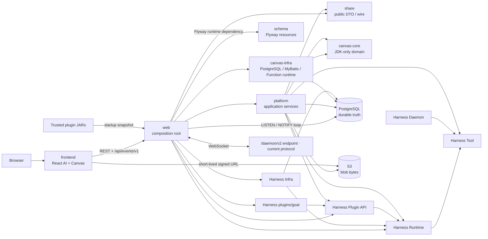

# 系统设计

`kk-studio` 是一个由 Web 组合根承载的单实例工作台。系统有两个并列产品域：
Harness / AI 负责可恢复的 Agent Thread 执行，Studio / Canvas 负责图形、Resource
与 Function 运行。两者共享 PostgreSQL、全局 Blob Storage、应用事件 WebSocket
和浏览器入口，但不共享领域状态机。

## 核心概念与全局不变量

| 概念 | 当前边界 |
| --- | --- |
| Durable truth | PostgreSQL 保存会影响恢复、重试、查询、删除和版本对账的业务事实；进程内对象只保存执行期 reservation、连接和 live projection。 |
| Snapshot | REST Snapshot 是 Thread 和 Canvas 的权威读取面；通知和 WebSocket 只负责低延迟唤醒或可丢失 overlay。 |
| Work | Harness 与 Canvas 都把可调度事实放在 PostgreSQL，并以 claim、lease、token 和 poll 处理丢通知、断线和进程退出。 |
| Version | Harness Thread version 与 Canvas document version 是独立单调坐标；HTTP mapper 使用 canonical UUID 和 decimal cursor。 |
| Composition root | `web` 是唯一生产 Spring Boot root；`platform`、Core、Runtime 和 plugin API 不创建第二个 root。 |
| Byte boundary | Blob metadata 与引用在 PostgreSQL；对象字节在受控 Blob Storage；浏览器只取得短期签名 URL。 |

跨域写入必须在单个定义清晰的事务边界内完成，失败时不留下半成品事实；
外部 I/O 不持有业务锁。任何 stale token、过期 lease、重复 callback 或版本
gap 都只能产生 no-op、resync 或可恢复的内部失败，不能覆盖新 owner 的状态。



## Goals

- **Durable execution。** PostgreSQL 保存会影响恢复、重试、查询和删除的全部事实；
  进程退出后，已提交的 Command、Entry、Invocation、Work 和 Blob 引用仍可继续处理。
- **清晰的领域边界。** `canvas-core` 与 `harness-runtime` 保持 framework-free；
  数据库、网络、Provider、Environment 和插件装配由外层适配。
- **快照优先的客户端模型。** REST Snapshot 是权威投影，应用事件通道只传递
  version 或 live overlay；客户端可在首次连接、重连或 gap 后重新对账。
- **受约束的并发。** durable Work 使用 PostgreSQL claim/lease/fencing；Provider、
  Tool 和 subagent 使用有界的进程内 admission，不以隐式线程队列代替容量控制。
- **明确的字节边界。** PostgreSQL 保存 Blob 的 hash、媒体事实、引用和生命周期；
  S3 保存 original/preview 字节，浏览器只获得短期签名 URL。
- **单一组合根。** `web` 负责 Spring Bean、Notification loop、dispatcher、插件
  snapshot、HTTP、WebSocket 与静态资源的生产装配。

## Non-goals

- PostgreSQL `NOTIFY` 不承担持久化、重放或审计职责；丢失通知必须可以由 poll 或
  Snapshot 收敛。
- `canvas-core` 不连接 PostgreSQL、S3、HTTP、Spring 或 Harness；Canvas Link 也
  不是自动 DAG 调度器。
- Realtime overlay 不替代 durable Snapshot；浏览器本地 Pane、布局和 draft 不写入
 业务表。
- S3 对象 key、bucket、长期 URL 和原始 URI 不进入 durable message、Command 或
  Function state。
- 系统不提供用户/管理员角色模型；`/api/settings` 属于受信任单用户部署边界。

## 1. Durable truth 与字节边界

### PostgreSQL-only durable truth

唯一 Flyway baseline 是
`schema/src/main/resources/db/migration/V1__schema.sql`。它定义 Catalog、Chat、
Canvas、Harness、owner relation、System Settings 和全局 Storage 的表、约束及
PostgreSQL trigger。`schema/src/main/resources/db/seed/**` 提供 dev、e2e、
canvas-test profile seed。

PostgreSQL 中的关键事实分为四组：

| 事实组 | 代表内容 |
| --- | --- |
| 产品聚合 | `agent_*`、`chat`、`canvas_*`、`system_setting` |
| Harness 协议 | `harness_session`、`harness_entry`、`harness_thread`、`harness_thread_command`、`harness_model_invocation`、`harness_tool_invocation`、`harness_work` |
| 归属关系 | `chat_session`、`canvas_session`、`session_blob_ref` |
| Blob 元数据 | `storage_blob`、`storage_upload`，以及 Canvas Resource 对 Blob 的引用 |

进程内对象只承担执行中的 reservation、连接、线程和 live projection。它们关闭后
不能成为恢复依据：恢复始终重新读取 PostgreSQL。

### S3 字节边界

`storage_blob` 保存内容摘要、媒体事实、引用计数和生命周期；对象内容与预览字节
保存在 S3。对象 key 只由服务端根据 Blob identity 派生，浏览器和业务 DTO 不接收
bucket、key 或长期 URL。

上传校验、对象复制和删除在数据库长事务外执行；短事务只负责 upload/Blob
去重、引用和 cleanup 事实。durable message 与 Canvas Resource 只保存 `blobId`
或内联文本，读取时再获取短期签名 URL。引用归零后，后台 maintenance 依据
PostgreSQL 中的 token-fenced cleanup state 删除对象并收敛元数据。完整协议由
[Platform 模块](modules/platform.md)负责。

## 2. 模块与依赖边界

### Maven reactor 与逻辑模块

根 `pom.xml` 直接聚合六个 Maven module：`share`、`schema`、`canvas`、
`harness`、`platform`、`web`。`canvas/pom.xml` 再聚合 `canvas/core` 和
`canvas/infra`；`harness/pom.xml` 再聚合 `tool`、`runtime`、`plugin-api`、
`infra`、`daemon` 和 `plugins/goal`。下表列出的是可维护的逻辑模块/目录，
不是 root reactor 的直接 children。`frontend/` 是独立的 Node/Vite 工程，
不属于 Maven reactor。

| 模块 | 当前职责 | 直接边界 |
| --- | --- | --- |
| `frontend` | React 页面、AI/Canvas feature、API client、Pane 与本地状态 | 只经 Web REST/WebSocket 与短期 S3 URL |
| `share` | public DTO 与 JSON/wire 形状 | 生产依赖只有 Jackson annotations |
| `schema` | Flyway V1 baseline 与 profile seed 资源 | 无 Java、无生产依赖 |
| `canvas/core` | Canvas 领域、typed command、ports、Function Catalog | JDK-only |
| `canvas/infra` | Canvas PostgreSQL/MyBatis、Snapshot query、Function durable runtime | 依赖 `canvas-core`，不反向依赖 Platform/Harness/Web |
| `harness/tool` | Tool、descriptor、ResourceRef、Environment Capability、Daemon wire | Tool 基础契约 |
| `harness/runtime` | Session/Entry/Thread/Command/Invocation/Work 状态机与 processors | 纯 Java |
| `harness/plugin-api` | trusted plugin 的 Catalog、BranchView、Tool、intent 与 projector API | 纯 Java |
| `harness/infra` | PostgreSQL HarnessStore、Work dispatcher、realtime、Resource store | 依赖 Runtime/Tool |
| `harness/daemon` | 独立 Environment 进程适配器 | 只依赖 Tool |
| `harness/plugins/goal` | Goal v2 的 branch-scoped `CUSTOM` snapshot 插件 | 依赖 Plugin API |
| `platform` | Catalog、Storage、Chat/Canvas application service、Resolver、Model/Tool/Environment Gateway | 适配 Share、Core/Runtime ports，不成为组合根 |
| `web` | Spring Boot、HTTP、浏览器事件、daemon WebSocket、生产生命周期 | 唯一 composition root |

依赖方向保持为：

```text
frontend -> web API
web -> platform
platform -> share
web -> canvas-infra -> canvas-core
web -> harness-infra -> harness-runtime -> harness-tool
web -> harness-runtime
web -> harness-plugin-api / harness/plugins/goal
platform -> canvas-core
platform -> harness-runtime -> harness-tool
platform -> harness-plugin-api
harness-daemon -> harness-tool
```

`platform` 的架构测试禁止它引用 `canvas-infra`、`harness-infra`、`web` 和
`harness-daemon` 的生产实现；`web` 的架构测试要求它直接声明 Canvas Infra、
Harness Infra、Plugin API 和 Goal plugin，保证组合根不会依赖未声明的传递实现。

## 3. Web composition root

`web/src/main/java/fun/fengwk/kkstudio/web/WebApplication.java` 是唯一
`@SpringBootApplication` 入口。它在 Web runtime 与 event package 中完成以下
装配：

1. `HarnessRuntimeConfiguration` 注入 `UUID::randomUUID`、PostgreSQL
   `HarnessStore`、Resource store、Model/Tool processor、dispatcher 和
   `PostgresqlRealtimeEventSink`。
2. `BuiltInPluginConfiguration` 提供 Goal plugin；`PluginCatalogConfiguration`
   收集 Spring `HarnessPlugin` 与 `HarnessPluginSource`，由
   `TrustedJarPluginLoader` 加载受信任 JAR，并在启动时冻结 `PluginCatalog`。
3. `HarnessRuntimeLifecycle` 按 `workers-enabled` 启停 Harness dispatcher；
   `ApplicationEventConfiguration` 装配唯一 PostgreSQL notification loop。
4. HTTP Controller、DTO mapper、错误 advice、浏览器事件 WebSocket 和 SPA fallback
   共享同一应用生命周期。

`platform` 只提供应用服务和 port adapter，不声明 `@SpringBootApplication`，也不
读取插件目录或管理 classloader。`canvas-infra` 通过
`CanvasInfraAutoConfiguration` 暴露 PostgreSQL/MyBatis 与 Function runtime。

## 4. 关键主链路

### Harness：Command 到 Agent Loop

```text
POST /api/ai/runtime/command-batches
  -> Web 严格解析 owner / target / UUID / decimal cursor
  -> HarnessCommandAcceptanceOrchestrator
       owner KEY SHARE + owner/session relation + attachment materialize
  -> HarnessRuntime.acceptCommands
       Session -> Thread -> Command CAS
       enqueue Commands + request THREAD Work
  -> HarnessWorkDispatcher claim THREAD
  -> ThreadProcessor（一 claim 一 durable action）
  -> DatabaseTurnResolver
       latest Catalog / Environment -> frozen ModelRequestSpec
  -> ModelProcessor + ModelGateway
  -> ToolProcessor + ToolGateway / Environment
  -> ThreadProcessor apply Entry/head、TURN_END、continuation
```

Session 只有一棵 append-only Entry Tree。Thread 保存 head、命令 cursor、version、
YOLO 和 materialization identity；Model/Tool 的完整请求与外部 I/O 不写入 Entry，
而由 Invocation 及其 Work 承担执行事实。`task` 是内部 `PLATFORM` Tool，通过同一
`HarnessRuntime.acceptCommands(NEW_SESSION, ...)` 创建子 Session、ROOT、Thread、
Commands 与 Work，不增加表或调度协议。

### Canvas：Command 与 Function

```text
POST /api/canvases/{canvasId}/commands
  -> Platform Canvas command service
  -> canvas-core typed command + expectedVersion CAS
  -> CanvasStore / command dedup
  -> Canvas Patch + canvas_document.version

POST .../nodes/{nodeId}/runs
  -> CanvasFunctionRunTransactions.start
  -> freeze config / reference facts / target resource IDs
  -> canvas_function_run READY + pins + version
  -> canvas_function_work NOTIFY / periodic poll
  -> claim -> adapter preflight/execute -> heartbeat/checkpoint
  -> success resource swap or fenced failure/cancel + version
  -> GET /api/canvases/{canvasId} authoritative Snapshot
```

Canvas Graph version 与 Harness Thread version 独立。Canvas Function 的 start、
checkpoint、cancel、success、failure 都由同一 `canvas_document.version` 坐标表示；
Harness command acceptance 不推进 Canvas Graph version。

### Storage、Settings、Realtime、Environment、Plugin

| 链路 | durable 边界 | live 边界 |
| --- | --- | --- |
| Storage | `storage_blob`、`storage_upload`、`session_blob_ref`、Canvas Resource 引用 | S3 stream、预签名 URL、`StorageMaintenance` |
| Settings | `system_setting(id=1, config, version)` | `SystemSettingsSnapshot` 与 after-commit 回读 |
| Realtime | Thread/Canvas version、Invocation checkpoint、Work 状态 | PostgreSQL `NOTIFY`、应用事件 WebSocket、Tool partial |
| Environment | Thread ROOT/TURN_START 的 `EnvironmentBinding` | `LiveEnvironmentRegistry`、Daemon 连接与心跳 |
| Plugin | Entry 中的 `CUSTOM(pluginId, customType, schemaVersion, data)` | 启动期冻结 `PluginCatalog`、PluginTool transport 与 projector |

Settings 的写入使用完整 section + `expectedVersion` CAS。提交成功后回读
`system_setting` 并原子替换进程快照；跨节点通过 `system_settings_changed` 通知
触发同样的权威回读。Environment 的 wire identity 是 canonical bounded
`environmentName`，每个环境只有一个 live active capability invocation 槽位。

## 5. 事务边界与并发协议

### 跨域事务

- Harness acceptance 在一个 Spring physical transaction 内完成 owner 授权、
  owner relation、Session/Thread/Command/Work durable acceptance 以及
  `ATTACHMENT(uploadId)` 到 `ResourceMessageContent` 的物化。Owner 行先取
  `KEY SHARE`，阻止删除而允许同 owner 并发接受；Chat/Canvas 的 Session
  relation 由单条互斥插入保证一个 Session 只有一个 owner。
- Harness Store 事务固定锁序：
  `Session KEY SHARE -> Thread -> Commands -> Model -> Tool siblings -> Work`。
  Processor 事务不等待 Provider、Tool 或 Environment；外部 I/O 位于事务外，
  terminal 回调再次通过 claim 与 token 校验。
- Canvas Function 写事务固定为 document -> node -> run，并以
  `canvas_document.version` expected-version CAS 提交 graph、run、Resource
  pin 和 Patch 所需事实。Function Resource 先在无 owner 状态物化，成功事务再
  交换当前 owned Resource 与 target。
- S3 PUT、HEAD、copy、delete 不在持有业务事务的线程内执行。数据库提交后的
  cleanup 事实由独立短事务保存，后台维护线程完成对象删除。

### claim、lease、fencing、admission

Harness 与 Canvas 的 durable queue 都在 PostgreSQL：

| 队列 | claim | lease/fencing |
| --- | --- | --- |
| Harness | `harness_work` 三种 target：`THREAD/MODEL/TOOL`；`FOR UPDATE SKIP LOCKED` 选 due 行 | `lease_token + lease_until`；`wake_version` 合并 wake 并防止丢失 |
| Canvas Function | `canvas_function_run` 唯一一行表示 Node 的当前/最后 Run；READY 或过期 RUNNING 可 claim | token、过期时间、attempt 的 CAS；checkpoint/terminal/reschedule 都验证当前 ownership |

Dispatcher 使用固定 round-robin 与 bounded handoff。worker executor 使用
fail-fast rejection；claim 后若不能 handoff，立即 fenced reschedule。Heartbeat
只续租当前 Work，续租失败表示 ownership 丢失，worker 停止继续写。

Model/Tool Gateway 在确定性路由后尝试无等待 `ConcurrencyAdmission`。容量耗尽
返回 `Busy`/`Overloaded`，不会打开 Provider、执行 Tool 或发送 Environment 请求。
Subagent 使用 `SynchronousQueue + AbortPolicy` 的固定并发 executor。Admission
是进程内容量，不是 durable 状态；`lease.close()` 幂等并恰好归还一个 permit。

任何 stale token、过期 lease、attempt 不匹配、document/node 消失或 terminal
竞争都只能产生 no-op、内部取消或 `UNKNOWN` 收敛，不能写回新 owner 的状态。

## 6. Snapshot、NOTIFY 与恢复

### Work 恢复

Harness Work 的通知由同一物理事务中的
`requestWork -> pg_notify('harness_runtime_work', ...)` 发出：Work upsert、
wake version 和通知使用同一 JDBC transaction，只有提交后 listener 才能看见
提示。Harness 没有依赖 Work trigger。

Canvas Function Work 的通知由
`schema/src/main/resources/db/migration/V1__schema.sql` 中的
`canvas_function_work` DB trigger 发出；trigger 只提示当前已到期的 READY row，
不改变 queue fact。两条路径都由
`web/src/main/java/fun/fengwk/kkstudio/web/events/postgresql/PostgresqlNotificationLoop.java`
用单独 JDBC connection 执行 `LISTEN`，断线后重连；每个 channel handler 彼此
隔离。Harness 和 Canvas dispatcher 都有 fixed-delay poll，因此通知丢失、连接
重建或 worker 进程退出只会延迟 claim，不改变最终状态。Lease 到期后，任意可用
worker 可重新 claim。

### 浏览器 Snapshot 恢复

浏览器先通过 REST 获取 Thread 或 Canvas Snapshot，再订阅
`/api/events/v1`。订阅先注册上游再读取 durable cursor，并在发出
`subscribed` ack 后激活事件投递：

```text
subscribe
  -> register resource
  -> read durable version cursor
  -> subscribed(cursor)
  -> version / realtime events
```

Thread version 与 Canvas version 事件带 cursor；Thread 的 Model delta、Tool
partial 是无 cursor 的 live overlay。事件丢失、payload 畸形、通知超出
PostgreSQL payload 上限、重连、订阅 gap 或 buffer overflow 都折叠为
`resync`，客户端重新读取完整 Snapshot。terminal durable result 不依赖 terminal
notification。

### Settings 恢复

`SystemSettingsSnapshot` 启动时读取 `system_setting`。本地 PUT 的 after-commit
回读和 `system_settings_changed` / listener reconnect 的 resync 都按数据库
version 门控，低 version 回读不能覆盖高 version 快照；回读失败不回滚已提交的数据库事实。

## 7. 安全边界

- HTTP mapper 严格校验 canonical UUID、非负 decimal cursor、sealed union 和
  owner discriminator；unknown field、错误 JSON 类型和重复字段拒绝。
- `share` DTO 不承载部署 secret 的可读输出。Provider credential 使用
  write-only 语义；System Settings DTO 的敏感字段名由 contract test 拦截。
- 全局 Blob 的 durable 引用只使用 `blobId`。S3 bucket/key 由服务端配置和
  `StorageObjectKeys` 派生，预签名服务校验 namespace、checksum、content type
  和过期上限；`/api/storage` 不允许调用方选择对象 key。
- Tool 边界的 `ResourceRef` 只属于瞬时执行。写入 Entry 前必须由
  `GlobalStorageToolResultHistoryMaterializer` 摄入 Blob，无法摄入则 fail closed。
- Environment 请求由 HELLO 绑定的 canonical name 路由；同名 live connection
  被占用时拒绝第二个持有者。
- Trusted plugin loader 只位于
  `web/src/main/java/fun/fengwk/kkstudio/web/runtime/plugin/`，从配置目录加载并在启动时
  形成冻结 snapshot；Platform 和 Runtime 不直接接触 classloader。

## 8. 测试分层与阅读导航

### 测试分层

| 层级 | 证明内容 | 入口 |
| --- | --- | --- |
| 纯领域/契约 | Canvas 不变量、Harness reducer/admission、DTO wire | `canvas/core/src/test/java/`、`harness/runtime/src/test/java/`、`share/src/test/java/` |
| 架构守护 | 包、POM、自动配置、唯一 schema、composition root、admission | `canvas/core/src/test/java/fun/fengwk/kkstudio/canvas/CanvasCoreArchitectureTest.java`、`canvas/infra/src/test/java/fun/fengwk/kkstudio/canvas/infra/CanvasInfraArchitectureTest.java`、`web/src/test/java/fun/fengwk/kkstudio/web/FlywayBootstrapArchitectureTest.java`、`platform/src/test/java/fun/fengwk/kkstudio/platform/harness/PlatformArchitectureTest.java`、`web/src/test/java/fun/fengwk/kkstudio/web/WebModuleArchitectureTest.java` |
| PostgreSQL 集成 | schema、锁、CAS、claim/lease/fencing、NOTIFY、Snapshot 投影、Blob 引用 | `canvas/infra/src/test/java/fun/fengwk/kkstudio/canvas/infra/postgresql/`、`harness/infra/src/test/java/`、`platform/src/test/java/`、`web/src/test/java/` |
| Spring/组合测试 | Controller、Flyway、Platform orchestration、实时通道与 Storage | `web/src/test/java/`、`platform/src/test/java/` |
| E2E | REST/WS、Canvas Patch/Snapshot、Harness quiescent recovery | `scripts/e2e.sh`、`scripts/e2e/run-matrix.mjs`、`frontend/src/` |

### 阅读导航

- [share 模块](modules/share.md)：public DTO 与 wire 约束。
- [schema 模块](modules/schema.md)：V1 baseline、profile seed 与数据库边界。
- [canvas-core 模块](modules/canvas-core.md)：JDK-only Canvas 领域与 ports。
- [canvas-infra 模块](modules/canvas-infra.md)：PostgreSQL/MyBatis 与 Function durable runtime。
- [frontend 模块](modules/frontend.md)：React 宿主、feature 边界与浏览器恢复。
- [harness-daemon 模块](modules/harness-daemon.md)：Environment Daemon 与 Daemon wire。
- [harness-infra 模块](modules/harness-infra.md)：Harness Store、Work、通知与 ResourceStore。
- [harness-plugin-api 模块](modules/harness-plugin-api.md)：trusted Java plugin SPI 与 catalog。
- [harness-plugin-goal 模块](modules/harness-plugin-goal.md)：Goal branch snapshot contract。
- [harness-runtime 模块](modules/harness-runtime.md)：Agent Runtime 状态机与 processors。
- [harness-tool 模块](modules/harness-tool.md)：Tool、ResourceRef 与公共 wire contract。
- [platform 模块](modules/platform.md)：application service、gateway 与外部适配。
- [web 模块](modules/web.md)：唯一 Spring Boot composition root 与 transport。
- [开发与测试](operations/development-and-testing.md)：质量、E2E、可靠性和报告入口。
- [部署与运行](operations/deployment.md)：Fat JAR、Compose stacks、配置和清理。

模块文档负责模块内 API、实现入口和测试边界；本页只保留跨模块的事实、
依赖方向、事务边界和恢复规则，避免复制模块细节。
