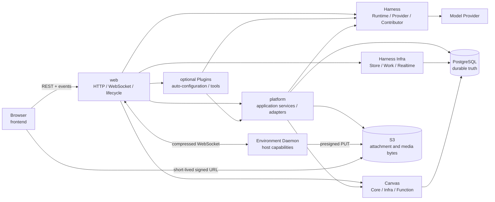

# 系统设计

理解 `kk-studio` 的关键，是先把“实时输出”与“可恢复事实”分开：一次用户操作先在
PostgreSQL 中形成可认领的事实，Worker 再执行外部 I/O，最后凭租约和 token 写回结果。
WebSocket 与 `NOTIFY` 只缩短等待时间；进程退出、连接中断或通知丢失后，系统仍从数据库
和 REST Snapshot 恢复。

```text
用户操作
  -> 短事务：写入 Command / Work / 引用
  -> Worker：claim + lease
  -> 事务外：Provider / Tool / Function / S3 I/O
  -> 短事务：fenced checkpoint 或 terminal
  -> REST Snapshot：权威读取
       ^
       +-- WebSocket / NOTIFY：低延迟提示，可丢失
```

系统包含两个并列产品域：

- **Harness / AI** 运行 Agent Thread，管理模型调用、工具调用、审批、压缩和子 Agent。
- **Studio / Canvas** 管理图形、Resource 与 Function run。

两者共享 PostgreSQL、Blob Storage、浏览器事件通道和 Web 入口，但各自维护独立的领域
状态机与版本坐标。

## 全局心智模型

| 问题 | 设计答案 |
| --- | --- |
| 哪些状态能用于恢复？ | PostgreSQL 保存所有影响恢复、重试、查询、删除和版本对账的业务事实。进程内对象只保存连接、reservation 和 live projection。 |
| 浏览器相信谁？ | REST Snapshot 是 Thread 与 Canvas 的权威读取面；实时事件只提供唤醒和临时 overlay。 |
| 后台任务如何接管？ | Work 先持久化，再通过 claim、lease 和 fencing token 竞争执行权；固定轮询覆盖丢通知和进程退出。 |
| 多个 App 节点如何协调？ | 节点共享 PostgreSQL 与 Blob Storage，不建立 App-to-App 网络边。route、mailbox、Work 和通知都经 PostgreSQL 协调。 |
| 大文件放在哪里？ | PostgreSQL 保存 Blob 元数据和引用，S3 保存附件与媒体字节；业务对象只持有 `blobId`。 |
| Spring 应用从哪里启动？ | [`web`](modules/web.md) 是唯一生产 composition root，负责装配 HTTP、WebSocket、Worker 和生命周期。 |
| 可选集成如何进入发行物？ | `plugins` 只聚合独立的构建期 Plugin JAR；`web` 以 runtime dependency 选择最终包含哪些 Plugin。 |

跨域写入在一个明确的短事务内完成。Provider、Tool、Function 和对象存储 I/O 位于事务
外；写回时重新校验版本、attempt、lease 与 token。迟到 callback 或旧 owner 最多触发
no-op、resync 或内部重试，不能覆盖新 owner 的状态。

## Agent、Branch 与执行上下文

Agent 是可复用的行为定义：它声明 system prompt、默认 Model、Tool、Skill 和可委派的
其他 Agent，不绑定具体 Environment，也没有“主 Agent”或“Subagent”类型。一个 Agent
是否作为子 Agent 使用，只取决于另一个 Agent 是否选择了它；委派关系可以递归，但运行时
由统一深度上限终止无限递归。委派图允许自引用和环；`task` 工具面不随当前深度变化，
到达上限后的实际调用返回明确错误。

一次对话真正执行在哪里，由 Branch 的完整设置决定：

```text
BranchSettings
├── agentName
├── model = providerName + modelName + variant
└── environmentName?
```

Root 保存初始设置，每个普通 TurnStart 冻结该回合设置；`SET_AGENT`、`SET_MODEL` 与
`SET_ENVIRONMENT` 命令在下一轮开始时归约成新的完整快照。Thread fork 从目标 Entry 的
路径重放出当时设置，Compaction Turn 不改变业务设置。Environment 使用全局唯一且不可变
的 name 进入历史；Platform 在每个 Turn 将其解析为内部 UUID，UUID 只服务 Daemon 认证、
连接租约和已开始 Tool invocation 的物理路由。

选择 Environment 后，System Prompt 只加入模型真正需要的宿主事实：

```xml
<current_environment>
- name: laptop-dev
- system: linux
- user: user
- home: /home/user
- date: 2026-09-21
- note: Local workstation daemon.
</current_environment>
```

`note` 只来自操作者显式配置；未配置时省略，不用 OS 文本重复 `system`。无 Environment
时只展示 `name: none` 与 Platform 当前日期。`user` 和 `home` 也展示在 Environment
Card，但不参与任何路径默认值。

Tool 定义用 `EnvironmentSupport` 明确声明三种环境关系：

| 支持级别 | 无 Environment | 有 Environment |
| --- | --- | --- |
| `NONE` | 展示，不绑定 | 展示，不绑定 |
| `OPTIONAL` | 展示，以 Platform 能力执行 | 展示，并可使用当前 Environment |
| `REQUIRED` | 不进入模型 Tool declarations | 展示并绑定当前 Environment |

`read` 是唯一的 `OPTIONAL` 内建工具；Platform Tool、MCP 与 `task` 使用 `NONE`，
`write`、`edit`、`bash`、`grep`、`find` 与 LSP 工具使用 `REQUIRED`。每个 Turn
先恢复并校验 Agent 选择的全部 Tool，再以「Branch 是否选择 Environment」做一次稳定
过滤；过滤保持原声明顺序，并且不读取 Daemon 的 READY/OFFLINE 瞬时状态。由此 Tool
前缀只在用户 attach/detach Environment 时变化，离线重连不会抖动 Prompt Cache。Gateway
仍保留缺失 Environment 的执行期拒绝，作为陈旧或伪造 binding 的 fail-closed 防线。

`read.path` 是 Agent 唯一的读取地址。绝对本地路径交给当前 Daemon，`kkstudio:` URI
交给 Platform；相对路径必须同时提供显式绝对 `workdir`，系统不继承 Session cwd、
HOME、上一次调用目录或任何隐藏根目录。第一阶段只定义两个 Platform 命名空间：

```text
kkstudio:/skills/<package>/<skill>/...
kkstudio:/resources/<blobId>
```

路径分发只有四条规则：

| `path` | `workdir` | 结果 |
| --- | --- | --- |
| 本地绝对路径 | 可省略 | 要求当前 Environment，委托 Daemon |
| `kkstudio:` 绝对 URI | 可省略 | Platform 读取 |
| 本地相对路径 | 本地绝对目录 | 要求当前 Environment，以该目录解析 |
| 相对路径 | `kkstudio:` 绝对目录 URI | Platform 在同一命名空间解析 |

`workdir` 对绝对 `path` 不产生作用，也不因调用方冗余提供而报错。无 Environment 的本地
路径返回明确的 `LOCAL_PATH_REQUIRES_ENVIRONMENT`，相对路径缺少 `workdir` 返回
`WORKDIR_REQUIRED`。`resources` 读取还必须校验当前 Session 持有对应 Blob 引用，不能
凭 UUID 跨会话读取。

`kkstudio:` 使用 path-absolute URI，不含 authority、query 或 fragment；每个 segment
分别做 UTF-8 百分号编码，拒绝 dot segment、编码后的斜杠/反斜杠和 NUL。解析统一经过
`java.net.URI`，不以字符串 `split` 猜测结构。

任意 HTTP(S) 获取保持为独立网络工具，不能借 `read` 绕过 SSRF、响应预算和凭据边界。

子 Agent 新建 Session 时使用自身默认 Model；其默认开启的
`inheritParentEnvironment` 决定是否把
父 Model invocation 已冻结的 `environmentName` 作为子 Branch 初始值。该选项只影响
委派，不限制 Agent 作为普通 Chat 根 Agent 使用；恢复既有子 Session 时同样按该规则把
Agent、Model 与 Environment 收敛到当前目标设置。

Skill Package 是一个受控安装的 Git 仓库，仓库根目录的每个一级子目录代表一个 Skill：

```text
<repository>/
├── dev/
│   ├── SKILL.md
│   ├── references/
│   ├── scripts/
│   └── assets/
└── chatgpt-agent/
    └── SKILL.md
```

Skill 身份是 `(packageName, name)`；Agent 选择器展示 `package / name`，System Prompt
只给模型 `<name>`、`<description>` 与稳定 `<path>`。数据库每个 Package 只有一行，
保存不可变 repository URL、用于检查更新的 branch、当前人工确认的 `currentCommit`、
最近观察到的 `observedHeadCommit`，以及从当前 commit 派生的 `skills` JSON 数组。Branch
只发现候选更新，只有用户确认某个 exact commit 后，`currentCommit + skills` 才通过
一次 CAS 原子切换。应用启动只修复当前 commit 的 Platform cache 并异步更新 Card 上的
branch 检查结果，不自动发布远端 HEAD。

模型提示保持最小且可直接复制：

```xml
The following skills provide specialized instructions for specific tasks.
Use read to load a skill when the task matches its description.
Resolve relative references against the directory containing its SKILL.md.

<available_skills>
  <skill>
    <name>dev</name>
    <description>软件研发规范与工作流。</description>
    <path>kkstudio:/skills/official-skills/dev/SKILL.md</path>
  </skill>
</available_skills>
```

不同 Package 可以有同名 Skill；模型通过 description 与 path 区分，Catalog 不为低概率
重名引入全局唯一约束。`kkstudio:` 是只读地址，只交给 `read`；只有 Daemon 本地路径能
交给 `bash` 等宿主工具执行脚本。

Platform 以 bare Git cache 读取 `currentCommit`，Daemon 把同一 commit 安装到稳定目录
`<data-dir>/skills/<package>/`，并用包内 marker 记录已安装 commit。Daemon 安装状态等于
Platform 当前 commit 时，Prompt 使用本地路径
`<data-dir>/skills/<package>/<skill>/SKILL.md`；否则使用
`kkstudio:/skills/<package>/<skill>/SKILL.md`，由 Platform 读取当前 commit。两种地址都
不含 commit；Agent 始终只需把 `<path>` 原样交给 `read`。Skill 采用全局当前安装版本
语义；Runtime 冻结最终 System Prompt，Daemon 每个 Package 只维护当前目录。
默认数据目录下的实际路径形如
`/home/user/.kk-studio/skills/official-skills/dev/SKILL.md`。
Skill 不做 per-Turn 内容冻结：Platform URI 在发布后读取新版本，本地稳定路径在 Daemon
同步成功时整体切换，已经打开的 Turn 可能观察到这种变化，与普通工作区文件被用户修改
后的语义一致。name、description 和交付方式都未变化时，Package commit 更新不会改变
System Prompt 或 Prompt Cache 前缀；同步窗口内从 local 暂时回退到 platform 属于可见
执行能力变化。

MCP 同样属于 Platform 全局 Tool catalog：配置与发现结果按不可变的 server name 键控，
Backend 在自身进程内通过 Streamable HTTP 完成同步发现与 per-call 执行，不在
Environment Daemon 内启动任何子进程。

## 构建期 Plugin

Plugin 是随应用构建并在启动期自动装配的可信代码，不是运行时上传、卸载或热更新的脚本。
它与应用同进程、拥有相同 JVM 权限；构建期可选性是依赖解耦，不是安全沙箱。
仓库顶层 `plugins` 是纯 Maven aggregator，每个子模块产出一个互不依赖的 Plugin JAR；
aggregator 构建子模块不等于把它们装进应用，只有 `web` 的 runtime dependencies 决定
Fat JAR 最终包含哪些 Plugin：

```text
plugins
└── minimax-mavis -> kk-studio-plugin-minimax-mavis.jar

web --runtime dependency--> minimax-mavis  => 安装
web --no dependency-----------------------> 不安装
```

每个 Plugin 通过 Spring Boot auto-configuration 注册两类独立贡献：

- `StudioPlugin` 提供安装元数据、可选的固定 deep-link 认证能力和工具默认权限；Web 用统一
  API 与通用配置界面投影这些能力，不解释 Plugin 自定义 JSON schema。
- `HarnessContributor` 复用唯一 Tool SPI，把 Plugin 工具并入启动时冻结的
  `HarnessCatalog`。Plugin 不定义第二套 Tool、历史、审批或结果协议。

Classpath Plugin 可以依赖 Platform 服务、持久化凭据和启动后台任务；外部 trusted
Contributor JAR 仍只是由隔离 classloader 加载的纯 `HarnessContributor`，两者不能混为
同一种生命周期。删除 `web` 对某个 Plugin 的依赖并重建后，它的 Bean、API、任务和 Tools
全部消失；通用加密凭据行可以保留，重新引入同一 Plugin 后继续解析。

首个 Plugin 是 MiniMax Mavis。它执行于 Platform，模型工具都声明
`EnvironmentSupport.NONE`；输入只接受公开 HTTP(S) 地址或当前 Session 有权访问的
`kkstudio:/resources/<blobId>`，不接收 Daemon 本地路径。需要宿主文件时，Agent 先用
统一 `read` 把它物化为 Platform Resource。生成的图片、音频、音乐和视频在 Tool 成功前
流式暂存为 Storage upload，再由既有 ToolResult finalizer 原子转成当前 Session 持有的
Blob Resource；临时目录、Base64 正文、Mavis CDN 地址和 S3 内部地址都不进入 durable
history。

Mavis 模型工具保持一项动作一个 schema：

```text
mavis_web_search        mavis_extract_web
mavis_image_search      mavis_reverse_image
mavis_understand_image  mavis_understand_audio  mavis_understand_video
mavis_asr               mavis_list_voices
mavis_tts               mavis_tts_batch
mavis_generate_image    mavis_generate_music
mavis_submit_video      mavis_query_video
```

认证、实时 capability catalog、媒体中转和旧同步视频端点属于 Plugin 内部控制面，不作为
模型工具。搜索、提取、理解和查询为只读工具；TTS 与生成/提交工具为
`NON_IDEMPOTENT`，Plugin 默认要求人工审批，单次发送结果不确定时不自动重放。

MiniMax 登录使用其 SSO deep link，而不是标准 authorization-code / refresh-token 流程：
配置页按 CN/EN 返回官方登录链接，用户完成浏览器登录后粘贴
`minimax-cn://auth-callback?...` 或 `minimax://auth-callback?...`。Backend 严格解析并在线
验证 token，只把加密 credential 写入 PostgreSQL，响应和日志只返回认证状态。各 App
节点默认每小时扫描一次到期行，先以数据库 lease 取得唯一刷新权，再用当前 token 调一次
renewal；刷新成功后原子替换密文。默认实际续期时间是「成功后 7 天」与「token 生命周期
中点」的较早者；确定性认证拒绝进入 `REAUTH_REQUIRED`。请求发送后的断连或超时进入
`REFRESH_UNCERTAIN` 并要求重新登录，不能拿结果未知的 renewal 做自动重放；节点崩溃后
遗留的过期 refresh lease 同样按结果未知处理，而不是由另一节点重发。

## 系统组成



源码按“契约在内、适配在外”组织：

| 层次 | 模块 | 维护时先关注什么 |
| --- | --- | --- |
| 浏览器 | [Frontend](modules/frontend.md) | 路由、Feature、Snapshot 与 realtime 合并、交互状态 |
| 传输与装配 | [Web](modules/web.md) | Spring Boot、Controller、DTO mapping、WebSocket、进程生命周期 |
| 应用编排 | [Platform](modules/platform.md)、[Share](modules/share.md) | Application service、Plugin 管理、外部适配、public wire contract |
| Agent 契约 | [Harness Common](modules/harness-common.md)、[Tool](modules/harness-tool.md)、[Environment](modules/harness-environment.md)、[Contributor API](modules/harness-contributor-api.md) | 值对象、Tool 与 Environment 边界、扩展契约 |
| Agent 执行 | [Harness Runtime](modules/harness-runtime.md)、[Provider](modules/harness-provider.md)、[Builtin](modules/harness-builtin.md) | 状态机、Processor、模型协议、内置能力 |
| Agent 基础设施 | [Harness Infra](modules/harness-infra.md)、[Environment Server](modules/harness-environment-server.md)、[Daemon](modules/harness-daemon.md)、[MCP](modules/harness-mcp.md) | PostgreSQL Work、会话租约、主机执行与 MCP 调用契约 |
| Canvas | [Canvas Core](modules/canvas-core.md)、[Canvas Infra](modules/canvas-infra.md) | 纯领域命令、Graph 版本、持久化与 Function runtime |
| 数据库 | [Schema](modules/schema.md) | 唯一 Flyway baseline、约束与 profile seed |

根 [`pom.xml`](../pom.xml) 聚合 `share`、`schema`、`canvas`、`harness`、`platform`、
`plugins` 和 `web`；`canvas`、`harness` 与 `plugins` 再聚合各自子模块。`frontend`
是独立的 Node/Vite 工程。核心依赖方向可以简化为：

```text
frontend -> web -> platform
web -(runtime)-> selected plugins -> platform / harness-contributor-api
web -> canvas-infra -> canvas-core
web -> harness-infra -> harness-runtime -> harness-tool / harness-environment
platform -> Canvas / Harness contracts / harness-mcp
harness-daemon -> harness-environment
```

Core、Runtime 与公共契约不创建 Spring Boot root，也不反向依赖外层实现。模块级
架构测试守护 POM 和 import 方向；具体依赖及测试入口由上表中的模块文档说明。

## Agent 请求如何执行

### 从 Command 到 Agent Loop

```text
POST /api/harness/command-batches
  -> Web 校验 owner、target、UUID 与 cursor
  -> Platform 在短事务中完成授权、附件物化和 owner relation
  -> HarnessRuntime.acceptCommands
       Session / Thread / Command CAS
       写入 command mailbox + 请求 THREAD Work
  -> HarnessWorkDispatcher claim THREAD
  -> ThreadProcessor 选择下一项 durable action
  -> ModelProcessor 或 ToolProcessor 执行外部 I/O
  -> fenced checkpoint / terminal
  -> ThreadProcessor 追加 Entry、推进 head 或结束 turn
```

一个 Session 拥有一棵 append-only Entry Tree。Thread 指向当前 head，并保存命令
cursor、控制状态和单调 version；Model 与 Tool 的请求、attempt、checkpoint 和终态由
Invocation 与 Work 记录。这样的拆分让对话历史保持稳定，同时允许外部调用独立重试和
恢复。

Thread version 用于结构与控制状态的 CAS，并不是完整 Snapshot 的 ETag。模型 checkpoint
可以在同一 version 内继续提交，因此首次加载、重连和 resync 都重新读取完整 Snapshot，
不能仅凭 version 相等跳过内容对账。

模型流式事件先在当前 execution 内有界聚合。每次 flush、retry 或 terminal 都在短事务
中重校验 invocation attempt 和 Work ownership；事务提交后才发布 realtime。浏览器看到
的 delta 是临时 overlay，已提交 checkpoint 和 terminal Snapshot 才能用于恢复。详细状态
机见 [Harness Runtime](modules/harness-runtime.md)，Provider 请求与回放规则见
[Harness Provider](modules/harness-provider.md)。

### Canvas Command 与 Function

```text
POST /api/canvases/{canvasId}/commands
  -> typed command + expectedVersion
  -> Graph mutation + command dedup
  -> Patch + canvas_document.version

POST .../nodes/{nodeId}/function-run
  -> 冻结配置、引用与目标 Resource
  -> READY run + durable work
  -> claim + heartbeat + adapter execution
  -> fenced success / failure / cancel
  -> GET /api/canvases/{canvasId} 读取权威 Snapshot
```

Canvas Graph version 与 Harness Thread version 相互独立。Function 的 start、
checkpoint 和 terminal 都由 Canvas document version 表达；Harness Command acceptance
不会推进 Graph version。领域命令见 [Canvas Core](modules/canvas-core.md)，数据库映射和
Function Worker 见 [Canvas Infra](modules/canvas-infra.md)。

### 附件与媒体

上传先建立受控 upload，再将字节写入 S3，完成校验后生成全局 Blob。Chat、Canvas 和
Tool 历史只保存 `blobId` 或内联文本；下载时由服务端签发短期 URL。数据库事务负责 Blob
引用和 cleanup 状态，对象 PUT、copy、HEAD 与 delete 在事务外执行。

Tool 或 Environment 返回的临时 `ResourceRef` 在写入历史前必须物化为全局 Blob；物化
失败时终止提交，避免把 Daemon 本地路径或短期 URL写入 durable message。完整生命周期见
[Platform 的 Storage、Blob 与 Resource](modules/platform.md#storageblob-与-resource)。

## 并发与恢复

### Work ownership

Harness 与 Canvas 都使用 PostgreSQL durable Work：

1. 短事务从到期 Work 中 `claim`，写入随机 token 和 `lease_until`。
2. Worker 在事务外执行模型、工具或 Function。
3. heartbeat 只续租当前 token。
4. checkpoint、terminal 和 reschedule 再次验证 token、attempt 与当前状态。
5. handoff 失败时立即 fenced reschedule；进程退出后由 lease 到期触发接管。

Harness 的 `THREAD`、`MODEL`、`TOOL` Work 共享同一池。只有绑定 Environment 的
`TOOL` Work 带节点亲和性：claim 同时要求目标 Environment 的 route lease 属于当前
Dispatcher 节点。Canvas Function 使用独立 run/work 协议，但遵循同样的
claim/lease/fencing 原则。

Model、Tool 与 Subagent 还经过进程内有界 admission。容量不足会在打开 Provider 或发送
Tool 请求前返回可重试结果，不以无界线程队列积压请求。Admission 控制当前节点容量，
PostgreSQL Work 才是恢复依据。

### 失败如何收敛

| 失败或竞争 | 恢复依据 | 收敛方式 |
| --- | --- | --- |
| `NOTIFY` 丢失或监听连接重建 | PostgreSQL Work | fixed-delay poll 再次发现可执行行 |
| Worker 退出 | Work lease | lease 到期后由任意合格节点重新 claim |
| 旧 callback 晚到 | token、attempt、version | 写回变为 no-op 或内部取消 |
| 浏览器漏帧、断线或 buffer overflow | REST Snapshot | 事件通道发出或折叠为 `resync` |
| 重复 Command | idempotency key、cursor、CAS | 返回已有结果或拒绝冲突写入 |
| Daemon 物理连接中断 | `daemonInstanceId`、invocation journal、route lease | 同实例重连重放；新实例接管后收敛旧调用 |
| Blob 清理进程中断 | PostgreSQL cleanup state 与 token | 后台 maintenance 继续处理 |

应用节点之间不通过 HTTP、RPC 或 DNS 协调。数据库不可达时，claim、route lease 与 mailbox
判定 fail closed；已有实时连接不能替代 durable ownership。

## Snapshot 与实时通道

浏览器采用“先快照、后订阅”的读取顺序：

```text
subscribe
  -> 服务端先注册资源
  -> 读取 durable cursor
  -> subscribed(cursor)
  -> version / realtime events
```

Thread 与 Canvas version event 带 cursor；Model delta、Tool partial 和进程输出属于无
cursor overlay。事件 gap、畸形 payload、PostgreSQL 通知降级或客户端缓冲溢出都会触发
完整 Snapshot 回读。terminal 的正确性从不依赖 terminal notification。

PostgreSQL `NOTIFY` 同样只承担低延迟唤醒。Harness 在 Work 写事务内主动通知，Canvas
Function 由数据库 trigger 提示；两条路径都保留固定轮询。Web 节点用一条独立 JDBC
连接监听多个 channel，各 handler 彼此隔离。浏览器侧合并策略见
[Frontend](modules/frontend.md#snapshotrealtime-与恢复)，服务端通道见
[Web](modules/web.md#通知事件与-websocket)。

### Debug 与模型可见请求

Thread Debug 顶部明确标注 `NEXT REQUEST PREVIEW`，展示当前 Branch 下一次规划得到的
请求前缀，而不是只显示一段脱离工具面的 System Prompt。其固定顺序是完整
`systemInstruction`、一行 Tools、一行 Skills，再进入 Event 列表。有效
Tools 排在前面；因未选择 Environment 被过滤的候选 Tool 以灰色、虚线和 `⊘` 标记放在
末尾，仍可打开详情查看过滤原因。Skills 显示 `local` 或 `platform` 交付方式，详情同时
给出 Package 当前 commit、最近观察到的 branch HEAD、Daemon 已安装 commit 与实际
Prompt path。

详情面板展示 Tool 的完整 description、input schema、EnvironmentSupport、Contributor
与最终 Provider definition；Skill 详情展示 Package、描述、路径和实际 XML 片段。活动
Model invocation 另有明确标注为 `FROZEN_INVOCATION` 的 Request 详情，由冻结
`ModelRequestSpec + EntryPath` 物化 canonical ProviderRequest；其中
`systemInstruction` 本身就是该次请求的 Skill 精确事实，不用第二份 Skill binding。
重新计算的当前预览不能冒充活动或已经结束的历史请求。凭据、Authorization header、
对象存储内部地址与 Base64 正文不进入 Debug。

## Environment 的四条数据路径

Environment 把主机能力接入 Agent，但不同数据采用不同路径：

| 路径 | 承载内容 | 恢复与容量语义 |
| --- | --- | --- |
| WebSocket 控制面 | `INVOKE`、`CANCEL`、heartbeat、上传票据和有界 progress | 强制 `permessage-deflate`；invocation journal 处理同实例重连 |
| Daemon 本地文本 | `process.exec` 的 stdout/stderr 与大文本结果 | 完整文本写入 `~/.kk-studio/resources/text/`，UI 只接收有界 tail；模型通过 `fs.read` / `fs.grep` 分页读取 |
| Daemon Skill 包 | 人工确认 commit 的 `SKILL.md`、references、scripts 与 assets | READY 与 Package 发布后异步同步；本地 commit 落后时 Prompt 自动使用 Platform URI |
| Blob 数据面 | 用户附件和 Tool 产生的图片、音频、视频等二进制 | Backend 分配预签名 PUT，Daemon 直接流式上传 S3，二进制不经过 WebSocket |

协议契约由 [Harness Environment](modules/harness-environment.md) 定义，服务端租约与调用所有权
见 [Environment Server](modules/harness-environment-server.md)，主机执行和本地存储见
[Harness Daemon](modules/harness-daemon.md)。

Environment Card 同时保留最近一次 READY 的 user/home 与最近一条警告；详情读取连接和
Skill 同步产生的最近 200 条结构化运维事件。该有界事件列表用于诊断，不是原始 Daemon
日志流，也不参与连接、调用或 Package 的正确性判定。

## 安全边界

`kk-studio` 面向可信单用户部署，当前应用本身没有登录鉴权。默认本地栈只监听
`127.0.0.1`；局域网或公网入口需要由反向代理提供 TLS 和访问控制，具体要求见
[部署与运行](operations/deployment.md#生产部署与反向代理)。

系统在内部继续保持以下边界：

- HTTP mapper 严格校验 UUID、cursor、sealed union 与 JSON 形状；重复字段、未知字段和
  错误类型在边界拒绝。
- Provider credential、MCP secret 和 registration token 使用受控写入路径，不进入普通
  DTO、日志或错误信息。
- Plugin credential 只以部署级主密钥加密后写入 PostgreSQL；OAuth callback、明文 token、
  renewal 签名参数与预签名 URL 不进入日志、Debug、SystemSettings 或普通 DTO。
- S3 bucket、object key 与长期 URL 由服务端掌握；业务记录保存 `blobId`，浏览器只得到
  短期签名 URL。
- Environment Daemon 继承启动用户的主机权限。registration token 通过 owner-only 文件
  读取；READY 只公开进程用户与 HOME 等宿主事实，它们不构成 cwd、默认 workdir 或沙箱。
- 配置一个 Skill Package 等价于信任该仓库中由用户明确确认的 commit。Branch HEAD
  只能形成更新提示，不能自动改变模型指令或 Daemon 上可执行的 scripts。
- Trusted Contributor JAR 只从显式目录在启动时加载，形成冻结 catalog；运行期间不刷新
  classloader。

漏洞报告渠道与支持范围见 [Security Policy](../SECURITY.md)。

## 按任务继续阅读

| 要解决的问题 | 下一篇文档 |
| --- | --- |
| 修改 public DTO 或 JSON wire | [Share 模块](modules/share.md) |
| 修改 Agent 状态机、Processor 或恢复规则 | [Harness Runtime](modules/harness-runtime.md) 与 [Harness Infra](modules/harness-infra.md) |
| 增加模型协议或排查 Provider 流式输出 | [Harness Provider](modules/harness-provider.md) |
| 增加 Tool、Contributor、Plugin、Skill 或 MCP 能力 | [Tool](modules/harness-tool.md)、[Contributor API](modules/harness-contributor-api.md)、[Platform](modules/platform.md)、[Builtin](modules/harness-builtin.md)、[MCP](modules/harness-mcp.md) |
| 修改 Environment protocol 或 Daemon | [Environment](modules/harness-environment.md)、[Environment Server](modules/harness-environment-server.md)、[Daemon](modules/harness-daemon.md) |
| 修改 Canvas 命令或 Function runtime | [Canvas Core](modules/canvas-core.md) 与 [Canvas Infra](modules/canvas-infra.md) |
| 修改应用服务、HTTP 或前端交互 | [Platform](modules/platform.md)、[Web](modules/web.md)、[Frontend](modules/frontend.md) |
| 修改数据库 baseline | [Schema 模块](modules/schema.md) |
| 运行、测试或部署系统 | [开发与测试](operations/development-and-testing.md)、[部署与运行](operations/deployment.md)、[Environment Daemon 安装](operations/environment-daemon.md) |
