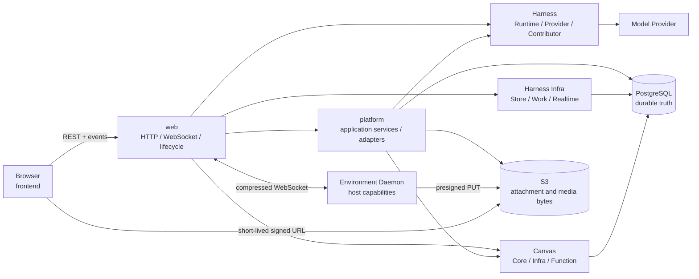

# 系统设计

理解 `kk-studio` 的关键，是先把“实时输出”与“可恢复事实”分开：一次用户操作先在
PostgreSQL 中形成可认领的事实，Worker 再执行外部 I/O，最后凭租约和 token 写回结果。
WebSocket 与 `NOTIFY` 只缩短等待时间；进程退出、连接中断或通知丢失后，系统仍从数据库
和 REST Snapshot 恢复。

```text
用户操作
  -> 短事务：写入 Command / Work / 引用
  -> Worker：claim + lease
  -> 事务外：Provider / Tool / Function / S3 I/O
  -> 短事务：fenced checkpoint 或 terminal
  -> REST Snapshot：权威读取
       ^
       +-- WebSocket / NOTIFY：低延迟提示，可丢失
```

系统包含两个并列产品域：

- **Harness / AI** 运行 Agent Thread，管理模型调用、工具调用、审批、压缩和子 Agent。
- **Studio / Canvas** 管理图形、Resource 与 Function run。

两者共享 PostgreSQL、Blob Storage、浏览器事件通道和 Web 入口，但各自维护独立的领域
状态机与版本坐标。

## 全局心智模型

| 问题 | 设计答案 |
| --- | --- |
| 哪些状态能用于恢复？ | PostgreSQL 保存所有影响恢复、重试、查询、删除和版本对账的业务事实。进程内对象只保存连接、reservation 和 live projection。 |
| 浏览器相信谁？ | REST Snapshot 是 Thread 与 Canvas 的权威读取面；实时事件只提供唤醒和临时 overlay。 |
| 后台任务如何接管？ | Work 先持久化，再通过 claim、lease 和 fencing token 竞争执行权；固定轮询覆盖丢通知和进程退出。 |
| 多个 App 节点如何协调？ | 节点共享 PostgreSQL 与 Blob Storage，不建立 App-to-App 网络边。route、mailbox、Work 和通知都经 PostgreSQL 协调。 |
| 大文件放在哪里？ | PostgreSQL 保存 Blob 元数据和引用，S3 保存附件与媒体字节；业务对象只持有 `blobId`。 |
| Spring 应用从哪里启动？ | [`web`](modules/web.md) 是唯一生产 composition root，负责装配 HTTP、WebSocket、Worker 和生命周期。 |

跨域写入在一个明确的短事务内完成。Provider、Tool、Function 和对象存储 I/O 位于事务
外；写回时重新校验版本、attempt、lease 与 token。迟到 callback 或旧 owner 最多触发
no-op、resync 或内部重试，不能覆盖新 owner 的状态。

## Agent、Branch 与执行上下文

Agent 是可复用的行为定义：它声明 system prompt、默认 Model、Tool、Skill 和可委派的
其他 Agent，不绑定具体 Environment，也没有“主 Agent”或“Subagent”类型。一个 Agent
是否作为子 Agent 使用，只取决于另一个 Agent 是否选择了它；委派关系可以递归，但运行时
由统一深度上限终止无限递归。委派图允许自引用和环；`task` 工具面不随当前深度变化，
到达上限后的实际调用返回明确错误。

一次对话真正执行在哪里，由 Branch 的完整设置决定：

```text
BranchSettings
├── agentName
├── model = providerName + modelName + variant
└── environmentName?
```

Root 保存初始设置，每个普通 TurnStart 冻结该回合设置；`SET_AGENT`、`SET_MODEL` 与
`SET_ENVIRONMENT` 命令在下一轮开始时归约成新的完整快照。Thread fork 从目标 Entry 的
路径重放出当时设置，Compaction Turn 不改变业务设置。Environment 使用全局唯一且不可变
的 name 进入历史；Platform 在每个 Turn 将其解析为内部 UUID，UUID 只服务 Daemon 认证、
连接租约和已开始 Tool invocation 的物理路由。

Tool 的声明与当前可执行状态分离。Agent 选择的环境工具始终进入模型 Tool declarations：
Branch 未选择 Environment 或引用已不存在时，调用返回明确 Tool error；Environment
暂时离线时，已冻结路由的调用等待重连或正常 deadline；在线状态不会动态改变 system
prompt、Tool surface 或 Prompt Cache affinity。这样用户仍可在无 Environment 的对话中
正常使用模型和 Platform Tool，并能从错误直接知道需要选择或启动哪个 Environment。

子 Agent 新建 Session 时使用自身默认 Model；其默认开启的
`inheritParentEnvironment` 决定是否把
父 Model invocation 已冻结的 `environmentName` 作为子 Branch 初始值。该选项只影响
委派，不限制 Agent 作为普通 Chat 根 Agent 使用；恢复既有子 Session 时同样按该规则把
Agent、Model 与 Environment 收敛到当前目标设置。

Skill 是 Platform 全局名称资源，与 Environment inventory 解耦。Package 负责安装和原子
升级，Agent 与 `load_skill` 只使用全局唯一 Skill name；一次 Model invocation 会冻结
Package 版本和内容 revision。MCP 同样属于 Platform 全局 Tool catalog，Backend 只通过
Streamable HTTP 连接 Server，不在 Environment Daemon 内启动 stdio 子进程。

## 系统组成



源码按“契约在内、适配在外”组织：

| 层次 | 模块 | 维护时先关注什么 |
| --- | --- | --- |
| 浏览器 | [Frontend](modules/frontend.md) | 路由、Feature、Snapshot 与 realtime 合并、交互状态 |
| 传输与装配 | [Web](modules/web.md) | Spring Boot、Controller、DTO mapping、WebSocket、进程生命周期 |
| 应用编排 | [Platform](modules/platform.md)、[Share](modules/share.md) | Application service、外部适配、public wire contract |
| Agent 契约 | [Harness Common](modules/harness-common.md)、[Tool](modules/harness-tool.md)、[Environment](modules/harness-environment.md)、[Contributor API](modules/harness-contributor-api.md) | 值对象、Tool 与 Environment 边界、扩展契约 |
| Agent 执行 | [Harness Runtime](modules/harness-runtime.md)、[Provider](modules/harness-provider.md)、[Builtin](modules/harness-builtin.md) | 状态机、Processor、模型协议、内置能力 |
| Agent 基础设施 | [Harness Infra](modules/harness-infra.md)、[Environment Server](modules/harness-environment-server.md)、[Daemon](modules/harness-daemon.md)、[MCP](modules/harness-mcp.md) | PostgreSQL Work、会话租约、主机执行与 MCP 生命周期 |
| Canvas | [Canvas Core](modules/canvas-core.md)、[Canvas Infra](modules/canvas-infra.md) | 纯领域命令、Graph 版本、持久化与 Function runtime |
| 数据库 | [Schema](modules/schema.md) | 唯一 Flyway baseline、约束与 profile seed |

根 [`pom.xml`](../pom.xml) 聚合 `share`、`schema`、`canvas`、`harness`、`platform`
和 `web`；`canvas` 与 `harness` 再聚合各自子模块。`frontend` 是独立的 Node/Vite
工程。核心依赖方向可以简化为：

```text
frontend -> web -> platform
web -> canvas-infra -> canvas-core
web -> harness-infra -> harness-runtime -> harness-tool / harness-environment
platform -> Canvas / Harness contracts
harness-daemon -> harness-environment / harness-mcp
```

Core、Runtime 与公共契约不创建 Spring Boot root，也不反向依赖外层实现。模块级
架构测试守护 POM 和 import 方向；具体依赖及测试入口由上表中的模块文档说明。

## Agent 请求如何执行

### 从 Command 到 Agent Loop

```text
POST /api/harness/command-batches
  -> Web 校验 owner、target、UUID 与 cursor
  -> Platform 在短事务中完成授权、附件物化和 owner relation
  -> HarnessRuntime.acceptCommands
       Session / Thread / Command CAS
       写入 command mailbox + 请求 THREAD Work
  -> HarnessWorkDispatcher claim THREAD
  -> ThreadProcessor 选择下一项 durable action
  -> ModelProcessor 或 ToolProcessor 执行外部 I/O
  -> fenced checkpoint / terminal
  -> ThreadProcessor 追加 Entry、推进 head 或结束 turn
```

一个 Session 拥有一棵 append-only Entry Tree。Thread 指向当前 head，并保存命令
cursor、控制状态和单调 version；Model 与 Tool 的请求、attempt、checkpoint 和终态由
Invocation 与 Work 记录。这样的拆分让对话历史保持稳定，同时允许外部调用独立重试和
恢复。

Thread version 用于结构与控制状态的 CAS，并不是完整 Snapshot 的 ETag。模型 checkpoint
可以在同一 version 内继续提交，因此首次加载、重连和 resync 都重新读取完整 Snapshot，
不能仅凭 version 相等跳过内容对账。

模型流式事件先在当前 execution 内有界聚合。每次 flush、retry 或 terminal 都在短事务
中重校验 invocation attempt 和 Work ownership；事务提交后才发布 realtime。浏览器看到
的 delta 是临时 overlay，已提交 checkpoint 和 terminal Snapshot 才能用于恢复。详细状态
机见 [Harness Runtime](modules/harness-runtime.md)，Provider 请求与回放规则见
[Harness Provider](modules/harness-provider.md)。

### Canvas Command 与 Function

```text
POST /api/canvases/{canvasId}/commands
  -> typed command + expectedVersion
  -> Graph mutation + command dedup
  -> Patch + canvas_document.version

POST .../nodes/{nodeId}/function-run
  -> 冻结配置、引用与目标 Resource
  -> READY run + durable work
  -> claim + heartbeat + adapter execution
  -> fenced success / failure / cancel
  -> GET /api/canvases/{canvasId} 读取权威 Snapshot
```

Canvas Graph version 与 Harness Thread version 相互独立。Function 的 start、
checkpoint 和 terminal 都由 Canvas document version 表达；Harness Command acceptance
不会推进 Graph version。领域命令见 [Canvas Core](modules/canvas-core.md)，数据库映射和
Function Worker 见 [Canvas Infra](modules/canvas-infra.md)。

### 附件与媒体

上传先建立受控 upload，再将字节写入 S3，完成校验后生成全局 Blob。Chat、Canvas 和
Tool 历史只保存 `blobId` 或内联文本；下载时由服务端签发短期 URL。数据库事务负责 Blob
引用和 cleanup 状态，对象 PUT、copy、HEAD 与 delete 在事务外执行。

Tool 或 Environment 返回的临时 `ResourceRef` 在写入历史前必须物化为全局 Blob；物化
失败时终止提交，避免把 Daemon 本地路径或短期 URL写入 durable message。完整生命周期见
[Platform 的 Storage、Blob 与 Resource](modules/platform.md#storageblob-与-resource)。

## 并发与恢复

### Work ownership

Harness 与 Canvas 都使用 PostgreSQL durable Work：

1. 短事务从到期 Work 中 `claim`，写入随机 token 和 `lease_until`。
2. Worker 在事务外执行模型、工具或 Function。
3. heartbeat 只续租当前 token。
4. checkpoint、terminal 和 reschedule 再次验证 token、attempt 与当前状态。
5. handoff 失败时立即 fenced reschedule；进程退出后由 lease 到期触发接管。

Harness 的 `THREAD`、`MODEL`、`TOOL` Work 共享同一池。只有绑定 Environment 的
`TOOL` Work 带节点亲和性：claim 同时要求目标 Environment 的 route lease 属于当前
Dispatcher 节点。Canvas Function 使用独立 run/work 协议，但遵循同样的
claim/lease/fencing 原则。

Model、Tool 与 Subagent 还经过进程内有界 admission。容量不足会在打开 Provider 或发送
Tool 请求前返回可重试结果，不以无界线程队列积压请求。Admission 控制当前节点容量，
PostgreSQL Work 才是恢复依据。

### 失败如何收敛

| 失败或竞争 | 恢复依据 | 收敛方式 |
| --- | --- | --- |
| `NOTIFY` 丢失或监听连接重建 | PostgreSQL Work | fixed-delay poll 再次发现可执行行 |
| Worker 退出 | Work lease | lease 到期后由任意合格节点重新 claim |
| 旧 callback 晚到 | token、attempt、version | 写回变为 no-op 或内部取消 |
| 浏览器漏帧、断线或 buffer overflow | REST Snapshot | 事件通道发出或折叠为 `resync` |
| 重复 Command | idempotency key、cursor、CAS | 返回已有结果或拒绝冲突写入 |
| Daemon 物理连接中断 | `daemonInstanceId`、invocation journal、route lease | 同实例重连重放；新实例接管后收敛旧调用 |
| Blob 清理进程中断 | PostgreSQL cleanup state 与 token | 后台 maintenance 继续处理 |

应用节点之间不通过 HTTP、RPC 或 DNS 协调。数据库不可达时，claim、route lease 与 mailbox
判定 fail closed；已有实时连接不能替代 durable ownership。

## Snapshot 与实时通道

浏览器采用“先快照、后订阅”的读取顺序：

```text
subscribe
  -> 服务端先注册资源
  -> 读取 durable cursor
  -> subscribed(cursor)
  -> version / realtime events
```

Thread 与 Canvas version event 带 cursor；Model delta、Tool partial 和进程输出属于无
cursor overlay。事件 gap、畸形 payload、PostgreSQL 通知降级或客户端缓冲溢出都会触发
完整 Snapshot 回读。terminal 的正确性从不依赖 terminal notification。

PostgreSQL `NOTIFY` 同样只承担低延迟唤醒。Harness 在 Work 写事务内主动通知，Canvas
Function 由数据库 trigger 提示；两条路径都保留固定轮询。Web 节点用一条独立 JDBC
连接监听多个 channel，各 handler 彼此隔离。浏览器侧合并策略见
[Frontend](modules/frontend.md#snapshotrealtime-与恢复)，服务端通道见
[Web](modules/web.md#通知事件与-websocket)。

## Environment 的三条数据路径

Environment 把主机能力接入 Agent，但不同数据采用不同路径：

| 路径 | 承载内容 | 恢复与容量语义 |
| --- | --- | --- |
| WebSocket 控制面 | `INVOKE`、`CANCEL`、heartbeat、上传票据和有界 progress | 强制 `permessage-deflate`；invocation journal 处理同实例重连 |
| Daemon 本地文本 | `process.exec` 的 stdout/stderr 与大文本结果 | 完整文本写入 `~/.kk-studio/resources/text/`，UI 只接收有界 tail；模型通过 `fs.read` / `fs.grep` 分页读取 |
| Blob 数据面 | 用户附件和 Tool 产生的图片、音频、视频等二进制 | Backend 分配预签名 PUT，Daemon 直接流式上传 S3，二进制不经过 WebSocket |

协议契约由 [Harness Environment](modules/harness-environment.md) 定义，服务端租约与调用所有权
见 [Environment Server](modules/harness-environment-server.md)，主机执行和本地存储见
[Harness Daemon](modules/harness-daemon.md)。

## 安全边界

`kk-studio` 面向可信单用户部署，当前应用本身没有登录鉴权。默认本地栈只监听
`127.0.0.1`；局域网或公网入口需要由反向代理提供 TLS 和访问控制，具体要求见
[部署与运行](operations/deployment.md#生产部署与反向代理)。

系统在内部继续保持以下边界：

- HTTP mapper 严格校验 UUID、cursor、sealed union 与 JSON 形状；重复字段、未知字段和
  错误类型在边界拒绝。
- Provider credential、MCP secret 和 registration token 使用受控写入路径，不进入普通
  DTO、日志或错误信息。
- S3 bucket、object key 与长期 URL 由服务端掌握；业务记录保存 `blobId`，浏览器只得到
  短期签名 URL。
- Environment Daemon 继承启动用户的主机权限。registration token 通过 owner-only 文件
  读取，`environmentRoot` 仅用于展示，不构成沙箱。
- Trusted Contributor JAR 只从显式目录在启动时加载，形成冻结 catalog；运行期间不刷新
  classloader。

漏洞报告渠道与支持范围见 [Security Policy](../SECURITY.md)。

## 按任务继续阅读

| 要解决的问题 | 下一篇文档 |
| --- | --- |
| 修改 public DTO 或 JSON wire | [Share 模块](modules/share.md) |
| 修改 Agent 状态机、Processor 或恢复规则 | [Harness Runtime](modules/harness-runtime.md) 与 [Harness Infra](modules/harness-infra.md) |
| 增加模型协议或排查 Provider 流式输出 | [Harness Provider](modules/harness-provider.md) |
| 增加 Tool、Contributor、Skill 或 MCP 能力 | [Tool](modules/harness-tool.md)、[Contributor API](modules/harness-contributor-api.md)、[Builtin](modules/harness-builtin.md)、[MCP](modules/harness-mcp.md) |
| 修改 Environment protocol 或 Daemon | [Environment](modules/harness-environment.md)、[Environment Server](modules/harness-environment-server.md)、[Daemon](modules/harness-daemon.md) |
| 修改 Canvas 命令或 Function runtime | [Canvas Core](modules/canvas-core.md) 与 [Canvas Infra](modules/canvas-infra.md) |
| 修改应用服务、HTTP 或前端交互 | [Platform](modules/platform.md)、[Web](modules/web.md)、[Frontend](modules/frontend.md) |
| 修改数据库 baseline | [Schema 模块](modules/schema.md) |
| 运行、测试或部署系统 | [开发与测试](operations/development-and-testing.md)、[部署与运行](operations/deployment.md)、[Environment Daemon 安装](operations/environment-daemon.md) |
