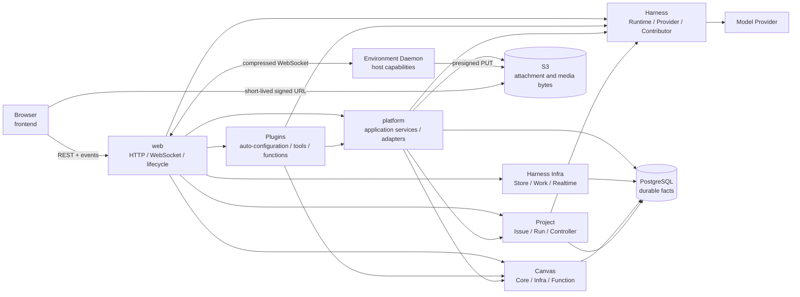

# 系统设计

`kk-studio` 是面向可信单用户部署的自托管 AI 工作台。浏览器提供 Chat、Canvas 和
Project 入口；服务端负责配置、资源授权与持久执行；Environment Daemon 把指定主机的
文件、命令和 LSP 能力接入 Agent。

理解执行与恢复时，先看两类状态：PostgreSQL 保存业务事实和执行权，REST Snapshot
提供权威读取；WebSocket 和数据库 `NOTIFY` 提供低延迟提示。连接中断、通知丢失或进程
退出后，Worker 从持久 Work 接管执行，浏览器回读 Snapshot 对账。

## 系统组成与依赖

系统的三个执行领域各自维护状态机与版本坐标：

| 领域 | 职责 | 核心对象 |
| --- | --- | --- |
| Harness | Agent Loop、模型与工具调用、审批、问答、压缩和子 Agent | Session、Entry Tree、Thread、Invocation、Work |
| Canvas | 图形编辑、资源引用与显式 Function 执行 | Document、Node、Resource、Function Run |
| Project | Issue 工作阶段、执行预算、Agent 分工和交付 | Workflow、Issue、Agent Thread 绑定、Stage Budget、Run、Evidence |

Canvas 与 Project 并列存在，各自拥有领域数据。Project 使用 Harness 执行 Agent；
Canvas 使用 Function SPI 执行具体能力。两者通过 Storage Blob 保存媒体内容。


```mermaid
flowchart LR
    Browser["Browser<br/>frontend"]
    Web["web<br/>HTTP / WebSocket / lifecycle"]
    Platform["platform<br/>application services / adapters"]
    Harness["Harness<br/>Runtime / Provider / Contributor"]
    Plugins["Plugins<br/>auto-configuration / tools / functions"]
    Infra["Harness Infra<br/>Store / Work / Realtime"]
    Canvas["Canvas<br/>Core / Infra / Function"]
    Project["Project<br/>Issue / Run / Controller"]
    PG[("PostgreSQL<br/>durable facts")]
    S3[("S3<br/>attachment and media bytes")]
    Provider["Model Provider"]
    Daemon["Environment Daemon<br/>host capabilities"]

    Browser -->|REST + events| Web
    Web --> Platform
    Web --> Harness
    Web --> Infra
    Web --> Canvas
    Web --> Project
    Web --> Plugins
    Plugins --> Platform
    Plugins --> Harness
    Plugins --> Canvas
    Platform --> Harness
    Platform --> Canvas
    Platform --> Project
    Project --> Harness
    Platform --> PG
    Platform --> S3
    Infra --> PG
    Canvas --> PG
    Project --> PG
    Harness --> Provider
    Web <-->|compressed WebSocket| Daemon
    Daemon -->|presigned PUT| S3
    Browser -->|short-lived signed URL| S3
```

[`web`](modules/web.md) 是生产 Spring Boot composition root，装配 HTTP、WebSocket、
Worker 与生命周期。领域契约和状态机位于内层，数据库、主机、网络和产品适配位于外层：

```text
frontend -> web -> platform
web -(runtime)-> selected plugins -> platform / harness-contributor-api / canvas-core
web -> canvas-infra -> canvas-core
web -> project -> harness-runtime
web -> harness-infra -> harness-runtime -> harness-tool / harness-environment
platform -> Canvas / Harness contracts / harness-mcp
platform -> project（实现宿主端口）
harness-daemon -> harness-environment
```

根 [`pom.xml`](../pom.xml) 聚合 `share`、`schema`、`canvas`、`project`、`harness`、
`platform`、`plugins` 和 `web`；前端是独立 Node/Vite 工程。模块职责与依赖约束见
[文档导航](README.md#按代码区域理解系统)。公共 DTO 与严格 JSON wire 见
[Share](modules/share.md)，数据库关系与约束见 [Schema](modules/schema.md)。

## 配置如何进入一次 Agent 请求

Catalog 把连接、模型能力与行为定义分开：

| 配置 | 决定什么 |
| --- | --- |
| Provider | 上游协议、连接、凭据与超时 |
| Model | 真实模型 ID、上下文与输出限制、能力、Variant 和价格 |
| Agent | System Prompt、默认 Model、Tools、Skills 与可委派的 Agent |
| Environment | 主机身份、Daemon 连接与能力 |
| BranchSettings | 当前分支选择的 Agent、Model、Environment 与用户 Goal |

普通对话的执行上下文来自 Branch 的完整设置：

```text
BranchSettings
├── agentName
├── model = providerName + modelName + variant
├── environmentName?
└── goal? = id + text
```

Root 保存初始设置，每个普通 TurnStart 冻结该回合设置。设置命令在下一轮归约为完整
快照，fork 沿目标 Entry 的父链恢复当时设置。每轮再从 Catalog 解析当前 Agent 能力和
模型配置，冻结最终 ModelRequestSpec；引用缺失或能力失效时明确拒绝规划。Environment
以全局唯一且不可变的 name 进入历史，每轮解析为执行路由使用的内部 UUID。

Goal 由用户通过 typed `GOAL` 命令设置或清除。Agent 使用 `get_goal` 读取正文，通过
`update_goal` 回报 `complete` / `blocked` 进度；进度 Entry 绑定目标 id。用户正文是
目标事实，Agent 进度供用户判断完成情况。压缩后仍生效的 Goal 作为 USER 级历史背景恢复。

YOLO 是一棵执行树共享的即时策略：根 Thread 保存 `ENABLE/DISABLE`，子代理保存
`FOLLOW(rootThreadId)`，直接指向真实执行根。`PUT /api/harness/threads/{threadId}/yolo`
只更新根，不与完整 Thread version 做 CAS；同值不推进 version，变化时只推进根 version
精确 +1，最后一次序列化写入生效。子代理在权限决定时通过树锁内的祖先链校验读取根值，
不复制开关，也不因根切换而更新自身 version。开启时跳过普通工具 preflight；
已等待的审批仍需人工处理，`ask_user` 始终等待回答。控制与投影规则见
[Thread 控制与展示](modules/thread-control-and-presentation.md)。

Project Agent 的 Agent、Model、阶段 Environment、业务工具与身份上下文不由 live turn 反查：
Run 接受时由 Project 以显式命令提交（`SET_AGENT` / `SET_MODEL` / `SET_ENVIRONMENT` /
`SET_CONTRIBUTOR_STATE`），并冻结本次 Run 的 `ProjectRunScope`。每个 live turn 只按该分支设置规划；
`issue_transition` 等业务工具从冻结 scope 取得 runId，在业务锁内复核 Run/Issue/阶段/版本与调用
Thread 身份。产品行为见 [Canvas、Project 与交互](canvas-project.md)，规划适配见
[Platform](modules/platform.md)。

### Tools、Skills 与委派

工具以 `EnvironmentSupport` 声明执行所需上下文：

| 级别 | 未选择 Environment | 已选择 Environment |
| --- | --- | --- |
| `NONE` | 展示，使用 Platform 能力 | 展示，使用 Platform 能力 |
| `OPTIONAL` | 展示，使用 Platform 能力 | 展示，可使用当前 Environment |
| `REQUIRED` | 从模型工具声明中过滤 | 展示，绑定当前 Environment |

内置 `read` 使用 `OPTIONAL`，文件写入、命令、搜索和 LSP 使用 `REQUIRED`；
Platform Tool、MCP 与 `task` 使用 `NONE`。过滤依据 Branch 的环境选择，保留声明顺序；
Daemon 在线状态用于实际执行路由。执行入口继续校验绑定，缺失或失效时拒绝调用。

`read.path` 支持当前 Daemon 的本地路径与 Platform 只读 URI：

```text
kkstudio:/skills/<package>/<skill>/...
kkstudio:/resources/<blobId>
```

本地相对路径要求显式绝对 `workdir`；本地读取要求绑定 Environment。Platform URI
要求省略非空 `workdir`。Resource 读取从执行 Thread 解析 Session，再校验该 Session 的
Blob 引用；未授权访问拒绝。`read` 不执行网络获取；网络访问由各自具备该能力的工具
按自己的地址、响应预算与凭据约束承担。
路径与读取契约见 [内置工具设计](modules/builtin-tools-design.md)。

Skill 身份为 `(packageName, name)`。Package 保存仓库、branch、人工确认的
`currentCommit`、最近观察到的 `observedHeadCommit` 与当前 Skill manifest；检查 branch
用于发现更新，发布由用户确认 exact commit 后通过 CAS 原子切换。Prompt 提供 Skill 的
name、description 与稳定 path。Daemon 已安装 commit 与当前发布 commit 一致时使用
本地路径，否则使用 Platform URI。内容按 Package 当前安装版本读取，因此已打开的
Turn 也可能观察到发布或同步后的内容。安装和发布细节见 [Platform](modules/platform.md)
与 [Harness Daemon](modules/harness-daemon.md)。

Agent 的 subagents allowlist 决定可委派对象。`task` 将命令与 join 身份持久接受后立即
返回 `{"thread_id":"...","status":"accepted"}`；父 Thread 可以继续工作，root Join 在子执行
首次到达终态（`COMPLETED` / `ERROR` / `CANCELLED`）时冻结 `terminalEntryId` / `finalAnswerEntryId`，
再以 `NOTIFICATION` 交付给直接派发的父 Thread，不等待其永久子树 idle。
后代审批和问卷归属人工控制根，但不会改变 Join 的直接父订阅。继续委派使用 `thread_id` 并复验父子归属；
深度、单父并发与全局并发额度由 Runtime 裁决。子 Agent 使用自身默认 Model，
`inheritParentEnvironment` 决定是否继承父调用冻结的 Environment。完整契约见
[异步委派](modules/builtin-tools-design.md)与 [Harness Runtime](modules/harness-runtime.md)。

### 构建期扩展

[`plugins`](../plugins/pom.xml) 聚合独立 Plugin JAR，
[`web` 的 runtime dependencies](../web/pom.xml) 决定发行物包含哪些 Plugin。
Plugin 通过 Spring Boot auto-configuration 注册以下能力：

- `StudioPlugin`：安装元数据、可选认证和工具默认权限。
- `HarnessContributor`：工具、自定义历史类型与上下文投影，使用 Harness 的执行和结果契约。
- `CanvasFunctionAdapter`：Function 定义与执行，由 Canvas Runtime 管理输入冻结、租约和发布。

当前 Plugin 包括 MiniMax Mavis、Canvas Media 与 Canvas ComfyUI。Plugin 与应用同进程，
拥有相同 JVM 权限，部署者须信任其代码。Web 收集 Spring 容器中的
`HarnessContributor` bean，校验依赖与名称后冻结为不可变 HarnessCatalog。
Contributor 契约和 Plugin 装配见
[Contributor API](modules/harness-contributor-api.md)和 [Platform](modules/platform.md)。
MCP 由 Backend 使用 Streamable HTTP 发现和执行，调用预算与取消见
[Harness MCP](modules/harness-mcp.md)。

## 持久执行链

所有执行链都围绕“先持久接受，再执行外部 I/O，最后围栏写回”组织：

```text
用户操作
  -> 短事务：写入 Command / Work / 引用
  -> Worker：claim + lease
  -> 事务外：Provider / Tool / Function / S3 I/O
  -> 短事务：校验身份、attempt、lease 与 token，提交 checkpoint 或终态
  -> REST Snapshot：读取已提交事实
       ^
       +-- WebSocket / NOTIFY：提示回读与短期流式展示
```

### Agent Loop

```text
创建型 POST /api/harness/command-batches
  或 owner-free POST /api/harness/threads/{threadId}/command-batches
  -> Web 校验 owner/target 或 path threadId、UUID 与 cursor
  -> Platform 授权、附件物化与归属校验
  -> HarnessRuntime.acceptCommands / acceptOnThread
       Session / Thread / Command CAS
       command mailbox + THREAD Work
  -> HarnessWorkDispatcher claim
  -> ThreadProcessor 选择下一项 durable action
  -> ModelProcessor / ToolProcessor 执行
  -> fenced checkpoint / terminal
  -> ThreadProcessor 追加 Entry、推进 head 或结束 turn
```

Session 拥有 append-only Entry Tree；Thread 保存 head、命令 cursor、控制状态与单调
version；Invocation 保存外部请求、attempt、checkpoint 与终态；Work 保存调度与执行权。
Thread version 用于结构和控制状态 CAS。模型 checkpoint 可在同一 version 内推进，
首次加载、重连和 resync 都需要读取完整 Snapshot。

流式输出在当前 execution 内有界聚合，flush、retry 和 terminal 在短事务中复验
attempt 与 Work ownership，提交后发布 realtime。审批和 `ask_user` 是持久等待，
等待期间释放 Worker；人工决定按冻结调用、身份与提交约束接受后登记后续 Work。
详细状态机见 [Harness Runtime](modules/harness-runtime.md)，协议适配见
[Harness Provider](modules/harness-provider.md)。

### Canvas Function 与 Project Run

Canvas 编辑接受 typed commands、语义组前置条件与 idempotency key，在一个短事务内
规划并提交整批 mutation，返回 patch 与 revision。Function 启动冻结配置、实际输入与
输出计划，pin 输入后登记 READY Run；Worker claim、heartbeat、执行 adapter，再围栏发布
完整输出。Canvas revision 用于同步排序，编辑冲突按名称、资源、Function 或布局各自判断。

Project 的 `(Issue, Agent)` 绑定稳定 Thread，`(Issue, state)` 持有阶段预算。Run 接受
原子完成额度检查、Thread 选择或创建、历史起点冻结、`ProjectRunScope`（含显式
Agent/Model/Environment 与业务工具）提交、Run/Activity 写入、Harness 命令与 Work 登记。
Issue Controller 每次认领后重读当前事实，只认本次 root Join 冻结的 `terminalEntryId` /
`finalAnswerEntryId`（`COMPLETED` / `ERROR` / `CANCELLED`）收尾，不等永久子树 idle；
交接提交时复验 Run 身份、版本、合法边与门禁，并在同一业务锁内写入 `active=false` 快照。
Canvas 与 Project 的使用、数据关系和 UNKNOWN 核实路径见 [Canvas、Project 与交互](canvas-project.md)。

### 附件与媒体

上传先建立受控 upload，将字节写入 S3，校验后生成全局 Blob。业务记录保存 `blobId`
或内联文本，下载由服务端签发短期 URL。Tool 和 Environment 的临时 ResourceRef 在
写入历史前物化为 Blob；物化失败则拒绝历史提交。引用与 cleanup 状态由数据库事务维护，
对象 PUT、copy、HEAD 和 delete 在事务外执行。生命周期见
[Platform](modules/platform.md#storageblob-与-resource)。

## 执行权与恢复

Harness 的 `THREAD`、`MODEL`、`TOOL` Work 共享调度池。到期 Work 经 claim 获得随机
token 与 lease，heartbeat 仅续租当前 owner；checkpoint、terminal 与 reschedule 再次
复验执行权。绑定 Environment 的 TOOL Work 同时要求该 Environment 的 READY route
lease 属于当前节点。Canvas Function 与 Project Issue 使用各自的 Work 协议，均采用
持久调度、租约与围栏。

Model 与 Tool 还经过节点内有界 admission。容量不足在打开 Provider 或发送工具请求前
返回可重试结果。节点容量控制用于限流，PostgreSQL Work 用于恢复；Subagent 额度由
持久 Thread/join 事实及数据库锁裁决。

| 场景 | 恢复依据与处理 |
| --- | --- |
| `NOTIFY` 丢失或监听重建 | 固定轮询发现到期 Work |
| Worker 退出 | lease 到期后由合格节点重新 claim |
| 旧 callback 晚到 | token、attempt、version 围栏使写回成为 no-op 或内部取消 |
| 重复 Command | idempotency key、cursor 与 CAS 返回已有结果或拒绝冲突 |
| 浏览器断线、漏帧或缓冲溢出 | 回读 REST Snapshot |
| Daemon 连接中断 | 同实例通过 invocation journal 重放；新实例接管后收敛旧调用 |
| Blob 清理中断 | 持久 cleanup state 与 token 支持后台继续处理 |
| 外部副作用结果不明 | UNKNOWN 路径保留核实所需事实，人工核查后显式处理 |

多 App 节点共享 PostgreSQL 与 Blob Storage，route、mailbox、Work 与通知经数据库
协调。数据库不可达时停止依赖 ownership 的准入与写回。租约围栏保护内部状态；
外部执行结果须由确定响应、查询或人工核实确认。实现见
[Harness Infra](modules/harness-infra.md)、[Canvas Infra](modules/canvas-infra.md)
与 [Project](modules/project.md)。

## 浏览器读取与主机数据路径

浏览器先加载 Snapshot，再建立订阅；服务端的订阅握手按以下顺序封住 cursor 读取窗口：

```text
subscribe -> 注册资源 -> 读取 durable cursor -> subscribed(cursor) -> events
```

Thread version 与 Canvas revision 事件带 cursor；Model delta、Tool partial 和进程输出
用于临时 overlay。事件 gap、畸形 payload、通知降级与缓冲溢出触发 Snapshot 回读。
终态从数据库读取。Canvas 展示由确认快照、待确认操作和本地草稿组成，回读保留未保存
输入。合并与恢复见 [Frontend](modules/frontend.md)，通道见 [Web](modules/web.md)。

Thread Debug 区分 `NEXT_REQUEST_PREVIEW` 与 `FROZEN_INVOCATION`：前者按当前
Branch 重新规划，后者从冻结的 ModelRequestSpec 和 EntryPath 物化实际请求。
Debug 展示工具声明、Skill 路径与执行事件，并对凭据和私有存储地址做保密处理。

Environment 按数据类型使用四条路径：

| 路径 | 内容 |
| --- | --- |
| 压缩 WebSocket 控制面 | INVOKE、CANCEL、heartbeat、上传票据与有界 progress |
| Daemon 本地文本 | 完整命令输出与大文本写入本地资源，UI 展示有界 tail，Agent 分页读取 |
| Daemon Skill 安装 | 同步人工确认的 commit；安装一致后提供本地 Skill 路径 |
| Blob 数据面 | Backend 分配预签名 PUT，Daemon 直接流式上传 S3 |

协议、路由租约与主机执行分别见 [Harness Environment](modules/harness-environment.md)、
[Environment Server](modules/harness-environment-server.md)和
[Harness Daemon](modules/harness-daemon.md)。

## 部署与安全条件

应用面向可信单用户，登录鉴权由外部入口承担。默认本地栈监听 `127.0.0.1`；
局域网或公网部署必须配置 TLS 和访问控制。Daemon 继承启动用户的主机权限，
**没有文件系统沙箱**；Plugin 与 Contributor 也须作为可信代码部署。

- HTTP 边界严格校验 UUID、cursor、sealed union 和 JSON 形状，拒绝未知或重复字段及错误类型。
- Resource 访问按业务持有关系授权；UUID、URI 与跳转地址仅用于定位。
- Provider、MCP、Daemon 与 Plugin 凭据经受控入口写入，普通 DTO、日志和 Debug 保持脱敏。
  Plugin credential 以部署级主密钥加密存入 PostgreSQL。
- registration token 和主密钥文件要求 owner-only 权限。主机 user/home 用于描述环境，
  路径操作要求显式路径与 workdir。
- Skill 安装内容由人工确认的 exact commit 决定，branch 检查只提供候选更新。
- 生产变更需经过审批并准备可恢复备份；备份同时覆盖 PostgreSQL 与 S3 数据及部署密钥。

首次运行见 [项目 README](../README.md)，参数与生产操作见
[部署与运行](operations/deployment.md)，开发和质量入口见
[开发与测试](operations/development-and-testing.md)。漏洞报告见
[Security Policy](../SECURITY.md)。
