# 技术方案

本文档目录维护 `kk-studio` 当前生效的架构、协议与实现约束，以代码、Controller、DTO、schema 与测试为事实源。文档保持自洽，不保存会话过程。

## 文档地图

```mermaid
flowchart TD
    A[技术方案入口]
    A --> B[architecture.md<br/>架构与模块边界]
    A --> O[domain-map.md<br/>领域词汇与映射]
    A --> Q[harness-runtime-architecture.md<br/>Harness Runtime 架构]
    A --> T[session-thread-pane.md<br/>Session / Thread / Pane lazy materialization]
    A --> Y[harness-agent-loop.md<br/>Agent Loop durable reducer]
    A --> X[harness-runtime-contracts.md<br/>Runtime 公共契约]
    A --> S[harness-storage-runtime.md<br/>PostgreSQL durable facts 与 Work/Redis]
    A --> D[backend-implementation-design.md<br/>后端实现]
    A --> E[storage-models.md<br/>存储模型]
    A --> F[frontend-implementation-design.md<br/>前端实现]
    A --> H[harness-capability-wiring.md<br/>Harness 能力装配]
    A --> I[prompt-cache-usage-cost.md<br/>Prompt Cache 与 Usage/Cost 冻结]
    A --> J[s3-presign.md<br/>S3 预签名直传]
    A --> K[comfyui-workflow-api.md<br/>ComfyUI 工作流与运行 API]
    A --> L[environment-daemon-gateway.md<br/>Environment Daemon Gateway v2]
    A --> W[environment-workspace-binding.md<br/>Environment Workspace 绑定]
    A --> V[application-event-channel.md<br/>应用事件通道 /api/events/v1]
    A --> M[prompt-to-resource.md<br/>Prompt 到 Resource 数据流]
    A --> P[e2e-regression.md<br/>E2E 回归矩阵与报告]
    A --> R[docker-reliability-stack.md<br/>Docker Reliability 隔离栈]
```

## 阅读顺序

| 顺序 | 文档 | 关注点 |
| --- | --- | --- |
| 1 | [architecture.md](architecture.md) | 模块拓扑、依赖方向与所有权 |
| 2 | [domain-map.md](domain-map.md) | Harness/Studio 词汇与前后端映射 |
| 3 | [harness-runtime-architecture.md](harness-runtime-architecture.md) | Entry/Thread/Command/Invocation/Work、Agent Loop 与 processor |
| 4 | [harness-agent-loop.md](harness-agent-loop.md) | Agent Loop durable reducer、持久化形状与执行协议 |
| 5 | [harness-runtime-contracts.md](harness-runtime-contracts.md) | JSON/DTO、命令 batch、CAS、replay、snapshot 与异常 wire |
| 6 | [harness-storage-runtime.md](harness-storage-runtime.md) | HarnessStore 事务/锁序、7 表、Work wake 协议与 Redis overlay |
| 7 | [backend-implementation-design.md](backend-implementation-design.md) | `share` / `core` / `web` 的 composition root 与 HTTP 边界 |
| 8 | [storage-models.md](storage-models.md) | 全应用表结构；Harness 精确 7 表 |
| 9 | [frontend-implementation-design.md](frontend-implementation-design.md) | Chat defaults、BranchDraft、first send、batch、replay 与 Pane 门禁 |
| 10 | [harness-capability-wiring.md](harness-capability-wiring.md) | BranchSettings → Resolver → Model/Tool Gateway 装配 |
| 11 | [prompt-cache-usage-cost.md](prompt-cache-usage-cost.md) | cache control、usage/cost 冻结与 metadata |
| 12 | [s3-presign.md](s3-presign.md) | S3 预签名直传与直下载 |
| 13 | [comfyui-workflow-api.md](comfyui-workflow-api.md) | ComfyUI 工作流与运行 API |
| 14 | [environment-daemon-gateway.md](environment-daemon-gateway.md) | Environment registry、Daemon v3 与 Resource 边界 |
| 15 | [environment-workspace-binding.md](environment-workspace-binding.md) | `{name, workspacePath}\|null` 原子绑定、canonical 规则与目录隐私 |
| 16 | [application-event-channel.md](application-event-channel.md) | `/api/events/v1` WebSocket 事件通道帧协议与恢复 |
| 17 | [prompt-to-resource.md](prompt-to-resource.md) | Command → Turn → Resolver → Model → Tool → Resource 事实链 |
| 18 | [e2e-regression.md](e2e-regression.md) | E2E case、开关、验证与报告 |
| 19 | [docker-reliability-stack.md](docker-reliability-stack.md) | Docker 隔离拓扑、锚点快照、case 与清理 |
| 20 | [session-thread-pane.md](session-thread-pane.md) | Session Tree、三态 PaneTarget、lazy Thread materialization、Stop 恢复与上传回收 |

## 贯穿约束

- Harness 单轨协议：恰好 5 个 Harness 基础模块（`harness-tool` / `harness-runtime` / `harness-plugin` / `harness-runtime-spring` / `harness-daemon`）、3 个 processor（Thread/Model/Tool）、3 个 Work target（THREAD/MODEL/TOOL）、7 张表、10 种 `EntryType`、1 个 Agent Loop；受信任插件位于独立 `plugins/*` 构建模块。
- `harness-runtime` 是纯 Java 领域模块，拥有 Thread 状态机与 processor；`harness-plugin` 提供构建期注册、启动时冻结的插件 API；`harness-runtime-spring` 只做 Store/Work/Redis 适配；`core` 提供 Catalog、TurnResolver、Model/Tool Gateway 与 Environment/Chat 应用能力，不写 `harness_*` 表；Goal 由 `plugins/goal` 提供；`web` 是生产组合根。
- PostgreSQL 是唯一 durable truth；`harness_work` 是唯一调度 mailbox（`wake_version` + lease）；Redis/NOTIFY 永非 correctness truth。
- 所有 Runtime 实体 id（Thread/Session/Entry/Invocation/Command）在 HTTP wire 上是 canonical UUID strings；HTTP DTO 的 Java `long`/`Long` 统一编码为 canonical decimal strings，前端以 `DecimalLong=string` 接收并按字段领域约束严格校验。
- Thread `nextCommandSequence` 从 1 开始；每次可见状态变化 `version` 恰好 +1。
- Agent Loop 固定 6 类 command：`USER_MESSAGE` / `CUSTOM_MESSAGE` / `SET_ENVIRONMENT` / `SET_AGENT` / `SET_MODEL` / `SET_ACTIVE_TOOLS`；产品输入 batch 恰有一个末尾 user-like message，设置只在下一次 INPUT 边界生效；YOLO 由 Thread 控制 API 修改。
- 产品唯一写入口是 `POST /api/ai/runtime/command-batches`（owner + NEW_SESSION/ENTRY/THREAD target + commands）：任何 user Session/Thread materialization 只发生在第一批 Command 被原子接受时；`/tree` 只把 Pane 切换为 `ENTRY_DRAFT(sessionId,startEntryId)`（零数据库写入），现有 Thread 的 head 只能由 Runtime 沿 descendant 推进，永不 relocation。
- Stop 先按 owning Thread 的 `TURN_END.closeRequestId` 或 Command `cancelRequestId` 精确 replay，再做 version CAS；结果正交返回 stopped TURN_END、cancelled Commands/messages 和当前 Thread projection，no-op 不写 marker。
- Tool approval 输入 `ALLOW` / `DENY`，durable 值为 `ALLOWED` / `DENIED`；`ALLOWED` 恢复执行，`DENIED` 终结失败；ToolProcessor 在 permission preflight 前读取当前 Thread YOLO，true 时直接 Allow。
- AgentDefinitionConfigDTO 的 `tools`/`skills`/`subagents` 三个列表必填：`tools`/`skills` 是短名集合，`subagents` 是 Agent 名称 allowlist（引用锁定，被引用 Agent 不可删除）；branch `activeTools` 由 config.tools + skills 非空时的内部 `load_skill` + subagents 非空时的内部 `task` 派生（子 Agent 在最大深度处省略 `task`）。
- `load_skill` 与 `task` 是两个内部 `PLATFORM` Tool，绝不出现在 `GET /api/ai/catalog/tools`；`task` 在一个事务内创建 Session + ROOT + Thread + initial prompt Commands + Work（ROOT 冻结 `subagentContext`），复用 ToolInvocation/approval/stop/Work，无新表/新状态机/新调度器。
- Tool terminal success 的 `effects` 与 `SUCCEEDED` 同行原子持久化且 terminal immutable；唯一 `ToolOutcomeAppender` 按 `CUSTOM effects -> Tool Result` 顺序推进 Entry/head。
- 普通 Model 的 `TRANSIENT` retry 把已展示的 text/thinking、错误与 retry 时间追加到 Invocation `failedAttempts`；active snapshot 通过 `modelAttemptFailures` 暴露，终态/Stop 时按 attempt 顺序物化为 `MODEL_ATTEMPT_FAILURE` 后再写 Assistant 结果。失败 attempt 与 `ASSISTANT_ERROR` 的 partial/error 只用于 UI/audit，绝不进入立即 retry 或后续 turn 的 Provider Context。
- Durable compaction 复用 MODEL Work 与现有 processor：阈值或一次 overflow recovery 启动 `TURN_START(COMPACTION) -> COMPACTION -> TURN_END`；split turn 使用 HISTORY/TURN_PREFIX；complete summary 是可沿 Session EntryPath 共享的 checkpoint，但 incomplete HISTORY、`continueModel` 与 overflow retry obligation 仅由原 owner Thread 继续；内部 turn 不进入后续 Provider Context 或前端 transcript。手动压缩是当前能力：snapshot 携带 `manualCompaction.available/disabledReason` availability sidecar，`POST /{threadId}/compact` 以 expectedVersion CAS 提交 MANUAL Compaction Turn，`/compact` 是 Bound Thread 可用 slash 命令。
- Runtime Thread 查询/控制面：owner 侧 `GET /api/ai/chat/{chatId}/sessions`、`GET /api/canvases/{canvasId}/sessions`；runtime 侧 `GET /api/ai/runtime/sessions/{sessionId}/threads|entries`、`GET /api/ai/runtime/threads/{threadId}/snapshot|system-prompt`、`PUT /{threadId}/yolo`、`POST /{threadId}/compact|stop`、`POST /{threadId}/tool-invocations/{id}/approval`。无 Batch ID、无 StopReceipt；HTTP DTO 的 `long` 均为 canonical decimal strings。
- CUSTOM_MESSAGE / SYSTEM steering 是内部 Runtime 能力：产品 HTTP batch 仅接受固定顺序 SET_* 前缀 + 恰一条末尾 USER_MESSAGE；Task/one-shot 的初始 SYSTEM 上下文与 soft steering 只经受信任内部 Java 调用入队，不通过 Chat/Canvas HTTP 控制面暴露。
- Chat/Canvas 归属使用 `chat_session(session_id,chat_id)` / `canvas_session(session_id,canvas_id)` 真实 FK 关系表；Canvas 经 `canvas_session` 持有多个 Session。Canvas Graph version 初始 0，每个成功 graph command/function 状态前进 +1；Harness command acceptance 不前移 graph version。
- PaneTarget 严格三态（NEW_SESSION_DRAFT / ENTRY_DRAFT / BOUND_THREAD），`pendingAcceptance` 与 `pendingStop` 等 sidecar 只存在于浏览器本地，不写入数据库。
- Environment 以 canonical bounded 小写 `environmentName` 作为唯一动态路由身份，不持久化独立环境资源；分支快照冻结完整 `EnvironmentBinding{name, workspacePath}`（workspace path 为 Environment Root 下 canonical 相对 wire 路径，`'.'` 表示 root）；daemon wire 是 v3。
- Resource 安全边界：Tool 边界的 URI 只属于瞬时 `ResourceRef`；写入 Entry 前统一摄入全局 Blob，durable message 只保存 `resource(blobId,name,preview)`。前端通过 `/api/storage/blobs/{blobId}/presigned-original|presigned-preview` 在渲染期获取短期 URL，并以原件响应的权威 `mediaType/sizeBytes` 分类；`GET /api/ai/runtime/resources/{sha256}` 只处理瞬时/Invocation `file:`、`s3:` 引用。

## 维护规则

| 规则 | 说明 |
| --- | --- |
| 状态准确 | Session/Thread/Pane 以 [session-thread-pane.md](session-thread-pane.md) 为准；Agent Loop 以 [harness-agent-loop.md](harness-agent-loop.md)、[harness-runtime-architecture.md](harness-runtime-architecture.md) 与 [harness-runtime-contracts.md](harness-runtime-contracts.md) 为事实源，存储与 Work/Redis 以 [harness-storage-runtime.md](harness-storage-runtime.md) 为事实源 |
| 上下文无关 | 文档可独立阅读，不依赖讨论过程；不写否决项、迁移历史或旧方案 |
| 分层清晰 | 架构、Runtime、存储、前后端实现分别维护 |
| 当前态 | 所有技术方案只描述当前仓库已生效的职责、结构、协议与约束 |
