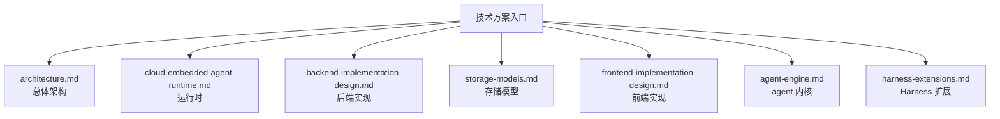

# 技术方案

本文档目录维护 `kk-studio` 当前生效的整体技术方案。

## 文档地图

## 阅读顺序

| 顺序 | 文档 | 关注点 | 适用场景 |
| --- | --- | --- | --- |
| 1 | [architecture.md](architecture.md) | 系统形态、模块边界、最小闭环 | 先建立全局认知 |
| 2 | [cloud-embedded-agent-runtime.md](cloud-embedded-agent-runtime.md) | embedded runtime 执行链路 | 理解 message submit 后发生什么 |
| 3 | [backend-implementation-design.md](backend-implementation-design.md) | `share` / `core` / `web` 结构与 API | 修改后端控制面 |
| 4 | [storage-models.md](storage-models.md) | 表结构、资源文件、seed 语义 | 调整存储或初始化脚本 |
| 5 | [frontend-implementation-design.md](frontend-implementation-design.md) | 路由、状态管理、测试边界 | 修改前端页面或 API 适配 |
| 6 | [agent-engine.md](agent-engine.md) | `agent` 模块执行内核 | 深入运行时与事件语义 |
| 7 | [harness-extensions.md](harness-extensions.md) | typed registry、hook 顺序、factory 与 lifecycle | 扩展 Harness 执行链 |

## 按主题索引

| 主题 | 文档 |
| --- | --- |
| 总体架构 | [architecture.md](architecture.md) |
| 运行时 | [cloud-embedded-agent-runtime.md](cloud-embedded-agent-runtime.md) |
| 后端实现 | [backend-implementation-design.md](backend-implementation-design.md) |
| 存储模型 | [storage-models.md](storage-models.md) |
| 前端实现 | [frontend-implementation-design.md](frontend-implementation-design.md) |
| agent 内核 | [agent-engine.md](agent-engine.md) |
| Harness 扩展 | [harness-extensions.md](harness-extensions.md) |

## 维护规则

| 规则 | 说明 |
| --- | --- |
| 与代码一致 | 文档只描述当前主干已生效的职责、协议、约束和实现方案 |
| 不写历史依赖 | 不要求读者了解旧版本、讨论过程或废弃方案 |
| 分层清晰 | 架构、运行时、存储、前后端实现分别维护，避免交叉重复 |
