# 技术方案

本文档目录维护 `kk-studio` 当前已落地实现；每份文档必须自洽可读，只描述现行职责、结构、协议与约束。

## 文档地图

```mermaid
flowchart TD
    A[技术方案入口]
    A --> B[architecture.md<br/>总体架构]
    A --> O[domain-map.md<br/>领域词汇与映射]
    A --> Q[harness-runtime-architecture.md<br/>Harness Runtime 架构]
    A --> X[harness-runtime-contracts.md<br/>Runtime 公共契约]
    A --> S[harness-storage-runtime.md<br/>PostgreSQL、Redis 与 activation]
    A --> D[backend-implementation-design.md<br/>后端实现]
    A --> E[storage-models.md<br/>存储模型]
    A --> F[frontend-implementation-design.md<br/>前端实现]
    A --> H[harness-capability-wiring.md<br/>Harness 能力装配]
    A --> I[prompt-cache-usage-cost.md<br/>Prompt Cache、Usage 与成本账本]
    A --> J[s3-presign.md<br/>S3 预签名直传]
    A --> K[comfyui-workflow-api.md<br/>ComfyUI 工作流与 S3 直传后端]
    A --> L[environment-daemon-gateway.md<br/>Environment Daemon Gateway]
    A --> M[prompt-to-artifact.md<br/>Prompt 到 Artifact 数据流]
    A --> P[e2e-regression.md<br/>E2E 回归矩阵与报告]
```

## 阅读顺序

| 顺序 | 文档 | 关注点 | 适用场景 |
| --- | --- | --- | --- |
| 1 | [architecture.md](architecture.md) | 双域拓扑、模块边界、Studio 当前事实 | 先建立全局认知 |
| 2 | [domain-map.md](domain-map.md) | Harness/Studio 词汇与前后端映射 | 统一命名与对接 |
| 3 | [harness-runtime-architecture.md](harness-runtime-architecture.md) | Runtime、Invocation、Interaction 与 durable actor 边界 | Harness 核心执行架构 |
| 4 | [harness-runtime-contracts.md](harness-runtime-contracts.md) | 核心类型、状态机、端口与事务契约 | 编写 Runtime 和 Adapter |
| 5 | [harness-storage-runtime.md](harness-storage-runtime.md) | PostgreSQL、Redis、通知、实时流、activation | 实现持久化与事件驱动基础设施 |
| 6 | [backend-implementation-design.md](backend-implementation-design.md) | `share` / `core` / `web` 的 HTTP、SSE 和 WebSocket 边界 | 修改后端控制面 |
| 7 | [storage-models.md](storage-models.md) | 表结构、资源文件、seed 语义 | 调整存储或初始化脚本 |
| 8 | [frontend-implementation-design.md](frontend-implementation-design.md) | 路由、状态管理、测试边界；视觉约定见 [前端设计规范](../product-design/frontend-design-system.md) | 修改前端页面或 API 适配 |
| 9 | [harness-capability-wiring.md](harness-capability-wiring.md) | Spring ObjectProvider、ProviderFactories、ToolFactories、interceptor chain | 修改 Harness 能力装配 |
| 10 | [prompt-cache-usage-cost.md](prompt-cache-usage-cost.md) | cache control、usage、pricing、ledger 与聚合 API | 修改模型调用计量与缓存链路 |
| 11 | [s3-presign.md](s3-presign.md) | 固定 bucket、path-style 的 S3 预签名直传 / 直下载 | 接入浏览器到对象存储的直传链路 |
| 12 | [comfyui-workflow-api.md](comfyui-workflow-api.md) | ComfyUI 工作流卡片 CRUD + 无状态提交 / 查询 / 取消 + S3 输入桥 | 接入 ComfyUI 控制台 |
| 13 | [environment-daemon-gateway.md](environment-daemon-gateway.md) | Environment 注册、Daemon v1 WebSocket、RemoteTool 分发 | 接入远端 Environment Tool |
| 14 | [prompt-to-artifact.md](prompt-to-artifact.md) | Prompt、Provider、Tool、Artifact 和浏览器读取的端到端事实链 | 修改跨边界执行或 artifact 呈现 |
| 15 | [e2e-regression.md](e2e-regression.md) | 矩阵分层、契约锚点、报告目录与前端变更维护 | 跑/改 E2E 回归 |

## 按主题索引

| 主题 | 文档 |
| --- | --- |
| 总体架构 | [architecture.md](architecture.md) |
| 领域词汇与映射 | [domain-map.md](domain-map.md) |
| Harness Runtime 架构 | [harness-runtime-architecture.md](harness-runtime-architecture.md) |
| Runtime 公共契约 | [harness-runtime-contracts.md](harness-runtime-contracts.md) |
| PostgreSQL、Redis 与 activation | [harness-storage-runtime.md](harness-storage-runtime.md) |
| 后端实现 | [backend-implementation-design.md](backend-implementation-design.md) |
| 存储模型 | [storage-models.md](storage-models.md) |
| 前端实现 | [frontend-implementation-design.md](frontend-implementation-design.md) |
| 前端设计规范 | [../product-design/frontend-design-system.md](../product-design/frontend-design-system.md) |
| Harness 能力装配 | [harness-capability-wiring.md](harness-capability-wiring.md) |
| Prompt Cache、Usage 与成本账本 | [prompt-cache-usage-cost.md](prompt-cache-usage-cost.md) |
| S3 预签名直传 | [s3-presign.md](s3-presign.md) |
| ComfyUI 工作流与 S3 直传后端 | [comfyui-workflow-api.md](comfyui-workflow-api.md) |
| Environment Daemon Gateway | [environment-daemon-gateway.md](environment-daemon-gateway.md) |
| Prompt 到 Artifact 数据流 | [prompt-to-artifact.md](prompt-to-artifact.md) |
| E2E 回归矩阵与报告 | [e2e-regression.md](e2e-regression.md) |

## 维护规则

| 规则 | 说明 |
| --- | --- |
| 状态准确 | Harness 以 [harness-runtime-architecture.md](harness-runtime-architecture.md) 与 [harness-runtime-contracts.md](harness-runtime-contracts.md) 为架构/契约事实源；存储与通知以 [harness-storage-runtime.md](harness-storage-runtime.md) 为事实源；Studio 当前事实以 [architecture.md](architecture.md) § 4 与 [storage-models.md](storage-models.md) Canvas 段为准 |
| 上下文无关 | 不要求读者了解讨论过程或其他文档的隐含前提 |
| 分层清晰 | 架构、运行时、存储、前后端实现分别维护，避免交叉重复 |
| 当前态 | 只描述现行实现；不写迁移历史、否决设计、未来恢复计划或兼容叙事 |
