# 技术方案

本文档目录维护 `kk-studio` 当前实现，只描述现行职责、结构、协议与约束。

## 文档地图

```mermaid
flowchart TD
    A[技术方案入口]
    A --> B[architecture.md<br/>总体架构]
    A --> O[domain-map.md<br/>领域词汇与映射]
    A --> Q[harness-runtime-architecture.md<br/>Harness Runtime 架构]
    A --> X[harness-runtime-contracts.md<br/>Runtime 公共契约]
    A --> S[harness-storage-runtime.md<br/>PostgreSQL activation、Redis realtime]
    A --> D[backend-implementation-design.md<br/>后端实现]
    A --> E[storage-models.md<br/>存储模型]
    A --> F[frontend-implementation-design.md<br/>前端实现]
    A --> H[harness-capability-wiring.md<br/>Harness 能力装配]
    A --> I[prompt-cache-usage-cost.md<br/>Prompt Cache、Usage 与成本账本]
    A --> J[s3-presign.md<br/>S3 预签名直传]
    A --> K[comfyui-workflow-api.md<br/>ComfyUI 工作流与 S3 直传后端]
    A --> L[environment-daemon-gateway.md<br/>Environment Daemon Gateway]
    A --> M[prompt-to-artifact.md<br/>Prompt 到 Artifact 数据流]
    A --> P[e2e-regression.md<br/>E2E 回归矩阵与报告]
```

## 阅读顺序

| 顺序 | 文档 | 关注点 |
| --- | --- | --- |
| 1 | [architecture.md](architecture.md) | 双域拓扑、模块边界与所有权 |
| 2 | [domain-map.md](domain-map.md) | Harness/Studio 词汇与前后端映射 |
| 3 | [harness-runtime-architecture.md](harness-runtime-architecture.md) | Thread、规划、Invocation 与 activation |
| 4 | [harness-runtime-contracts.md](harness-runtime-contracts.md) | Runtime 类型、状态机、端口与事务 |
| 5 | [harness-storage-runtime.md](harness-storage-runtime.md) | PostgreSQL durable facts、持久化激活与 Redis realtime |
| 6 | [backend-implementation-design.md](backend-implementation-design.md) | `share` / `core` / `web` 的 HTTP、SSE 与 WebSocket 边界 |
| 7 | [storage-models.md](storage-models.md) | 表结构、名称引用与账本事实 |
| 8 | [frontend-implementation-design.md](frontend-implementation-design.md) | Chat 设置、逐消息请求、Pane 与 transcript |
| 9 | [harness-capability-wiring.md](harness-capability-wiring.md) | Provider、Tool、Catalog 与 resolver 装配 |
| 10 | [prompt-cache-usage-cost.md](prompt-cache-usage-cost.md) | cache control、usage、pricing 与 ledger |
| 11 | [s3-presign.md](s3-presign.md) | S3 预签名直传与直下载 |
| 12 | [comfyui-workflow-api.md](comfyui-workflow-api.md) | ComfyUI 工作流与运行 API |
| 13 | [environment-daemon-gateway.md](environment-daemon-gateway.md) | Environment 注册、Daemon v1 与 RemoteTool |
| 14 | [prompt-to-artifact.md](prompt-to-artifact.md) | Prompt、Provider、Tool、Artifact 的事实链 |
| 15 | [e2e-regression.md](e2e-regression.md) | E2E case、开关、验证与报告 |

## 贯穿约束

- Provider 与 Agent 使用 immutable `name`。Model 的身份是 `(providerName, name)`，其公开引用是 `providerName/modelName`，解析时只在第一个 `/` 切分；Catalog DTO 不提供 bigint resource ID。
- Chat 只持久化唯一可见发送设置 `agentName` 与 `yoloEnabled`。`HarnessThread` 持有 nullable `environmentName`：创建时可原子指定，静止 Thread 可通过 `PUT /api/ai/runtime/threads/{threadId}/environment` 设置或清除；请求携带 `expectedExecutionEpoch`，成功同时递增 `executionEpoch` 与 `revision`，运行中或 epoch 陈旧返回 `409`。每条 USER/CUSTOM 消息的 `TurnSettings` 只保存 `agentName` 与 `yoloEnabled`。
- Chat-scoped Thread 创建在一个事务中原子完成 Session、ROOT、已绑定 Thread 与 Chat 关系，并可同时写入初始 Environment；Thread 的 head 始终非空，`PUT /head` 只接受非空 Entry 引用。
- Entry 只包含 `ROOT`、`MESSAGE`、`CUSTOM_MESSAGE`、`ASSISTANT_ERROR`、`ASSISTANT_ABORTED`；Input 只包含 `USER_MESSAGE`、`CUSTOM_MESSAGE`。
- 每次规划通过 `DatabaseTurnExecutionResolver` 读取最新 Agent、Provider、Model、ToolCatalog 与 Thread 当前 Environment。Agent 配置中的 Tool 名必须命中可选择目录，未知 Tool 返回 `TOOL_NOT_FOUND`；Platform Tool 总可候选，只有 READY Environment 才贡献 Environment Tool/Skill，配置的 Environment Tool/Skill 与当前能力取交集。null、stale 或 offline Environment 只贡献零 Environment Tool/Skill，不产生 Environment 或 Skill 缺失错误。
- 每个 Invocation 的 exact `ProviderRequest`、`ToolBinding`（descriptor/type/environmentName）、`SkillBinding` 与 `yolo` 一起持久化；retry 重放同一 request，ToolCall 严格按原 binding 路由。Provider 返回本次 request 不可见的 Tool 时，写入包含请求名称和可用 Tool 名称的可恢复 `ASSISTANT_ERROR`，不物化 ToolInvocation。

## 维护规则

| 规则 | 说明 |
| --- | --- |
| 状态准确 | Runtime 以 [harness-runtime-architecture.md](harness-runtime-architecture.md) 与 [harness-runtime-contracts.md](harness-runtime-contracts.md) 为事实源；存储与 activation 以 [harness-storage-runtime.md](harness-storage-runtime.md) 为事实源 |
| 上下文无关 | 文档可独立阅读，不依赖讨论过程 |
| 分层清晰 | 架构、Runtime、存储、前后端实现分别维护 |
| 当前态 | 只描述当前实现，目录、API 与 E2E case 以仓库现状为准 |
