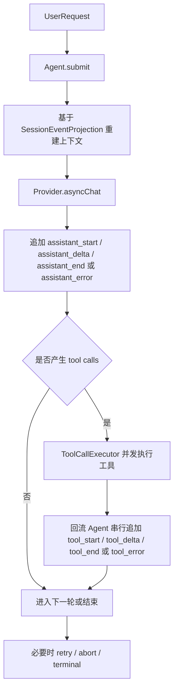

# Agent 执行内核

本文是整体技术方案的一部分，描述 `agent` 模块内部执行内核。

## 快速导航

| 主题 | 章节 | 关注点 |
| --- | --- | --- |
| 设计目标与原则 | 1 - 2 | 事实来源、Delta、错误、Abort、LangChain4j 边界 |
| 术语与事件 | 3 - 8 | Session、Branch、Run、Assistant / Tool / Abort 事件 |
| 主循环与重试 | 9 - 11 | submit、turn 结构、配置刷新、retry 语义 |
| Tool 基座与执行 | 12 - 16 | Tool SPI、ToolCallExecutor、batch、异步协调 |
| 投影与注册表 | 17 - 18 | SessionEventProjection、Agent / Provider / Model / Tool Registry |
| 外部依赖与结构 | 19 - 20 | LangChain4j 边界、代码组织 |

## 执行总览



## 生命周期矩阵

| 对象 | 开始事件 | 增量事件 | 成功结束 | 错误结束 | 取消语义 | 内容事实来源 |
| --- | --- | --- | --- | --- | --- | --- |
| Assistant | `assistant_start` | `assistant_delta` | `assistant_end` | `assistant_error` | `abort` 在 run 级别取消 | `assistant_delta` |
| Tool | `tool_start` | `tool_delta` | `tool_end` | `tool_error` | `abort` 同时取消所有 active tools | `tool_delta` |
| Run | `submit` 触发 | 由 assistant / tool 事件推进 | terminal 状态 | terminal 状态 | `abort` 记录用户取消事实 | `SessionEvent` |

## 事件族总表

| 事件族 | 事件 | 作用 |
| --- | --- | --- |
| 配置事件 | `set_agent_info`、`set_model_info` | 刷新执行上下文 |
| Assistant 事件 | `assistant_start`、`assistant_delta`、`assistant_end`、`assistant_error` | 表达 assistant 生命周期 |
| Tool 事件 | `tool_start`、`tool_delta`、`tool_end`、`tool_error` | 表达 tool 生命周期 |
| Abort 事件 | `abort` | 记录 run 级用户取消事实 |

## 1. 目标

Agent 模块采用 `SessionEvent` 单层事件流模型，统一支撑：

- 实时展示
- 上下文重放
- branch 继续执行
- assistant / tool 流式输出
- 模型重试
- 工具超时与取消
- 异常恢复与显式取消

模型特征：

- 使用单层 branch 继续执行模型。
- 使用 assistant/tool 生命周期表达循环边界。
- 持久化层只保存事件事实与必要元信息。
- LangChain4j 仅保留在 provider 边界。

## 2. 核心原则

### 2.1 SessionEvent 是唯一事实来源

持久化层只有 `SessionEvent`。

它同时承担：

- 历史事实记录
- 下一轮 assistant 输入来源
- 展示与重放来源

### 2.2 Delta 是内容真相

对 assistant / tool 两类流：

- `assistant_delta` 保存 assistant 内容变化
- `tool_delta` 保存 tool result 内容变化
- `assistant_end` / `tool_end` 只保存边界与少量元信息

因此：

- assistant 完整消息由 `assistant_delta` 重放得到
- tool 完整结果由 `tool_delta` 重放得到
- `*_end` 不是内容来源

### 2.3 Assistant error 与 tool error 明确分离

错误事件不再使用单个 `error` 事件隐式区分目标。

新事件为：

- `assistant_error`
- `tool_error`

语义：

- `assistant_error` 闭合当前 assistant 生命周期
- `tool_error` 闭合指定 `toolCallId` 的 tool 生命周期
- 被错误事件闭合后，不再写对应 `assistant_end` / `tool_end`
- 已存在 delta 仍参与重放

### 2.4 Abort 是 run-level 取消事实

`abort` 表示当前 run 被请求取消，不按 assistant/tool 拆分。用户显式取消和宿主 runtime 超时都复用该事件；`reason` 记录取消来源。

语义：

- `abort` 不携带 `toolCallId`
- 一个 `abort` 同时取消当前 run 中所有 active assistant / tools / retry timer
- `abort` 是 run-level 取消事实，不是某个 tool call 的错误事实
- 若存在 open assistant/tool，投影时由 projector 为 open state 追加中断文本
- 若没有 open assistant/tool，例如等待 retry delay 阶段，`abort` 只记录用户取消事实，不生成 LLM 消息

### 2.5 Agent 运行时串行推进 event

同一 branch 上：

- event append 必须串行
- assistant 调用无并发
- 多个 `toolCallId` 可以并行执行
- 多个 tool callback 可以交错到达
- callback 回流到 Agent 后由单个 signal drain 串行处理
- 运行时协作者只能通过 `AgentSessionWriter` 追加 event
- 若 Agent 在无法写出终态 event 的内部失败中释放当前 run，会通过 `AgentEventHandler.onFailure(...)`
  通知宿主 runtime 将对应 run 标记为失败

`ToolCallExecutor` 不直接写 `SessionEvent`。

它只负责：

- 隔离执行
- timeout 调度
- callback 防御
- cancel 管理
- 向 Agent 回流 tool signal

### 2.6 Agent 核心与 LangChain4j 依赖边界

`Agent`、`agent.session`、`agent.tool` 核心 SPI 必须保持 LangChain4j-free。

消息边界使用 kk-studio 自有 `AgentMessage` 模型：

- `Agent` 只持有 `List<AgentMessage>` 投影上下文
- `SessionEventProjection` 只返回 `List<AgentMessage>`
- `Provider.asyncChat(...)` 入参使用 `List<AgentMessage>`
- `AbstractModelProvider` 在 provider 包内部把 `AgentMessage` 转换为 LangChain4j `ChatMessage`

LangChain4j 依赖边界：

- `agent.provider` 把 `AgentMessage` 转成 LangChain4j `ChatMessage`
- `agent.provider` 把 `ToolInfo` 转成 LangChain4j `ToolSpecification`
- adapter 包把 LangChain4j `@Tool` 方法包装成 kk-studio `Tool`

核心 SPI 保持：

- `Agent` / `SessionEventProjection` / `Provider` 接口不暴露 LangChain4j 类型
- `Tool` / `ToolRegistry` / `ToolCallRequest` / `ToolExecutionHandler` 不直接使用 LangChain4j 类型
- Agent 主循环由 kk-studio runtime 负责推进

### 2.7 Runtime 负责工具生命周期裁决

工具实现只负责执行业务逻辑和协作式取消。

Runtime 负责：

- `tool_start / tool_delta / tool_end / tool_error` 顺序
- timeout
- abort
- 重复 callback 防御
- 迟到 callback 忽略
- 非法 callback 转错误
- batch 全部 terminal 后继续下一轮 assistant

## 3. 术语

### 3.1 Session

`Session` 保留：

- `sessionId`
- `currentHeadEventId`

### 3.2 Branch

`Branch` 是逻辑游标，不是实体。

字段：

- `sessionId`
- `headEventId`

### 3.3 Run

一次 run 从成功 CAS `idle -> busy` 开始，到释放 loop 结束。

一个 run 内可以包含：

- 一次或多次 assistant attempt
- 零个或多个 tool batch
- 模型重试 delay
- 用户 abort

### 3.4 Assistant attempt

一次实际 provider 调用对应一个 assistant attempt。

每次 attempt 都有独立生命周期：

```text
assistant_start
assistant_delta*
assistant_end | assistant_error
```

### 3.5 Tool call

一次模型返回的 tool call 对应一个工具生命周期：

```text
tool_start
tool_delta*
tool_end | tool_error
```

### 3.6 UserRequestQueue

`submit` 先进入 `UserRequestQueue`。

每一轮 `assistant_start` 前都要收割队列中的全部用户消息。

## 4. 事件类型

`SessionEventType` 为：

- `set_agent_info`
- `set_model_info`
- `assistant_start`
- `assistant_delta`
- `assistant_end`
- `assistant_error`
- `tool_start`
- `tool_delta`
- `tool_end`
- `tool_error`
- `abort`

旧的通用 `error` 事件移除。

## 5. 配置事件

### 5.1 set_agent_info

保存当前实际生效的 agent 信息。

payload：

- `agentName`
- `systemPrompt`
- `tools: List<String>`
- `subagents: List<String>`
- `skills: List<String>`

语义：

- 记录的是实际展开后的 agent 信息
- replay 不依赖 registry 的外部变更
- 不投影成业务消息，但会在投影时生成 system message

### 5.2 set_model_info

保存当前实际生效的模型选择。

payload：

- `provider`
- `model`
- `variant`

语义：

- 记录的是实际解析后的最终调用信息
- 每次实际 assistant 调用前都要检查是否变化

## 6. Assistant 事件

### 6.1 assistant_start

payload：

- `userMessages: List<String>`

语义：

- 每一轮 assistant attempt 都要写 `assistant_start`
- 首轮写收割到的用户消息
- tool 后续轮允许空列表
- 模型重试时也要重新写一条，但 `userMessages = []`

### 6.2 assistant_delta

payload：

- `textDelta`
- `thinkingDelta`
- `toolCallsDelta`

其中 `toolCallsDelta` 元素为：

- `index`
- `toolCallDelta`

`toolCallDelta` 字段：

- `toolCallId`
- `toolName`
- `argumentsDelta`

语义：

- `assistant_delta` 是 assistant 文本、thinking、tool calls 的内容来源
- provider 的 partial tool call 差异必须在 provider 边界或 Agent gap 逻辑中归一

### 6.3 assistant_end

payload：

- `metadata`

语义：

- 表示 assistant 正常结束
- 只保存 metadata
- 最终 text / thinking / tool calls 都通过 delta 补齐

### 6.4 assistant_error

payload：

- `message`

语义：

- 表示当前 assistant attempt 异常结束
- provider/model 失败、provider compatibility 失败等写 `assistant_error`
- 不再写 `assistant_end`
- 投影时将 `message` 追加到 assistant 文本中

## 7. Tool 事件

### 7.1 tool_start

payload：

- `toolCallId`
- `toolName`
- `arguments`

语义：

- 表示模型发起的一个 tool call 开始进入执行阶段
- 即使 tool not found，也先写 `tool_start` 再写 `tool_error`
- `arguments` 为模型返回的原始 JSON 字符串

### 7.2 tool_delta

payload：

- `toolCallId`
- `contentDeltas`

语义：

- `tool_delta` 是 tool result 的内容来源
- 多个 tool call 的 `tool_delta` 按实际 callback 到达顺序落 event

### 7.3 tool_end

payload：

- `toolCallId`

语义：

- 表示 tool call 正常结束
- 只负责闭合 tool 生命周期
- 不保存最终内容

### 7.4 tool_error

payload：

- `toolCallId`
- `message`

语义：

- 表示指定 tool call 异常结束
- timeout、tool not found、工具执行异常、非法 tool callback 都写 `tool_error`
- 不再写 `tool_end`
- 投影为 `ToolExecutionResultMessage`，并设置 `isError = true`

稳定错误文本：

- tool not found：`tool not found: {toolName}. Available tools: {a, b, c}.`
- timeout：`tool timeout after {timeoutSeconds} seconds: {toolName}`

可用工具列表按字典序展示。

## 8. Abort 事件

### 8.1 abort

payload：

- `reason`

语义：

- 由用户显式取消或宿主 runtime 超时触发
- 是 run-level 事件，不携带 `toolCallId`
- abort 发生后：
  - 取消 active assistant handle
  - 取消 active tool handles
  - 取消 pending retry scheduled task
  - 将当前 run 标记为 aborted
  - release loop
- `cancel()` 是 best-effort，抛异常时 warn 后继续

### 8.2 abort 与 open state 投影

Projector 看到 `abort` 时：

- 若存在 open assistant：追加 `[assistant response interrupted]` 并闭合 assistant 投影
- 若存在 open tool：为每个 open tool 追加 `[tool execution interrupted]` 并闭合 tool 投影
- 若没有 open state：只记录取消事实，不生成 LLM 消息

### 8.3 abort 与 tool batch 启动竞态

`startToolBatch` 每次写 `tool_start` 前必须检查：

- `currentRun != null`
- `!currentRun.aborted`

一旦 abort 已生效，停止启动后续 tool call。

已经启动的 tool call 由 run-level abort 统一取消。

## 9. 主链语义

### 9.1 submit

`submit` 的语义：

- 入队
- 触发主 loop 尝试启动

### 9.2 loop 启动

主 loop 规则：

1. 先检查 `UserRequestQueue`
2. 队列非空时 CAS `idle -> busy`
3. 抢占成功才真正进入 loop
4. 抢占失败说明已有 loop 在执行，安全返回

### 9.3 turn 结构

```text
pull all user messages
-> assistant attempt
-> if tool calls exist:
     run tool batch
     -> next assistant attempt
   else:
     final answer
```

补充：

- 第一次 assistant 无 tool call，即 final answer
- tool 全部结束后，进入下一轮 assistant 前再次收割用户消息
- final answer 后先释放 loop，再重新检查队列并触发新 loop

## 10. Assistant 调用前的配置刷新

每次实际 assistant 调用前：

1. 获取最新 `AgentInfo`
2. 获取最新模型选择
3. 若与当前事实不同：
  - 先写 `set_agent_info`
  - 再写 `set_model_info`
4. 然后写 `assistant_start`
5. 再发起模型调用

约束：

- 只在 assistant 前刷新配置
- tool 执行前不刷新
- 模型重试前也要刷新配置

## 11. 重试语义

### 11.1 范围

只支持当前模型级别重试：

- 不切 provider
- 不切 model fallback
- 不做额外 runtime fallback

### 11.2 失败后的事件表现

一次失败但可重试的尝试会显式进入历史：

```text
assistant_start
-> assistant_delta*
-> assistant_error
-> assistant_start
-> ...
-> assistant_end
```

语义：

- 每次模型调用尝试都是一个独立 assistant 生命周期
- 历史中可看到失败与已消耗副作用
- 重试时新的 `assistant_start.userMessages = []`

### 11.3 退避与上下文

运行中维护一个全异步 `AgentRunContext`，记录例如：

- 当前重试次数
- 当前 assistant handle
- 当前 tool handles
- 待处理 signal 队列状态
- pending retry scheduled task

当模型失败且未超限时：

1. 当前尝试写 `assistant_error`
2. `retryCount++`
3. 通过 `AgentScheduler` 注册一次延迟回调
4. 延迟按指数退避计算
5. 回调触发后重新进入下一次 assistant attempt

等待 retry delay 阶段：

- `currentRun != null`
- `activeAssistant == null`
- 没有 active tool
- `scheduledTask != null`

此阶段如果用户 abort：

1. 写 run-level `abort`
2. 取消 `scheduledTask`
3. release loop
4. projector 不生成 LLM 消息

## 12. Tool 基座

### 12.1 包结构

包结构：

```text
agent.tool
  Tool
  ToolCallRequest
  ToolExecutionHandler
  ToolExecutionHandle
  NoopToolExecutionHandle
  ToolInfo
  ToolRegistration
  ToolRegistry
  DefaultToolRegistry

agent.tool.execution
  ToolCallExecutor
  ToolExecutionListener
  ManagedToolExecutionHandle
  GuardedToolExecutionHandler
  ToolTimeoutException
```

### 12.2 ToolCallRequest

字段：

- `toolCallId`
- `toolName`
- `argumentsJson`

约束：

- `toolCallId` 非空
- `toolName` 非空
- `argumentsJson` 为合法 JSON object 字符串
- `null` 或 blank arguments 规范化为 `{}`
- 当调用方提供 `ToolInfo.inputSchema` 时，`argumentsJson` 必须满足 schema：
  - `required` 字段必须存在
  - `additionalProperties=false` 时拒绝未声明字段
  - string / integer / number / boolean / enum / array / object 按类型递归校验
- Agent 启动已注册工具前使用对应 `ToolRegistration.toolInfo.inputSchema` 构造 `ToolCallRequest`，schema 失败会写 `tool_error`，不会调用工具实现

### 12.3 Tool

接口：

```java
public interface Tool {

    ToolExecutionHandle asyncExecute(ToolCallRequest request, ToolExecutionHandler handler);

    default long timeoutSeconds() {
        return 0L;
    }

}
```

语义：

- `asyncExecute` 必须快速返回
- runtime 仍会用 worker 隔离调用，防止坏实现阻塞 Agent signal drain
- 返回值必须非 null
- 返回 null 视为工具实现契约错误，当前 tool call 写 `tool_error`
- `timeoutSeconds() == 0` 表示无限等待
- `timeoutSeconds() < 0` 非法，注册时拒绝

### 12.4 ToolExecutionHandler

接口：

```java
public interface ToolExecutionHandler {

    void onPartial(List<IndexedToolContentDelta> partial);

    void onComplete(List<ToolContent> result);

    void onError(Throwable error);

}
```

约束：

- callback 不携带 `ToolExecutionContext`
- runtime 已绑定 request、toolCallId 与 tool state
- 工具实现不能通过 callback 伪造 context

### 12.5 ToolExecutionHandle

接口：

```java
public interface ToolExecutionHandle {

    void cancel();

    boolean isCancelled();

}
```

语义：

- `cancel()` 是 best-effort
- `cancel()` 必须尽量幂等
- `cancel()` 抛异常时 runtime warn 后继续
- `NoopToolExecutionHandle` 作为独立类提供给测试与适配器使用，不在接口上放 `NOOP` 常量

### 12.6 ToolRegistration

字段：

- `ToolInfo toolInfo`
- `Tool tool`

语义：

- 注册层以 registration 为唯一事实
- 避免 `getToolInfo(name)` 与 `getTool(name)` 分裂

### 12.7 ToolRegistry

能力：

- `register(ToolRegistration registration)`
- `get(String toolName)`
- `getToolInfo(String toolName)`
- `getTool(String toolName)`
- `listToolNames()`
- `listRegistrations()`

`DefaultToolRegistry` 策略：

- name 非空
- `ToolInfo.name` 非空
- `ToolInfo.name` 与注册名一致
- `Tool` 非空
- `tool.timeoutSeconds() < 0` 拒绝注册
- 重复注册 fail-fast
- list 返回不可变视图
- `listToolNames()` 用字典序返回，确保错误提示和测试稳定

## 13. ToolCallExecutor

### 13.1 职责

`ToolCallExecutor` 执行单个 tool call。

职责：

- 接收 `ToolRegistration`
- 接收 `ToolCallRequest`
- 使用外部注入 `ExecutorService` 隔离 `tool.asyncExecute`
- 使用 `AgentScheduler` 调度 timeout
- 创建 `ManagedToolExecutionHandle`
- 创建 `GuardedToolExecutionHandler`
- 把 tool callback 转换为 listener 回调
- 不直接 append `SessionEvent`

### 13.2 依赖生命周期

`ToolCallExecutor` 由外部装配后注入 `Agent`。

`Agent` 不直接创建 worker 线程池，也不在内部 new 默认 executor。

`ExecutorService` 外部注入，调用方负责 shutdown。

原因：

- Agent 不私自持有线程池生命周期
- 测试可注入同步或可控 executor
- 应用层可统一管理资源

`AgentScheduler` 复用已有调度抽象，用于：

- model retry delay
- tool timeout

`AgentFactory` 负责把外部装配好的 `ToolCallExecutor` 传入 `Agent`。

### 13.3 执行流程

```text
Agent writes tool_start
-> Agent creates ToolExecutionState
-> ToolCallExecutor.execute(...)
     -> create ManagedToolExecutionHandle
     -> schedule timeout when timeoutSeconds > 0
     -> submit tool.asyncExecute(...) to ExecutorService
     -> bind returned delegate handle
     -> callback enters GuardedToolExecutionHandler
     -> listener sends signal back to Agent
-> Agent serially appends tool_delta/tool_end/tool_error
```

### 13.4 Timeout

语义：

- 起点：`tool_start` 持久化成功后
- `timeoutSeconds == 0`：无限等待，不注册 timeout task
- `timeoutSeconds > 0`：注册 timeout task
- timeout 触发：
  - 先以 terminal CAS 抢占终态
  - 触发 listener error
  - Agent 写 `tool_error`
  - best-effort cancel worker future 和 delegate handle
  - 迟到 callback warn + ignore

稳定 timeout 文本：

```text
tool timeout after {timeoutSeconds} seconds: {toolName}
```

### 13.5 Terminal 竞争

同一个 tool call 的终态包括：

- complete
- error
- timeout
- abort

规则：

- 先到先赢
- 后续终态 warn + ignore
- terminal 后的 partial warn + ignore
- 一个 tool call 最多写一个 `tool_end` 或 `tool_error`
- abort 是 run-level 事件；它会使 active tool runtime terminal，但不会为每个 tool 额外写 `tool_error`

### 13.6 非法 callback

结构非法直接使当前 tool call 进入 `tool_error`。

非法情况包括：

- `IndexedToolContentDelta.index == null`
- `IndexedToolContentDelta.index < 0`
- `contentDelta == null`
- `contentDelta.type == null`
- 同一 index 的 content type 冲突
- media content 缺少 data 或 mime
- media mime 与 content type 不匹配
- `onComplete` 返回非法 `ToolContent`

宽松情况：

- `onPartial(null)` / empty：warn + ignore
- `onComplete(null)`：按空结果 complete
- text delta 的 `text == null`：warn + ignore

### 13.7 asyncExecute 返回 null

`asyncExecute` 返回 null 是工具实现契约错误。

处理：

- 当前 tool call 写 `tool_error`
- 取消 timeout task
- 标记 terminal
- 不等待后续 callback

## 14. Tool batch 语义

### 14.1 启动

assistant 正常结束后，若 response 包含 tool calls：

1. 清空当前 run 的 tool state
2. 按模型返回顺序遍历 tool calls
3. 每个 tool call 写 `tool_start`
4. 启动 tool 执行
5. 每次写 `tool_start` 前检查 `currentRun.aborted`

### 14.2 tool not found

tool not found 仍写：

```text
tool_start
tool_error
```

错误文本：

```text
tool not found: {toolName}. Available tools: {a, b, c}.
```

如果没有可用工具：

```text
tool not found: {toolName}. Available tools: none.
```

### 14.3 单个工具失败

单个工具失败不取消整个 batch。

规则：

- 失败工具写 `tool_error`
- 其他工具继续执行
- 所有 tool 都 terminal 后进入下一轮 assistant

### 14.4 事件顺序

- `tool_start` 按模型返回顺序写入
- `tool_delta` / `tool_end` / `tool_error` 按实际 callback 或 timeout 到达顺序写入

## 15. 流式回调与 gap 补齐

### 15.1 assistant

Provider 层封装自己的 handler 协议，不让 Agent 直接依赖 LangChain4j 回调细节。

assistant complete 在写入 `assistant_end` 前校验最终 `toolCalls`：每个调用必须有非空 `toolCallId`、
非空 `toolName`，且 batch 内 id 唯一。校验失败时当前 attempt 写 `assistant_error`，并沿用普通 retry
策略；不会写出无法关联的 tool event。

回调类型：

- text delta
- thinking delta
- tool call delta
- tool call complete
- complete
- error

`complete` 到来时：

- 对比当前已聚合内容与最终完整结果
- 若存在 gap，则先补最后一个 `assistant_delta`
- 再写 `assistant_end`

### 15.2 tool

Tool handler 回调类型：

- partial
- complete
- error

`complete` 到来时：

- 校验最终完整结果
- 对比当前已聚合内容与最终完整结果
- 若存在 gap，则先补最后一个 `tool_delta`
- 再写 `tool_end`

若 complete 结果结构非法：

- 不写 `tool_end`
- 写 `tool_error`

## 16. 异步协调模型

### 16.1 assistant

assistant 本身没有并发，不需要多异步同步。

### 16.2 tool

多个 `toolCallId` 可以并行执行。

但回流到 Agent 时采用：

- CAS + signal 队列

即：

- callback 原样入队
- 同一时刻只有一个 drain 在消费
- event append 永远串行

### 16.3 ToolCallExecutor 与 Agent 的连接

`ToolCallExecutor` 使用 listener 回流：

- `onPartial(deltas)`
- `onComplete(contents)`
- `onError(error)`

Agent 创建 listener 时通过闭包绑定自己的 `ToolExecutionState`，再将 listener 回调包装成 `AgentSignal` 入队。

`ToolCallExecutor` 不依赖 Agent 内部状态类，避免 `agent.tool.execution` 反向耦合主状态机实现。

## 17. 投影规则

`SessionEventMessageProjector` 负责把 branch event 流投影为当前消息上下文。

`AgentSessionWriter` 持有当前 branch 的投影缓存。构造时建立初始投影；追加 event 或切换 branch
只标记缓存为 dirty，下一次读取 messages、agent/model 配置或完整 projection 时才完整重放。这样保持
投影作为唯一事实来源，同时避免每条 streaming delta 都重复扫描整个 branch event 链。

规则：

- 取最新 `set_agent_info` 生成当前 `SystemMessage`
- assistant/tool 完整消息由 delta 重放
- `assistant_error` 关闭当前 assistant，并将 message 追加到 assistant 文本
- `tool_error` 关闭指定 tool，并生成 `isError=true` 的 `ToolExecutionResultMessage`
- `abort` 关闭所有 open state：
  - assistant 追加 `[assistant response interrupted]`
  - tool 追加 `[tool execution interrupted]`
- `abort` 如果没有 open state，不生成消息
- malformed 内容投影时 best-effort 恢复并 warn

## 18. 注册表职责

### 18.1 AgentRegistry

负责：

- `registerAgent(AgentInfo)`
- `getAgent(name)`

`AgentInfo` 包含：

- `name`
- `systemPrompt`
- `defaultProvider`
- `defaultModel`
- `defaultVariant`
- `tools`
- `subagents`
- `skills`

### 18.2 ProviderRegistry / ProviderManager

`ProviderRegistry`：

- 输入 `provider` 名称
- 输出 `ProviderInfo`

`ProviderManager`：

- 输入 `ProviderInfo`
- 输出 `Provider`

### 18.3 ModelRegistry

`ModelRegistry`：

- `registerModel(ModelInfo)`
- `getModel(provider, model)`

运行时再从 `ModelInfo` 中解析 `variant`。

`Variant` 中：

- 通用参数直接平铺
- provider 专有参数直接使用 `Map<String, Object> providerOptions`

`Variant` 是运行时模型请求参数的唯一载体，由 `AgentRuntimeConfigResolver` 解析后直接交给 `Provider.asyncChat(...)`。不再存在中间的 `ModelRequestConfig` 之类的搬运结构，`Provider` 内部自行把 `AgentMessage + Variant + tool specifications` 翻译成 LangChain4j 的 `ChatRequest`。

### 18.4 ToolRegistry

`ToolRegistry` 以 `ToolRegistration` 为核心注册单位。

职责：

- 注册工具描述与执行器
- 查询工具描述
- 查询工具执行器
- 提供可用工具名称列表

`ToolInfo` 中：

- `name`
- `description`
- `inputSchema: ToolParamsSchema`

`ToolParamsSchema` 表示工具顶层参数对象；若参数内部还有 object 字段，则继续使用 `ToolObjectSchema` 作为嵌套 schema 节点。provider 再统一把这套自有 schema 模型翻译成底层 SDK 的 `ToolSpecification.parameters`。这样工具目录层不直接依赖 LangChain4j 的 schema 类型。

## 19. LangChain4j 边界

LangChain4j 在系统中的职责是 provider 边界适配。

采用方式：

- 使用 `ToolSpecification + ToolExecutor` 的规格与执行分离思路。
- 使用声明式元数据表达 tool schema 与参数信息。
- 使用 provider 包完成 `AgentMessage`、tool schema、模型请求参数到底层 SDK 的映射。
- 使用 adapter 包兼容 LangChain4j `@Tool` 方法并输出 kk-studio `ToolRegistration`。

边界约束：

- `ToolService` 不参与 Agent 主循环。
- `AiServiceStreamingResponseHandler` 不参与核心事件模型。
- LangChain4j 类型不扩散到 `agent` 核心 SPI。

## 20. 代码结构

`agent` 根包的运行时由一个公开入口和三个 package-private 协作者组成：

- `Agent`
  - 负责公开 API、主链状态机、signal drain、retry、abort 与 branch 切换协调
  - 每次 assistant 调用前解析运行时配置，并决定是否持久化配置变化
- `AgentSessionWriter`
  - 持有当前 session/branch/event 链及其完整投影缓存
  - 在构造、切换 branch 和追加 event 后重建 agent/model/messages 投影
  - 是运行时追加 session event 的唯一实现入口
- `AgentAssistantRunner`
  - 负责单次 assistant attempt 的 start、stream delta、complete、error 与 cancel
  - 将 provider callback 转换为 `AgentSignal`
- `AgentToolOrchestrator`
  - 负责一批 tool call 的 start、delta、complete、error 与 cancel
  - 将 tool callback 转换为 `AgentSignal`
- `AgentRunContext`
  - 承载一个主链 run 的 retry、active assistant 和 tool execution 状态
  - 仅由上述运行时协作者共享
- `AgentRuntimeConfigResolver`
  - 负责 agent/model 选择解析与运行时 provider/request config 装配
- `AgentFactory`
  - 从 session tree 读取 branch event 链并装配 `Agent` 运行时
- `ToolCallExecutor`
  - 负责单个 tool call 的隔离执行、timeout、callback 防御和 cancel 管理
  - 由外部注入 Agent 运行时
- `SessionManager`
  - 负责 branch 视角历史读取与事件追加
- `session.projection.SessionEventMessageProjector`
  - 负责事件重放与 `AgentMessage` 投影
- `agent.message`
  - 提供 Agent、Session 投影与 Provider 接口共享的自有消息模型
- `provider.AbstractModelProvider`
  - 负责 `AgentMessage` 到 LangChain4j `ChatMessage` 的边界适配与 tool specification 映射

`AgentSignal` 是 provider/tool 异步回调与主状态机之间的唯一交接协议。所有 event 写入都在 signal drain 内完成，因此 event 链保持串行，同时 tool 可以在运行时并发执行。
