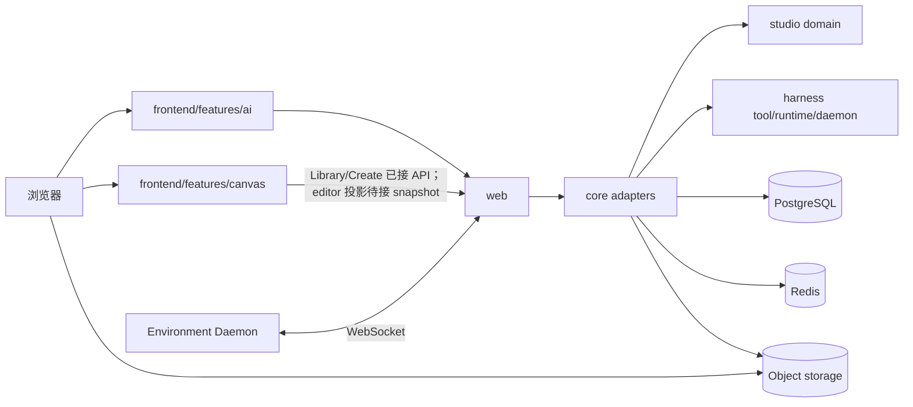

# 架构总览

`kk-studio` 是**全局单实例**产品，由两个并列产品域组成：

| 域 | 一句话 |
| --- | --- |
| **Harness / AI** | 可恢复的 Agent Thread 执行与观测 |
| **Studio / Canvas** | 全局单实例持久化画布（document / node / link / command-dedup） |

两者共享同一部署与 `web` 入口；React 产物嵌入 Spring Boot Fat JAR 并由 `classpath:/static` 提供，但**领域模型、状态机、存储事实与前端 feature 分离**。

词汇与映射见 [domain-map.md](domain-map.md)。

## 1. 系统拓扑



## 2. 模块边界

| 模块 | 职责 | 禁止 |
| --- | --- | --- |
| `studio` | Canvas 纯领域与端口 | Spring、MyBatis、HTTP、Harness 类型 |
| `harness-tool` | location-neutral Tool API / schema / RemoteTool / Daemon 协议 | Runtime 状态机 |
| `harness-runtime` | Session / Thread / Invocation / Interaction / Reconciler / Model 契约 | Provider SDK、Spring、HTTP |
| `harness-daemon` | 独立 Environment 进程适配器 | 依赖 runtime / Spring |
| `core` | Application boundary、composition、持久化/事务、worker lifecycle、S3、ComfyUI 与 Studio adapters；LangChain4j Provider | 成为第二个“万能领域层” |
| `web` | HTTP / SSE / WebSocket、内嵌静态资源与 SPA fallback 适配；只消费 Core API 与 share DTO | Harness 类型和领域状态机 |
| `share` | HTTP DTO | 领域规则 |
| `frontend` | React：`features/ai`、`features/canvas`、platform shell | 把后端契约写死在 UI 组件内部 |

依赖方向：

```text
web → core → studio
          → harness-runtime → harness-tool
          → harness-tool
web → share
core → share
harness-daemon → harness-tool
frontend → web APIs (via shared/api)
```

## 3. Harness 所有权模型

| 事实 | 职责 |
| --- | --- |
| **Chat** | 持久 Chat 集合与可选默认 Agent；不持有 Session/Thread，也不保存 Pane |
| **Pane** | 浏览器本地 Chat 工作区姿势：布局、焦点与各面板可空 `threadId` 仅存 localStorage |
| **Session** | 共享 append-only Entry Tree 的边界，不持有 Thread；存储列只有 `id`、`title`、`created_at`；由 Thread `bootstrapThread` 在同一事务中创建 |
| **Entry** | 语义持久真源：`ROOT`、`RUNTIME_CONFIG`、`MESSAGE`、`CUSTOM_MESSAGE`、`ASSISTANT_ERROR`、`ASSISTANT_ABORTED`（用户 `/stop` 持久化的 partial assistant turn，仅含安全 text/thinking） |
| **HarnessThread** | 可复用 durable runtime process：可空 `headEntryId`、input sequence、`runnable`、execution epoch、processor lease；当前 Session 由 head Entry 派生 |
| **Branch(thread)** | 不是独立实体：把某个 Thread 的 head 重定位到历史 Entry 即继续该分支；路径由 root→`headEntryId` 派生 |
| **ThreadInput** | 多生产者有序 mailbox：消息与配置命令；幂等键；TURN_BOUNDARY harvest |
| **ModelInvocation** | 冻结 ProviderRequest 的 durable Provider 调用 |
| **ToolInvocation** | 工具 lease、结果与终态；`PLATFORM`/`ENVIRONMENT` 路由；ID 是副作用幂等边界 |
| **Interaction** | 通用 approval/clarification/external input |
| **Usage / Cost** | 每 Assistant Entry 一条不可变账本（`harness_model_usage`） |
| **Live Environment** | 当前 Daemon 连接发现的内存工具/Skill 元数据；按名称唯一，不持久化 |

前端 AI 从 Chat 卡片进入本地 Pane 工作区。空 Pane 首发：`createThread -> bootstrap -> USER_MESSAGE`。前端以 Thread 路径 Entries 为历史基线，未物化的 `USER_MESSAGE` / `CUSTOM_MESSAGE` inputs 为装饰队列；流式覆盖来自 Redis realtime SSE（事件名 `realtime`，stream-id cursor）。

Thread head 的外部重定位（bootstrap / rebind / unbind）要求 Thread 逻辑静止，并以 `expectedExecutionEpoch` 做 CAS fencing：成功后 epoch+1 并清 lease/runnable，旧 epoch 的执行结果不再能写入。

执行由 `ThreadReconciler` 推进 Entry/head；`ModelWorker` / 统一 `ToolWorker` 只写 Invocation 事实。提交、Stop、Interaction 解决、Invocation terminal 后 afterCommit wake；低频 recovery 扫描 `runnable` 与过期 lease。

`Stop` 走 Thread command transaction 而非 mailbox，沿用 `ModelInvocationPlanner` 判定当前 head 是否仍有 response debt，并在 epoch 内原子追加 `ASSISTANT_ABORTED`（仅 text/thinking）或 `ASSISTANT_ERROR(CANCELLED)` barrier 后 fence 旧 generation 的 terminal CAS。`ModelWorker` 在每次 text/thinking SSE delta 之前以 Thread + Invocation 锁 fenced 写入 `safe_stream_snapshot`；fence LOST 时 worker 端立即 `abandon()` 本地 handle，不再发布该 delta。Retry 走 `safe_stream_snapshot = null` 的 CAS 重置，避免旧 attempt partial 污染下一轮 Provider 上下文。

ComfyUI Run 独立于 Harness Thread 模型。

详细架构见 [harness-runtime-architecture.md](harness-runtime-architecture.md)。

## 4. Studio 事实

| 事实 | 职责 | 代码状态 |
| --- | --- | --- |
| CanvasDocument + revision | 画布文档 | `canvas_document` 持久化；`updated_at` 用于列表排序 |
| CanvasNode (RESOURCE/FUNCTION) | 画布节点 | `canvas_node` 持久化；硬删除；`(canvas_id, id)` 唯一 |
| CanvasLink | 可见性 | `canvas_link` 持久化；同 Canvas 复合 FK，删除节点级联 |
| CanvasCommandDedup | 幂等去重事实 | `canvas_command_dedup`，主键 `(canvas_id, command_id)` |

FUNCTION 节点当前唯一实例是 `system.generate-text` v1。

## 5. Workspace 策略

- 全局单实例，无 membership/RBAC、无 workspace 列。
- Canvas 列表、详情与命令使用全局资源路径。

## 6. 前端结构

```text
frontend/src
├── app/                 启动与 Extension 注册
├── platform/            shell / workbench / extensions
├── features/ai/         Harness 控制台（Thread 真 API）
├── features/canvas/     Studio 画布（真实 Library/Create；editor projection/commands 待完整接入）
├── shared/api/          HTTP 客户端（含 studio-service 契约）
└── styles.css           全局设计 token
```

Canvas 表现模型与 Studio 词汇映射：`features/canvas/domain-map.ts`。

## 7. 清晰度规则（必须遵守）

1. **双域不混写**：Canvas 不引用 Harness Session/Thread 类型；Harness 不引用 CanvasDocument。
2. **Agent 进入 Studio 只有 Function 门面**：`system.agent.execute`（后续 Adapter 实现）。
3. **Link 与 Reference 不混称**：当前 Canvas 不持久化 ResourceReference。
4. **stub 必须诚实**：未实现能力不直接打包进接口；只暴露实际可用的 Canvas 行为。
5. **文档进度与代码一致**：见各文档落地描述。

## 8. 入口文档

| 文档 | 用途 |
| --- | --- |
| [domain-map.md](domain-map.md) | 词汇与前后端映射 |
| [harness-runtime-architecture.md](harness-runtime-architecture.md) | Harness 执行架构事实源 |
| [harness-runtime-contracts.md](harness-runtime-contracts.md) | Runtime 类型与事务契约 |
| [frontend-implementation-design.md](frontend-implementation-design.md) | 前端落地 |
| [frontend-design-system.md](../product-design/frontend-design-system.md) | 视觉 token |
| [storage-models.md](storage-models.md) | 关系存储摘要 |
