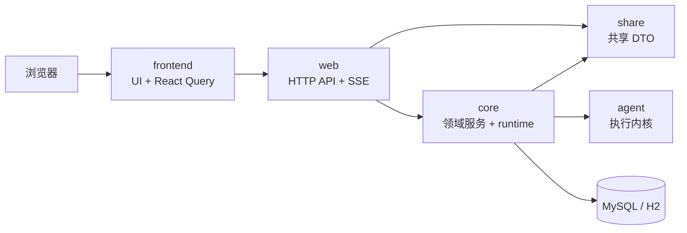

# 架构总览

本文描述 `kk-studio` 当前已经落地的云端内嵌 Agent Studio MVP 架构边界和最小可运行闭环。

## 架构摘要

| 主题 | 当前状态 |
| --- | --- |
| 系统形态 | 前后端分离控制面 |
| 前端入口 | `frontend` |
| 后端入口 | `web` |
| 核心领域服务 | `core` |
| 执行内核 | `agent`，由 `core` 以 embedded runtime 方式复用 |
| 共享契约 | `share` 承载前后端共享 DTO |

## 总体拓扑

## 最小可运行闭环

| 步骤 | 行为 | 结果 |
| --- | --- | --- |
| 1 | 启动 `frontend` | 前端页面可访问 |
| 2 | 前端调用 `web` API | 获取 provider / model / agent / session / run 数据 |
| 3 | `web` 转发到 `core` | 命中领域服务 |
| 4 | `core` 从 MySQL / H2 读取数据 | 返回 DTO 给前端 |
| 5 | 用户创建 session | 初始化 `default` head 与 `root` |
| 6 | 用户提交 message | 追加 `user_message` 并创建 `queued` run |
| 7 | `core` after-commit 调度 runtime | run 进入 `running` |
| 8 | embedded runtime 追加 `set_*` / `assistant_*` | run 最终进入 `succeeded` 或 `failed` |
| 9 | 前端订阅 SSE | `session_event` 推送后更新聊天投影 |

## 模块职责

| 模块 | 职责 | 边界 |
| --- | --- | --- |
| `frontend` | 页面、路由、API contract 适配、服务端状态管理、SSE 订阅 | 不直接访问数据库，不托管后端逻辑 |
| `web` | HTTP API、SSE 入口、参数解析、响应包装 | 不下沉 SQL 或复杂业务编排 |
| `core` | provider / model / agent / session / run 领域服务、仓储访问、embedded runtime | 负责当前控制面主链路 |
| `share` | `Agent*DTO` 等稳定共享 DTO | 不放 service / repository |
| `agent` | provider 适配、tool schema、session event 投影、执行主循环 | 被 `core` 复用，不直接对外暴露控制面 |

## 数据主线

| 数据域 | 表 | API |
| --- | --- | --- |
| provider | `agent_provider` | `/api/agent/providers` |
| model | `agent_model` | `/api/agent/models` |
| agent | `agent_definition` | `/api/agent/agents` |
| session metadata | `agent_session` | `/api/agent/sessions` |
| session branch | `agent_session_head`、`agent_session_event` | `/api/agent/sessions/{sessionId}/heads`、`/api/agent/sessions/{sessionId}/events` |
| event stream | `agent_session_event` | `/api/agent/sessions/{sessionId}/events/stream` |
| run | `agent_run` | `/api/agent/sessions/{sessionId}/runs` |
