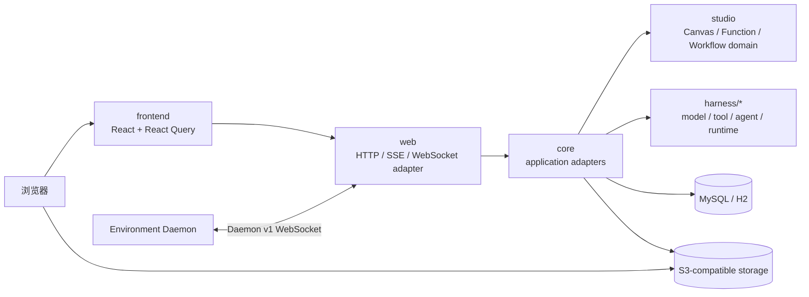

# 架构总览

`kk-studio` 是全局单实例的 Agent Studio。它以数据库中的 Harness Session、Run、Run Event、Tool Invocation、Task、Control、Usage、Artifact 和 Environment 作为可恢复事实；HTTP、SSE、WebSocket、worker 与 daemon connection 都是可丢弃的传输或执行载体。

## 系统拓扑

浏览器经 `web` 访问全局资源、Harness 控制面和可恢复 SSE。ComfyUI 输入输出使用浏览器到固定 bucket 的预签名直传；服务端只保存 object key 和元数据，不代理对象 bytes。Environment Daemon 只通过 WebSocket adapter 连接，Core 不依赖具体传输协议。

## 模块边界

| 模块 | 职责 |
| --- | --- |
| `studio` | Canvas / Resource / Function / Workflow 纯领域契约与运行时端口；不依赖 Spring/Harness |
| `harness/model` | Provider 无关的模型、用量、成本与 cache 合约 |
| `harness/tool` | Tool 描述、内容、schema 与 Daemon wire protocol |
| `harness/agent` | Provider 调用与单轮 Agent Turn 合约 |
| `harness/runtime` | Session Entry、Run、事件、权限、控制、Task 和 worker port 的领域语义 |
| `harness/daemon` | Environment 侧 Tool daemon 运行时与编码工具 |
| `core` | MyBatis 持久化、事务、运行时装配、worker、S3、ComfyUI、Environment gateway 与 Studio 适配器 |
| `web` | REST、SSE 和 WebSocket transport adapter；不承载领域状态 |
| `share` | HTTP DTO 边界 |
| `frontend` | React 页面、持久事实投影和 cursor 驱动 SSE 客户端 |

Provider / Model / AgentDefinition 是全局资源管理面，位于 `core.agent.definition|model|provider`；会话执行与观测只走 `harness/*` + `core.harness` 单轨。

## 持久模型

| 事实 | 职责 |
| --- | --- |
| Session / Session Entry | Session 树、冻结 Agent Snapshot 与完整语义消息历史 |
| Run / Run Event | 可重试的执行单元、流式进度、终态与实时投影 |
| Tool Invocation / Artifact | 工具权限、分发、结果与持久 artifact bytes |
| Root Activity / Subagent Task | 根 Session 范围的任务树、子代理状态与权限 relay |
| Run Control | steer、follow-up 与 abort 的可恢复命令 |
| Usage / Cost | 每次模型调用的不可变计量账本和聚合 |
| Tool Environment | 全局 Environment 元数据、daemon capability 与 heartbeat |

Session Entry 保存可重放的完整语义；Run Event 保存运行中增量和状态变化。前端以 Entry 作为聊天历史基线，只在尚未物化的区间以 Run Event 构建实时覆盖层。

## 一致性与并发

- 全局资源模型不包含 Tenant、Workspace membership、RBAC 或 ACL。
- 运行时配置、Session Agent Snapshot 与 Environment tool/version/capability binding 都是执行时冻结事实。
- 事务锁顺序固定为 `Run -> Session -> Root -> Invocation/Task/Control`。
- Assistant Entry、Usage 和对应 Run Event 按同一稳定事务写入。
- SSE 按数据库 cursor 重放，且只在成功发送后推进 cursor。
- Tool worker、Environment gateway 的 lease 和结果状态持久化，连接断开不伪造终态结果。

## Studio 当前落地状态

| 能力 | 状态 |
| --- | --- |
| `studio` 纯领域模块 | 已落地骨架：`model` / `canvas` / `workflow` / `runtime` |
| Function Catalog | 内存种子：text/image/video/agent system Function 定义 |
| Canvas / Workflow / Function 写路径 | core stub + HTTP 路由；返回 `501 Not Implemented` 或空查询 |
| 生成 Provider / Agent Adapter | **未实现**，明确 TODO |
| 持久化表 / Worker | **未实现**，下一切片 |

## 入口文档

- [无限画布与 Workflow](infinite-canvas-implementation-design.md)：Studio 领域与运行时目标契约。
- [Harness 运行时](cloud-embedded-agent-runtime.md)：消息提交、Run、worker、Tool 和 Daemon 的执行链。
- [后端落地设计](backend-implementation-design.md)：HTTP/SSE 边界、分层和错误语义。
- [前端落地设计](frontend-implementation-design.md)：聊天、Task Timeline 与 cursor 投影。
- [存储模型](storage-models.md)：表、初始化资源与存储约束。
- [Environment Daemon Gateway](environment-daemon-gateway.md)：Environment、协议与持久分发。
