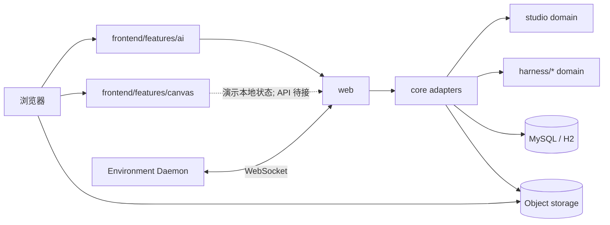

# 架构总览

`kk-studio` 是**全局单实例**产品，由两个并列产品域组成：

| 域 | 一句话 |
| --- | --- |
| **Harness / AI** | 可恢复的 Agent 会话执行与观测 |
| **Studio / Canvas** | 资源优先的多模态画布工作台（Function / Workflow） |

两者共享同一部署与 `web` 入口，但**领域模型、状态机、存储事实与前端 feature 分离**。

词汇与映射见 [domain-map.md](domain-map.md)。

## 1. 系统拓扑



## 2. 模块边界

| 模块 | 职责 | 禁止 |
| --- | --- | --- |
| `studio` | Canvas / Resource / Function / Workflow 纯领域与端口 | Spring、MyBatis、HTTP、Harness 类型 |
| `harness/*` | Agent 会话执行领域（Session/Run/Tool/Task） | 依赖 studio、承载 Canvas 语义 |
| `core` | 两边的持久化、事务、worker、S3、ComfyUI、Studio stub/adapters | 成为第二个“万能领域层” |
| `web` | HTTP / SSE / WebSocket 适配；DTO 映射 | 领域状态机 |
| `share` | HTTP DTO | 领域规则 |
| `frontend` | React：`features/ai`、`features/canvas`、platform shell | 把后端契约写死在 UI 组件内部 |

依赖方向：

```text
web → core → studio
          → harness/*
web → share
core → share
frontend → web APIs (via shared/api)
```

## 3. Harness 事实（已落地）

| 事实 | 职责 |
| --- | --- |
| Session / Entry | 完整语义历史与冻结 Agent Snapshot |
| Run / Run Event | 执行单元、流式覆盖、终态 |
| Tool Invocation / Artifact | 工具权限、结果、媒体 |
| Root Activity / Subagent Task | 任务树与权限 relay |
| Run Control | steer / follow-up / abort |
| Usage / Cost | 计量账本 |
| Tool Environment | daemon 元数据与 heartbeat |

前端 AI 以 Entry 为历史基线，Run Event 仅覆盖尚未物化区间；SSE cursor 可恢复。

## 4. Studio 事实（目标；骨架已立）

| 事实 | 职责 | 代码状态 |
| --- | --- | --- |
| CanvasDocument + revision | 画布文档 | 领域类型 + stub command/query |
| CanvasNode (RESOURCE/FUNCTION/GROUP) | 画布节点 | 领域类型 |
| CanvasLink | 可见性 | 领域类型 |
| ResourceReference | 实际依赖 | 领域类型 |
| Resource / ResourceVersion | 资源身份与不可变版本 | 领域类型 |
| FunctionDefinition / FunctionRun | 能力目录与执行 | Catalog 内存种子；Run stub |
| WorkflowDocument / Version | 工作流程序 | 领域类型 + stub |

生成 Provider、Agent Adapter、DB 表、Worker：**未实现**（显式 `StudioFeatureNotReadyException` / HTTP 501）。

## 5. Workspace 策略

- 单实例，无 membership/RBAC。
- 默认 workspace：`1`（`StudioWorkspaces.DEFAULT_ID`）。
- API 保留 `workspaceId` 参数；非默认值拒绝。

## 6. 前端结构

```text
frontend/src
├── app/                 启动与 Extension 注册
├── platform/            shell / workbench / extensions
├── features/ai/         Harness 控制台（真 API）
├── features/canvas/     Studio 画布演示（本地状态 + domainKind 映射）
├── shared/api/          HTTP 客户端（含 studio-service 契约）
└── styles.css           全局设计 token
```

Canvas 表现模型与 Studio 词汇映射：`features/canvas/domain-map.ts`。

## 7. 清晰度规则（必须遵守）

1. **双域不混写**：Canvas 不引用 Harness Session 类型；Harness 不引用 CanvasDocument。
2. **Agent 进入 Studio 只有 Function 门面**：`system.agent.execute`。
3. **Link 与 Reference 不混称**：演示连线 = visibility；依赖另建。
4. **stub 必须诚实**：未实现走 not-ready，不伪造成功路径。
5. **文档进度与代码一致**：见各文档“落地进度”表。

## 8. 入口文档

| 文档 | 用途 |
| --- | --- |
| [domain-map.md](domain-map.md) | 词汇与前后端映射 |
| [infinite-canvas-implementation-design.md](infinite-canvas-implementation-design.md) | Studio 目标契约 |
| [cloud-embedded-agent-runtime.md](cloud-embedded-agent-runtime.md) | Harness 执行链 |
| [frontend-implementation-design.md](frontend-implementation-design.md) | 前端落地 |
| [frontend-design-system.md](../product-design/frontend-design-system.md) | 视觉 token |
| [storage-models.md](storage-models.md) | 存储（Harness 已落地；Studio 表待补） |
