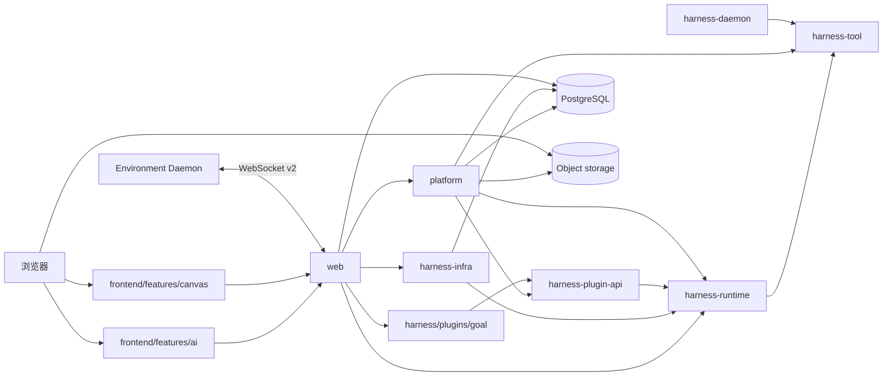

# 架构总览

`kk-studio` 是全局单实例产品，由 Harness/AI 与 Studio/Canvas 两个并列产品域组成。两者共享 `web` 入口与部署，但领域事实、状态机、存储和前端 feature 分开。

| 域 | 职责 |
| --- | --- |
| Harness / AI | Chat、Session Entry Tree、Thread 执行、Model/Tool Invocation、命令 batch 与实时投影 |
| Studio / Canvas | Canvas document、Resource/Function、Blob 生命周期、Patch/事件通道与 Canvas 持有的 Session |

浏览器把当前语言通过 `Accept-Language` 发送给 Web；后端只本地化用户可见错误，不改变稳定字段和领域事实。

## 1. 系统拓扑



## 2. 模块边界

| 模块 | 职责 |
| --- | --- |
| `harness-tool` | `Tool`、descriptor、schema、`ResourceRef`、`RemoteTool` 与 Daemon v3 wire |
| `harness-runtime` | **纯 Java 领域模块**：Session/Entry/Thread/Command/Invocation/Work 状态机、Thread/Model/Tool processor、Stop/Approval/fencing；不依赖 Spring、数据库驱动、HTTP 或 Provider SDK |
| `harness-plugin-api` | **纯 Java 受信任插件 API**：构建期注册、启动时冻结的 `PluginCatalog`，以及 `BranchView`、同步 `PluginTool`、声明式 `AppendCustomEntry` 与 context projector |
| `harness/plugins/goal` | Goal 插件：`create_goal` / `get_goal` / `update_goal` v2、branch-scoped `goal/state` 快照与 active goal 上下文投影 |
| `harness-infra` | `HarnessStore` PostgreSQL 适配、`harness_work` dispatcher（claim/NOTIFY/poll）、PostgreSQL realtime notification、本地 Resource store |
| `harness-daemon` | 独立 Environment 进程适配器，只依赖 `harness-tool` |
| `canvas-core` | **纯 Java Canvas 领域模块**：document、graph、Resource/Function、typed command、repository/query/codec 端口 |
| `canvas-infra` | Canvas PostgreSQL/MyBatis 持久化、Query 投影、Function JSON codec，以及依赖 Core 窄端口的 Function Runtime 基座 |
| `platform` | Catalog、全局 Blob Storage、`DatabaseTurnResolver`、Model/Tool Gateway、Environment、Chat 与 Canvas 应用服务；实现 Canvas Blob/Resource 生命周期端口并保留第三方 Function Adapter；Canvas 持久化只经 Core 端口访问；装配并执行受信任插件；Harness 执行表只经 Runtime/Store 端口写入 |
| `web` | **生产组合根**：装配 Runtime、infra 与 Platform ports，管理 dispatcher 与单连接 PostgreSQL notification loop 生命周期，并提供 HTTP、WebSocket（浏览器事件通道与 daemon v2）与静态资源适配 |
| `share` | HTTP DTO 与公开 JSON 结构 |
| `frontend` | React 页面、Pane、本地状态与 API client |

依赖方向：

```text
frontend -> web API / composition root
web -> platform
web -> canvas-infra -> canvas-core
web -> harness-infra -> harness-runtime -> harness-tool
web -> harness-runtime
web -> harness/plugins/* -> harness-plugin-api
platform -> harness-runtime -> harness-tool
platform -> harness-plugin-api -> harness-runtime
platform -> canvas-core
platform -> harness-tool
web -> share
harness-daemon -> harness-tool
```

## 3. Catalog 身份

| 资源 | 身份 | 运行时引用 |
| --- | --- | --- |
| Provider | immutable `name` | Agent 通过 Model 的 `providerName` 引用 |
| Model | `(providerName, name)` | Agent 通过 Model ref 引用 |
| Agent | immutable `name` | Chat defaults 与 Entry branch settings 通过 `agentName` 引用；default `model` 可编辑，只影响之后用该 Agent 新建的对话 |
| Variant | Model config 中的 `id` | Agent 的可选 `variant` 覆盖 Model 的 `defaultVariant` |
| Tool | 只有 `PLATFORM` / `ENVIRONMENT` 两类 | Agent config 保存可选择 Tool 名称集合；`load_skill`/`task` 是内部 `PLATFORM` Tool，不在可选择目录 |

公开 Model ref 的格式是 `providerName/modelName`。`ModelRef.parse` 只在第一个 `/` 切分，因此 `modelName` 可以包含额外 `/`。Catalog response 只使用名称、结构化 config 和版本字段，不使用 bigint resource ID。

Catalog 只有 `agent_provider`、`agent_model`、`agent_definition` 三张名称资源表。三表都是带 `expectedVersion` CAS 的硬删除：删除后同名立即可重建，重建行 `version` 从 0 重新开始；记录存续期间名称不可修改。所有引用都只按名称：Chat 的 `agentName`、Thread 的 `BranchSettings`、Model 的 `providerName` 都不绑定资源 ID。Agent/Model 修改在下一 turn 由 `DatabaseTurnResolver` 解析最新行生效；每次 Model attempt 由 Platform 按 `providerName` 重新读取当前 `agent_provider` 行（providerType/baseUrl/credential/config）形成短生命周期 attempt-local Provider。硬删除到同名重建之间既有名称引用 fail closed（turn 拒绝 / attempt 确定性失败）；重建后既有 Chat/Thread 的名称引用解析到当前同名资源。

## 4. Harness 所有权模型

| 事实 | 当前职责 |
| --- | --- |
| Chat | 保存 `agentName`、可空默认 `EnvironmentBinding{name, workspacePath}`、`yoloEnabled` 三个可见发送设置，以及标题、版本和时间；经 `chat_session` 持有 0..N 个 Session |
| Pane | 浏览器 `localStorage` 中的八个固定槽位、布局、焦点和每个槽位的 `PaneTarget`（NEW_SESSION_DRAFT / ENTRY_DRAFT / BOUND_THREAD 三态） |
| Session | 一棵 append-only Entry Tree 的边界；只在第一批 Command 被原子接受时创建 |
| Entry | 对话与运行审计事实，只允许十种 `EntryType`（见 [harness-runtime-architecture.md](harness-runtime-architecture.md)） |
| HarnessThread | durable 字段为 `sessionId`、`headEntryId`、`materializationHash`、`yoloEnabled`、`nextCommandSequence`、`version` 与时间；Environment/status 由 head Entry 分支派生 |
| ThreadCommand | 有序 mailbox，只允许六类 command（见 [harness-runtime-contracts.md](harness-runtime-contracts.md)）；YOLO 是 Thread 直接控制面 |
| ModelInvocation | 一次持久化 `basisHeadEntryId + compact ModelRequestSpec`（providerType/model/variant/preamble/toolBindings/skillBindings/subagentBindings/cacheControl；无 messages/tools/YOLO/contextWindow/compaction metadata）的 Provider 执行及其状态、attempt-local checkpoint、连续 `failedAttempts` 与 terminal 事实；完整 ProviderRequest 每次 attempt 由 Materializer 从 EntryPath + spec 内存重建，压缩身份由 basis EntryPath 末尾的 `TURN_START.compaction` 表达 |
| ToolInvocation | 一次 ToolCall（`call` + 可空 `binding`）的 approval、状态、结果与 `effects`；插件 provenance/access 随 binding 冻结，unknown tool 槽位 binding 为 null，非空 effects 只允许出现在 `SUCCEEDED` 且 terminal immutable |
| SubagentContext | 子 Agent Thread ROOT 上冻结的委派归属 `{parentThreadId, rootThreadId, taskInvocationId, depth}`；task id/session_id 即子 ThreadId（canonical UUID） |
| Work | 唯一调度 mailbox：`(target_type, target_id)` 的 `available_at`/`wake_version`/lease |
| Goal state | `goal` 插件拥有的 branch-scoped 完整快照：`CUSTOM(pluginId=goal, customType=state, schemaVersion=1)`；只取当前分支最近快照，无独立 Goal 表 |
| Live Environment | 已绑定 Daemon 的服务器内存投影，按 canonical `environmentName` 唯一，状态为 `CONNECTING`/`READY`；可用性 = READY + 连接打开 + 心跳未过期 |

Session、Environment、status 与 branch settings 都从 head Entry 分支派生，**不**在 Thread 行上复制；Thread 行不保存 execution epoch、processor lease 或 runnable 标志。

## 5. 创建、发送与执行

`POST /api/ai/runtime/command-batches` 是唯一产品写入口：一个事务内原子接受 owner + target + commands，并在 NEW_SESSION/ENTRY 时创建 Session（唯一 ROOT，携带完整 `BranchSettings`）、head 指向 ROOT/startEntry 的 Thread（`nextCommandSequence=1`、`version=0`）、owner relation、Commands 与 Work。Session/Thread materialization 只发生在首批 Command 被接受时；`/tree` 选择 Entry 只把 Pane 切换为 `ENTRY_DRAFT(sessionId,startEntryId)`（零写入）。

发送路径如下：

```text
NEW_SESSION_DRAFT submission:
  POST /api/ai/runtime/command-batches       -> NEW_SESSION target 原子创建 Session + ROOT + Thread
                                                + owner relation + Commands + Work

ENTRY_DRAFT / Bound Thread 的每次发送:
  构造 SET_* diff batch（ENV→AGENT→MODEL→TOOLS）+ USER_MESSAGE（YOLO 走直接控制面 PUT /yolo）
  -> ENTRY target（首发）或 THREAD target（expectedHeadEntryId + expectedNextCommandSequence CAS）
  -> ThreadProcessor 收割 queued Commands（全量已存在 id 时是 ordered replay）
  -> TurnPlanBuilder 追加 TURN_START(INPUT) + Message Entries
  -> TurnResolver 读取最新 Catalog/Environment 并冻结 compact ModelRequestSpec（fail closed；Agent/Model 修改下一 turn 生效）
  -> ModelProcessor（有效 claim 内从 basisHeadEntryId + spec 重建内存 ProviderRequest；每次 attempt 按 providerName 重读当前 agent_provider 行，见 harness-capability-wiring）
  -> 失败 attempt 审计 Entry（0..N）+ Assistant Entry + 可选 ToolInvocation -> ToolProcessor -> Tool Result Entry
  -> TURN_END(COMPLETED, continueModel=true) -> continuation，直到 Model 无 ToolCall
```

`ThreadProcessor` 是执行阶段 Entry/head 的唯一写者；控制面 `HarnessRuntime` 只在 command acceptance/stop 等同步事务写 Entry/head。`ModelProcessor`/`ToolProcessor` 不写 Entry/head，但会更新各自 Invocation、为可见状态变化 touch Thread version、维护 Work，并发布 PostgreSQL realtime notification。Model terminal apply 与 Stop 会先把普通 invocation 的 `failedAttempts` 物化为透明 `MODEL_ATTEMPT_FAILURE` Entry，再写唯一 Assistant 结果。插件 Tool terminal success 先由 `PlatformToolGateway` 校验 provenance/access 与 intents，再外部化结果，由 `ToolProcessor` 将 `ToolResult + effects` 原子写为 `SUCCEEDED`。正常 apply 与 Stop 共用唯一 `ToolOutcomeAppender`，按 effects 中 CUSTOM 的声明顺序追加后再追加 Tool Result。

Model 与 Tool Gateway 在确定性路由完成后分别通过 Runtime 的无等待 `ConcurrencyAdmission` 获取进程内 permit；容量耗尽返回既有 `Busy`/`Overloaded`，不会打开 Provider、执行 Tool 或发送 Environment 请求。permit 覆盖整个 invocation，从两阶段激活前到首个 terminal、取消、提交拒绝或异常收敛，lease 关闭幂等且不会以 executor 任务时长代替 invocation 容量。Subagent 使用部署容量驱动的固定 N 虚拟线程 executor、零队列与 `AbortPolicy`；TaskTool 在创建 child Session/Thread 前把拒绝转换为既有 task ERROR ToolResult。容量是部署级进程边界，不进入 durable DB、SystemSettings、DTO 或 API wire。

## 6. Canvas

Canvas 使用 `CanvasDocument` 聚合：所有业务节点都是 `ResourceNode`，当前内容通过直接 owner 的有序
`Resource[]` 表达，资源生产能力通过可选 Function 表达；Group 与 Link 独立存在，Link target
必须有 Function且允许成环。用户 typed command batch 通过 document 行 `version` CAS 原子提交，并以
`(canvasId, commandId) + requestHash` 幂等。Function start、checkpoint 与 terminal 状态都前进同一 version，
并发布携带 run 投影的 node patch 使前端经 version 事件收敛。

媒体 Resource 只引用全局 `storage_blob`；`canvas_resource` 的
`ownerNodeId + resourceIndex` 是成对可空字段，使 Function target 和 pinned orphan 可以暂时无 owner。
`canvas_function_resource_pin` 的 INPUT/OUTPUT pin 只保护 Resource 生命周期，不增加 Blob ref_count。
Canvas 经 `canvas_session` 持有 0..N 个 Harness Session；Canvas 首条 Agent 消息与 Chat 共用
`POST /api/ai/runtime/command-batches`（NEW_SESSION target），ordered ATTACHMENT 复用共享命令
use-case 物化为 durable `resource(blobId,name,preview)`。Canvas Graph version 初始 0，只有成功 graph
command/function 状态变化才前进 +1；Harness command acceptance 不前移 graph version。

## 7. Realtime 与恢复

PostgreSQL 是唯一 durable truth，`harness_work` 是 Harness 唯一调度 mailbox。Work 的
`NOTIFY` 只是可用性提示，丢失时由 periodic poll 收敛；realtime 使用 live-only PostgreSQL
notification，不保存历史。浏览器先读取 REST snapshot，再经应用事件 WebSocket
（`/api/events/v1`，见 [application-event-channel.md](application-event-channel.md)）订阅 durable
`version` 与 realtime delta；首次订阅、重连、gap 或 `resync` 都重新读取 snapshot。

Canvas 使用同一原则：PostgreSQL 实体与 `canvas_document.version` 是事实源，命令响应返回 Patch 供发起窗口
即时应用；PostgreSQL `NOTIFY canvas_version` 只唤醒事件通道的 version source。其他窗口收到更高 version，
以及首次订阅、重连或 `resync` 时，都重新读取权威 Snapshot 收敛。

## 8. Subagent 委派（task）

`task` 是内部 `PLATFORM` Tool（`rendererKey=task`、`NON_IDEMPOTENT`）：Model 调用后，`harness.runtime.subagent.TaskTool` 以普通 durable Harness Thread 创建子 Agent Session，复用现有 ToolInvocation/approval/stop/Work 与 Thread 状态机——**没有新表、新状态机或新调度器**。关键事实：

- 子 Thread ROOT payload 携带可选 `subagentContext {parentThreadId, rootThreadId, taskInvocationId, depth}`；`task` 的 id/session_id 是子 ThreadId（canonical UUID）。
- 委派权限在父 ModelRequestSpec 冻结为 `subagentBindings`（Agent 名称 + 描述 allowlist）；执行绝不重读父 Agent 配置扩权。子 Agent branch settings 由 `AgentBranchSettingsMaterializer` 按最新 catalog 物化（`activeTools = config.tools + skills 非空时 load_skill + subagents 非空且未达最大深度时 task`）。
- 运行期控制全部是配置（`SubagentConfig`）：`maxDepth`、每父/每根并发上限、idle 超时、`maxTurns` 软预算；观察完全事件驱动（`ChangeGate.awaitChange` 等 version wake 到达才读 snapshot，无固定轮询）；进程内 `SubagentRunRegistry` 只做并发 reservation，不是 durable truth。恢复（`session_id`）要求同 parent/root 归属且子 Thread quiescent；Stop/取消保留可恢复 Session。
- 进度经非 durable PostgreSQL `TOOL_PARTIAL` notification（约 1s）发布完整 JSON 快照（`details.kind=task.status`：threadId/subagentType/state/depth/turns/toolCalls/lastActivity/approvals/descendants）；`descendants` 是进程内 relay 的扁平活动子树状态，使根 Thread 可直接处理任意深度审批，且不参与调度或终态判定。前端整帧替换而非增量合并；通知丢失时重新读取 durable snapshot。最终 ToolResult 是 `<task id state>` envelope（`<task_result>` / `<task_error>`），`details.kind=task.result`。

详细契约见 [harness-runtime-architecture.md](harness-runtime-architecture.md)、[harness-runtime-contracts.md](harness-runtime-contracts.md) 与 [harness-storage-runtime.md](harness-storage-runtime.md)。
