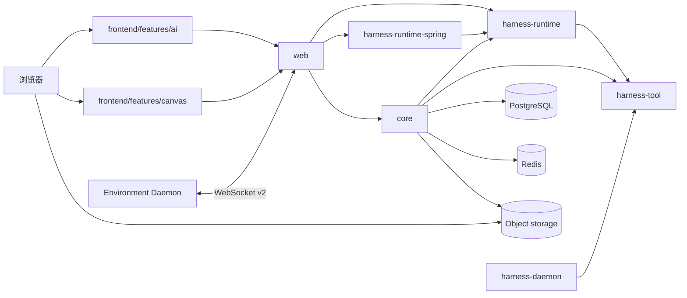

# 架构总览

`kk-studio` 是全局单实例产品，由 Harness/AI 与 Studio/Canvas 两个并列产品域组成。两者共享 `web` 入口与部署，但领域事实、状态机、存储和前端 feature 分开。

| 域 | 职责 |
| --- | --- |
| Harness / AI | Chat、Session Entry Tree、Thread 执行、Model/Tool Invocation、命令 batch 与实时投影 |
| Studio / Canvas | Canvas document、node、link 与 command dedup |

浏览器把当前语言通过 `Accept-Language` 发送给 Web；后端只本地化用户可见错误，不改变稳定字段和领域事实。

## 1. 系统拓扑



## 2. 模块边界

| 模块 | 职责 |
| --- | --- |
| `harness-tool` | `Tool`、descriptor、schema、`ResourceRef`、`RemoteTool` 与 Daemon v2 wire |
| `harness-runtime` | **纯 Java 领域模块**：Session/Entry/Thread/Command/Invocation/Work 状态机、Thread/Model/Tool processor、Stop/Approval/fencing；不依赖 Spring、数据库、Redis、HTTP 或 Provider SDK |
| `harness-runtime-spring` | `HarnessStore` PostgreSQL 适配、`harness_work` dispatcher（claim/NOTIFY/poll）、Redis realtime overlay、本地 Resource store |
| `harness-daemon` | 独立 Environment 进程适配器，只依赖 `harness-tool` |
| `core` | Catalog、`DatabaseTurnResolver`、`CoreModelGateway`/`CoreToolGateway`、Environment registry/daemon gateway、Goal 与 Chat 应用服务；**不写 `harness_*` 表** |
| `web` | **生产组合根**：装配 Runtime、runtime-spring 与 Core ports，管理 dispatcher/listener 生命周期，并提供 HTTP、SSE、WebSocket v2 与静态资源适配 |
| `share` | HTTP DTO 与公开 JSON 结构 |
| `frontend` | React 页面、Pane、本地状态与 API client |

依赖方向：

```text
frontend -> web API / composition root
web -> core
web -> harness-runtime-spring -> harness-runtime -> harness-tool
web -> harness-runtime
core -> harness-runtime -> harness-tool
core -> harness-tool
web -> share
harness-daemon -> harness-tool
```

## 3. Catalog 身份

| 资源 | 身份 | 运行时引用 |
| --- | --- | --- |
| Provider | immutable `name` | Agent 通过 Model 的 `providerName` 引用 |
| Model | `(providerName, name)` | Agent 通过 Model ref 引用 |
| Agent | immutable `name` | Chat defaults 与 Entry branch settings 通过 `agentName` 引用 |
| Variant | Model config 中的 `id` | Agent 的可选 `variant` 覆盖 Model 的 `defaultVariant` |
| Tool | 只有 `PLATFORM` / `ENVIRONMENT` 两类 | Agent config 保存可选择 Tool 名称集合 |

公开 Model ref 的格式是 `providerName/modelName`。`ModelRef.parse` 只在第一个 `/` 切分，因此 `modelName` 可以包含额外 `/`。Catalog response 只使用名称、结构化 config 和版本字段，不使用 bigint resource ID。

## 4. Harness 所有权模型

| 事实 | 当前职责 |
| --- | --- |
| Chat | 保存 `agentName`、`yoloEnabled` 两个可见发送设置，以及标题、版本和时间 |
| Pane | 浏览器 `localStorage` 中的八个固定槽位、布局、焦点和每个槽位的 `threadId` |
| Session | 一棵 append-only Entry Tree 的边界；由 Chat-scoped Thread 创建事务产生 |
| Entry | 对话与运行审计事实，只允许七种 `EntryType`（见 [harness-runtime-architecture.md](harness-runtime-architecture.md)） |
| HarnessThread | durable 字段只有 `headEntryId`、`yoloEnabled`、`nextCommandSequence`、`revision` 与时间；Session/Environment/status 由 head Entry 分支派生 |
| ThreadCommand | 有序 mailbox，只允许八类 command（见 [harness-runtime-contracts.md](harness-runtime-contracts.md)） |
| ModelInvocation | 一次冻结的 `ModelInvocationRequest`（route/provider/tools/skills/YOLO）及其状态、attempt 与 terminal 事实 |
| ToolInvocation | 一次 ToolCall 的冻结 binding、approval、状态与结果 |
| Work | 唯一调度 mailbox：`(target_type, target_id)` 的 `available_at`/`wake_version`/lease |
| ThreadGoal | Core application-owned 的 per-Thread Goal：`agent_thread_goal` 表（无 `harness_` 前缀，**不是** Runtime 第 8 表），经 selectable Platform tools `create_goal`/`get_goal`/`update_goal` 读写 |
| Live Environment | 已绑定 Daemon 的服务器内存投影，按 canonical `environmentId` 唯一，状态为 `CONNECTING`/`READY`；只有 READY 可参与 resolve/dispatch |

Session、Environment、status 与 branch settings 都从 head Entry 分支派生，**不**在 Thread 行上复制；Thread 行不保存 execution epoch、processor lease 或 runnable 标志。

## 5. 创建、发送与执行

`POST /api/ai/chat/{chatId}/threads` 是 Thread 创建入口：一个事务内创建 Session、唯一 ROOT（携带完整 `BranchSettings`）、head 指向 ROOT 的 Thread（`nextCommandSequence=1`、`revision=0`），并写入 Chat↔Thread 关系；创建 API 刻意非幂等（无 createRequestId），每次创建全新 Session/Thread。

发送路径如下：

```text
Blank first send:
  POST /api/ai/chat/{chatId}/threads          -> Session + ROOT + Thread（完整 BranchSettings 已固化）
  POST /api/ai/runtime/threads/{threadId}/commands  -> 原子 USER_MESSAGE-only batch（202）

绑定 Pane 的每次发送:
  构造 SET_* diff batch（ENV→AGENT→MODEL→THINKING→TOOLS→YOLO）+ USER_MESSAGE
  -> POST /commands（expectedHeadEntryId + expectedNextCommandSequence CAS，202）
  -> ThreadProcessor 收割 queued Commands（全量已存在 id 时是 ordered replay）
  -> TurnPlanBuilder 追加 TURN_START(INPUT) + Message Entries
  -> TurnResolver 读取最新 Catalog/Environment 并冻结 ModelInvocationRequest（fail closed）
  -> ModelProcessor / Provider
  -> Assistant Entry + 可选 ToolInvocation -> ToolProcessor -> Tool Result Entry
  -> TURN_END(COMPLETED, continueModel=true) -> continuation，直到 Model 无 ToolCall
```

`ThreadProcessor` 是执行阶段 Entry/head 的唯一写者；控制面 `HarnessRuntime` 只在 create/move/stop 等同步事务写 Entry/head。`ModelProcessor`/`ToolProcessor` 不写 Entry/head，但会更新各自 Invocation、为可见状态变化 touch Thread revision、维护 Work，并发布 realtime overlay；Tool terminal success 先由 `CoreToolGateway` 回调桥外部化，再交给 `ToolProcessor` 落库。

## 6. Canvas

Canvas 继续使用独立的 `CanvasDocument`、`CanvasNode`、`CanvasLink` 与 `CanvasCommandDedup`。当前持久化 Function 节点是 `system.generate-text` v1。Canvas 不引用 Harness Session/Thread。

## 7. Realtime 与恢复

PostgreSQL 是唯一 durable truth，`harness_work` 是唯一调度 mailbox（NOTIFY 只是可用性提示）。Redis Streams 只保存有界 realtime overlay；浏览器先读取 REST snapshot，再以 durable `revision` 打开 SSE。Redis 丢失时重新加载 snapshot，不从 delta 重建状态。

详细契约见 [harness-runtime-architecture.md](harness-runtime-architecture.md)、[harness-runtime-contracts.md](harness-runtime-contracts.md) 与 [harness-storage-runtime.md](harness-storage-runtime.md)。
