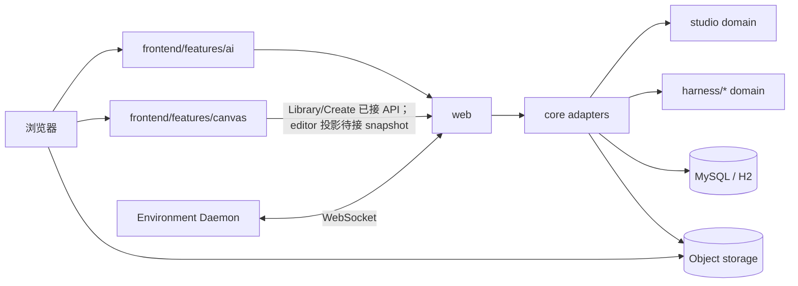

# 架构总览

`kk-studio` 是**全局单实例**产品，由两个并列产品域组成：

| 域 | 一句话 |
| --- | --- |
| **Harness / AI** | 可恢复的 Agent Thread 执行与观测 |
| **Studio / Canvas** | 资源优先的多模态画布工作台（Function / Workflow） |

两者共享同一部署与 `web` 入口，但**领域模型、状态机、存储事实与前端 feature 分离**。

词汇与映射见 [domain-map.md](domain-map.md)。

## 1. 系统拓扑



## 2. 模块边界

| 模块 | 职责 | 禁止 |
| --- | --- | --- |
| `studio` | Canvas / Resource / Function / Workflow 纯领域与端口 | Spring、MyBatis、HTTP、Harness 类型 |
| `harness/*` | Agent 执行领域（Session / Thread / Tool / Task / Usage） | 依赖 studio、承载 Canvas 语义 |
| `core` | 两边的持久化、事务、worker、S3、ComfyUI 与 Studio adapters | 成为第二个“万能领域层” |
| `web` | HTTP / SSE / WebSocket 适配；DTO 映射 | 领域状态机 |
| `share` | HTTP DTO | 领域规则 |
| `frontend` | React：`features/ai`、`features/canvas`、platform shell | 把后端契约写死在 UI 组件内部 |

依赖方向：

```text
web → core → studio
          → harness/*
web → share
core → share
frontend → web APIs (via shared/api)
```

## 3. Harness 所有权模型（已落地）

| 事实 | 职责 |
| --- | --- |
| **Session** | 共享 append-only Entry Tree 容器；无 leaf / active 执行指针 / YOLO |
| **Entry** | 语义持久真源：消息、Agent Snapshot、Tool Result、Compaction |
| **AgentThread** | 用户面板 / actor 状态：`sessionId`、`headEntryId` 游标、冻结 Agent 定义与 runtime config、Thread YOLO、input sequence、processor token/until/version |
| **Branch(thread)** | 由 root→`headEntryId` 路径派生，不独立持久化；多 Thread 可共享 head 后自然分叉 |
| **ThreadInput** | 有序 mailbox：`USER_MESSAGE` / `SET_YOLO` / `SET_AGENT`；`clientMessageId` 幂等；HTTP 202 |
| **ThreadEvent** | Thread 级 journal / 可观测覆盖层；全局十进制 `eventId` 作 SSE cursor |
| **ToolInvocation** | 工具权限、lease、结果与终态；ID 是副作用幂等边界 |
| **SubagentTask** | parent invocation → child Session + child Thread 关系、maxTurns、report |
| **Root Activity** | 根 Session 树内事件投影（查询合成，非独立写表） |
| **Usage / Cost** | 每 Assistant Entry 一条不可变账本 |
| **Tool Environment** | daemon 元数据与 heartbeat |

前端 AI 以 Thread 路径 Entries 为历史基线，未物化的 `USER_MESSAGE` inputs 与 active ThreadEvents 作覆盖层；SSE 以全局 `eventId` 字符串 cursor 恢复。

执行由事件触发的 `ThreadProcessor` 推进：提交 / 权限 / tool / subagent 完成后 `kick`；低频 `ThreadRecoveryLifecycle` 仅扫描丢失的 durable work。

ComfyUI Run 与 Studio `FunctionRun` 是独立概念，不纳入 Harness Thread 模型。

## 4. Studio 事实

| 事实 | 职责 | 代码状态 |
| --- | --- | --- |
| CanvasDocument + revision | 画布文档 | `canvas_document` 持久化 + command/query |
| CanvasNode (RESOURCE/FUNCTION/GROUP) | 画布节点 | `canvas_node` 持久化，soft delete |
| CanvasLink | 可见性 | `canvas_link` 持久化，唯一 `(canvas_id, source_node_id, target_node_id)` |
| CanvasCommand | 幂等命令记录 | `canvas_command`，唯一 `(workspace_id, command_id)` |
| ResourceReference | 实际依赖 | 领域契约，持久化待补 |
| Resource / ResourceVersion | 资源身份与不可变版本 | 领域类型 |
| FunctionDefinition / FunctionRun | 能力目录与执行 | Catalog 内存种子；Run stub |
| WorkflowDocument / Version | 工作流程序 | 领域类型 + stub |

Resource / Workflow / FunctionRun 的完整持久化与执行 worker 尚未实现；未就绪能力显式返回 `StudioFeatureNotReadyException` / HTTP 501。

## 5. Workspace 策略

- 单实例，无 membership/RBAC。
- 默认 workspace：`1`（`StudioWorkspaces.DEFAULT_ID`）。
- API 保留 `workspaceId` 参数；非默认值拒绝。

## 6. 前端结构

```text
frontend/src
├── app/                 启动与 Extension 注册
├── platform/            shell / workbench / extensions
├── features/ai/         Harness 控制台（Thread 真 API）
├── features/canvas/     Studio 画布（真实 Library/Create；editor projection/commands 待完整接入）
├── shared/api/          HTTP 客户端（含 studio-service 契约）
└── styles.css           全局设计 token
```

Canvas 表现模型与 Studio 词汇映射：`features/canvas/domain-map.ts`。

## 7. 清晰度规则（必须遵守）

1. **双域不混写**：Canvas 不引用 Harness Session/Thread 类型；Harness 不引用 CanvasDocument。
2. **Agent 进入 Studio 只有 Function 门面**：`system.agent.execute`。
3. **Link 与 Reference 不混称**：演示连线 = visibility；依赖另建。
4. **stub 必须诚实**：未实现走 not-ready，不伪造成功路径。
5. **文档进度与代码一致**：见各文档落地描述。
6. **独立 Run 概念不跨域混用**：Harness 无 Run 实体；Studio `FunctionRun`、Canvas `AgentRunNode`、ComfyUI job 各自独立。

## 8. 入口文档

| 文档 | 用途 |
| --- | --- |
| [domain-map.md](domain-map.md) | 词汇与前后端映射 |
| [infinite-canvas-implementation-design.md](infinite-canvas-implementation-design.md) | Studio 目标契约 |
| [cloud-embedded-agent-runtime.md](cloud-embedded-agent-runtime.md) | Harness Thread 执行链 |
| [frontend-implementation-design.md](frontend-implementation-design.md) | 前端落地 |
| [frontend-design-system.md](../product-design/frontend-design-system.md) | 视觉 token |
| [storage-models.md](storage-models.md) | 当前关系存储（Harness 与 Canvas 最小持久化） |
