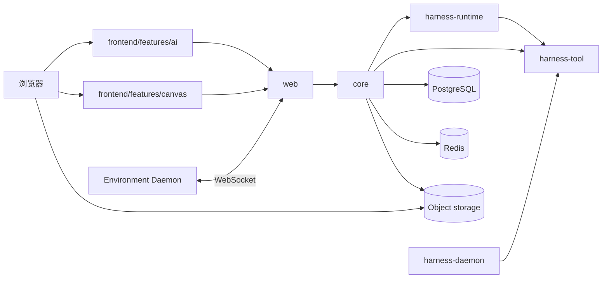

# 架构总览

`kk-studio` 是全局单实例产品，由 Harness/AI 与 Studio/Canvas 两个并列产品域组成。两者共享 `web` 入口与部署，但领域事实、状态机、存储和前端 feature 分开。

| 域 | 职责 |
| --- | --- |
| Harness / AI | Chat、Session Entry Tree、Thread 执行、Model/Tool Invocation、Interaction 与 Usage |
| Studio / Canvas | Canvas document、node、link 与 command dedup |

浏览器把当前语言通过 `Accept-Language` 发送给 Web；后端只本地化用户可见错误，不改变稳定字段和领域事实。

## 1. 系统拓扑



## 2. 模块边界

| 模块 | 职责 |
| --- | --- |
| `studio` | Canvas 纯领域与端口 |
| `harness-tool` | `Tool`、descriptor、schema、`RemoteTool` 与 Daemon 协议 |
| `harness-runtime` | Session、Entry、Thread、Reconciler、Model/Tool Invocation、Interaction 与运行时端口 |
| `harness-daemon` | 独立 Environment 进程适配器，只依赖 `harness-tool` |
| `core` | Spring composition、PostgreSQL/Redis/S3 adapter、Catalog 与 Environment resolver、Provider adapter |
| `web` | HTTP、SSE、WebSocket 与静态资源适配 |
| `share` | HTTP DTO 与公开 JSON 结构 |
| `frontend` | React 页面、Pane、本地状态与 API client |

依赖方向：

```text
frontend -> web API -> core -> studio
                         -> harness-runtime -> harness-tool
                         -> harness-tool
harness-daemon -> harness-tool
```

## 3. Catalog 身份

| 资源 | 身份 | 运行时引用 |
| --- | --- | --- |
| Provider | immutable `name` | Agent 通过 `modelProviderName` 引用 |
| Model | `(providerName, name)` | Agent 通过两部分引用 |
| Agent | immutable `name` | Chat 与每条消息通过 `agentName` 引用 |
| Variant | Model config 中的 `id` | Agent 的可选 `variant` 覆盖 Model 的 `defaultVariant` |
| Tool / Skill | 名称与版本或名称 | Agent config 保存名称集合 |

公开 Model ref 的格式是 `providerName/modelName`。`ModelRef.parse` 只在第一个 `/` 切分，因此 `modelName` 可以包含额外 `/`。Catalog response 只使用名称、结构化 config 和版本字段，不使用 bigint resource ID。

## 4. Harness 所有权模型

| 事实 | 当前职责 |
| --- | --- |
| Chat | 保存 `agentName`、`environmentName`、`yoloEnabled` 这三个可见发送设置，以及标题、版本和时间 |
| Pane | 浏览器 `localStorage` 中的八个固定槽位、布局、焦点和每个槽位的 `threadId` |
| Session | 一棵 append-only Entry Tree 的边界；由 Chat-scoped Thread 创建事务产生 |
| Entry | 对话与运行审计事实，只允许五种 `EntryType` |
| HarnessThread | `headEntryId`、input sequence、runnable、revision、execution epoch、processor lease 与时间；只保存运行事实 |
| ThreadInput | 有序 mailbox，只允许 `USER_MESSAGE` 与 `CUSTOM_MESSAGE` |
| ModelInvocation | 一次冻结的 `ModelInvocationRequest` 及其状态、lease、retry 和 terminal 事实 |
| ToolInvocation | 一次 ToolCall 的原 binding、参数、目标、权限、状态和结果 |
| Interaction | Tool permission 等待与响应事实 |
| Usage | 每个 Assistant Entry 一条不可变模型用量账本 |
| Live Environment | READY Daemon 的服务器内存投影，按 `environmentName` 唯一 |

USER/CUSTOM message 的 Input 与最终 Entry 都保存 compact `TurnSettings(agentName, environmentName, yoloEnabled)`。Agent 决定 Model、Variant、Tools 和 Skills；Thread 不保存这些 active config。

## 5. 创建、发送与执行

`POST /api/ai/chat/{chatId}/threads` 是 Thread 创建入口。一个事务内创建 Session、唯一 ROOT、head 指向 ROOT 的 Thread，并写入 Chat↔Thread 关系；响应已经包含可发送的 Thread。ROOT 保证 head 非空，`PUT /api/ai/runtime/threads/{threadId}/head` 只能指向非空 Entry，并要求 Thread 静止与 `expectedExecutionEpoch` CAS。

发送路径如下：

```text
Chat 当前可见设置
  -> POST /messages 或 /messages/custom
  -> ThreadInput(USER_MESSAGE/CUSTOM_MESSAGE)
  -> TURN_INPUT_BATCH harvest
  -> Entry append
  -> ModelInvocationPlanner
  -> DatabaseTurnExecutionResolver 读取最新 Catalog 与 READY Environment
  -> 冻结 ModelInvocationRequest
  -> ModelWorker / Provider
  -> Assistant Entry + Usage
```

Resolver 发现 Agent、Provider、Model、Variant、Environment、Tool 或 Skill 缺失时返回 typed `PlanningFailure`；Reconciler 将其写成 `ASSISTANT_ERROR` barrier，模型调用不会静默降级。已创建的 ModelInvocation retry 使用同一份 request，ToolWorker 也只使用其中冻结的 ToolBinding。

`ThreadReconciler` 是执行过程中 Entry/head 的唯一写者。ModelWorker 只写 ModelInvocation 和 realtime delta；ToolWorker 只写 ToolInvocation 和 realtime partial；terminal 事实通过 PostgreSQL ExecutionActivation 唤醒后续 Reconcile。

## 6. Canvas

Canvas 继续使用独立的 `CanvasDocument`、`CanvasNode`、`CanvasLink` 与 `CanvasCommandDedup`。当前持久化 Function 节点是 `system.generate-text` v1。Canvas 不引用 Harness Session/Thread。

## 7. Realtime 与恢复

PostgreSQL 是唯一 durable truth，`harness_execution_activation` 是唯一 durable activation queue。Redis Streams 只保存有界 realtime overlay；浏览器先读取 REST snapshot，再以 durable `revision` 打开 SSE。Redis 丢失时重新加载 snapshot，不从 delta 重建状态。

详细契约见 [harness-runtime-architecture.md](harness-runtime-architecture.md)、[harness-runtime-contracts.md](harness-runtime-contracts.md) 与 [harness-storage-runtime.md](harness-storage-runtime.md)。
