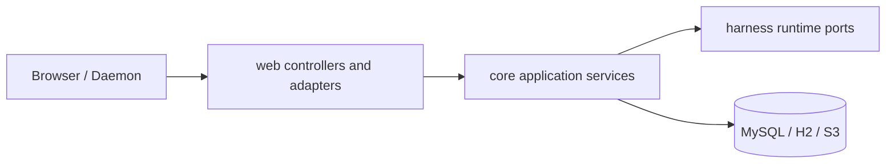

# 后端落地设计

本文描述当前 `share`、`core` 和 `web` 的 Harness 控制面。领域状态由 `core` 管理，`web` 仅负责 HTTP、SSE 和 WebSocket 适配。

## 分层



| 层 | 职责 |
| --- | --- |
| `share` | DTO、JSON 字段和 HTTP 数据边界 |
| `web` | 路由、参数解析、SSE emitter、WebSocket adapter、HTTP 状态映射 |
| `core.harness` | Session、Thread、Task、Tool、Usage、Artifact 的应用服务与持久化 |
| `core.environment` | 内存 Live Environment Registry、capability/heartbeat 应用和 daemon gateway |
| `harness/*` | Provider、Thread、Session、Tool、Task 和协议领域合约 |

## API 边界

所有 Snowflake ID 在 HTTP 载荷和路径中均为正十进制字符串。格式非法、负 cursor 或非法 limit 返回 `400`；格式合法但不存在的资源返回 `404`；版本、状态或引用冲突返回 `409`。

| 域 | 接口 | 用途 |
| --- | --- | --- |
| Provider / Model / Agent | `/api/providers`、`/api/models`、`/api/agents` | 全局 Agent 资源 CRUD |
| Chat | `/api/chats`、`/api/chats/{chatId}/sessions` | 持久 Chat CRUD 与 Session 成员关系 |
| Session | `POST /api/sessions`、`GET /api/sessions`、`GET /api/sessions/{sessionId}`、`/entries` | 原子创建 Session/Main Thread；Session Tree 与完整 Entries 查询 |
| Session Threads | `GET` / `POST /api/sessions/{sessionId}/threads` | 列出 Thread；从 durable `fromEntryId` 创建 Secondary Thread |
| Thread | `GET /api/threads/{threadId}` | 读取 durable Branch actor |
| Thread 输入（202） | `POST /api/threads/{id}/messages`、`PUT .../agent`、`/model`、`/yolo` | 按 mailbox 顺序入队消息或配置命令 |
| Thread 投影 | `GET /api/threads/{id}/entries`、`/inputs`、`/events`、`/events/stream` | 路径 Entries、inputs、events 与 SSE |
| Thread 控制 | `POST /api/threads/{id}/stop` | 幂等取消 queued Input / Tool work |
| Retry policy | `GET` / `PUT /api/harness/retry-policy` | 全局持久化自动重试策略 |
| Root Activity / Task | `GET /api/sessions/{id}/activities`、`GET /api/sessions/{id}/tasks` | 根活动投影与子代理任务 |
| Tool | `GET /api/threads/{id}/tool-invocations`、`GET /api/tool-invocations/{id}`、`POST /api/tool-invocations/{id}/decision` | Tool 状态与权限决策 |
| Artifact / Usage | `/api/artifacts/{id}`、`/api/usage/threads/{id}`、`/api/usage/sessions/{id}`、`/api/usage/models/{id}` | artifact bytes 与用量汇总 |
| Environment | `GET /api/environments`、`/api/environments/daemon/v1` | 只读实时 Registry 与 daemon WebSocket |

Model 与 Agent 的 `PUT` 接口接收完整 editable body；`name`、结构化 `config`、Agent `modelId/variant` 均为必需字段。Provider credential 不回显，因此 Provider 更新中空 credential 表示保留当前密钥。

ComfyUI 和 S3 接口边界见 [ComfyUI 工作流 API](comfyui-workflow-api.md) 与 [S3 预签名](s3-presign.md)。

### Controller 映射

| Controller | 路径前缀 | 职责 |
| --- | --- | --- |
| `StudioHarnessThreadController` | `/api/threads` | Thread 读取、入队 202、Stop、entries/inputs/events/SSE |
| `StudioHarnessRetryPolicyController` | `/api/harness/retry-policy` | 自动重试策略读取与完整替换 |
| `StudioHarnessSessionController` | `/api/sessions` | Session/Main Thread 创建、Session 查询与 Secondary Thread 创建 |
| `StudioChatController` | `/api/chats` | Chat CRUD 与 Chat-Session 成员关系 |
| `StudioHarnessObservabilityController` | `/api` | activities、tool-invocations、tasks、artifacts |
| `StudioToolInvocationController` | `/api` | permission decision |
| `StudioModelUsageController` | `/api/usage` | Thread / Session / Model 聚合 |
| `StudioToolEnvironmentController` | `/api/environments` | 只读实时 Environment Registry |

## Thread 与 Session

`POST /api/sessions` 在一个事务内写入 Session、语义根 `ROOT` Entry 与 Main Thread（agent/model 为空，yolo 取请求或默认），并回写稳定的 `main_thread_id`。`POST /api/sessions/{sessionId}/threads` 必须提供属于该 Session 的 `fromEntryId`，只创建新的 Thread cursor，不复制 Entry、ToolInvocation 或 Event，也不追加合成 `AGENT_CHANGE`。新 Thread 的 head 保持 `fromEntryId`；若路径上存在 `AGENT_CHANGE`，则按路径最后一次 Agent 身份与**当前** AgentDefinition 的 model/variant 初始化 Thread 独立字段（yolo=false）；无 Agent 历史则 agent/model 为空；历史 Definition 缺失时整事务失败。

用户消息与设置变更只进入 `ThreadInput` mailbox，**不**同步写 Entry。Processor 仅在 Provider 调用前、无 Tool Turn 完成后、当前 Tool batch 全部终态并应用后或 Compaction 后 Harvest：锁定 Thread 与 token、读取 cutoff、按 sequence 应用 cutoff 内全部 queued Input、逐条 CAS 为 `APPLIED`，再原子推进 head。一个含消息的批次只触发一次 Assistant Turn；配置-only 批次只更新路径配置投影。

查询顺序由后端定义：Thread Entries 按 root→`headEntryId` 父链返回，inputs 按 `sequence ASC` 返回，events 按 `id ASC` 返回。`createTime` 只用于展示与审计；墙钟回拨不能改变 Entry 因果顺序或 mailbox/journal 顺序，前端不得二次重排。

Java 领域类型使用 `AgentThread`，避免与 `java.lang.Thread` 冲突。

核心应用服务：

| 服务 | 职责 |
| --- | --- |
| `HarnessSessionCommandService` | create Session/Main Thread / create Secondary Thread |
| `HarnessThreadCommandService` | submit message / queue Agent、Model、YOLO / Stop |
| `HarnessRetryPolicyService` | 读取/替换全局自动重试策略，并为 Runtime 提供当前策略 |
| `HarnessThreadQueryService` | thread 查询、路径 entries、inputs、events |
| `HarnessThreadTransactionService` | Thread/Input/Entry/Tool/Usage 原子事务（实现 `ThreadTransactions`） |
| `HarnessSessionQueryService` | Session 只读 |
| `HarnessObservabilityQueryService` | events、activities、invocations、tasks、artifacts |
| `ToolInvocationDecisionService` | 权限决策 |
| `ModelUsageAggregationService` | 账本聚合 |
| `ThreadRecoveryLifecycle` | 低频 recoverable kick |

## 事务与锁

固定锁序（避免死锁）：

```text
非锁 peek → 锁 Thread 行 → 锁 Invocation / Task（按需）
```

规则：

- 入队与 Stop 锁 Thread；自动重试计划也校验当前 `processorToken`。Harvest、beginTurn、commit assistant、prepare tools、release 额外校验 `processorToken`。
- Tool decision / terminal 与 processor 同序：先 Thread 后 invocation。
- Assistant Entry 与 `model_usage_record` 同事务；`assistant_entry_id` 唯一。
- Tool 副作用以 `tool_invocation.id` 为幂等键。

## SSE 与可恢复投影

Thread Event SSE 先重放 durable events，再监听未来轮询结果；事件名 `thread_event`，SSE id 为全局 `eventId` 十进制字符串。恢复 cursor 取 query `afterEventId` 与 `Last-Event-ID` 中合法非负十进制的较大者。Root Activity 为 REST 快照合成（由 root 下 ThreadEvent 等事实查询），不以内存 EventBus 为真源。Child Tool ASK 仍归属 Child Thread，并以同一 Invocation ID 向 root Thread 镜像 permission relay event。

## Tool、Environment 与 Artifact

Tool Invocation 在数据库中经历权限、lease、partial 与 terminal 状态。Cloud Tool 由 ThreadProcessor `dispatchDue` 事件触发执行；Environment Tool 由 gateway 分发给 daemon。Environment 不提供 REST CRUD；`GET /api/environments` 只投影当前连接 Daemon 发现的内存 Registry，capability / last-seen 仅由 daemon 协议更新。协议细节见 [Environment Daemon Gateway](environment-daemon-gateway.md)。

`GET /api/artifacts/{id}` 返回原始 bytes 与有效 media type；异常 media 降级为 `application/octet-stream`，并附加 `X-Content-Type-Options: nosniff` 与 `Content-Security-Policy: sandbox`。

## 验证

```bash
env JAVA_HOME=$JAVA_HOME_17 mvn clean verify -Dspotless.check.skip=true
env JAVA_HOME=$JAVA_HOME_17 mvn validate -Dspotless.check.skip=true
```

Java 代码还需通过仓库 Checkstyle、Google Java Format 1.18.0、newline audit 和 `git diff --check`。
