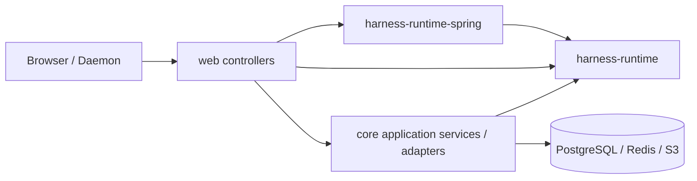

# 后端落地设计

本文描述当前 `share`、`core`、`web`、Harness Runtime 与受信任插件的后端边界。`harness-runtime` 拥有纯 Java 领域状态机；`harness-plugin` 提供构建期注册、启动时冻结的插件 API；`harness-runtime-spring` 只做 Store/Work/Redis 适配；`core` 提供 Catalog、TurnResolver、Model/Tool Gateway、Environment 与 Chat 应用能力；Goal 由 `plugins/goal` 提供；`web` 是生产组合根并映射 HTTP/SSE/WebSocket。

## 1. 分层



| 层 | 职责 |
| --- | --- |
| `share` | DTO、JSON 字段、分页与错误边界 |
| `web` | 生产组合根、Runtime/dispatcher/listener 生命周期、路由、参数校验、HTTP 状态、SSE emitter、WebSocket v2 adapter |
| `core.ai.catalog` | Provider/Model/Agent 的名称身份、结构化 config 与版本并发 |
| `core.ai.chat` | Chat CRUD、`agentName`/`yoloEnabled` 可见发送设置与 Chat↔Thread 关系 |
| `core.ai.runtime` | `DatabaseTurnResolver`、`CoreModelGateway`/`CoreToolGateway`、`ToolResultExternalizer`、Environment registry/gateway、query 投影 |
| `harness-plugin` | `PluginCatalog`、`BranchView`、同步 `PluginTool`、state access 声明、intent、context projector 与提示词模板 |
| `plugins/goal` | Goal v2 工具、`goal/state` 完整快照 codec 与 active context projector |
| `harness-runtime-spring` | `HarnessStore`（PostgreSQL）、Work dispatcher、Redis overlay、`LocalFileResourceStore` |
| `harness-runtime` | Thread/Command/Invocation/Work 状态机与 Thread/Model/Tool processor |
| `harness-tool` | Tool API、descriptor、`ResourceRef`、RemoteTool 与 Daemon v2 wire |

## 2. 身份与公开数据

Runtime durable ID 在 HTTP 中编码为 strict decimal strings（id `[1-9][0-9]*`、revision `0|[1-9][0-9]*`）。Catalog 不使用 bigint resource ID：

- Provider 和 Agent 的 identity 是 immutable `name`，Model 的 identity 是 `(providerName, name)`；记录存续期间名称不可修改。
- Provider/Model/Agent 都是带 `expectedVersion` CAS 的硬删除（物理删行）：删除后同名立即可重建，重建行 `version` 从 0 重新开始。
- 所有名称必须非空、拒绝首尾 Unicode whitespace；Provider/Agent 名称还必须是单路径段，禁止包含 `/`。
- API Model ref 是 `providerName/modelName`，只在第一个 `/` 处切分，因此 Model 名称可以包含 `/`。
- Catalog version 是独立的并发 token，以十进制字符串传输。

Agent DTO 的 `model` 使用 Model ref；Model DTO 使用 `providerName` 与 `name` 两个字段。Provider、Model、Agent 的 PUT/DELETE 都用名称定位并携带 `expectedVersion`。

## 3. Composition root

生产组合根位于 `web`；它把 Core ports 与 runtime-spring adapters 装配成完整 Runtime。Core 的 Spring beans 只提供应用能力与端口适配，不写 `harness_*` 表：

| 配置 | 装配 |
| --- | --- |
| `web.runtime.HarnessRuntimeConfiguration` | 构造 PostgreSQL Store、Redis sink/tail、ResourceStore、Thread/Model/Tool Processor、`HarnessRuntime`、dispatcher/listener/executor；注入 Core 的 TurnResolver/ModelGateway/ToolGateway ports |
| `HarnessRuntimeLifecycle` | 启动/停止 dispatcher 与 processor；REST/SSE 只经 `HarnessRuntime` 门面 |
| `ModelExecutionConfiguration` | `ObjectProvider<ProviderFactory>` 收集并索引；`CoreModelGateway`（serialized FIFO 单 drainer 回调桥） |
| `PluginCatalogConfiguration` | 收集 `HarnessPlugin` beans，补齐默认 `GoalPlugin`，构造并冻结 `PluginCatalog` |
| `HarnessToolGatewayConfiguration` | `ObjectProvider<ToolFactory>` + `PluginCatalog` + `PluginBranchViewLoader`；`CoreToolGateway`（preflight + 两阶段激活 + FIFO 回调桥 + intent 校验 + `ToolResultExternalizer`） |
| `RuntimeToolsConfiguration` | 装配唯一 internal Platform Tool `load_skill`；把本地 `ToolFactory` descriptor 与冻结插件贡献合并为 `ToolCatalog`，按插件 visibility 维护 selectable/internal 名称 |
| `HarnessRuntimeWebMapper` | strict decimal/JSON 校验：DTO → 领域命令 |

## 4. HTTP API

### Catalog

| 方法 | 路径 | 语义 |
| --- | --- | --- |
| GET/POST | `/api/ai/catalog/providers` | Provider 分页查询/创建 |
| PUT/DELETE | `/api/ai/catalog/providers/{name}` | Provider 全量更新/按版本删除 |
| GET/POST | `/api/ai/catalog/models` | Model 分页查询/创建 |
| PUT/DELETE | `/api/ai/catalog/models?providerName=&modelName=` | Model 全量更新/按复合名称删除 |
| GET/POST | `/api/ai/catalog/agents` | Agent 分页查询/创建 |
| PUT/DELETE | `/api/ai/catalog/agents/{name}` | Agent 全量更新/按版本删除 |
| GET | `/api/ai/catalog/tools` | Agent 可选择的 Platform/Environment ToolCatalog |

### Chat 与 Thread

| 方法 | 路径 | 语义 |
| --- | --- | --- |
| GET/POST | `/api/ai/chat` | Chat 列表/创建 |
| GET/PUT/DELETE | `/api/ai/chat/{chatId}` | Chat 读取/部分设置更新/按版本删除 |
| GET | `/api/ai/chat/{chatId}/threads` | Chat 关联的全部 Thread，按关联时间从新到旧 |
| POST | `/api/ai/chat/{chatId}/threads` | 原子创建 Session、ROOT（BranchSettings）、Thread 并关联 Chat；返回 snapshot |
| PUT | `/api/ai/chat/{chatId}/threads/{threadId}` | 幂等建立历史关联 |
| GET | `/api/ai/runtime/threads/{threadId}/snapshot` | revision、entries（root-to-head）、queuedCommands、活跃 Invocation |
| POST | `/api/ai/runtime/threads/{threadId}/commands` | 原子命令 batch 入队（8 类命令），202 |
| PUT | `/api/ai/runtime/threads/{threadId}/head` | 同 Session 非空 head 重定位（revision CAS） |
| POST | `/api/ai/runtime/threads/{threadId}/stop` | `{stopRequestId, expectedRevision}`；STOPPED/IDLE/REPLAYED |
| POST | `/api/ai/runtime/threads/{threadId}/tool-invocations/{toolInvocationId}/approval` | `{decision: ALLOW|DENY, decisionId, actor, reason}` |
| GET | `/api/ai/runtime/threads/{threadId}/events/stream` | durable revision SSE + Redis realtime overlay |

**不存在**的 API：无全局 Thread 列表、无 Session/Usage/settings/artifacts/interactions 查询、无 `/messages` 或 `/messages/custom` 端点（消息由 `/commands` 的 `USER_MESSAGE`/`CUSTOM_MESSAGE` 命令表达）、无 `expectedExecutionEpoch` 字段。

### Environment

| 方法 | 路径 | 语义 |
| --- | --- | --- |
| GET | `/api/ai/environment` | 当前 live Environment 内存投影（id/name/status/tools/skills/lastSeen，status 可为 CONNECTING/READY） |
| WebSocket | `/api/ai/environment/daemon/v2` | Daemon v2 连接（HELLO/WELCOME/READY/INVOKE/回调/心跳） |

## 5. 请求与错误

`POST /commands` 请求包含 `expectedHeadEntryId`、`expectedNextCommandSequence` 与命令数组（每项 `clientCommandId`）。`PUT /head` 包含非空 `targetEntryId` 与 `expectedRevision`。`POST /stop` 包含 `stopRequestId` 与 `expectedRevision`。

统一行为：

| 情况 | HTTP |
| --- | --- |
| DTO、名称格式、Model config、Model ref、decimal string 或请求体中的 Catalog 引用非法 | 400 |
| 作为请求目标的 Thread/Entry/Catalog 名称不存在（snapshot/commands/head/stop 路径） | 404 |
| 命令 cursor / revision CAS 过期、Thread 非 quiescent、terminal apply pending、跨 Session move、ordered replay 冲突 | 409 |
| approval target 不存在 / 不属于本 Thread / 无 required approval / 不在适用上下文（`APPROVAL_NOT_APPLICABLE`）、已决定但请求不匹配（`APPROVAL_DECISION_MISMATCH`） | 409（approval 路径的 Thread/target 缺失不是 404） |
| 命令 batch 被接受进入 mailbox | 202 |
| Chat-scoped Thread 创建成功 | 201 |

HTTP 错误支持 `en-US` 与 `zh-CN`，稳定错误码、状态和结构化字段不随语言变化。

## 6. 应用服务与写者

| 组件 | 职责 |
| --- | --- |
| `ChatThreadServiceImpl` | 调用 `HarnessRuntime.createThread`（Session/ROOT/Thread 原子）并写入 Chat 关系 |
| `StudioHarnessThreadController` | 仅映射 `HarnessRuntime` 门面 + SSE tail + typed 异常翻译 |
| `HarnessRuntime` | `createThread`/`enqueueCommands`/`moveHead`/`stop`/`decideToolApproval`/`getThreadSnapshot` 单事务控制面 |
| `ThreadProcessor` | Agent Loop：terminal apply、continuation、INPUT turn、QUIESCENT |
| `ModelProcessor` | 两阶段激活、checkpoint/terminal 持久化、terminal-once、Thread revision touch、Work/realtime 与 reschedule；不写 Entry/head |
| `ToolProcessor` | 两阶段激活、preflight、接收已验证/外部化的 terminal `ToolSuccess(result, effects)`、领域校验与严格 terminal CAS，并维护 Thread revision/Work/realtime；不写 Entry/head |
| `DatabaseTurnResolver` | 以 candidate path + YOLO 解析冻结 `ModelInvocationRequest`；冻结插件 contribution/state accesses，并注入插件 context projection；ENVIRONMENT 工具按最新 `environmentName` 绑定、规划不拒绝；skills 需最新选中 Environment live + 显式 `load_skill`；planning 拒绝共用 `PLANNING_FAILED` |
| `HarnessWorkDispatcher` | Work-only claim、round-robin、bounded handoff、NOTIFY/poll 合并 |

## 7. Snapshot-first SSE

客户端先读取：

```text
GET /api/ai/runtime/threads/{threadId}/snapshot
```

再以 snapshot `revision` 打开：

```text
GET /api/ai/runtime/threads/{threadId}/events/stream?afterRevision={revision}
```

revision 帧使用 durable SSE id（`Last-Event-ID` 覆盖 `afterRevision`）；Redis `realtime` delta 没有 SSE id，只作为临时 overlay。重连通过 revision 重新读取 snapshot，Redis Stream 不承担恢复职责。

## 8. 代码入口

- [StudioHarnessThreadController](../../web/src/main/java/fun/fengwk/kkstudio/web/controller/StudioHarnessThreadController.java)
- [StudioChatController](../../web/src/main/java/fun/fengwk/kkstudio/web/controller/StudioChatController.java)
- [StudioToolEnvironmentController](../../web/src/main/java/fun/fengwk/kkstudio/web/controller/StudioToolEnvironmentController.java)
- [HarnessRuntime](../../harness/runtime/src/main/java/fun/fengwk/kkstudio/harness/runtime/HarnessRuntime.java)
- [HarnessRuntimeWebMapper](../../web/src/main/java/fun/fengwk/kkstudio/web/runtime/HarnessRuntimeWebMapper.java)
- [DatabaseTurnResolver](../../core/src/main/java/fun/fengwk/kkstudio/core/ai/runtime/thread/command/DatabaseTurnResolver.java)
