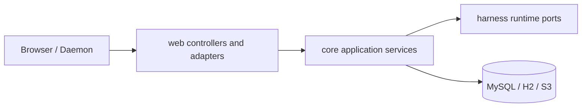

# 后端落地设计

本文描述当前 `share`、`core` 和 `web` 的 Harness 控制面。领域状态由 `core` 管理，`web` 仅负责 HTTP、SSE 和 WebSocket 适配。

## 分层



| 层 | 职责 |
| --- | --- |
| `share` | DTO、JSON 字段和 HTTP 数据边界 |
| `web` | 路由、参数解析、SSE emitter、WebSocket adapter、HTTP 状态映射 |
| `core.harness` | Session、Thread、Task、Tool、Usage、Artifact 的应用服务与持久化 |
| `core.environment` | 全局 Environment CRUD、capability/heartbeat 应用和 daemon gateway |
| `harness/*` | Provider、Thread、Session、Tool、Task 和协议领域合约 |

## API 边界

所有 Snowflake ID 在 HTTP 载荷和路径中均为正十进制字符串。格式非法、负 cursor 或非法 limit 返回 `400`；格式合法但不存在的资源返回 `404`；版本、状态或引用冲突返回 `409`。

| 域 | 接口 | 用途 |
| --- | --- | --- |
| Provider / Model / Agent | `/api/providers`、`/api/models`、`/api/agents` | 全局 Agent 资源 CRUD |
| Thread | `GET` / `POST /api/threads`、`GET /api/threads/{threadId}` | Thread 列表、创建、读取 |
| Session Threads | `GET /api/sessions/{sessionId}/threads` | 某 Session 上的 Thread 列表 |
| Thread 输入（202） | `POST /api/threads/{id}/messages`、`PUT .../yolo`、`PUT .../agent` | 入队 USER_MESSAGE / SET_YOLO / SET_AGENT |
| Thread 投影 | `GET /api/threads/{id}/entries`、`/inputs`、`/events`、`/events/stream` | 路径 Entries、inputs、events 与 SSE |
| Session 只读 | `GET /api/sessions`、`GET /api/sessions/{id}`、`GET /api/sessions/{id}/entries` | 根 Session 列表与整树 Entries |
| Root Activity / Task | `GET /api/sessions/{id}/activities`、`GET /api/sessions/{id}/tasks` | 根活动投影与子代理任务 |
| Tool | `GET /api/threads/{id}/tool-invocations`、`GET /api/tool-invocations/{id}`、`POST /api/tool-invocations/{id}/decision` | Tool 状态与权限决策 |
| Artifact / Usage | `/api/artifacts/{id}`、`/api/usage/threads/{id}`、`/api/usage/sessions/{id}`、`/api/usage/models/{id}` | artifact bytes 与用量汇总 |
| Environment | `/api/environments`、`/api/environments/daemon/v1` | 全局 Environment CRUD 与 daemon WebSocket |

ComfyUI 和 S3 接口边界见 [ComfyUI 工作流 API](comfyui-workflow-api.md) 与 [S3 预签名](s3-presign.md)。

### Controller 映射

| Controller | 路径前缀 | 职责 |
| --- | --- | --- |
| `StudioHarnessThreadController` | `/api` | Thread CRUD、入队 202、entries/inputs/events/SSE |
| `StudioHarnessSessionController` | `/api/sessions` | Session 只读列表与 entries |
| `StudioHarnessObservabilityController` | `/api` | activities、tool-invocations、tasks、artifacts |
| `StudioToolInvocationController` | `/api` | permission decision |
| `StudioModelUsageController` | `/api/usage` | Thread / Session / Model 聚合 |
| `StudioToolEnvironmentController` | `/api/environments` | Environment CRUD |

## Thread 与 Session

创建根 Thread（`POST /api/threads`，带 `agentDefinitionId`）在同一事务内创建 Session、初始 Agent Snapshot Entry 与 Thread（`head_entry_id` 指向 snapshot）。在既有 tree 上可带 `sessionId` + `fromEntryId` 新建独立 cursor。

用户消息与设置变更只进入 `ThreadInput` mailbox，**不**同步写 Entry。`ThreadProcessor` 在 Turn 边界 `applyNextInput`：exactly-once `markApplied`、append 对应 Entry、推进 head（并可能更新 Thread YOLO/agent 冻结配置）。

查询顺序由后端定义：Thread Entries 按 root→`headEntryId` 父链返回，inputs 按 `sequence ASC` 返回，events 按 `id ASC` 返回。`createTime` 只用于展示与审计；墙钟回拨不能改变 Entry 因果顺序或 mailbox/journal 顺序，前端不得二次重排。

Java 领域类型使用 `AgentThread`，避免与 `java.lang.Thread` 冲突。

核心应用服务：

| 服务 | 职责 |
| --- | --- |
| `HarnessThreadCommandService` | create / submit message / queue yolo / queue agent |
| `HarnessThreadQueryService` | thread 查询、路径 entries、inputs、events |
| `HarnessThreadTransactionService` | Thread/Input/Entry/Tool/Usage 原子事务（实现 `ThreadTransactions`） |
| `HarnessSessionQueryService` | Session 只读 |
| `HarnessObservabilityQueryService` | events、activities、invocations、tasks、artifacts |
| `ToolInvocationDecisionService` | 权限决策 |
| `ModelUsageAggregationService` | 账本聚合 |
| `ThreadRecoveryLifecycle` | 低频 recoverable kick |

## 事务与锁

固定锁序（避免死锁）：

```text
非锁 peek → 锁 Thread 行 → 锁 Invocation / Task（按需）
```

规则：

- 入队、apply input、beginTurn、commit assistant、prepare tools、release 均校验 `processorToken`（入队除外，入队只锁 Thread 分配 sequence）。
- Tool decision / terminal 与 processor 同序：先 Thread 后 invocation。
- Assistant Entry 与 `model_usage_record` 同事务；`assistant_entry_id` 唯一。
- Tool 副作用以 `tool_invocation.id` 为幂等键。

## SSE 与可恢复投影

Thread Event SSE 定时轮询 `listThreadEvents`，`send` 成功后推进 cursor；事件名 `thread_event`，SSE id 为 `eventId` 十进制字符串。恢复 cursor 取 query `afterEventId` 与 `Last-Event-ID` 中合法非负十进制的较大者。Root Activity 为 REST 快照合成（由 root 下 ThreadEvent 等事实查询），不以内存 EventBus 为真源。

## Tool、Environment 与 Artifact

Tool Invocation 在数据库中经历权限、lease、partial 与 terminal 状态。Cloud Tool 由 ThreadProcessor `dispatchDue` 事件触发执行；Environment Tool 由 gateway 分发给 daemon。Environment REST CRUD 不接受 capability / last-seen；二者仅由 daemon 协议更新。协议细节见 [Environment Daemon Gateway](environment-daemon-gateway.md)。

`GET /api/artifacts/{id}` 返回原始 bytes 与有效 media type；异常 media 降级为 `application/octet-stream`，并附加 `X-Content-Type-Options: nosniff` 与 `Content-Security-Policy: sandbox`。

## 验证

```bash
env JAVA_HOME=$JAVA_HOME_17 mvn clean verify -Dspotless.check.skip=true
env JAVA_HOME=$JAVA_HOME_17 mvn validate -Dspotless.check.skip=true
```

Java 代码还需通过仓库 Checkstyle、Google Java Format 1.18.0、newline audit 和 `git diff --check`。
