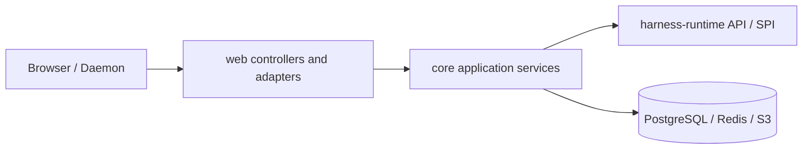

# 后端落地设计

本文描述当前 `share`、`core` 和 `web` 的 Harness 控制面。领域状态机与 framework-free 用例编排由 `harness-runtime` 管理；`core` 提供 application boundary、composition 与基础设施 adapter，`web` 仅负责 HTTP、SSE 和 WebSocket 适配。

## 分层



| 层 | 职责 |
| --- | --- |
| `share` | DTO、JSON 字段和 HTTP 数据边界 |
| `web` | 路由、参数解析、SSE emitter、WebSocket adapter、HTTP 状态映射 |
| `core.harness` | 薄 application boundary、Spring composition 与 PostgreSQL/Redis/Provider adapter |
| `core.environment` | 内存 Live Environment Registry、RemoteToolTransport、daemon gateway |
| `harness-runtime` | Command coordinators、Reconciler、Invocation workers、Interaction、Model 契约与 outbound SPI |
| `harness-tool` | Tool API / RemoteTool / Daemon 协议 |

## API 边界

所有 durable ID 在 HTTP 载荷和路径中均为正十进制字符串。格式非法返回 `400`；不存在返回 `404`；冲突返回 `409`。

| 域 | 接口 | 用途 |
| --- | --- | --- |
| Provider / Model / Agent | `/api/providers`、`/api/models`、`/api/agents` | 全局 Agent 资源 CRUD |
| Chat | `/api/chats`、`/api/chats/{chatId}/sessions` | 持久 Chat CRUD 与 Session 成员关系 |
| Session | `POST /api/sessions`、`GET /api/sessions`、`GET /api/sessions/{sessionId}`、`/entries` | 原子创建 Session/Main Thread；Session Tree 与 Entries |
| Session Threads | `GET` / `POST /api/sessions/{sessionId}/threads` | 列出 Thread；从 durable `fromEntryId` 创建 Secondary Thread |
| Thread | `GET /api/threads/{threadId}` | 读取 Thread（展示状态由 durable facts 派生） |
| Thread 输入（202） | `POST /api/threads/{id}/messages`、`PUT .../agent`、`/model`、`/yolo` | mailbox 入队 |
| Thread 投影 | `GET /api/threads/{id}/entries`、`/inputs` | 路径 Entries 与 inputs |
| Thread realtime | `GET /api/threads/{id}/events/stream` | Redis-backed SSE，事件名 `realtime`，cursor 为 stream-id |
| Thread 控制 | `POST /api/threads/{id}/stop` | epoch fencing 取消 queued Input / 非终态 Invocation |
| Retry policy | `GET` / `PUT /api/harness/retry-policy` | 全局持久化自动重试策略 |
| Root Activity | `GET /api/sessions/{id}/activities` | 根活动查询投影 |
| Tool | `GET /api/threads/{id}/tool-invocations`、`GET /api/tool-invocations/{id}` | Tool 状态查询 |
| Interaction | `GET /api/interactions/{id}`、`GET /api/interactions/open`、`POST /api/interactions/{id}/response` | 通用 Interaction |
| Artifact / Usage | `/api/artifacts/{id}`、`/api/usage/threads/{id}`、`/api/usage/sessions/{id}`、`/api/usage/models/{id}` | artifact bytes 与用量汇总 |
| Environment | `GET /api/environments`、`/api/environments/daemon/v1` | 只读实时 Registry 与 daemon WebSocket |

Model 与 Agent 的 `PUT` 接收完整 editable body。Provider credential 不回显；空 credential 表示保留当前密钥。

### Controller 映射

| Controller | 路径前缀 | 职责 |
| --- | --- | --- |
| `StudioHarnessThreadController` | `/api/threads` | Thread 读取、入队 202、Stop、entries/inputs、realtime SSE |
| `StudioHarnessRetryPolicyController` | `/api/harness/retry-policy` | 自动重试策略 |
| `StudioHarnessSessionController` | `/api/sessions` | Session/Main Thread 创建与查询、Secondary Thread |
| `StudioChatController` | `/api/chats` | Chat CRUD 与成员关系 |
| `StudioHarnessObservabilityController` | `/api` | activities、tool-invocations、artifacts |
| `StudioInteractionController` | `/api/interactions` | Interaction 查询与响应 |
| `StudioModelUsageController` | `/api/usage` | 聚合 |
| `StudioToolEnvironmentController` | `/api/environments` | 只读 live Environment Registry |

## Thread 与 Session

`POST /api/sessions` 在一个事务内写入 Session、语义根 `ROOT` Entry 与 Main Thread，并回写稳定 `main_thread_id`。`POST /api/sessions/{sessionId}/threads` 必须以属于该 Session 的 `fromEntryId` 创建新 Thread cursor，不复制 Entry 或 Invocation。

用户消息与设置变更只进入 `ThreadInput` mailbox，不直接写 Entry。`ThreadReconciler` 按 TURN_BOUNDARY harvest、追加 `RUNTIME_CONFIG`/消息 Entry，并在 response debt 时创建冻结 `ModelInvocation`。

查询：Thread Entries 按 root→`headEntryId` 父链返回，inputs 按 `sequence ASC`。`createTime` 只用于展示；不得用墙钟重排因果顺序。

Java 领域类型使用 `HarnessThread`，避免与 `java.lang.Thread` 冲突。

核心服务：

| 服务 | 职责 |
| --- | --- |
| `SessionCommandCoordinator` / `ThreadCommandCoordinator` | harness-runtime 内 framework-free 命令编排：payload 构造、配置冻结、幂等短路、映射 coordinator-owned results；Core 不依赖 transaction SPI |
| `RuntimeConfigSource` | live Agent/Model 冻结 SPI；Core `RuntimeConfigSnapshotResolver` 实现；纯 YOLO 替换在 runtime |
| `HarnessSessionCommandService` | Core 薄边界：产品默认、Spring 事务、DTO 映射 |
| `HarnessThreadCommandService` | Core 薄边界：decimal/DTO、after-commit activation |
| `InteractionCoordinator` | harness-runtime 内 handler 投影、expiry、resolution |
| `InteractionService` | Core 薄边界：decimal/DTO、notifier isolation |
| `HarnessRetryPolicyService` | 全局自动重试策略 |
| `HarnessThreadQueryService` | thread、路径 entries、inputs |
| Thread command / reconcile transactions | PostgreSQL 原子事务适配 |
| `HarnessSessionQueryService` | Session 只读 |
| `HarnessObservabilityQueryService` | activities、invocations、artifacts 查询投影 |
| `ModelUsageAggregationService` | 账本聚合 |
| Thread / Model / Tool recovery lifecycles | 低频 recoverable scan |

## 事务与锁

```text
锁 Thread 行 → 锁 Invocation / Interaction（按需）→ Entry/Input append
```

- 入队与 Stop 锁 Thread；Stop 递增 `execution_epoch` 并 fencing 旧执行。
- Assistant Entry 与 `harness_model_usage` 同事务；`assistant_entry_id` 唯一。
- Tool 副作用以 `tool_invocation.id` 为幂等键。
- Model/Tool worker terminal 与 Thread `runnable=true` 同事务。

## SSE 与 snapshot-first 投影

客户端先读取 PostgreSQL REST snapshot，再打开 Redis realtime SSE：

```text
GET /api/threads/{id}/events/stream?afterEventId={redis-stream-id}
```

事件名 `realtime`；SSE id 为 Redis stream-id（如 `ms-seq`）。Root Activity 为 REST 查询投影。

## Tool、Environment 与 Artifact

统一 `ToolWorker` 从数据库 claim Invocation：

- `PLATFORM` → 本地 `Tool`
- `ENVIRONMENT` → `RemoteTool` → Gateway transport → Daemon → 同一 Tool API

Gateway 只管理连接与协议，不是第二套 durable 状态机。Environment 不提供 REST CRUD；`GET /api/environments` 投影当前连接 Daemon 的内存 Registry。协议细节见 [environment-daemon-gateway.md](environment-daemon-gateway.md)。

WebSocket handler 只依赖 Core `EnvironmentDaemonEndpoint`；Gateway 以 `RemoteToolTransport` SPI 接入统一 `ToolWorker`。Daemon READY hint 通过不可变 listener bridge 离开 WebSocket 栈后调度，低频 `pollOnce` 仍负责丢失 hint 的恢复。

`GET /api/artifacts/{id}` 返回原始 bytes 与有效 media type；异常 media 降级为 `application/octet-stream`，并附加 `X-Content-Type-Options: nosniff` 与 `Content-Security-Policy: sandbox`。

## 验证

```bash
env JAVA_HOME=$JAVA_HOME_21 mvn clean verify -Dspotless.check.skip=true
env JAVA_HOME=$JAVA_HOME_21 mvn validate -Dspotless.check.skip=true
```

Java 代码还需通过仓库 Checkstyle、Google Java Format 1.18.0、newline audit 和 `git diff --check`。
