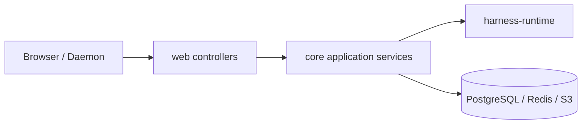

# 后端落地设计

本文描述当前 `share`、`core`、`web` 与 Harness Runtime 的后端边界。Runtime 负责 framework-free 领域编排，Core 负责 Spring composition、持久化和外部 adapter，Web 负责 HTTP/SSE/WebSocket。

## 1. 分层



| 层 | 职责 |
| --- | --- |
| `share` | DTO、JSON 字段、分页与错误边界 |
| `web` | 路由、参数校验、HTTP 状态、SSE emitter、WebSocket adapter |
| `core.ai.catalog` | Provider/Model/Agent 的名称身份、结构化 config 与版本并发 |
| `core.ai.chat` | Chat CRUD、可见发送设置与 Chat↔Thread 关系 |
| `core.ai.runtime` | PostgreSQL command/query、resolver、worker、dispatcher、Redis 与 Provider adapter |
| `harness-runtime` | Thread、Entry、Input、Reconciler、Invocation 与 Interaction 契约 |
| `harness-tool` | Tool API、descriptor、RemoteTool 与 Daemon wire |

## 2. 身份与公开数据

Runtime durable ID 在 HTTP 中编码为十进制字符串。Catalog 不使用 bigint resource ID：

- Provider 和 Agent 的 identity 是永久保留的 immutable `name`，删除只写 `deleted_at`。
- Model 的 identity 是永久保留的 `(providerName, name)`。
- 所有名称必须非空、拒绝首尾 Unicode whitespace；Provider/Agent 名称还必须是单路径段，禁止包含 `/`。
- API Model ref 是 `providerName/modelName`，只在第一个 `/` 处切分，因此 Model 名称可以包含 `/`。
- Catalog version 是独立的并发 token，以十进制字符串传输。Provider 的每个成功版本另有 append-only revision，runtime 只按 `(providerName, providerVersion)` dispatch。

Agent DTO 的 `model` 使用 Model ref；Model DTO 使用 `providerName` 与 `name` 两个字段。Provider、Model、Agent 的 PUT/DELETE 都用名称定位并携带 `expectedVersion`。

## 3. HTTP API

### Catalog

| 方法 | 路径 | 语义 |
| --- | --- | --- |
| GET/POST | `/api/ai/catalog/providers` | Provider 分页查询/创建 |
| PUT/DELETE | `/api/ai/catalog/providers/{name}` | Provider 全量更新/按版本删除 |
| GET/POST | `/api/ai/catalog/models` | Model 分页查询/创建 |
| PUT/DELETE | `/api/ai/catalog/models?providerName=&modelName=` | Model 全量更新/按复合名称删除 |
| GET/POST | `/api/ai/catalog/agents` | Agent 分页查询/创建 |
| PUT/DELETE | `/api/ai/catalog/agents/{name}` | Agent 全量更新/按版本删除 |
| GET | `/api/ai/catalog/tools` | 统一可选 ToolCatalog |

### Chat 与 Thread

| 方法 | 路径 | 语义 |
| --- | --- | --- |
| GET/POST | `/api/ai/chat` | Chat 列表/创建 |
| GET/PUT/DELETE | `/api/ai/chat/{chatId}` | Chat 读取/部分设置更新/按版本删除 |
| GET | `/api/ai/chat/{chatId}/threads?sort&cursor&limit` | Chat 关系的 opaque keyset 分页 |
| POST | `/api/ai/chat/{chatId}/threads` | 原子创建 Session、ROOT、已绑定 Thread 并关联 Chat |
| PUT | `/api/ai/chat/{chatId}/threads/{threadId}` | 幂等建立历史关联 |
| GET | `/api/ai/runtime/threads?sort&cursor&limit` | 全局 Thread 分页 |
| GET | `/api/ai/runtime/threads/{threadId}` | Thread 运行事实投影 |
| GET | `/api/ai/runtime/threads/{threadId}/snapshot` | revision、Entries、Inputs、Invocation、Interaction 与 Usage |
| PUT | `/api/ai/runtime/threads/{threadId}/head` | 静止 Thread 的非空 head 重定位 |
| POST | `/api/ai/runtime/threads/{threadId}/messages` | USER message 入队，202 |
| POST | `/api/ai/runtime/threads/{threadId}/messages/custom` | SYSTEM/USER custom message 入队，202 |
| POST | `/api/ai/runtime/threads/{threadId}/stop` | epoch fence、取消可取消事实并生成 stop barrier |
| GET | `/api/ai/runtime/threads/{threadId}/events/stream` | durable revision 与 Redis realtime SSE |

Thread 创建只由 Chat-scoped POST 暴露。创建事务生成 Session、ROOT 与 Thread，Thread 的 `headEntryId` 非空且直接指向 ROOT。

### 查询与设置

| 方法 | 路径 | 语义 |
| --- | --- | --- |
| GET | `/api/ai/runtime/sessions` | Session 列表 |
| GET | `/api/ai/runtime/sessions/{sessionId}` | Session 详情 |
| GET | `/api/ai/runtime/sessions/{sessionId}/entries` | Entry Tree |
| GET | `/api/ai/runtime/tool-invocations/{id}` | Tool invocation 详情 |
| GET | `/api/ai/runtime/interactions/{id}` | Interaction 详情 |
| GET | `/api/ai/runtime/interactions/open` | OPEN Interaction 列表 |
| POST | `/api/ai/runtime/interactions/{id}/response` | 提交 Interaction response |
| GET | `/api/ai/runtime/artifacts/{id}` | Artifact bytes |
| GET | `/api/ai/runtime/usage/sessions/{sessionId}` | Session Usage 聚合 |
| GET | `/api/ai/runtime/usage/models?providerName=&modelName=` | 按 Model 复合名称聚合 Usage |
| GET/PUT | `/api/ai/runtime/settings/retry-policy` | 全局 retry 策略 |
| GET/PUT | `/api/ai/runtime/settings/realtime-stream-policy` | Redis Stream 容量策略 |
| GET | `/api/ai/environment` | READY Environment 内存投影 |
| WebSocket | `/api/ai/environment/daemon/v1` | Daemon v1 连接 |

## 4. 请求与错误

Chat 的唯一可见发送设置是 `agentName`、`environmentName`、`yoloEnabled`。前端提交任一设置时会暂时阻止该 Chat 的全部 pane 发送，只有服务端确认并刷新 Chat 后才允许下一条消息。每个 message/custom message 请求还包含 `content`、`clientMessageId` 与 `expectedExecutionEpoch`。Reconcile 时从 payload 中的 `TurnSettings` 解析本轮实际能力。

`PUT /head` 请求包含非空 `headEntryId` 与 `expectedExecutionEpoch`。head 重定位要求当前 Thread 无 processor lease、无 runnable work、无 queued Input、无当前 epoch 的非终态 Invocation/OPEN Interaction；成功后递增 epoch 并清理 lease。

统一行为：

| 情况 | HTTP |
| --- | --- |
| DTO、名称格式、Model config、Model ref 或请求体中的 Catalog 引用非法 | `400` |
| 作为请求目标的 Thread、Session、Entry 或 Catalog 名称不存在 | `404` |
| Chat version 或 execution epoch 过期，或 Thread 尚未静止 | `409` |
| message/custom message 被接受进入 mailbox | `202` |
| Chat-scoped Thread 创建成功 | `201` |

HTTP 错误支持 `en-US` 与 `zh-CN`，稳定错误码、状态和结构化字段不随语言变化。

## 5. 应用服务与写者

| 组件 | 职责 |
| --- | --- |
| `ChatThreadServiceImpl` | 在一个事务中调用 Thread command 创建 Session/ROOT/Thread，写入 Chat 关系并返回查询投影 |
| `ThreadCommandCoordinator` | 创建 Thread、非空 head 重定位、消息 payload 构造、幂等短路与 stop |
| `PostgresqlThreadCommandTransactions` | Session/ROOT/Thread 原子写入、head CAS、Input enqueue、stop |
| `DatabaseTurnExecutionResolver` | 以 TurnSettings 名称在同一 PostgreSQL repeatable-read snapshot 中读取 active Agent、Model、Provider 与 Variant，并把 active Provider version 冻结进 ModelDescriptor；读取当前 READY Environment；Thread 行并发更新导致的 `40001` 在新事务中有界重试 |
| `DatabaseProviderResolutionService` | 只按冻结的 `(providerName, providerVersion)` 读取 `agent_provider_revision`；不读取当前 Provider 行，因此更新/软删除不影响已有 invocation 的首次 dispatch 与 retry |
| `ThreadReconciler` | TURN_INPUT_BATCH、planning、Model/Tool terminal apply、Entry/head 推进 |
| `ModelWorker` | 回放冻结 ProviderRequest，写 ModelInvocation terminal 与 realtime |
| `ToolWorker` | 按冻结 ToolBinding 执行本地或 RemoteTool |
| `PostgresqlExecutionTargetDispatcher` | 根据 durable execution target 唤醒 Thread、Model、Tool worker |

缺失 Agent、Provider、Model、Variant、Environment、Tool 或 Skill 时，resolver 返回 `PlanningFailure`；Reconciler 追加 `ASSISTANT_ERROR`，不创建伪 ModelInvocation，也不切换到隐式资源。

## 6. Snapshot-first SSE

客户端先读取：

```text
GET /api/ai/runtime/threads/{threadId}/snapshot
```

再以 snapshot `revision` 打开：

```text
GET /api/ai/runtime/threads/{threadId}/events/stream?afterRevision={revision}
```

revision 帧使用 durable SSE id；Redis `realtime` delta 没有 SSE id，只作为临时 text/thinking overlay。重连通过 revision 重新读取 snapshot，Redis Stream 不承担恢复职责。

## 7. 代码入口

- [StudioHarnessThreadController](../../web/src/main/java/fun/fengwk/kkstudio/web/controller/StudioHarnessThreadController.java)
- [StudioChatController](../../web/src/main/java/fun/fengwk/kkstudio/web/controller/StudioChatController.java)
- [ChatThreadServiceImpl](../../core/src/main/java/fun/fengwk/kkstudio/core/ai/chat/service/impl/ChatThreadServiceImpl.java)
- [DatabaseTurnExecutionResolver](../../core/src/main/java/fun/fengwk/kkstudio/core/ai/runtime/thread/command/DatabaseTurnExecutionResolver.java)
