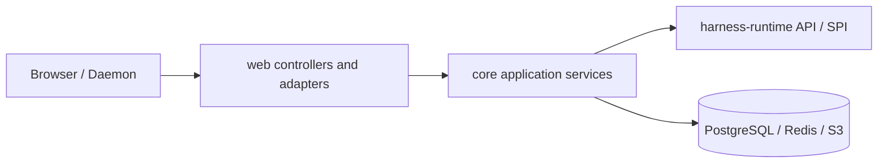

# 后端落地设计

本文描述当前 `share`、`core` 和 `web` 的 Harness 控制面。领域状态机与 framework-free 用例编排由 `harness-runtime` 管理；`core` 提供 application boundary、composition 与基础设施 adapter，`web` 负责 HTTP、SSE、WebSocket 与内嵌前端静态资源适配。

## 分层



| 层 | 职责 |
| --- | --- |
| `share` | DTO、JSON 字段和 HTTP 数据边界 |
| `web` | 路由、参数解析、SSE emitter、WebSocket adapter、HTTP 状态映射、`classpath:/static` 与 BrowserRouter fallback |
| `core.harness` | 薄 application boundary、Spring composition 与 PostgreSQL/Redis/Provider adapter |
| `core.environment` | 内存 Live Environment Registry、RemoteToolTransport、daemon gateway |
| `harness-runtime` | Command coordinators、Reconciler、Invocation workers、Interaction、Model 契约与 outbound SPI |
| `harness-tool` | Tool API / RemoteTool / Daemon 协议 |

## API 边界

所有 durable ID 在 HTTP 载荷和路径中均为正十进制字符串。格式非法返回 `400`；不存在返回 `404`；冲突返回 `409`。

| 域 | 接口 | 用途 |
| --- | --- | --- |
| Provider / Model / Agent | `/api/providers`、`/api/models`、`/api/agents` | 全局 Agent 资源 CRUD |
| Chat | `/api/chats` | 持久 Chat CRUD；Chat 不持有 Session/Thread |
| Session | `GET /api/sessions`、`GET /api/sessions/{sessionId}`、`/entries` | flat Session 查询与 Session Entry Tree；Session 仅由 Thread bootstrap 创建 |
| Thread | `GET /api/threads`、`POST /api/threads`、`GET /api/threads/{threadId}`、`GET /api/threads/{threadId}/snapshot` | 全局 Thread 列表；创建 UNBOUND Thread（201，无 body）；单一 chat-runtime snapshot 含 revision、状态、entries、inputs、invocations、open interactions 和 usage |
| Thread head | `POST /api/threads/{id}/bootstrap`、`PUT /api/threads/{id}/head` | bootstrap 创建 Session 并绑定 head（201 `{session, thread}`）；`PUT /head` 做 bind/rebind/unbind |
| Thread 输入（202） | `POST /api/threads/{id}/messages`、`/messages/custom`、`PUT .../agent`、`/model`、`/yolo` | mailbox 入队 |
| Thread realtime | `GET /api/threads/{id}/events/stream` | durable `revision`/`resync` SSE 加上无 id 的 lossy Redis `realtime`；`afterRevision` 与 `Last-Event-ID` 只表示 revision |
| Thread 控制 | `POST /api/threads/{id}/stop` | epoch fencing 取消 queued Input、可安全取消的 Invocation 与 OPEN Interaction |
| Retry policy | `GET` / `PUT /api/harness/retry-policy` | 全局持久化自动重试策略 |
| Realtime Stream policy | `GET` / `PUT /api/harness/realtime-stream-policy` | 全局持久化 Redis Stream `maxLength` 策略 |
| Tool | `GET /api/tool-invocations/{id}` | 单个 Tool 状态查询；Thread 集合投影位于 snapshot |
| Interaction | `GET /api/interactions/{id}`、`GET /api/interactions/open`、`POST /api/interactions/{id}/response` | 通用 Interaction |
| Artifact / Usage | `/api/artifacts/{id}`、`/api/usage/sessions/{id}`、`/api/usage/models/{id}` | artifact bytes 与 session/model 用量汇总；Thread usage 位于 snapshot |
| Environment | `GET /api/environments`、`/api/environments/daemon/v1` | 只读实时 Registry 与 daemon WebSocket |

Model 与 Agent 的 `PUT` 接收完整 editable body。Provider credential 不回显；空 credential 表示保留当前密钥。

`bootstrap`、`PUT /head`、`stop` 与全部 mailbox 请求体都含必填 `expectedExecutionEpoch`。epoch 过期或 Thread 非静止返回 `409`；未知 Thread/Session/Entry/Agent 返回 `404`。

### Controller 映射

| Controller | 路径前缀 | 职责 |
| --- | --- | --- |
| `StudioHarnessThreadController` | `/api/threads` | Thread 列表/读取/创建、snapshot、bootstrap、head 重定位、入队 202、Stop、realtime SSE |
| `StudioHarnessRetryPolicyController` | `/api/harness/retry-policy` | 自动重试策略 |
| `StudioHarnessRealtimeStreamPolicyController` | `/api/harness/realtime-stream-policy` | realtime Stream 最大保留事件数策略 |
| `StudioHarnessSessionController` | `/api/sessions` | Session 查询、Session Entries |
| `StudioChatController` | `/api/chats` | Chat CRUD |
| `StudioHarnessObservabilityController` | `/api` | 单个 tool invocation、artifacts；Thread 集合事实位于 snapshot |
| `StudioInteractionController` | `/api/interactions` | Interaction 查询与响应 |
| `StudioModelUsageController` | `/api/usage` | 聚合 |
| `StudioToolEnvironmentController` | `/api/environments` | 只读 live Environment Registry |

## Thread 与 Session

Session 只组织 Entry Tree，不持有 Thread；Thread 是可跨 Session 复用的 durable runtime process，当前 Session 由 head Entry 派生。

`POST /api/threads` 创建 UNBOUND Thread；`POST /api/threads/{id}/bootstrap` 在一个事务内创建 Session/ROOT/RUNTIME_CONFIG 并把该 UNBOUND Thread 的 head 绑定到 `RUNTIME_CONFIG` Entry。

`PUT /api/threads/{id}/head` 是外部修改 head 的唯一入口，可跨 Session 重定位或传 `null` 回到 UNBOUND；不复制 Entry 或 Invocation。它要求 Thread 逻辑静止：无有效 processor lease、`runnable=false`、无 QUEUED Input、当前 epoch 无非终态 Model/Tool Invocation、无相关 OPEN Interaction。满足后 CAS `expectedExecutionEpoch`，成功则 epoch+1 并清 lease/`runnable`，旧 epoch 的执行结果不再能写入。分支就是这样的 head 重定位，没有独立的 Branch 实体。

用户消息与设置变更只进入 `ThreadInput` mailbox，不直接写 Entry；UNBOUND Thread 拒绝入队。`ThreadReconciler` 按 TURN_BOUNDARY harvest、追加 `RUNTIME_CONFIG`/消息 Entry，并在 response debt 时创建冻结 `ModelInvocation`。

查询：`GET /api/threads` 返回全局 Thread 列表，`sessionId`/`sessionTitle`/`headEntryId` 均可空，DTO 附带当前 `executionEpoch`。`GET /api/threads/{id}/snapshot` 在 REPEATABLE READ 下返回 revision 与 root→head Entries（UNBOUND 为空）、按 `sequence ASC` 的 inputs、invocations、open interactions 和 usage。`createTime` 只用于展示；不得用墙钟重排因果顺序。

Java 领域类型使用 `HarnessThread`，避免与 `java.lang.Thread` 冲突。

核心服务：

| 服务 | 职责 |
| --- | --- |
| `ThreadCommandCoordinator` | harness-runtime 内 framework-free 命令编排：Thread 创建/bootstrap/head 重定位、payload 构造、配置冻结、幂等短路、映射 coordinator-owned results；Core 不依赖 transaction SPI。Session / ROOT / `RUNTIME_CONFIG` 通过 `bootstrapThread` 内部私有 helper 落库 |
| `RuntimeConfigSource` | live Agent/Model 冻结 SPI；Core `RuntimeConfigSnapshotResolver` 实现；纯 YOLO 替换在 runtime |
| `HarnessThreadCommandService` | Core 薄边界：decimal/DTO、同事务 durable target mutation；bootstrap 响应内嵌 Session DTO |
| `InteractionCoordinator` | harness-runtime 内 handler 投影、expiry、resolution |
| `InteractionService` | Core 薄边界：decimal/DTO |
| `HarnessRetryPolicyService` | 全局自动重试策略 |
| `HarnessRealtimeStreamPolicyService` | 全局 realtime Stream 容量策略；Redis sink 以短期缓存按写入解析 |
| `HarnessThreadQueryService` | thread 列表与一致 snapshot |
| Thread command / reconcile transactions | PostgreSQL 原子事务适配 |
| `HarnessSessionQueryService` | Session 只读；列表按 derived max-entry `updated_at` desc, id desc 排序 |
| `HarnessObservabilityQueryService` | tool / model invocations、interactions、artifacts 查询投影 |
| `ModelUsageAggregationService` | 账本聚合 |
| `PostgresqlExecutionTargetListener` / `PostgresqlExecutionTargetDispatcher` | LISTEN/NOTIFY、startup/reconnect/nearest-due wake 与本地 Thread/Model/Tool target 分发 |

## 事务与锁

```text
锁 Thread 行 → 锁 Invocation / Interaction（按需）→ Entry/Input append
```

- 入队、Stop 与 head 重定位都锁 Thread 行并 CAS `expectedExecutionEpoch`；Stop 与 head 重定位递增 `execution_epoch` 并 fencing 旧执行。
- Assistant Entry 与 `harness_model_usage` 同事务；`assistant_entry_id` 唯一。
- Tool 副作用以 `tool_invocation.id` 为幂等键。
- Model/Tool worker terminal 与 Thread `runnable=true` 同事务。

## SSE 与 snapshot-first 投影

客户端先读取 PostgreSQL REST snapshot，再按 snapshot revision 打开 SSE：

```text
GET /api/threads/{id}/events/stream?afterRevision={revision}
```

`revision` 事件以 revision 为 SSE id；`resync` 与 `realtime` 没有 SSE id。Redis delta 只做临时 text/thinking overlay，重新连接从 `$` live edge 开始；每次 `XADD` 使用持久化全局策略的 `maxLength`，保存策略不会扫描既有 key，而是在其下一次写入时精确裁剪。

## Tool、Environment 与 Artifact

统一 `ToolWorker` 从数据库 claim Invocation：

- `PLATFORM` → 本地 `Tool`
- `ENVIRONMENT` → `RemoteTool` → Gateway transport → Daemon → 同一 Tool API

Gateway 只管理连接与协议，不是第二套 durable 状态机。Environment 不提供 REST CRUD；`GET /api/environments` 投影当前连接 Daemon 的内存 Registry。协议细节见 [environment-daemon-gateway.md](environment-daemon-gateway.md)。

WebSocket handler 只依赖 Core `EnvironmentDaemonEndpoint`；Gateway 以 `RemoteToolTransport` SPI 接入统一 `ToolWorker`。Daemon READY event 通过不可变 listener bridge 离开 WebSocket 栈后调用 PostgreSQL dispatcher wake；没有 `pollOnce` 或 caller-thread fallback。

`GET /api/artifacts/{id}` 返回原始 bytes 与有效 media type；异常 media 降级为 `application/octet-stream`，并附加 `X-Content-Type-Options: nosniff` 与 `Content-Security-Policy: sandbox`。

## 验证

```bash
env JAVA_HOME=$JAVA_HOME_21 mvn clean verify -Dspotless.check.skip=true
env JAVA_HOME=$JAVA_HOME_21 mvn validate -Dspotless.check.skip=true
```

Java 代码还需通过仓库 Checkstyle、Google Java Format 1.18.0、newline audit 和 `git diff --check`。
