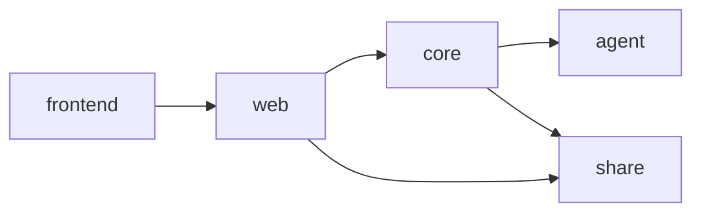
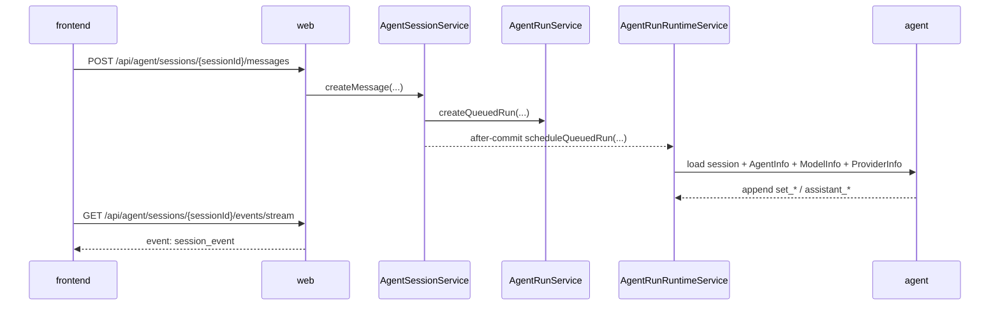

# 后端落地设计

本文描述当前已经落地的 `share`、`core`、`web` 三层实现，以及云端内嵌 agent MVP 的后端控制面。

## 实现摘要

| 主题 | 当前状态 |
| --- | --- |
| API 范围 | provider / model / agent / session / event / event stream / run |
| 运行时 | message submit 后调度 embedded runtime |
| 存储初始化 | H2 schema/seed + MySQL schema/seed |
| 共享契约 | `share` 统一承载 `Agent*DTO` |
| 本地验收 | 支持 `local-h2` + 验收 stub provider |

## 模块依赖



## 上层模型边界

| 上层模型 | agent 包对齐 | 上层允许扩展 |
| --- | --- | --- |
| `AgentProviderDTO` / `agent_provider` | `ProviderInfo.providerType/baseUrl/apiKey/timeout/streamIdleTimeout` | `provider/name/description` 仅用于管理和展示 |
| `AgentModelDTO` / `agent_model` | `ModelInfo.provider/name/displayName/defaultVariant/variants` 与 `Variant` | `description/capabilitiesJson/limitJson/pricingJson` 仅用于管理和展示 |
| `AgentDefinitionDTO` / `agent_definition` | `AgentInfo.name/systemPrompt/defaultProvider/defaultModel/defaultVariant/tools/subagents/skills` | `name/description` 仅用于管理和展示 |
| `AgentSessionDTO` / `agent_session` | `agent.session.Session` 的 session/head 语义 | `title/status` 用于控制面 |

`ProviderInfo` 不承载模型参数，也不承载 variant 请求参数。模型请求参数只能通过 `agent_model.variants_json` 映射到 `Variant`。

## Message 主链路



## `share` DTO 清单

| DTO | 用途 |
| --- | --- |
| `AgentProviderDTO`、`AgentProviderCreateDTO`、`AgentProviderUpdateDTO` | Provider CRUD |
| `AgentModelDTO`、`AgentModelCreateDTO`、`AgentModelUpdateDTO` | Model CRUD |
| `AgentDefinitionDTO`、`AgentDefinitionCreateDTO`、`AgentDefinitionUpdateDTO` | Agent CRUD |
| `AgentSessionDTO`、`AgentSessionCreateDTO`、`AgentSessionUpdateDTO` | Chat session CRUD |
| `AgentSessionMessageCreateDTO` | 用户消息提交 |
| `AgentSessionHeadDTO` | branch head |
| `AgentSessionEventDTO` | session branch event |
| `AgentRunDTO` | run 查询结果 |

DTO 规则：

| 规则 | 说明 |
| --- | --- |
| 字段命名 | 与 JSON 字段保持一致 |
| 业务标识 | provider/model/agent/session/event/run 全部使用业务 id 或业务键 |
| `payloadJson` | 当前直接透传字符串 |
| JSON 配置字段 | service 层校验对象或数组边界 |

## `core` 包结构

```text
fun.fengwk.kkstudio.core.agent
├── definition
├── model
├── provider
├── run
├── runtime
├── session
└── support
```

| 包 | 职责 |
| --- | --- |
| `provider` | provider 仓储、领域模型、CRUD 服务、DTO 转换 |
| `model` | model 仓储、领域模型、CRUD 服务、variant JSON 校验 |
| `definition` | agent definition 仓储、领域模型、CRUD 服务、provider/model 引用校验 |
| `session` | session / head / event 仓储、branch 回放、message submit 入口 |
| `run` | run 仓储、领域模型、状态迁移服务 |
| `runtime` | runtime 自动配置、embedded runtime 执行、agent 包模型组装 |
| `support` | 业务 id 生成 |

## `web` API

| 域 | Method | Path | Query / Body | 返回 |
| --- | --- | --- | --- | --- |
| Provider | `GET` | `/api/agent/providers` | `pageNumber`, `pageSize` | `Result<Page<AgentProviderDTO>>` |
| Provider | `POST` | `/api/agent/providers` | `AgentProviderCreateDTO` | `Result<AgentProviderDTO>` |
| Provider | `PUT` | `/api/agent/providers/{provider}` | `AgentProviderUpdateDTO` | `Result<AgentProviderDTO>` |
| Provider | `DELETE` | `/api/agent/providers/{provider}` | 无 | `204` |
| Model | `GET` | `/api/agent/models` | `pageNumber`, `pageSize` | `Result<Page<AgentModelDTO>>` |
| Model | `POST` | `/api/agent/models` | `AgentModelCreateDTO` | `Result<AgentModelDTO>` |
| Model | `PUT` | `/api/agent/models/{provider}/{name}` | `AgentModelUpdateDTO` | `Result<AgentModelDTO>` |
| Model | `DELETE` | `/api/agent/models/{provider}/{name}` | 无 | `204` |
| Agent | `GET` | `/api/agent/agents` | `pageNumber`, `pageSize` | `Result<Page<AgentDefinitionDTO>>` |
| Agent | `POST` | `/api/agent/agents` | `AgentDefinitionCreateDTO` | `Result<AgentDefinitionDTO>` |
| Agent | `PUT` | `/api/agent/agents/{agentName}` | `AgentDefinitionUpdateDTO` | `Result<AgentDefinitionDTO>` |
| Agent | `DELETE` | `/api/agent/agents/{agentName}` | 无 | `204` |
| Session | `GET` | `/api/agent/sessions` | `pageNumber`, `pageSize` | `Result<Page<AgentSessionDTO>>` |
| Session | `POST` | `/api/agent/sessions` | `AgentSessionCreateDTO` | `Result<AgentSessionDTO>` |
| Session | `GET` | `/api/agent/sessions/{sessionId}` | 无 | `Result<AgentSessionDTO>` |
| Session | `PUT` | `/api/agent/sessions/{sessionId}` | `AgentSessionUpdateDTO` | `Result<AgentSessionDTO>` |
| Session | `DELETE` | `/api/agent/sessions/{sessionId}` | 无 | `204` |
| Message | `POST` | `/api/agent/sessions/{sessionId}/messages` | `AgentSessionMessageCreateDTO` | `Result<AgentSessionEventDTO>` |
| Head | `GET` | `/api/agent/sessions/{sessionId}/heads` | 无 | `Result<List<AgentSessionHeadDTO>>` |
| Event | `GET` | `/api/agent/sessions/{sessionId}/events` | `headEventId` 可选 | `Result<List<AgentSessionEventDTO>>` |
| Event Stream | `GET` | `/api/agent/sessions/{sessionId}/events/stream` | `headEventId`、`idleTimeoutMillis` 可选 | `text/event-stream` |
| Run | `GET` | `/api/agent/sessions/{sessionId}/runs` | 无 | `Result<List<AgentRunDTO>>` |

SSE 事件：

| 事件名 | data |
| --- | --- |
| `session_event` | `AgentSessionEventDTO` |
| `heartbeat` | `{ "timestampMillis": number }` |

SSE 当前行为：

| 场景 | 当前实现 |
| --- | --- |
| 默认 current head 订阅 | controller 维护 `lastEmittedEventId`，每轮通过增量查询只拉取新事件 |
| 显式 `headEventId` 订阅 | 保留 branch 快照语义，继续按指定 head 全量重建 |
| 去重 | 同一连接内按 `eventId` 去重后再发送 `session_event` |
| 空闲退出 | 使用 `hasActiveRun(sessionId)` 判定是否仍有 `queued/running` run，而不是每轮拉全量 runs |

## 本地 H2 验收模式

| 项目 | 说明 |
| --- | --- |
| Spring Profile | `local-h2` |
| 配置文件 | `web/src/main/resources/application-local-h2.yml` |
| 数据库 | 本地 H2 内存库，服务重启即清空业务数据 |
| Provider | `LocalH2AcceptanceConfiguration` 注入 `AcceptanceStubProviderManager` |
| Run 调度 | `agentRunTaskExecutor` 使用同步执行器，便于手工验收 |
| SSE 调度 | `agentEventStreamTaskExecutor` 独立异步执行 |
| Nacos | 关闭 config / discovery / auto-registration |
| 雪花 ID | 固定 `convention.snowflake-id.worker-id = 0`，不依赖 Redis 申请 worker id |

## 测试边界

| 层级 | 测试类 | 验证内容 |
| --- | --- | --- |
| `core` service | `AgentProviderServiceTest`、`AgentModelServiceTest`、`AgentDefinitionServiceTest` | Provider/Model/Agent CRUD 与引用校验 |
| `core` service | `AgentSessionServiceTest` | session 创建、编辑、删除、message submit、runtime 结果 |
| `core` service | `AgentRunServiceTest` | run 查询与状态 |
| `web` controller | `StudioAgentResourceControllerTest` | provider/model/agent CRUD API |
| `web` controller | `StudioAgentSessionControllerTest` | session CRUD、message、events、SSE |
| `web` controller | `StudioAgentRunControllerTest` | run API |

## 验证命令

| 目标 | 命令 |
| --- | --- |
| 后端完整验证 | `env JAVA_HOME=$JAVA_HOME_17 mvn clean verify` |
| 后端局部验证 | `env JAVA_HOME=$JAVA_HOME_17 mvn -pl web -am test` |
| 后端打包 | `env JAVA_HOME=$JAVA_HOME_17 mvn -pl web -am -DskipTests package` |
